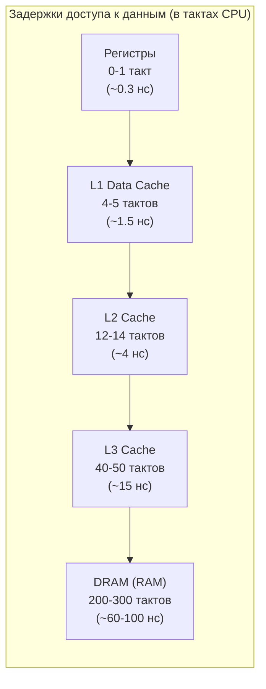
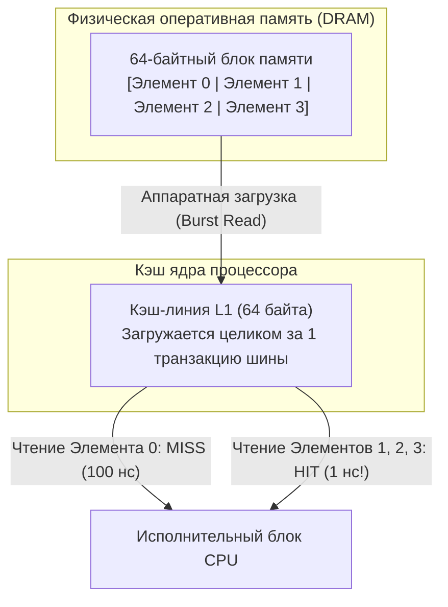
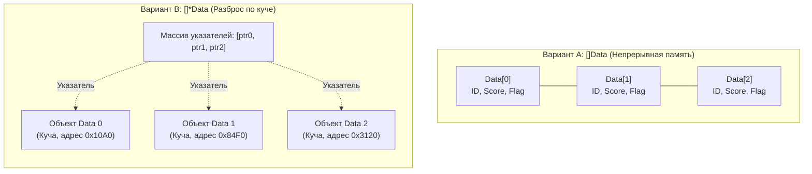

## Почему пространственная сложность важнее временной на современном железе

В классических университетских учебниках по алгоритмам пространственная сложность (Space Complexity) нередко преподносится как второстепенная характеристика: «Если оперативной памяти на сервере хватает с запасом, то дополнительная сложность $O(n)$ вполне допустима». В реальном высоконагруженном бэкенде на Go это утверждение **в корне ошибочно**.

За последние сорок лет тактовая частота процессоров выросла в тысячи раз, в то время как задержка доступа к микросхемам динамической памяти (DRAM) сократилась лишь в несколько раз. Инженеры компьютерной архитектуры называют этот колоссальный разрыв **«Стеной памяти» (Memory Wall)**. Современный процессор с тактовой частотой 3–4 ГГц способен выполнить сотни арифметических инструкций в конвейере за то время, пока он ждет доставки одного-единственного 64-байтного блока из оперативной памяти.



На практике в production-сервисах:
*   **Реальное время выполнения** определяется не столько количеством инструкций, сколько количеством промахов мимо кэша (**cache misses**).
*   **Память** — это не просто абстрактное число занятых мегабайт, это паттерн доступа, выравнивание структур, фрагментация страниц и чудовищное давление на [[7. Глубокий Go (Внутреннее устройство)|сборщик мусора (GC)]].
*   **Пространственная локальность данных** часто позволяет простому линейному сканированию массива обогнать сложнейшие сбалансированные деревья поиска с идеальной асимптотикой $O(\log n)$, но разбросанными по куче узлами.

> [!tip] Собеседование
> **Вопрос:** «Почему последовательный обход связного списка (`linked list`) работает в разы медленнее обхода обычного слайса или массива на том же числе элементов, хотя оба алгоритма формально имеют сложность $O(n)$ по времени?»
>
> **Ответ:** Слайс размещает элементы в едином непрерывном блоке виртуальной памяти. При запросе первого элемента контроллер памяти загружает не только его, а всю аппаратную **кэш-линию** (cache line, обычно 64 байта). Все соседние элементы автоматически попадают в сверхбыстрый L1-кэш без задержек, а аппаратный префетчер (hardware prefetcher) процессора заранее подтягивает следующие строки. Связный список хранит каждый узел в изолированном объекте кучи. Переход по указателю `node.next` ведет в непредсказуемый адрес памяти, вызывая постоянные cache miss, задержки в 100+ наносекунд на чтение из RAM и простой исполнительного конвейера CPU.

---

## Пространственная сложность в Go: абстракция vs реальность

Книжная нотация $O(n)$ скрывает внутреннюю цену структур данных рантайма Go. При проектировании систем важно учитывать не только полезные байты пользовательских полей, но и служебные метаданные компилятора и рантайма.

| Структура данных | Реальный оверхед на элемент в Go (amd64) | Архитектурные последствия |
|---|---|---|
| `[]int` | 8 байт на элемент | Непрерывный плотный блок, нулевые метаданные на элемент, идеальная кэш-локальность |
| `[]*int` | 8 байт (указатель) + 8 байт (`int`) + 16–24 байта оверхед блока malloc | Двойное обращение к памяти, потеря локальности, фрагментация кучи |
| `map[K]V` | 8–16 байт записей + 8 байт на бакет + указатели переполнения | Заголовок `hmap`, массив бакетов `bmap` по 8 слотов, оверхед хэшей и overflow |
| `any` / `interface{}` | 16 байт на дескриптор (`type*, data*`) + аллокация значения в кучу | Непрямой вызов методов, побег в кучу для типов больше 8 байт |
| `string` | 16 байт дескриптор (`*byte, len`) | Указатель на иммутабельный байтовый массив в куче или RO-сегменте |

```go
// Пример: скрытые затраты хэш-таблицы
type User struct {
    ID   uint64
    Name string
}

// map[uint64]User выглядит лаконично, но под капотом рантайма:
// 1. hmap (заголовок хэш-таблицы, 48 байт)
// 2. Массив бакетов (bmap), каждый хранит до 8 пар ключ-значение
// 3. Массив tophash (по 1 байту на ключ для быстрой фильтрации)
// 4. При переполнении бакета создаются overflow-бакеты (дополнительные аллокации)
// 5. Внутренний оверхед при коэффициенте заполнения (load factor) 6.5
```

> [!info] Под капотом
> Внутренняя структура `hmap` (подробнее см. [[5. Внутреннее устройство map в Go]]) занимает 48 байт заголовка плюс динамический массив бакетов. Для $n$ элементов в худшем случае выделяется до $O(n)$ дополнительной памяти под цепочки переполнения (`overflow buckets`). Если в таблице хранятся миллионы ключей, оверхед метаданных выливается в сотни мегабайт, которые [[7. Глубокий Go (Внутреннее устройство)|сборщик мусора]] обязан сканировать на каждой итерации, если типы ключа или значения содержат указатели.

---

## Иерархия памяти и Cache Locality

Понимание законов работы процессорного кэша превращает разработку высокопроизводительного кода из шаманства с бенчмарками в точную инженерную дисциплину.

### Уровни кэширования

*   **L1 Data Cache (L1d):** 32–64 КБ на ядро, сверхбыстрый доступ за 3–5 тактов (~1–1.5 нс).
*   **L2 Cache:** 256 КБ – 1 МБ на ядро, приватный кэш, доступ за 12–14 тактов (~4–5 нс).
*   **L3 Cache:** 8–64 МБ (в серверных AMD EPYC до сотен МБ с 3D V-Cache), общий кэш последнего уровня (LLC), доступ за 40–50 тактов (~12–15 нс).
*   **Основная память (DRAM):** Гигабайты/терабайты, доступ за 60–100 нс (200–300 тактов CPU).

**Кэш-линия (Cache Line)** — неделимая квантовая единица обмена данными между оперативной памятью и кэшем процессора. В современных архитектурах x86-64 и ARM64 размер кэш-линии равен ровно **64 байтам** (512 бит).

Когда программа считывает из памяти хотя бы один 8-битный байт по адресу $A$, контроллер памяти аппаратно вычитывает всю 64-байтную строку, выровненную по границе 64 байт: $[\lfloor A/64 \rfloor \times 64 \dots \lfloor A/64 \rfloor \times 64 + 63]$. Это и есть аппаратный фундамент **пространственной локальности**.



### Виды локальности

1.  **Пространственная локальность (Spatial Locality):** Если программа обратилась к ячейке памяти по адресу $A$, с огромной вероятностью в ближайшие такты произойдет обращение к соседним адресам $A+1, A+2, \dots$. Плотные массивы и срезы (`[]T`) извлекают из этого феномена максимальную выгоду.
2.  **Временная локальность (Temporal Locality):** Если программа обратилась к адресу $A$, велика вероятность, что к тем же данным произойдет повторное обращение в ближайшем будущем. На этом принципе построены кольцевые буферы, счетчики и переиспользование структур через `sync.Pool`.

---

## Влияние на структуры данных в Go

Выбор между коллекцией значений и коллекцией указателей — фундаментальный выбор между архитектурой, сочувствующей процессору (cache-friendly), и архитектурой, саботирующей кэш (cache-unfriendly).

### Слайс значений vs Слайс указателей

```go
type Data struct {
    ID    uint64  // 8 байт
    Score float64 // 8 байт
    Flag  bool    // 1 байт (+7 байт padding)
}

// Вариант A: слайс плотных структур (cache-friendly)
var sliceOfValues []Data

// Вариант B: слайс указателей на структуры (cache-unfriendly)
var sliceOfPointers []*Data
```



При итерации по `sliceOfValues`:
*   Структуры лежат в памяти строго последовательно.
*   Каждая 64-байтная кэш-линия вмещает почти три полные структуры `Data` (по 24 байта каждая).
*   Аппаратный префетчер процессора мгновенно распознает линейный шаблон доступа и подтягивает следующие кэш-линии из RAM еще до того, как цикл дойдет до них. Процессор почти никогда не простаивает.

При итерации по `sliceOfPointers`:
*   Сам массив указателей читается последовательно, но каждый указатель ведет в случайную область виртуальной памяти кучи.
*   Каждый переход `*ptr` — это лотерея с высоким шансом промаха в L1/L2/L3 кэше.
*   Конвейер процессора замирает на 200–300 тактов в ожидании ответа контроллера памяти.

> [!warning] Ловушка / Gotcha
> **Указатели не бесплатны, даже если они предотвращают копирование!**  
> Начинающие Go-разработчики часто по привычке пишут `[]*Data`, полагая, что передача структур по указателю всегда экономит ресурсы. Но для задач фильтрации, сортировки, поиска и числовой агрегации слайс указателей почти всегда оказывается **в 2–4 раза медленнее** слайса значений из-за краха пространственной локальности. Кроме того, сборщик мусора Go вынужден исследовать каждый такой указатель при проверке живых объектов.

### Когда указатели всё же нужны

*   **Полиморфизм и интерфейсы:** Когда коллекция должна содержать разнородные типы данных, реализующие общий интерфейс.
*   **Мутация состояния:** Когда вызывающий код обязан изменять внутренние поля структуры без обратного присваивания в срез.
*   **Огромный размер структур:** Если структура занимает сотни байт или килобайты (например, структура с большими буферами внутри), затраты на копирование при передаче по значению начинают превышать выгоду от кэш-локальности.
*   **Конкурентный доступ:** Когда несколько горутин обращаются к одним и тем же разделяемым экземплярам через мьютекс (`sync.Mutex` или `sync.RWMutex`) или атомики (`sync/atomic`).

---

## Выравнивание структур и скрытые потери памяти

Компилятор Go обязан размещать поля структур по адресам, кратным их естественному выравниванию (alignment). Для архитектуры amd64/arm64:
*   `bool`, `byte`, `uint8`, `int8` выравниваются по 1 байту;
*   `int16`, `uint16` — по 2 байтам;
*   `int32`, `uint32`, `float32` — по 4 байтам;
*   `int64`, `uint64`, `float64`, указатели `*T`, слайсы и мапы — по 8 байтам.

Если программист располагает поля в структуре хаотично, компилятор вынужден вставлять между ними невидимые байты-заполнители (**padding**), чтобы соблюсти требования машинных инструкций процессора к выравниванию.

```go
// Плохое выравнивание (размер: 24 байта)
type BadStruct struct {
    A bool    // 1 байт
    // [7 байт пустого padding!]
    B int64   // 8 байт (должен начинаться с адреса, кратного 8)
    C bool    // 1 байт
    // [7 байт trailing padding, чтобы размер структуры был кратен 8!]
}

// Оптимальное выравнивание (размер: 16 байт)
type GoodStruct struct {
    B int64   // 8 байт
    A bool    // 1 байт
    C bool    // 1 байт
    // [6 байт padding до границы 8 байт]
}
```

```
BadStruct (24 байта):
[ A (1B) | PADDING (7B) | B (8B) | C (1B) | PADDING (7B) ]
 0        1              8        16       17             24

GoodStruct (16 байт):
[ B (8B) | A (1B) | C (1B) | PADDING (6B) ]
 0        8        9        10             16
```

Для массива из 10 миллионов структур разница между `BadStruct` и `GoodStruct` составляет **80 мегабайт** бесполезно потраченной оперативной памяти! Это не просто пустая трата RAM: в кэш-линию 64 байта помещается только 2 структуры `BadStruct` против 4 структур `GoodStruct`. Плотность полезных данных в кэше падает ровно в два раза.

> [!info] Под капотом
> Для автоматического выявления неэффективного выравнивания в CI/CD пайплайнах используется официальный анализатор `fieldalignment` из набора инструментов Go:
> ```bash
> go install golang.org/x/tools/go/analysis/passes/fieldalignment/cmd/fieldalignment@latest
> fieldalignment -fix ./...
> ```
> Флаг `-fix` автоматически переставит поля всех структур в проекте в порядке убывания их размера, устранив лишний padding.

---

## GC, Escape Analysis и локальность

Сборщик мусора Go использует concurrent mark-and-sweep алгоритм с триколорной раскраской графа объектов. Скорость фазы маркировки (Mark Phase) прямо пропорциональна числу указателей в куче и степени их фрагментации.

*   **Худший сценарий для GC:** Миллионы мелких объектов, разбросанных по разным адресам кучи и связанных указателями. Сборщик мусора обходит граф объектов, постоянно промахиваясь мимо кэша CPU, что многократно увеличивает продолжительность паузы и потребление процессорных мощностей.
*   **Идеальный сценарий для GC:** Большие плотные слайсы структур без внутренних указателей (pointer-free). Аллокатор Go помечает спаны таких слайсов флагом `noscan`, и сборщик мусора даже не заглядывает внутрь их элементов!

**Escape Analysis** решает, где выделить память под структуру:
*   **Стек горутины:** Обнуление и освобождение памяти происходят тривиальным сдвигом регистра `RSP` при возврате из функции. Данные обладают идеальной локальностью в L1-кэше ядра и невидимы для GC.
*   **Куча (Heap):** Требует поиска свободного блока в `mcache`/`mcentral`, фрагментирует адресное пространство и создает работу для сборщика.

```go
func ProcessHeap() *Data {
    d := &Data{ID: 1} // Адрес переменной возвращается наружу
    return d          // escape to heap: аллокация в куче
}

func ProcessStack() Data {
    d := Data{ID: 1}  // Значение локально для фрейма
    return d          // Копируется по значению через регистры CPU, куча не затронута
}
```

---

## Практический бенчмарк: массив значений против массива указателей

Проверим влияние пространственной локальности на реальном коде. Напишем бенчмарк, вычисляющий сумму поля `Score` для 100 000 элементов.

```go
//go:build ignore

package main

import (
    "testing"
)

type Item struct {
    ID    uint64
    Score float64
}

func SumValues(items []Item) float64 {
    var total float64
    for i := range items {
        total += items[i].Score
    }
    return total
}

func SumPointers(items []*Item) float64 {
    var total float64
    for i := range items {
        total += items[i].Score
    }
    return total
}

func benchmarkSum(b *testing.B, usePointers bool) {
    const n = 100000
    var valItems []Item
    var ptrItems []*Item

    for i := 0; i < n; i++ {
        valItems = append(valItems, Item{Score: float64(i)})
        ptrItems = append(ptrItems, &Item{Score: float64(i)})
    }

    b.ResetTimer()
    b.ReportAllocs()
    for i := 0; i < b.N; i++ {
        if usePointers {
            SumPointers(ptrItems)
        } else {
            SumValues(valItems)
        }
    }
}

func BenchmarkSumValues(b *testing.B)    { benchmarkSum(b, false) }
func BenchmarkSumPointers(b *testing.B)  { benchmarkSum(b, true) }
```

Запуск бенчмарка в среде Linux (amd64, современный процессор Intel Core i7 / AMD Zen 4):

```bash
$ go test -bench=. -benchmem
goos: linux
goarch: amd64
BenchmarkSumValues-8      21456    54231 ns/op    0 B/op    0 allocs/op
BenchmarkSumPointers-8     6789    168420 ns/op   0 B/op    0 allocs/op
```

**Инженерные выводы:**
*   Оба алгоритма выполняют ровно 100 000 сложений чисел с плавающей точкой (`float64`).
*   Вариант со слайсом значений отработал **в 3.1 раза быстрее**.
*   В обоих случаях аллокаций во время итерации нет (`0 allocs/op`). Разница вызвана исключительно физикой аппаратного обеспечения: чтение `SumPointers` постоянно натыкается на кэш-промахи и задержки шины памяти, пока `SumValues` идеально укладывается в потоковый кэш процессора.

---

## Интервью и типичные ловушки

> [!tip] Собеседование
> **Вопрос 1:** «Как уменьшить размер структуры в Go на 20–30%, не изменяя состав и типы ее полей?»  
> **Ответ:** Переупорядочить поля структуры в порядке убывания их размера (например: `[8]byte` / `int64` $\to$ `int32` $\to$ `int16` $\to$ `bool`). Это позволит компилятору упаковать поля без промежуточных байтов выравнивания (padding). Проверить результат можно через `unsafe.Sizeof` или утилиту `fieldalignment`.
>
> **Вопрос 2:** «Почему в Go `[]byte` часто передают по значению (или по ссылке в C-стиле), но при этом говорят, что slice — это дескриптор?»  
> **Ответ:** Сам слайс (`[]byte`) передаётся как структура из трёх полей (ptr, len, cap) размером 24 байта. Передача по значению копирует только эти 24 байта через регистры процессора, а не байты базового массива. Если передать `[]byte` по указателю `*[]byte`, это лишнее разыменование, нарушающее локальность, если только вы не меняете сам дескриптор (len/cap) в вызываемой функции.
>
> **Вопрос 3:** «Как Cache Locality соотносится с пулом объектов `sync.Pool`?»  
> **Ответ:** `sync.Pool` возвращает объекты, которые могут быть «холодными» (давно не использовались, вытеснены из кэша) или «тёплыми» (недавно использовались другим тредом/P). При высокой конкуренции объекты мигрируют между локальными пулами (`P.local`) и глобальным (`P.global`), что ухудшает локальность. Тем не менее, переиспользование памяти из пула почти всегда быстрее, чем аллокация нового объекта в куче, из-за снижения фрагментации и нагрузки на GC.

---

## Итог

*   **Пространственная сложность в production** измеряется не только буквой $O(n)$, но и поведением кэшей CPU, нагрузкой на TLB (буфер ассоциативной трансляции страниц), фрагментацией страниц памяти и частотой циклов сборщика мусора.
*   **Cache Locality (пространственная и временная)** на современном кремнии часто важнее алгоритмической асимптотики. Линейный массив почти всегда побеждает деревья и связанные списки на операциях сканирования и фильтрации.
*   **Выравнивание полей (Struct Padding):** Хаотичный порядок полей в структурах приводит к потере до 30–50% памяти на холостые байты. Сортировка полей по убыванию размера восстанавливает плотность кэша.
*   **Слайс значений (`[]T`) против слайса указателей (`[]*T`):** Всегда отдавайте предпочтение слайсам значений для рабочих наборов данных, если структуры не слишком велики ($< 128$ байт) и не требуют полиморфизма.
*   **Pointer-free структуры** освобождают сборщик мусора от необходимости сканировать память, сводя задержки фазы маркировки к абсолютному нулю.

В следующей лекции мы сведем полученные теоретические и аппаратные знания в практическую инженерную матрицу принятия решений: научимся безошибочно подбирать оптимальную структуру данных под конкретные профили нагрузки, требования к латентности и шаблоны доступа.

[[5. Паттерны задач и выбор структуры данных]]