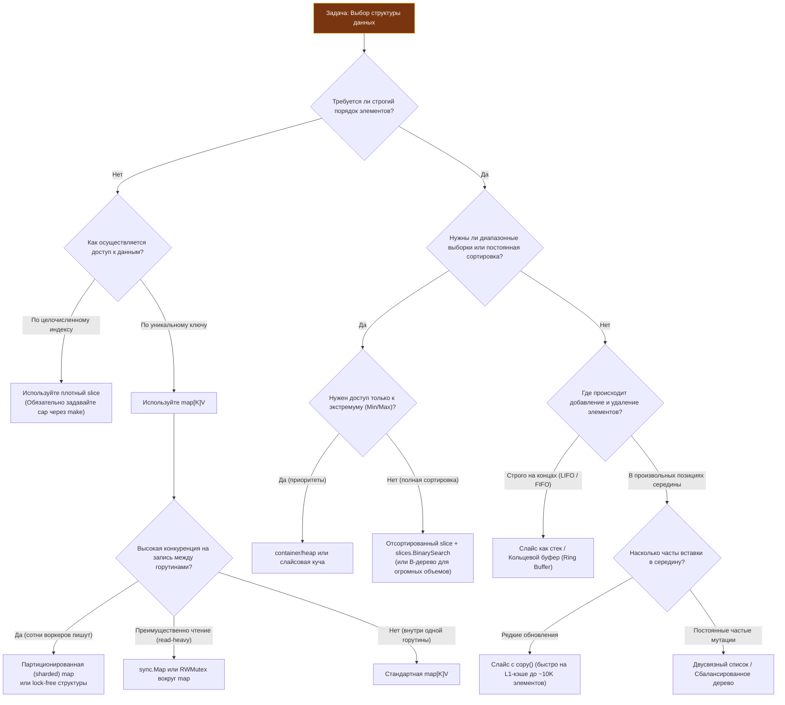

## От асимптотики к инженерным решениям

В предыдущих статьях мы подробно разобрали математический аппарат: нотации Big $O$, $\Theta$, $\Omega$, тонкости амортизированного анализа, пространственную сложность и критическое влияние кэш-локальности на реальное быстродействие железа. Но сухое знание асимптотических формул само по себе не дает ответа на главный практический вопрос инженера: **«Какую структуру данных мне выбрать прямо сейчас для этой конкретной задачи?»**.

В реальном бэкенде выбор оптимальной структуры данных редко сводится к беглому поиску типового рецепта. Это всегда взвешенный инженерный компромисс между четырьмя ключевыми измерениями:
1.  **Паттерн доступа:** чтение или запись, последовательный или случайный доступ, точечный запрос по ключу или выборка непрерывного диапазона.
2.  **Объем и жизненный цикл данных:** эфемерные структуры в рамках одного HTTP-запроса или многогигабайтные долгоживущие кэши в оперативной памяти.
3.  **Конкурентность:** синхронная обработка в одной горутине или параллельный доступ сотен тысяч горутин под высокой нагрузкой.
4.  **Аппаратные и рантайм-ограничения Go:** давление на [[7. Глубокий Go (Внутреннее устройство)|сборщик мусора (GC)]], количество аллокаций в куче, утилизация 64-байтных кэш-линий процессора и предотвращение промахов в TLB.

Эта статья служит практическим мостом между теоретическим анализом и реальным системным проектированием. Мы сформируем строгий каркас принятия решений, позволяющий обоснованно выбирать архитектурные примитивы.

---

### 1. Классификация паттернов доступа

Первый шаг в выборе структуры — четкая формализация доминирующего шаблона (паттерна) доступа к данным. От него зависит, какой механизм станет ускорителем, а какой превратится в непреодолимое бутылочное горлышко.

| Паттерн доступа | Типичный пример в бэкенде | Рекомендуемая структура | Физическое обоснование |
|---|---|---|---|
| **Прямой доступ по индексу** | Буферы сетевого ввода-вывода (I/O), парсинг бинарных протоколов, кадры данных | `slice` / статический массив `[N]T` | Непрерывная область памяти, доступ за $O(1)$, предсказуемый аппаратный префетчинг CPU |
| **Произвольный доступ по ключу** | Сессии пользователей, кэш метаданных, словари конфигурации | `map[K]V` | Амортизированный доступ $O(1)$, быстрое хэширование ключей, точечная выборка |
| **Вставка и удаление на концах** | Очереди задач, буферы логов, обработка потоковых событий | `slice` (стек / кольцевой буфер), `chan` | Слайс обеспечивает быстрый push/pop без сдвига базового массива |
| **Вставка и удаление в середине** | Текстовые буферы, интерактивные редакторы, списки с частым перемешиванием | Двусвязный список (`container/list`), rope, дерево | Позволяет избежать сдвига $O(n)$ элементов, но приносит в жертву кэш-локальность |
| **Диапазонные запросы и сортировка** | Пагинация лент, временные ряды, метрики за окно времени, Top-N отчёты | Отсортированный `slice` + бинарный поиск, B-дерево, LSM-дерево | Гарантированный порядок, эффективное взятие срезов, минимальный оверхед по памяти |
| **Поиск по префиксу** | Автодополнение поисковой строки, роутинг HTTP-путей, DNS-резолвинг | Trie (префиксное дерево), Radix Tree, отсортированный слайс + `binary search` | Мгновенный поиск подстрок, агрессивное переиспользование памяти на общих префиксах |

> [!warning] Ловушка / Gotcha
> **Избегайте использования двусвязных списков (`container/list`) в Go без крайней необходимости!**  
> В языках с классическим ООП вроде C++ (`std::list`) или Java (`LinkedList`) связный список часто преподносится как универсальное решение для частых вставок. В Go пакет `container/list` оперирует указателями на структуру `Element` с полями `Value any`. Каждый элемент аллоцируется отдельно в куче, порождая колоссальную фрагментацию и уничтожая пространственную кэш-локальность. На операциях обхода или фильтрации список на 10 000 элементов оказывается **в 5–10 раз медленнее** обычного непрерывного слайса, несмотря на книжные $O(1)$ для вставки. Используйте связные списки только для LRU-кэшей, где требуется мгновенное перемещение уже найденного узла в голову очереди без копирования данных.

---

### 2. Матрица принятия решений для Go

Ниже представлена детальная диаграмма выбора структуры данных, спроектированная с учетом особенностей компилятора, рантайма Go и реалий серверной разработки.



---

### 3. Go-специфика: когда стандартные структуры не подходят

Стандартная библиотека Go сознательно консервативна. Создатели языка Роб Пайк и Кен Томпсон заложили философию: предоставлять минимальный набор ортогональных примитивов (`slice`, `map`, `chan`), а не раздувать стандартную библиотеку сотнями узкоспециализированных контейнеров. Но в продакшене стандартных примитивов иногда недостаточно.

#### Мапы и конкурентность

Встроенная `map` в Go **категорически не потокобезопасна**. При обнаружении параллельного чтения и записи рантайм мгновенно завершает процесс аварийным падением (`fatal error: concurrent map read and map write`), которое невозможно перехватить через `recover()`.

Основные инженерные паттерны синхронизации:
1.  **Мьютекс вокруг `map` (`sync.RWMutex`):** Простое и надежное решение для умеренной нагрузки. При экстремальном числе горутин мьютекс становится точкой глобального конфликта (lock contention).
2.  **`sync.Map`:** Оптимизирована исключительно под два специфических сценария:
    *   Когда запись ключа происходит один раз, а чтение — многократно (cache-like read-heavy).
    *   Когда непересекающиеся множества горутин читают и модифицируют непересекающиеся наборы ключей.  
    Внутри `sync.Map` разделена на `read` (lock-free атомарная карта) и `dirty` (защищенная мьютексом). Для обычного смешанного профиля записи `sync.Map` работает медленнее стандартной `map` с мьютексом.
3.  **Шардированная мапа (Sharded / Partitioned Map):** Разделение ключей на $N$ независимых корзин (где $N$ кратно степени двойки, например 32 или 64):
    $$\text{shardIndex} = \text{hash}(\text{key}) \pmod N$$
    Каждый шард защищается собственным независимым мьютексом `sync.RWMutex`. Это кардинально снижает contention, являясь стандартом де-факто для высоконагруженных in-memory кэшей.

#### Слайсы как очереди и стеки

В Go слайс идеально подходит на роль стека (LIFO). Для очереди (FIFO) часто используют кольцевой буфер фиксированной емкости или слайс со сдвигом указателя.

```go
// Идиоматичный обобщенный стек на слайсе
type Stack[T any] struct {
    items []T
}

func (s *Stack[T]) Push(v T) {
    s.items = append(s.items, v)
}

func (s *Stack[T]) Pop() (T, error) {
    if len(s.items) == 0 {
        var zero T
        return zero, errors.New("stack is empty")
    }
    n := len(s.items) - 1
    item := s.items[n]
    var zero T
    s.items[n] = zero // КРИТИЧНО: освобождаем ссылку для Garbage Collector!
    s.items = s.items[:n]
    return item, nil
}
```

> [!info] Под капотом
> Обратите особое внимание на строку `s.items[n] = zero`. Если тип `T` содержит указатель, интерфейс или срез, усечение длины слайса `s.items = s.items[:n]` **не затирает** лежащие в базовом массиве байты. Указатель физически остается в невидимой «хвостовой» памяти слайса между `len` и `cap`. Сборщик мусора Go видит живую ссылку и не может освободить занятый объект из кучи, что приводит к коварным скрытым утечкам памяти (memory leaks). Присваивание нулевого значения `zero` гарантированно обнуляет указатель.

#### Очереди сообщений в памяти

*   **Каналы Go (`chan T`):** Идеальны для передачи владения данными между горутинами. Канал инкапсулирует кольцевой буфер `hchan`, мьютекс и списки ожидания горутин (`sudog`). Однако для локальной буферизации внутри одной горутины оверхед мьютексов канала избыточен.
*   **Кольцевой буфер на слайсе (Ring Buffer):** Лучший выбор для локальной FIFO-очереди. Размер фиксирован или растет блоками, накладные расходы на аллокации равны нулю.

---

### 4. Механическая симпатия в выборе структуры

Выбор контейнера напрямую диктует поведение кремния и подсистем рантайма. Оценивать архитектурные решения через призму Mechanical Sympathy помогает следующая матрица:

| Архитектурный критерий | Сочувствующий аппаратной части выбор (Cache-Friendly) | Конфликтующий с железом выбор (Cache-Unfriendly) | Системные последствия в Go Runtime |
|---|---|---|---|
| **Плотность упаковки** | Плотный слайс структур `[]Data`, массив примитивов | Слайс указателей `[]*Data`, связанный список `container/list` | Плотные структуры укладываются в 64-байтные кэш-линии; память pointer-free не сканируется GC |
| **Управление аллокациями** | `make` с точным `capacity`, пулы `sync.Pool` | Неограниченный `append`, динамические `new()` в цикле | Частые мелкие аллокации фрагментируют память в `mheap`, вызывая рост пауз Stop-The-World |
| **Размер одного элемента** | $\le 64$ байта (вписывается в одну кэш-линию) | $> 256$ байт с разветвленными внутренними ссылками | Крупные элементы быстро вытесняют соседние данные из L1/L2 кэша, снижая hit rate |
| **Модель конкурентности** | Read-heavy: атомики `sync/atomic`, шардирование | Write-heavy: глобальный `sync.Mutex` на всю мапу | Глобальные блокировки переводят горутины в состояние ожидания, заставляя планировщик Go переключать контекст |

> [!tip] Собеседование
> **Вопрос:** «Ваш сервис обрабатывает 50 000 сетевых запросов в секунду. В каждом обработчике создается структура `RequestContext` размером 1 КБ, заполняется данными, передается по цепочке middleware и отбрасывается. Сервис страдает от периодических всплесков p99 latency. В чем причина и как ее устранить?»
>
> **Сильный ответ:** «Причина всплесков — генерация 50 МБ/с короткоживущих объектов в куче. Сборщик мусора Go вынужден непрерывно запускать циклы маркировки (Mark Phase) и задействовать 25% всех процессорных ядер на помощь аллокатору (Mark Assist). Решение:
> 1. Внедрить пул объектов `sync.Pool` для переиспользования структур `RequestContext`. Перед возвратом объекта в пул через `Put` обязательно вызывать метод `Reset()`, обнуляющий поля и очищающий ссылки.
> 2. Проверить через `go build -gcflags="-m"`, почему структура покидает стек. Если передача в middleware происходит по интерфейсу, это может провоцировать лишний escape.
> 3. Зафиксировать мягкий лимит памяти рантайма через переменную окружения `GOMEMLIMIT`, предотвращая агрессивное преждевременное срабатывание GC».

---

### 5. Разбор кейсов и типичные ошибки

#### Кейс 1: Уникальные элементы с сохранением порядка

**Задача:** Отфильтровать дубликаты из потока идентификаторов, сохранив исходный порядок первого появления элементов.  
**Наивный подход:** Использовать две параллельные структуры — `map[int]bool` и слайс `[]int`.  
**Проблема:** Перерасход памяти, раздувание булевых флагов до отдельных байт.  
**Идиоматичное Go-решение:** Использовать слайс `[]int` (или `[]T`) для фиксации порядка и `map[int]struct{}` (или `map[T]struct{}`) для контроля уникальности. Тип `struct{}` (пустая структура) имеет размер строго 0 байт (`unsafe.Sizeof(struct{}{}) == 0`), что экономит память в бакетах мапы. Если в дальнейшем потребуется быстрое удаление произвольных элементов, следует использовать связку мапы и двусвязного списка, как в [[7. Продвинутые структуры данных/7. LRU кэш|LRU-кэше]].

#### Кейс 2: Топ-K элементов по частоте

**Задача:** В реальном времени определять 10 самых часто запрашиваемых товаров из миллионов входящих событий.  
**Наивный подход:** Сложить все счетчики в `map` и при каждом запросе сортировать срез пар `slice` длиной $N$ за время $O(N \log N)$ — недопустимо дорого.  
**Оптимальное решение:** Применить min-heap (мини-кучу) фиксированного размера $K=10$. При обработке каждого нового значения сложность поддержания топа составит всего $O(N \log K)$. При $N = 100\,000$ и $K = 10$ это $\approx 330\,000$ операций сравнения вместо $1\,700\,000$. В Go для этого используется стандартный пакет `container/heap` или кастомная реализация поверх непрерывного среза (подробнее см. [[6. Кучи и приоритетные очереди]]). Для агрегации на интервалах времени куча комбинируется со [[14. Практические паттерны/2. Rate limiting алгоритмы|скользящим окном]].

#### Кейс 3: Поиск в отсортированном слайсе

Нередко разработчики по инерции используют линейный поиск `for _, v := range slice`, даже когда коллекция изначально отсортирована.

```go
// Идиоматичный бинарный поиск в Go (Go 1.21+)
import "slices"

// slices.BinarySearch возвращает найденный индекс и булев флаг успеха
idx, found := slices.BinarySearch(data, target)
if found {
    // Элемент найден за O(log n)
    _ = data[idx]
}

// Альтернатива для сложных условий через предикат:
// idx := sort.Search(len(data), func(i int) bool { return data[i] >= target })
// if idx < len(data) && data[idx] == target { ... }
```

Бинарный поиск снижает время нахождения с $O(n)$ до $O(\log n)$. Благодаря высокой плотности упаковки среза в памяти и аппаратному кэшированию CPU бинарный поиск по срезу до 1 000–5 000 элементов зачастую опережает даже поиск по хэш-таблице `map`, не требуя затрат на вычисление хэш-функции.

---

### Итог

Выбор структуры данных в инженерной практике Go — это не гонка за абстрактной алгоритмической элегантностью, а поиск **оптимального соответствия физике задачи**:
1.  **Определите доминирующую операцию:** Поиск по ключу, выборка диапазона, добавление на концах или частые перестановки в середине.
2.  **Оцените объем и время жизни:** Мелкие эфемерные структуры удерживайте на стеке; для горячих объектов используйте `sync.Pool`; долгоживущие кэши стройте на компактных слайсах.
3.  **Помните об особенностях Go:** Встроенная `map` не потокобезопасна и создает оверхед в куче; `slice` исключительно дружелюбен к кэшу L1/L2, но требует обнуления ссылок (`s[i] = zero`) во избежание утечек памяти при эмуляции очередей.
4.  **Учитывайте поведение аппаратной части:** Линейный массив с последовательным обходом всегда эффективнее разрозненных указателей.
5.  **Следуйте правилу простоты:** Связка `slice` + `map` закрывает свыше 80% задач серверной разработки. Переходите к деревьям, кучам и специализированным кольцевым буферам только тогда, когда профилировщик (`pprof`) указывает на конкретное узкое место.

С этим прочным концептуальным фундаментом мы завершаем вводный модуль и переходим к детальному препарированию фундаментальных структур данных. В следующем подразделе мы начнем с самого сердца языка Go — статических массивов и динамических слайсов, детально разобрав их устройство вплоть до машинных инструкций.

[[1. Массивы и динамические массивы]]