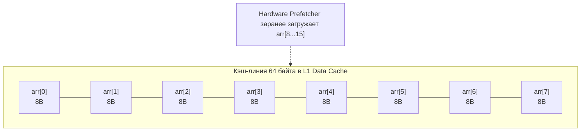
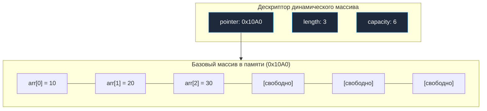
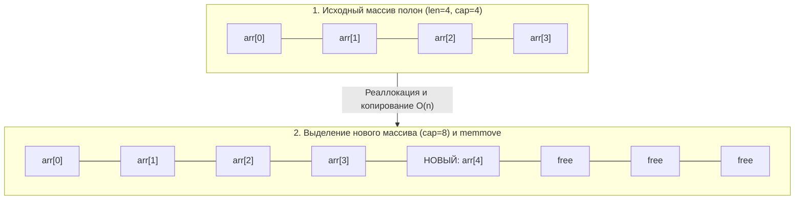

## Статический массив: кремниевый фундамент структур данных

Статический массив — это фундаментальная, самая простая и одновременно самая "железо-ориентированная" структура данных в информатике. Практически все более сложные абстракции — динамические массивы, хеш-таблицы, кольцевые буферы и бинарные кучи — под капотом опираются на монолитные непрерывные блоки памяти, то есть на статические массивы.

Для бэкенд-разработчика понимание работы массивов — это не просто знание синтаксиса `[N]T`, а понимание того, как данные физически перемещаются между оперативной памятью (RAM) и регистрами процессора через шину и многоуровневую иерархию кэшей.

---

## Mechanical Sympathy: Массивы и кэш CPU

Почему массив считается абсолютным эталоном скорости для последовательного обхода данных? Ответ кроется в архитектуре современных процессоров и подсистеме памяти.

Процессор **никогда** не читает данные из оперативной памяти по одному байту. Оперативная память (DRAM) работает чудовищно медленно по меркам исполнительного конвейера CPU: типичный доступ занимает 60–100 наносекунд, за которые ядро успевает пропустить сотни рабочих тактов. Чтобы сгладить эту разницу, процессоры используют трехуровневую иерархию кэшей (L1, L2, L3) и оперируют квантами фиксированного размера — **кэш-линиями (Cache Lines)**, размер которых на современных архитектурах x86-64 и ARM64 составляет ровно 64 байта.

```mermaid
flowchart LR
    classDef process  fill:#1e293b,stroke:#38bdf8,stroke-width:1px,color:#f8fafc
    classDef success  fill:#064e3b,stroke:#34d399,stroke-width:1px,color:#f8fafc
    classDef error    fill:#7f1d1d,stroke:#f87171,stroke-width:1px,color:#f8fafc
    classDef warning  fill:#78350f,stroke:#fbbf24,stroke-width:1px,color:#f8fafc
    classDef entry    fill:#1e3a5f,stroke:#38bdf8,stroke-width:2px,color:#f8fafc
    classDef aux      fill:#334155,stroke:#64748b,stroke-width:1px,color:#f8fafc
    classDef system   fill:#312e81,stroke:#a78bfa,stroke-width:1px,color:#f8fafc
    classDef data     fill:#132d29,stroke:#2dd4bf,stroke-width:1px,color:#f8fafc
    classDef network  fill:#881337,stroke:#fb7185,stroke-width:1px,color:#f8fafc
    classDef accent   fill:#1e1b4b,stroke:#818cf8,stroke-width:1px,color:#f8fafc
    RAM["Оперативная память (RAM):::data<br/>Задержка ~100ns (200-300 тактов)"] -->|"Выборка 64 байт<br/>(Кэш-линия)"| L3["L3 кэш<br/>Задержка ~15ns (40-50 тактов)"]
    L3 -->|"Предвыборка<br/>(Prefetcher)"| L2["L2 кэш<br/>Задержка ~4ns (12-14 тактов)"]
    L2 --> L1["L1 кэш<br/>Задержка ~1ns (3-4 такта)"]
    L1 --> CPU["Регистры CPU"]
```



> [!info] Под капотом: Spatial Locality
> Когда вы обращаетесь к нулевому элементу массива `arr[0]` (типа `int64`, размер 8 байт), процессор не просто берет 8 байт. Он вытягивает целую кэш-линию в 64 байта из RAM в L1 кэш. Это означает, что элементы с `arr[1]` по `arr[7]` **уже оказываются в сверхбыстром кэше L1 (доступ за ~1-3 такта)** до того, как ваш код явно к ним обратится. Это явление называется **Пространственной локальностью (Spatial Locality)**. См. подробнее в [[4. Пространственная сложность и cache locality]].

Более того, в современных ядрах процессоров работает специализированный блок — аппаратный **Prefetcher** (предсказатель выборок). Он непрерывно анализирует паттерны адресов, к которым обращается конвейер. Если Prefetcher видит монотонный линейный шаг (`arr[0]`, `arr[1]`, `arr[2]`), он начинает упреждающе и асинхронно подтягивать следующие 64-байтные строки из RAM в кэши L3/L2/L1 *до* того, как процессор физически дойдет до инструкций чтения этих элементов. Никакая другая структура данных (например, связный список или граф) не способна дать столь мощного синергетического эффекта с процессорным кремнием.



---

## Статические массивы в Go

В языке Go статический массив объявляется с жестко заданным размером: `[N]T`, где `N` — целочисленная константа, известная компилятору строго на этапе компиляции, а `T` — тип хранящихся элементов.

### Внутреннее устройство

В отличие от языков вроде Java или C#, где массивы — это всегда объекты в куче с обязательным заголовком (Object Header) и счетчиком длины, статический массив в Go — это чистый, непрерывный блок памяти. В рантайме Go (и в бинарном машинном коде) у статического массива нет никаких скрытых полей, указателей, метаданных или счетчиков длины.

Переменная типа `[5]int` на 64-битной архитектуре — это ровно **40 байт** (5 элементов $\times$ 8 байт) непрерывных данных, размещенных прямо в текущем фрейме стека (если переменная не убегает в кучу по результатам Escape Analysis).

```
Схема памяти для [5]int (40 байт на стеке):
+---------+---------+---------+---------+---------+
| arr[0]  | arr[1]  | arr[2]  | arr[3]  | arr[4]  |
| 8 байт  | 8 байт  | 8 байт  | 8 байт  | 8 байт  |
+---------+---------+---------+---------+---------+
BaseAddr  Base+8    Base+16   Base+24   Base+32
```

> [!warning] Ловушка / Gotcha: Value Semantics
> Одно из главных отличий Go от C++ или Java заключается в том, что массивы в Go — это **значения (values)**, а не указатели на первый элемент (как в C) или ссылки (как в Java).

Размер массива является неотъемлемой частью его типа. Тип `[5]int` не совместим с типом `[6]int` — с точки зрения системы типов Go это два абсолютно разных, не приводимых друг к другу типа. 

Когда вы присваиваете массив другой переменной (`b = a`) или передаете его аргументом в функцию по значению, рантайм Go выполняет **полное побайтовое копирование всего участка памяти**.

```go
package main

import "fmt"

func modifyArray(arr [5]int) {
    // arr здесь — это независимая полная копия оригинального массива в новом фрейме стека
    arr[0] = 99
}

func main() {
    original := [5]int{1, 2, 3, 4, 5}
    
    modifyArray(original)
    
    // Выведет [1 2 3 4 5]. Оригинальный массив остался нетронутым!
    fmt.Println(original) 
}
```

> [!tip] Собеседование
> **Вопрос:** Что произойдет, если передать массив `[1000000]int` в функцию по значению?
>
> **Ответ:** Go-рантайм скопирует ровно 8 мегабайт (1 000 000 $\times$ 8 байт) данных через стек или вызов функции `memmove`. Поскольку начальный размер стека горутины в Go составляет всего 2 КБ (2048 байт), попытка разместить такой фрейм мгновенно вызовет серию системных аллокаций через `runtime.morestack` для экспоненциального расширения стека. Копирование 8 МБ заблокирует ядро CPU, вымоет полезные горячие данные из кэшей L1/L2 (паразитное загрязнение кэша — cache pollution) и нанесет тяжелый удар по задержкам сервиса. Передавать крупные массивы следует строго по указателю: `func process(arr *[1000000]int)`.

---

## Динамические массивы: Алгоритмический концепт

Статические массивы непревзойденно быстры, но их фиксированный размер делает их непригодными для большинства реальных бэкенд-задач, где объем входящих сетевых пакетов, строк базы данных или сообщений неизвестен заранее.

Инженерам требуется структура, сочетающая кэш-локальность статического массива с возможностью динамического роста. Это — **Динамический массив** (в C++ представленный `std::vector`, в Java — `ArrayList`, в Python — `list`).

В языке Go роль динамического массива выполняет встроенный тип **Slice (слайс)**. Однако, прежде чем разбирать тонкости слайсов, разберем базовый алгоритмический фундамент динамических коллекций.

### Архитектура динамического массива

Динамический массив строится поверх статического массива в памяти и управляет тремя фундаментальными дескрипторами:
1. `pointer` — указатель на базовый непрерывный статический массив в памяти (backing array).
2. `length` (длина) — количество реально занятых полезными данными элементов в данный момент.
3. `capacity` (вместимость) — физический предельный размер текущего базового массива без реаллокации.



---

### Алгоритм изменения размера (Resizing / Reallocation)

Когда мы добавляем новый элемент в динамический массив и условие `length == capacity` становится истинным (массив полностью заполнен), структура больше не может производить запись на месте. Запускается алгоритм реаллокации:
1. В куче аллоцируется новый статический массив увеличенного объема (обычно `capacity * 2` или `capacity * 1.5`).
2. Содержимое старого массива копируется в начало нового блока через оптимизированные ассемблерные инструкции пакетного переноса памяти (`memmove`).
3. Новый элемент записывается на позицию с индексом `length`, а `length` инкрементируется.
4. Внутренний указатель переключается на адрес нового массива, а старый блок отдается на утилизацию Garbage Collector'у (в Go) или освобождается вручную.



> [!info] Под капотом: Амортизированная сложность
> Операция реаллокации очень дорогая ($O(n)$), так как требует аллокации в куче и копирования всех существующих элементов. Но поскольку мы увеличиваем размер мультипликативно (например, в 2 раза), реаллокации происходят логарифмически редко. Поэтому добавление в конец массива оценивается как **Амортизированное O(1)**. Подробнее этот математический фокус разобран в статье [[3. Амортизированный анализ]].

---

### Реализация концепта динамического массива на Go (Educational purpose)

Чтобы заглянуть под капот абстракции, создадим учебную, потоко-небезопасную реализацию динамического массива с использованием Go-дженериков, наглядно имитирующую механику слайса:

```go
package main

import (
	"errors"
	"fmt"
)

// DynamicArray инкапсулирует логику управления памятью.
// В Go встроенный слайс имеет ровно такую же структуру (SliceHeader).
type DynamicArray[T any] struct {
	data     []T // В реальности здесь был бы unsafe.Pointer на массив
	length   int
	capacity int
}

// NewDynamicArray создает массив с начальной вместимостью.
func NewDynamicArray[T any](initialCapacity int) *DynamicArray[T] {
	if initialCapacity < 1 {
		initialCapacity = 1
	}
	return &DynamicArray[T]{
		// Имитируем сырой статический массив через слайс с фиксированным размером
		data:     make([]T, initialCapacity), 
		length:   0,
		capacity: initialCapacity,
	}
}

// Append добавляет элемент в конец, прозрачно управляя памятью
func (da *DynamicArray[T]) Append(value T) {
	// Если места нет, запускаем тяжелую операцию реаллокации
	if da.length == da.capacity {
		da.grow()
	}
	
	// Теперь место гарантированно есть, вставляем за O(1)
	da.data[da.length] = value
	da.length++
}

// grow выполняет реаллокацию (увеличение capacity в 2 раза)
func (da *DynamicArray[T]) grow() {
	newCapacity := da.capacity * 2
	newData := make([]T, newCapacity)
	
	// Копируем старые данные в новый кусок памяти.
	// Это O(N) операция. В рантайме Go это делается оптимизированным memmove.
	copy(newData, da.data)
	
	da.data = newData
	da.capacity = newCapacity
}

func (da *DynamicArray[T]) Get(index int) (T, error) {
	var zero T // Нулевое значение для типа T
	if index < 0 || index >= da.length {
		return zero, errors.New("index out of bounds") // Защита от выхода за границы
	}
	// Доступ по индексу — O(1)
	return da.data[index], nil
}
```

> [!warning] Ловушка / Gotcha: Утечки памяти (Memory Leaks) при реаллокации
> В коде выше, когда мы делаем `da.data = newData`, старый массив теряет единственную ссылку на себя. В Go в дело вступит Garbage Collector (GC), который в фоне (во время фазы Mark & Sweep) найдет этот "осиротевший" кусок памяти и освободит его. 
> Если реаллокации происходят слишком часто (например, вы в цикле добавляете миллион элементов, начиная с capacity=1), это создаст огромную нагрузку на GC, который будет вынужден постоянно очищать старые массивы. Возникнет **GC Churn**. Поэтому всегда старайтесь аллоцировать структуры с заранее известным `capacity`!

---

## Временная сложность (Time Complexity)

Для статических и динамических массивов (при условии корректного амортизированного анализа последовательностей) справедливы следующие характеристики (подробнее см. [[2. Асимптотическая сложность. Big O, Big Theta, Big Omega]]):

*   **Доступ по индексу (`arr[i]`):** Строго **$O(1)$**. Аппаратный адрес вычисляется за 1 такт CPU по формуле:
    $$\text{Адрес} = \text{Базовый\_Адрес} + \text{Индекс} \times \text{Размер\_Типа}$$
    В ассемблере x86-64 это компилируется в одиночную инструкцию индексной адресации вида `MOVQ (RAX, RCX, 8), RDX`.
*   **Линейный поиск значения:** **$O(n)$** в худшем случае (требуется полный последовательный проход всех ячеек).
*   **Вставка в конец (`append`):** **$O(1)$ амортизированное** при геометрическом коэффициенте роста ($O(n)$ в редкие моменты реаллокации).
*   **Вставка / удаление в середине:** **$O(n)$**. Требуется сдвинуть все последующие $k$ элементов на одну позицию вправо или влево с помощью вызова `copy()` / `memmove`.

---

## Итог

*   **Статический массив** — фундаментальный кирпич архитектуры памяти: непрерывный, монолитный, без оверхеда метаданных.
*   **Симпатия к кэшу:** Благодаря 64-байтным кэш-линиям и аппаратному блоку Prefetcher процессора, последовательный обход массива в памяти происходит в разы быстрее любых связанных структур.
*   **Семантика значений в Go:** Массивы `[N]T` передаются по значению с полным побайтовым копированием; передача больших массивов требует явного использования указателей `*[N]T`.
*   **Динамический массив** решает проблему фиксированного размера через триаду дескрипторов `(pointer, length, capacity)` и алгоритм геометрической реаллокации, гарантирующий амортизированное время добавления $O(1)$.
*   **GC Churn:** Пренебрежение предвыделением емкости (`capacity`) при динамическом росте превращает реаллокации в тяжелый источник мусора для GC.

В Go вам никогда не придется писать структуру `DynamicArray` вручную. Язык предоставляет встроенный, глубоко интегрированный в рантайм и компилятор инструмент, который реализует паттерн динамического массива с дополнительной магией "срезания" (slicing) участков памяти. 

В следующей статье мы разберем главный инструмент работы с последовательностями в Go, заглянем в исходники `runtime/slice.go`, изучим `SliceHeader` и посмотрим, как компилятор оптимизирует `growslice`: [[2. Слайсы в Go как структура данных]].