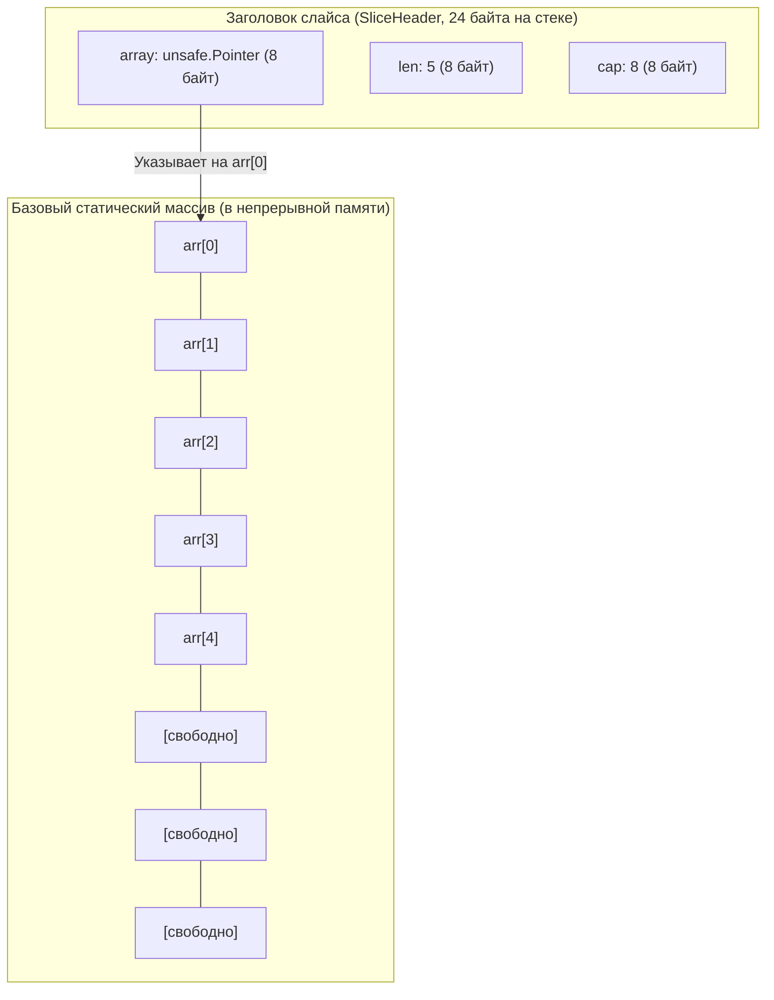
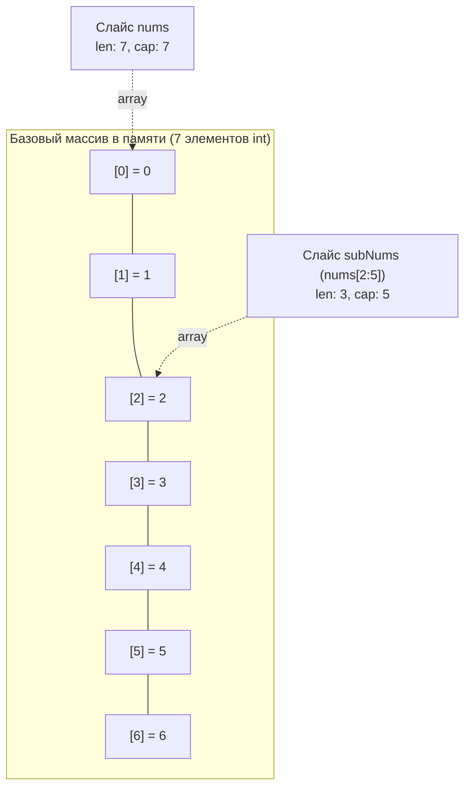
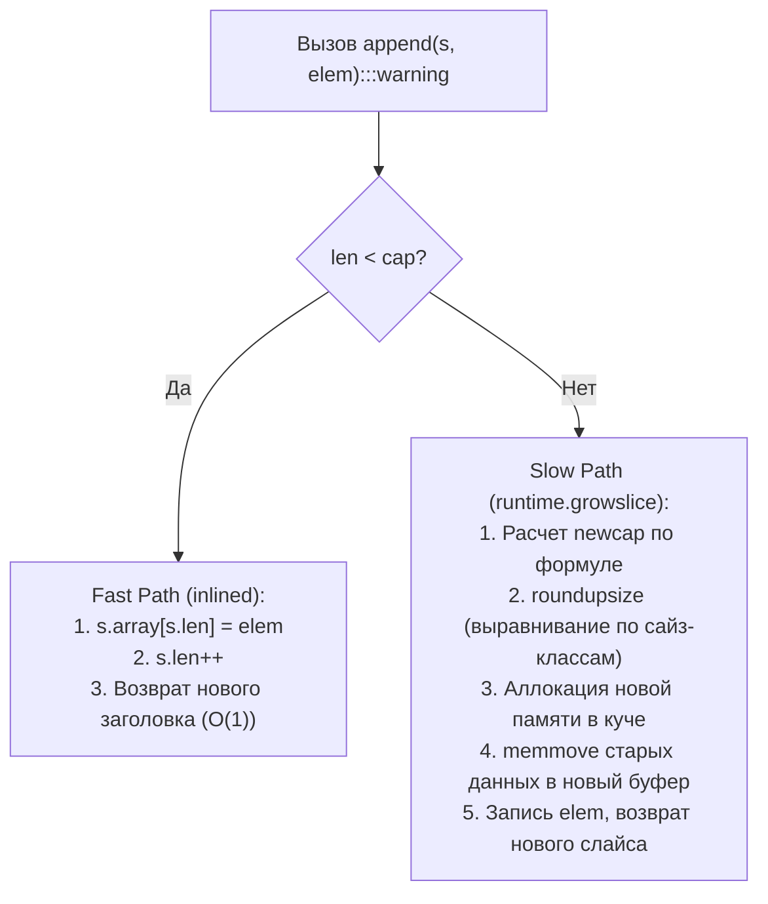
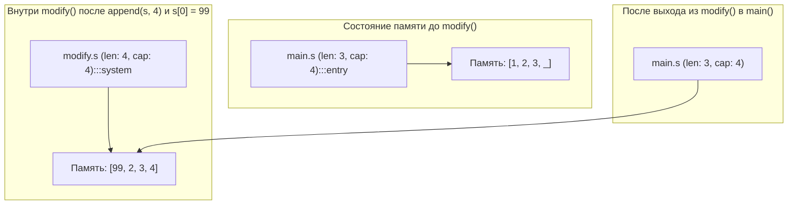

## Слайс: элегантная анатомия динамических последовательностей

В предыдущей статье [[1. Массивы и динамические массивы]] мы выяснили, что статические массивы — это физический фундамент аппаратной производительности, но их фиксированный размер непреодолимо сковывает разработку реальных сервисов. Для масштабируемых систем необходим механизм динамического управления емкостью.

В языке Go этот паттерн реализован на уровне ядра компилятора и рантайма в виде **слайсов (срез, slice)**. Слайсы — это альфа и омега серверной разработки на Go. Почти любая операция ввода-вывода, манипуляция с байтовыми потоками или бизнес-коллекциями опирается на слайсы. Без глубокого понимания их внутреннего устройства невозможно писать ни высокопроизводительный, ни даже базово корректный конкурентный код.

---

## Что такое слайс под капотом?

Многие разработчики, приходящие из сред со сборкой мусора на базе тяжелых классов (Java, C#, Python), ошибочно воспринимают слайс как сложный объект-коллекцию, живущий исключительно в куче с массой служебных дескрипторов. Это фундаментальное заблуждение.

В Go слайс — это **предельно компактная структура ровно из трех машинных слов**, передаваемая по значению. В исходном коде рантайма Go (в файле `src/runtime/slice.go`) слайс определяется структурой `slice`:

```go
// Исходный код рантайма Go (runtime/slice.go)
type slice struct {
	array unsafe.Pointer // Указатель на первый адресуемый элемент базового массива
	len   int            // Текущее количество активных элементов
	cap   int            // Полная вместимость базового массива от указателя array до его конца
}
```

На 64-битных архитектурах (x86-64, ARM64) размер этой структуры составляет ровно **24 байта** (8 байт указатель `array` + 8 байт `len` + 8 байт `cap`).



Когда вы передаете слайс в функцию в качестве аргумента, компилятор копирует через регистры процессора **только эти 24 байта**. Базовый массив (backing array), на который ссылается поле `array`, **не копируется**. Обе стороны (вызывающая и вызываемая функции) оперируют своими локальными 24-байтными заголовками, но смотрят на одну и ту же физическую область памяти.

> [!info] Под капотом: Escape Analysis и аллокации
> Где физически выделяется память под базовый массив слайса? 
> Если размер слайса известен на этапе компиляции, он невелик, и слайс не "утекает" из функции (не возвращается наружу, не передается по указателю в другие горутины), компилятор Go может разместить базовый массив прямо на **стеке** (Stack Allocation). Это дает колоссальный прирост производительности, так как не нагружает Garbage Collector.
> Если же размер вычисляется в рантайме (например, `make([]int, n)`) или слайс живет дольше функции, компилятор переносит (escapes) его в **кучу** (Heap Allocation). Проверить это можно флагом компилятора: `go build -gcflags="-m"`.

---

## Операция Slicing: Магия нулевого копирования

Синтаксическая конструкция `s[i:j]` называется операцией срезки (slicing). Эта операция создает **новый 24-байтный заголовок** слайса, который ссылается на **тот же самый** базовый массив, но с измененным начальным указателем, скорректированной длиной и пересчитанной емкостью.

```go
nums := []int{0, 1, 2, 3, 4, 5, 6} // len: 7, cap: 7
subNums := nums[2:5]               // len: 3, cap: 5
```

Как это вычисляется аппаратно за строгое $O(1)$:
1. `array` нового слайса = `array` старого + `2 * размер_типа` (смещение на 16 байт).
2. `len` = `5 - 2` = `3`.
3. `cap` = `старый_cap - 2` = `5`.



> [!warning] Ловушка / Gotcha: Утечка памяти (Memory Leak)
> Поскольку `subNums` ссылается на тот же базовый массив, что и `nums`, этот огромный базовый массив не будет собран Garbage Collector-ом, пока существует хотя бы один маленький слайс-наследник.
> **Пример:** Вы вычитываете из файла `[]byte` размером 100 МБ, берете из него первые 10 байт: `header := fileData[:10]` и сохраняете `header` в кэш. Поздравляю, вы закрепили в памяти все 100 МБ!
> **Решение:** Явно скопировать данные в новый слайс с помощью функции `copy()` или нового синтаксиса пакета `slices.Clone()` из Go 1.21.

---

## Функция append и алгоритм реаллокации

Встроенная функция `append` добавляет новые элементы в хвост слайса.
Если текущая длина `len` строго меньше вместимости `cap`, операция выполняется за $O(1)$: значение напрямую записывается в базовый массив по индексу `len`, после чего возвращается новый дескриптор слайса с инкрементированным полем `len + 1`.

Но если `len == cap`, свободное пространство в базовом массиве исчерпано. В этот момент рантайм Go передает управление внутренней системной функции `growslice` (`src/runtime/slice.go`). Она аллоцирует новый, более просторный блок памяти, копирует туда предшествующие элементы и дописывает новые.



---

### Как растет слайс (Go 1.18+)

До исторической версии Go 1.18 эвристика роста была дискретной: слайс удваивался (`cap * 2`) при `cap < 1024`, а затем резко переключался на фиксированный шаг $+25\%$ (`cap += cap / 4`). Это создавало неприятную «ступеньку» в потреблении памяти на границе 1024 элементов (1023 удваивалось до 2046, а 1024 вырастало лишь до 1280).

В современных версиях Go (включая Go 1.22–1.24) алгоритм сглажен и описывается следующими правилами:
1. Если требуемая вместимость (`cap`) больше удвоенной текущей (`doublecap`), выделяем в точности запрошенную емкость.
2. Если текущая `cap < 256`, удваиваем ее: `newcap = doublecap`.
3. Если текущая `cap >= 256`, применяется формула сглаженного роста: `newcap += (newcap + 3*256) / 4`.
   $$\text{newcap} = \text{newcap} + \frac{\text{newcap} + 3 \times 256}{4}$$
   Это обеспечивает плавный переход фактора роста от 2.0 (для малых слайсов) к 1.25 (для гигантских слайсов).

> [!info] Под капотом: Выравнивание памяти (Memory Alignment)
> Запрошенный размер `newcap` — это еще не финал. Go-рантайм не выделяет память с точностью до байта. Для эффективной работы аллокатора (TCMalloc), память выделяется "классами размеров" (size classes), например 32 байта, 48 байт, 64 байта и т.д. Компилятор округлит `newcap` до ближайшего подходящего класса размеров, поэтому реальный `cap` после `append` часто бывает немного больше, чем вы ожидаете математически.

---

## Типичные ошибки и корнер-кейсы

### 1. The Append Trap (Ловушка передачи по значению)

> [!tip] Собеседование
> **Вопрос:** Что выведет следующий фрагмент кода и почему?
> ```go
> func modify(s []int) {
>     s = append(s, 4)
>     s[0] = 99
> }
> 
> func main() {
>     s := make([]int, 3, 4) // len: 3, cap: 4
>     s[0], s[1], s[2] = 1, 2, 3
>     modify(s)
>     fmt.Println(s)
> }
> ```
> **Ответ:** Код выведет `[99 2 3]`. 
> Почему? Мы передали 24 байта заголовка слайса в `modify` **по значению**.
> Функция `modify` получила свою локальную копию заголовка. Она сделала `append`. Так как `cap == 4`, реаллокации не было! Элемент `4` был записан в базовый массив. Но `len` увеличился до `4` **только в локальной копии заголовка** внутри функции `modify`.
> Заголовок в `main` ничего не знает об этом `append`, его `len` остался равен `3`.
> Зато операция `s[0] = 99` изменила базовый массив, который является общим для обоих заголовков. 
> *Именно поэтому функции, изменяющие слайс, всегда должны возвращать его обратно: `s = appendFunc(s)`.*



---

### 2. Скрытое перезаписывание (Shadowing)

Прямое следствие совместного владения базовым массивом:

```go
s := make([]int, 0, 5)
s = append(s, 1, 2, 3)

s1 := append(s, 4) // Создает новый слайс s1: len 4, cap 5
s2 := append(s, 5) // Создает новый слайс s2: len 4, cap 5

// s1 и s2 ссылаются на один массив! 
// При создании s2 мы перезаписали четвертый элемент, который только что поставили для s1.
```

В таких случаях необходимо использовать полный синтаксис среза (**Full Slice Expression**): `s[low:high:max]`. Вызов `s[0:3:3]` жестко ограничит `cap` слайса тремя элементами (`cap = max - low`), и любой последующий `append` гарантированно вызовет реаллокацию в новый блок памяти, исключив повреждение соседних данных.

---

### 3. Nil vs Empty Slice

В Go существуют два принципиально разных состояния слайса нулевой длины:

```go
var s1 []int         // nil-слайс: len=0, cap=0, array=nil. Никаких аллокаций памяти!
s2 := make([]int, 0) // Пустой слайс: len=0, cap=0, array=указатель на zerobase.
s3 := []int{}        // Аналогично s2: пустой ненулевой слайс.
```

С точки зрения `len()` и `append()` они ведут себя одинаково. `append` к `nil`-слайсу безопасно выделит память.

Однако колоссальная разница проявляется при сериализации:
* `encoding/json` сериализует `nil`-слайс как JSON-значение `null`.
* `encoding/json` сериализует пустой слайс `s2` / `s3` как пустой JSON-массив `[]`.

**Best practice:** Всегда объявляйте слайсы через форму `var s []T`, если данные будут добавляться динамически. Это полностью избавляет рантайм от лишней работы аллокатора по связыванию дескриптора со специальным адресом `zerobase` (глобальной константой рантайма для объектов нулевого размера).

---

## Итог

1. **Слайс — это не массив.** Это легковесная 24-байтная структура (`array`, `len`, `cap`), управляющая скрытым базовым непрерывным массивом в памяти.
2. **Нулевое копирование:** Срезка `s[i:j]` не копирует данные массива. Она создает новый заголовок слайса, ссылающийся на ту же память.
3. **Mechanical Sympathy:** Слайсы обеспечивают ту же пространственную локальность (Spatial Locality) и попадание в кэш процессора, что и статические массивы. Это структура данных №1 (default choice) в Go.
4. **Контроль памяти:** Всегда используйте `make([]T, 0, expectedCapacity)`, чтобы избежать множественных реаллокаций при `append`.

Разобравшись с массивами и их динамической оберткой (слайсами), мы переходим к структурам, где элементы разбросаны по памяти случайным образом, но связаны между собой ссылками. В следующей статье мы разберем: [[3. Связные списки]].