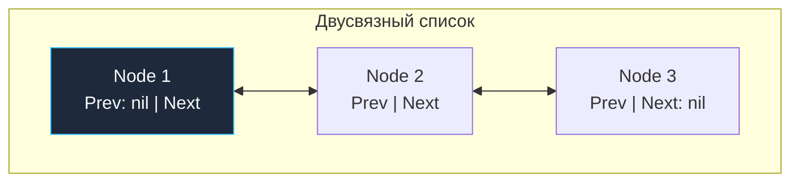
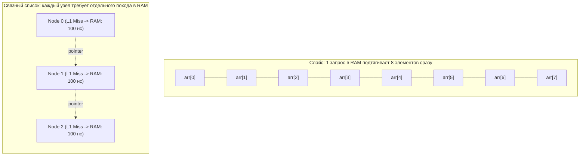
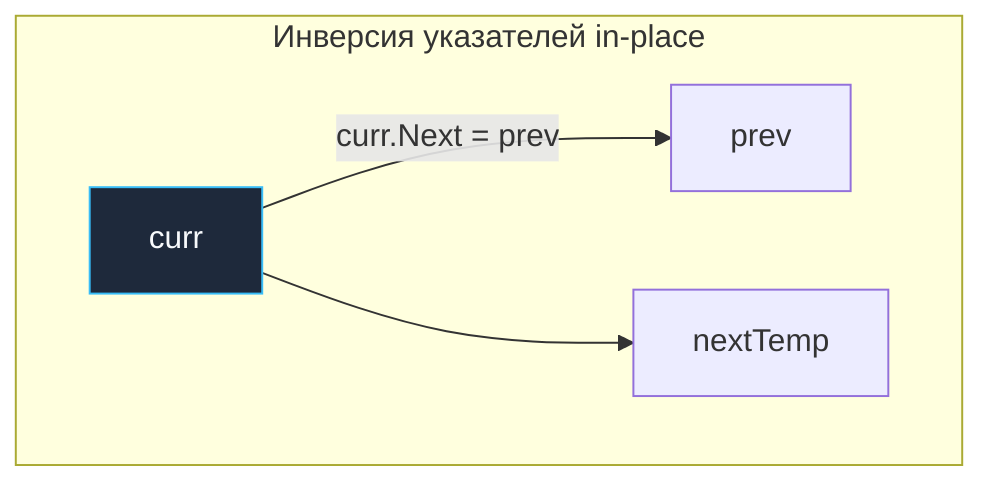
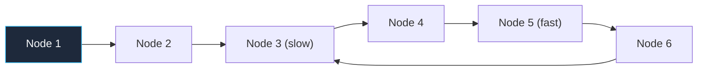

## Связные списки: указатели, свобода и цена косвенности

В статьях [[1. Массивы и динамические массивы]] и [[2. Слайсы в Go как структура данных]] мы изучили структуры данных, основанные на непрерывных блоках памяти. Их главная сила — феноменальная скорость доступа за $O(1)$ и естественная синергия с физическим кремнием процессора.

Но что происходит, когда архитектурная задача требует непрерывных вставок и удалений произвольных элементов в середине коллекции? Вставка в середину слайса требует физического сдвига половины элементов вправо, что дает сложность $O(n)$ и вымывает данные из кэша. В таких сценариях классическая алгоритмика предлагает альтернативный фундаментальный подход — **Связный список (Linked List)**.

---

## Архитектура связного списка

Связный список — это динамическая структура данных, состоящая из независимых структурных единиц — **узлов (Nodes)**. Каждый узел инкапсулирует полезную нагрузку (значение) и одну или несколько явных ссылок (указателей) на соседние узлы.

В отличие от массивов, узлы связного списка не обязаны располагаться в памяти друг за другом. Они могут быть хаотично разбросаны по всему виртуальному адресному пространству кучи (heap).

```mermaid
flowchart LR
    classDef process  fill:#1e293b,stroke:#38bdf8,stroke-width:1px,color:#f8fafc
    classDef success  fill:#064e3b,stroke:#34d399,stroke-width:1px,color:#f8fafc
    classDef error    fill:#7f1d1d,stroke:#f87171,stroke-width:1px,color:#f8fafc
    classDef warning  fill:#78350f,stroke:#fbbf24,stroke-width:1px,color:#f8fafc
    classDef entry    fill:#1e3a5f,stroke:#38bdf8,stroke-width:2px,color:#f8fafc
    classDef aux      fill:#334155,stroke:#64748b,stroke-width:1px,color:#f8fafc
    classDef system   fill:#312e81,stroke:#a78bfa,stroke-width:1px,color:#f8fafc
    classDef data     fill:#132d29,stroke:#2dd4bf,stroke-width:1px,color:#f8fafc
    classDef network  fill:#881337,stroke:#fb7185,stroke-width:1px,color:#f8fafc
    classDef accent   fill:#1e1b4b,stroke:#818cf8,stroke-width:1px,color:#f8fafc
    Head["Head (указатель головы)"] --> N1
    N1["Узел 1<br/>Адрес: 0xA100<br/>Value: 10 | Next: 0xFF20"]:::process --> N2["Узел 2<br/>Адрес: 0xFF20<br/>Value: 20 | Next: 0xBB12"]
    N2 --> N3["Узел 3<br/>Адрес: 0xBB12<br/>Value: 30 | Next: nil"]
    N3 --> Null["nil<br/>(Конец списка)"]
```



---

### Виды связных списков

1.  **Односвязный список (Singly Linked List):** Каждый узел содержит значение и единственный указатель `Next` на следующий элемент. Обход возможен строго в одном направлении от головы (`Head`) к хвосту (`Tail`).
2.  **Двусвязный список (Doubly Linked List):** Узел содержит два указателя — `Next` и `Prev`. Это позволяет двигаться в обоих направлениях и удалять произвольный узел за строгое $O(1)$, если ссылка на него уже находится в руках.
3.  **Кольцевой список (Circular Linked List):** Указатель `Next` хвостового узла замыкается обратно на `Head`. В кольцевом двусвязном списке `Head.Prev` ссылается на хвост, образуя симметричное замкнутое кольцо.



---

## Mechanical Sympathy: Почему списки ненавидят процессоры

Для Senior/Lead инженера критически важно понимать: связные списки в современном системном программировании применяются с предельной осторожностью. В теории алгоритмов вставка в связный список выполняется за $O(1)$ (при наличии прямого указателя на узел). Но с точки зрения аппаратного обеспечения связные списки — это практически худший из возможных способов организации данных в памяти.

### 1. Pointer Chasing и промахи кэша (Cache Misses)

Как мы подробно разбирали в [[4. Пространственная сложность и cache locality]], процессор обменивается данными с RAM не байтами, а 64-байтными кэш-линиями. Аппаратный блок Prefetcher безупречно предугадывает последовательные адреса плотных слайсов.

В связном списке каждый узел живет в случайном фрагменте кучи. Чтобы прочитать `Узел 2`, процессор обязан сначала вычитать `Узел 1`, извлечь из него 64-битный адрес поля `Next` (например, `0xFF20`), и лишь затем отправить запрос контроллеру памяти за `Узлом 2`.

Этот антипаттерн в архитектуре компьютеров называется **Pointer Chasing (Погоня за указателями)**.
*   Аппаратный Prefetcher здесь бессилен: он не может предугадать следующий адрес в куче.
*   Практически каждый переход по ссылке `current.Next` превращается в гарантированный L1/L2/L3 Cache Miss.
*   Процессор уходит в простой (pipeline stall) на 200–300 тактов, ожидая доставки байтов из DRAM.

На современных многоядерных машинах последовательный обход слайса из 10 000 элементов выполняется **в 20–50 раз быстрее**, чем обход связного списка той же длины, несмотря на формально одинаковую асимптотическую сложность $O(n)$!



### 2. Нагрузка на Garbage Collector (GC Pressure)

В языке Go каждый вызов `&Node{...}` без гарантий локальности фрейма приводит к побегу объекта в кучу (Escape to Heap).

*   **Миллион элементов в списке = один миллион изолированных объектов в куче.**
*   Во время фазы маркировки (Concurrent Mark Phase) [[7. Глубокий Go (Внутреннее устройство)|сборщик мусора]] Go вынужден последовательно распутывать этот клубок из миллиона указателей.
*   Это приводит к лавинообразному росту задержек (GC Churn), паразитной утилизации до 25% мощности CPU на работу GC и фрагментации страниц памяти.

> [!tip] Собеседование
> **Вопрос:** В чем разница между слайсом и связным списком, и что выбрать?
>
> **Ответ уровня Middle+:** Слайс использует непрерывный массив в памяти, что гарантирует доступ за $O(1)$ по индексу, максимальную утилизацию кэша процессора благодаря пространственной локальности (Spatial Locality) и нулевую нагрузку на GC при отсутствии указателей внутри элементов. Вставка в середину слайса стоит $O(n)$ из-за необходимости сдвига данных.
> Связный список обеспечивает вставку и удаление за $O(1)$ без сдвига соседей (при наличии ссылки на узел), но доступ по индексу деградирует до $O(n)$. Главные физические недостатки списка — катастрофические промахи кэша процессора из-за Pointer Chasing и колоссальное давление на сборщик мусора Go из-за миллионов мелких аллокаций.
> В Go-бэкенде выбором по умолчанию всегда является **слайс**. Связные списки применяются строго по показаниям: в LRU-кэшах, специфических lock-free очередях или алгоритмах планирования задач.

---

## Реализация на Go: Идиоматичный подход

С появлением дженериков в Go 1.18 мы можем написать типобезопасный, чистый и производительный связный список без интерфейсов и лишних приведений типов:

```go
package main

import "fmt"

// Node представляет узел списка с использованием дженериков
type Node[T any] struct {
	Value T
	Next  *Node[T]
}

// LinkedList инкапсулирует логику работы
type LinkedList[T any] struct {
	head *Node[T]
	tail *Node[T] // Храним указатель на хвост для O(1) вставки в конец
	size int
}

// Append добавляет элемент в конец за O(1)
func (l *LinkedList[T]) Append(value T) {
	newNode := &Node[T]{Value: value}
	
	if l.head == nil {
		l.head = newNode
		l.tail = newNode
	} else {
		l.tail.Next = newNode
		l.tail = newNode
	}
	l.size++
}

// Print обходит список. Внимание: это O(N) операция с потенциальными Cache Misses
func (l *LinkedList[T]) Print() {
	current := l.head
	for current != nil {
		fmt.Printf("%v -> ", current.Value)
		current = current.Next
	}
	fmt.Println("nil")
}
```

> [!warning] Ловушка / Gotcha: Потеря хвоста
> Обратите внимание на наличие поля `tail`. Классическая ошибка новичков — хранить только `head`. В таком случае операция `Append` (добавление в конец) будет занимать $O(n)$, так как придется каждый раз "бежать" по всему списку от начала до конца, чтобы найти последний элемент.

---

## Проблема стандартного пакета container/list

В стандартной библиотеке Go с самых ранних версий присутствует реализация двусвязного списка — пакет `container/list`. Взглянем на его внутреннее устройство:

```go
// src/container/list/list.go
type Element struct {
	next, prev *Element
	list *List
	Value any // <- Главная архитектурная проблема (interface{})
}
```

Поле `Value` имеет тип `any` (исторический алиас для `interface{}`). В высоконагруженном коде это порождает **две серьезные проблемы производительности**:
1.  **Упаковка значений (Boxing/Unboxing):** При передаче примитивного типа (например, `int` или компактной структуры) рантайм вынужден оборачивать значение в интерфейсный дескриптор `eface` (пара указателей: `_type` и `data`). Это гарантирует дополнительную аллокацию памяти в куче для каждого помещаемого значения!
2.  **Динамическая проверка типов (Type Assertion):** Чтение данных требует обязательного утверждения типа вида `val := e.Value.(int)`. Это добавляет лишние машинные инструкции проверки безопасности типов в рантайме.

**Вердикт архитектора:** Избегайте использования `container/list` в горячих путях (`hot paths`) высоконагруженных сервисов. Либо используйте непрерывные слайсы, либо напишите собственный типобезопасный список на дженериках `[T any]`, свободный от boxing-оверхеда.

---

## Алгоритмические задачи (LeetCode паттерны)

На технических собеседованиях связные списки служат идеальным полигоном для проверки умения кандидата аккуратно манипулировать указателями без утечек памяти.

### 1. Переворот списка (Reverse Linked List)

Классическая задача собеседований: развернуть односвязный список за $O(1)$ по дополнительной памяти (in-place), перенаправляя указатели `Next` на лету.

```go
func reverseList[T any](head *Node[T]) *Node[T] {
	var prev *Node[T] // Изначально указывает на nil (будущий конец развернутого списка)
	curr := head
	
	for curr != nil {
		nextTemp := curr.Next // 1. Запоминаем ссылку на следующий узел
		curr.Next = prev      // 2. Разворачиваем указатель текущего узла вспять
		prev = curr           // 3. Сдвигаем указатель prev на шаг вперед
		curr = nextTemp       // 4. Сдвигаем указатель curr на шаг вперед
	}
	
	return prev // prev становится новым head развернутого списка
}
```



---

### 2. Алгоритм зайца и черепахи (Floyd's Cycle Detection)

**Вопрос:** *Как определить, содержит ли связный список цикл (петлю), используя строго $O(1)$ дополнительной памяти?*

Алгоритм Роберта Флойда использует два указателя, движущихся с разной скоростью:
*   `slow` (черепаха) — на каждом шаге смещается на **1 узел** вперед.
*   `fast` (заяц) — на каждом шаге смещается на **2 узла** вперед.

Если в списке нет цикла, быстрый указатель `fast` первым достигнет `nil` за $O(n)$ шагов. Если же список зациклен, указатель `fast` окажется внутри кольца и неизбежно «догонит» медленный указатель `slow` сзади. Момент равенства адресов `slow == fast` математически доказывает наличие цикла.



> [!info] Под капотом: Массивы узлов (Memory Pool)
> Можно ли объединить алгоритмические преимущества связного списка ($O(1)$ вставка и удаление в произвольном месте) и аппаратные преимущества массива (Cache Locality и ноль аллокаций)?
> 
> Да! Это делается паттерном "Пул объектов" (Array-backed Linked List): 
> Мы создаем большой слайс узлов: `pool := make([]Node, 10000)`. Вместо указателей `*Node` мы используем индексы в этом слайсе: `Next int`. 
> Данные лежат непрерывно в памяти, GC не страдает (один большой объект вместо 10000 мелких), а логика связей работает как в связном списке. Подобные трюки часто применяются внутри баз данных и самом рантайме Go (например, пулы страниц памяти `mspan`).

---

## Итог

1.  **Адресация вместо смещений:** Узлы связного списка распределены по памяти произвольно и связываются между собой через явные указатели `Next` / `Prev`.
2.  **Асимптотический профиль:** Вставка и удаление выполняются за строгое $O(1)$ при наличии прямого указателя на узел; доступ по индексу и поиск требуют полного линейного прохода $O(n)$.
3.  **Аппаратная цена:** Худшая структура данных для кэшей процессора из-за феномена Pointer Chasing и тяжелое испытание для Garbage Collector'а Go.
4.  **Пакет `container/list`:** Архаичный примитив с полем `Value any`, вызывающим лишний boxing и проверки типов. В современном коде применяются кастомные дженерик-структуры.
5.  **Гибридные решения:** Для высоконагруженных сценариев связный список реализуется поверх плотного пула узлов на слайсе, заменяя указатели целочисленными индексами.

Связные списки редко выступают в качестве самостоятельного хранилища в Go, однако они являются незаменимым строительным блоком для очередей задач и алгоритмов вытеснения страниц кэша (подробнее см. [[7. LRU кэш]]).

Опираясь на понимание массивов и списков, мы переходим к абстрактным типам данных с дисциплинированным порядком доступа. В следующей лекции мы детально препарируем структуру LIFO: [[4. Стек]].