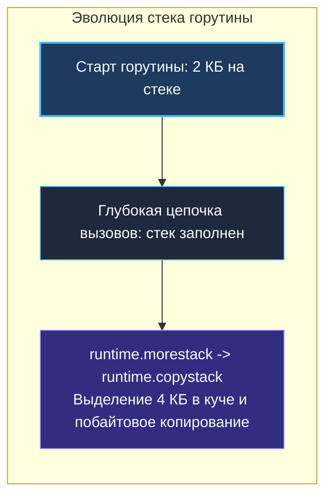
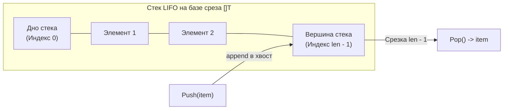
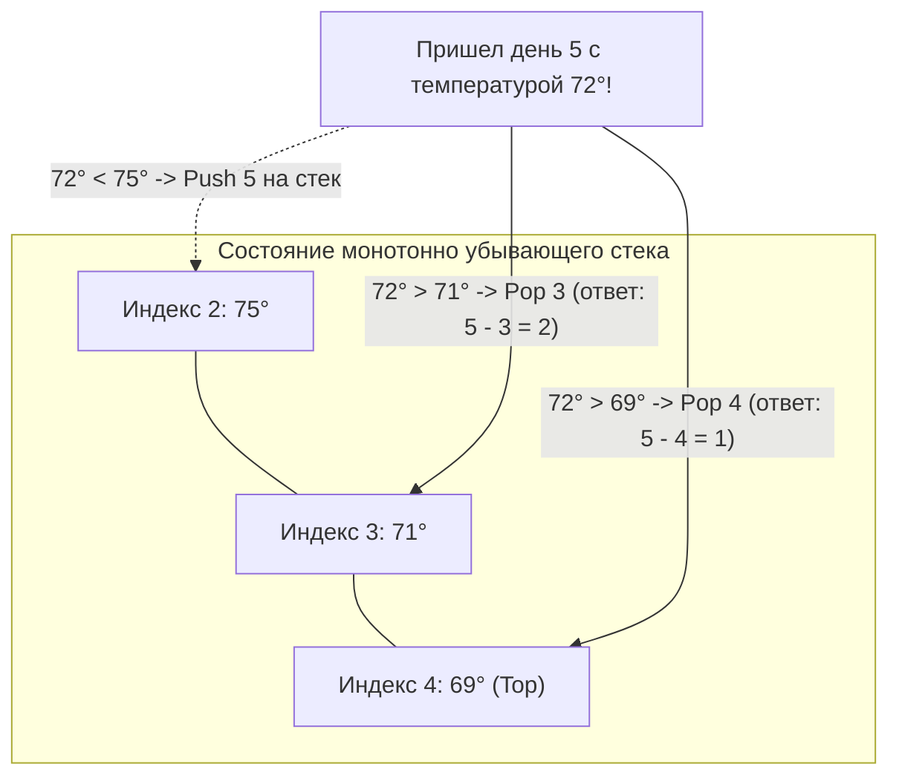

## Стек: дисциплина LIFO и архитектура исполнения

Стек (Stack) — это фундаментальный абстрактный тип данных, который, в отличие от массивов или связных списков общего назначения, жестко регламентирует порядок добавления и извлечения элементов. Он подчиняется непреложному правилу **LIFO (Last-In, First-Out — «Последним пришел, первым ушел»)**.

Классическая физическая аналогия — стопка чистых тарелок в буфете. Вы можете положить новую тарелку только на самый верх стопки, и взять тарелку для обеда тоже можете только с самого верха. Попытка выдернуть тарелку из середины неизбежно приведет к катастрофе — в программировании это означает грубое нарушение инварианта структуры данных.

Для бэкенд-инженера концепция стека выходит далеко за рамки алгоритмических этюдов: стек лежит в самом сердце исполнения любого скомпилированного машинного кода, операционных систем и планировщика горутин Go.

---

## Mechanical Sympathy: Стек вызовов (Call Stack) в Go

Любая запущенная программа использует аппаратный или виртуальный стек для управления вызовами функций, сохранения регистров, передачи аргументов и возврата управления.

В традиционных языках (C, C++, Java) потоки операционной системы (OS threads) получают монолитный фиксированный стек солидного размера — обычно от 2 до 8 мегабайт. В высоконагруженном сетевом сервисе, где одновременно открыты сотни тысяч сетевых соединений, модель «один поток на соединение» потребовала бы сотен гигабайт оперативной памяти только под пустые неиспользуемые стеки!

Язык Go решает эту проблему на фундаментальном уровне через легковесные **горутины**.



> [!info] Под капотом: Непрерывные стеки (Continuous Stacks)
> В Go горутина стартует с крошечным стеком размером всего **2 КБ**. 
> Что происходит, когда глубина вызовов функций (call depth) превышает этот объем? 
> В начале каждой функции компилятор Go вставляет невидимую инструкцию проверки размера стека. Если места не хватает, вызывается системная функция рантайма `runtime.morestack`.
> Рантайм выделяет новый, в 2 раза больший участок памяти, **копирует** туда все данные старого стека (`runtime.copystack`), пересчитывает все внутренние указатели, и только затем продолжает выполнение. Старый стек отдается Garbage Collector-у.
> Именно поэтому в Go нет проблемы `StackOverflowError` (до достижения жесткого лимита в 1 ГБ), но глубокая рекурсия все равно обходится дорого из-за постоянного копирования памяти.

---

## Реализация стека в Go: Выбор базы

Стек — это поведенческий контракт (интерфейс). Физически он должен быть реализован поверх некоторой базовой структуры данных в памяти. Ранее мы изучили двух главных кандидатов:
1.  **Связный список** (см. [[3. Связные списки]]): вставка в голову `head` и удаление из головы стоят честное $O(1)$.
2.  **Динамический массив / Слайс** (см. [[2. Слайсы в Go как структура данных]]): добавление в конец и удаление с конца стоят амортизированное $O(1)$.

**Инженерный выбор однозначен: всегда выбирайте слайс!**  
Связный список страдает от постоянных промахов кэша процессора (Cache Misses) из-за погони за указателями (Pointer Chasing) и создает тяжелую нагрузку на сборщик мусора Go из-за непрерывных аллокаций узлов. Слайс же гарантирует монолитное расположение в памяти, превосходную пространственную локальность (Spatial Locality) и на порядки опережает связный список по реальной пропускной способности.



---

## Production-Ready реализация на Go

Создадим типобезопасный, обобщенный (generic) стек на базе слайса, полностью готовый к использованию в production:

```go
package main

import (
	"errors"
	"fmt"
)

var ErrStackEmpty = errors.New("stack is empty")

// Stack реализует структуру данных стек на базе слайса.
type Stack[T any] struct {
	items []T
}

// NewStack создает новый стек с опциональным резервированием памяти.
// Предварительная аллокация (capacity) спасает от лишних вызовов runtime.growslice.
func NewStack[T any](capacity int) *Stack[T] {
	return &Stack[T]{
		items: make([]T, 0, capacity),
	}
}

// Push добавляет элемент на вершину стека (в конец слайса).
func (s *Stack[T]) Push(item T) {
	s.items = append(s.items, item)
}

// Pop извлекает и возвращает элемент с вершины стека.
func (s *Stack[T]) Pop() (T, error) {
	var zero T // Нулевое значение для типа T
	
	if len(s.items) == 0 {
		return zero, ErrStackEmpty
	}

	lastIndex := len(s.items) - 1
	item := s.items[lastIndex]
	
	// Важно: зачищаем ссылку, чтобы помочь Garbage Collector-у!
	s.items[lastIndex] = zero
	
	// Сужаем слайс (slicing)
	s.items = s.items[:lastIndex]
	
	return item, nil
}

// Peek возвращает элемент на вершине без его удаления.
func (s *Stack[T]) Peek() (T, error) {
	if len(s.items) == 0 {
		var zero T
		return zero, ErrStackEmpty
	}
	return s.items[len(s.items)-1], nil
}

// IsEmpty проверяет, пуст ли стек.
func (s *Stack[T]) IsEmpty() bool {
	return len(s.items) == 0
}
```

> [!warning] Ловушка / Gotcha: Утечки памяти (Memory Leaks) при Pop
> Обратите особое внимание на строку `s.items[lastIndex] = zero`. 
> Начинающие разработчики часто ограничиваются выражением `s.items = s.items[:lastIndex]`. Алгоритмически это верно: длина слайса уменьшается, и элемент становится недоступным для вызывающего кода.
> Однако физически базовый массив (backing array) **сохраняет свой объем `cap`**! Если тип `T` содержит указатели (например, `*struct` или слайс), то в невидимой хвостовой ячейке массива останется висеть «мертвая» ссылка на объект. Garbage Collector Go сочтет этот объект живым и никогда не освободит его из кучи. Явное присвоение нулевого значения `zero` (`nil` для ссылочных типов) надежно обрывает эту паразитическую связь.

---

## Применение стека в алгоритмах (Паттерны собеседований)

Стек — один из излюбленных инструментов на алгоритмических секциях собеседований (LeetCode). Он незаменим в задачах синтаксического анализа, отката к предыдущему состоянию и построения монотонных структур.

### 1. Валидация скобочных последовательностей (Valid Parentheses)

**Классическая задача:** Проверить сбалансированность скобок в произвольной строке, содержащей символы `(`, `)`, `{`, `}`, `[`, `]`, например `{[()()]}`.

**Алгоритм решения:**
1. Итерируемся по символам строки слева направо.
2. Встречая открывающую скобкулюбого типа, помещаем ее в стек через `Push`.
3. Встречая закрывающую скобку, проверяем стек: если он пуст, последовательность невалидна. Если нет — извлекаем верхний элемент через `Pop` и сверяем соответствие типов (например, `(` соответствует `)`).
4. По окончании строки стек обязан быть пустым (проверка `IsEmpty()`). Время работы строго $O(n)$, память $O(n)$.

---

### 2. Обратная польская запись (Reverse Polish Notation)

**Задача:** Вычислить арифметическое выражение, представленное в постфиксной нотации: `2 3 + 4 *` (эквивалентно выражению `(2 + 3) * 4`).

**Алгоритм решения:**
1. Сканируем токены входной последовательности.
2. Если токен является операндом (числом) — помещаем его в стек через `Push`.
3. Если токен является бинарным оператором (например, `+`, `-`, `*`, `/`) — извлекаем два верхних операнда через два последовательных вызова `Pop`, применяем к ним операцию и кладем результат обратно на вершину стека через `Push`.
4. Итоговый результат вычисления остается единственным числом на вершине стека.

---

> [!tip] Собеседование: Монотонный стек (Monotonic Stack)
> **Вопрос:** Дан массив ежедневных температур `[73, 74, 75, 71, 69, 72, 76, 73]`. Для каждого дня необходимо вернуть количество дней, через которое наступит более теплая погода (если более теплого дня нет, вернуть 0). Алгоритм обязан работать за линейное время $O(n)$.
>
> **Ответ:** Применяется паттерн **«Монотонный стек» (Monotonic Stack)**. Мы храним в стеке не сами температуры, а индексы дней, поддерживая строго монотонно убывающий порядок температур на вершине:
> 1. Проходим по массиву с индексом `i`.
> 2. Пока стек не пуст и температура текущего дня `temperatures[i]` строго выше температуры дня на вершине стека `temperatures[stack.Peek()]`, мы извлекаем индекс `prevDay := stack.Pop()`.
> 3. Разница `i - prevDay` является точным ответом для дня `prevDay`.
> 4. Помещаем текущий индекс `i` в стек.
>
> Так как каждый индекс попадает в стек ровно 1 раз и извлекается не более 1 раза, суммарная сложность составляет ровно **$O(n)$** вместо наивного $O(n^2)$ с вложенными циклами.



---

## Итог

1.  **Стек (LIFO)** — строгая поведенческая модель, лежащая в основе вызова функций (Call Stack), парсинга выражений и рекурсивных алгоритмов.
2.  **Стеки горутин в Go:** Начинаются с компактных 2 КБ и динамически масштабируются рантаймом через перевыделение и побайтовое копирование памяти (`runtime.morestack`).
3.  **Выбор фундамента:** В прикладном коде стек строится строго поверх **слайса**, обеспечивая идеальное использование кэша L1/L2 и нулевые накладные расходы на аллокации при предварительном задании емкости `capacity`.
4.  **Защита от утечек памяти:** При выполнении операции `Pop` в долгоживущем стеке всегда обнуляйте освободившуюся позицию в базовом массиве (`s.items[lastIndex] = zero`), снимая нагрузку со сборщика мусора.
5.  **Алгоритмическая мощь:** Монотонный стек позволяет понижать сложность поиска ближайших больших или меньших элементов с квадратичной $O(n^2)$ до строго линейной $O(n)$.

Стек позволяет нам надежно фиксировать пройденный путь и возвращаться назад во времени. Но что если требования задачи диктуют прямо противоположный порядок обработки — строго по времени прибытия (First-In, First-Out), как в балансировщиках входящего трафика или брокерах очередей? В следующей лекции мы детально изучим структуру FIFO: [[5. Очередь]].