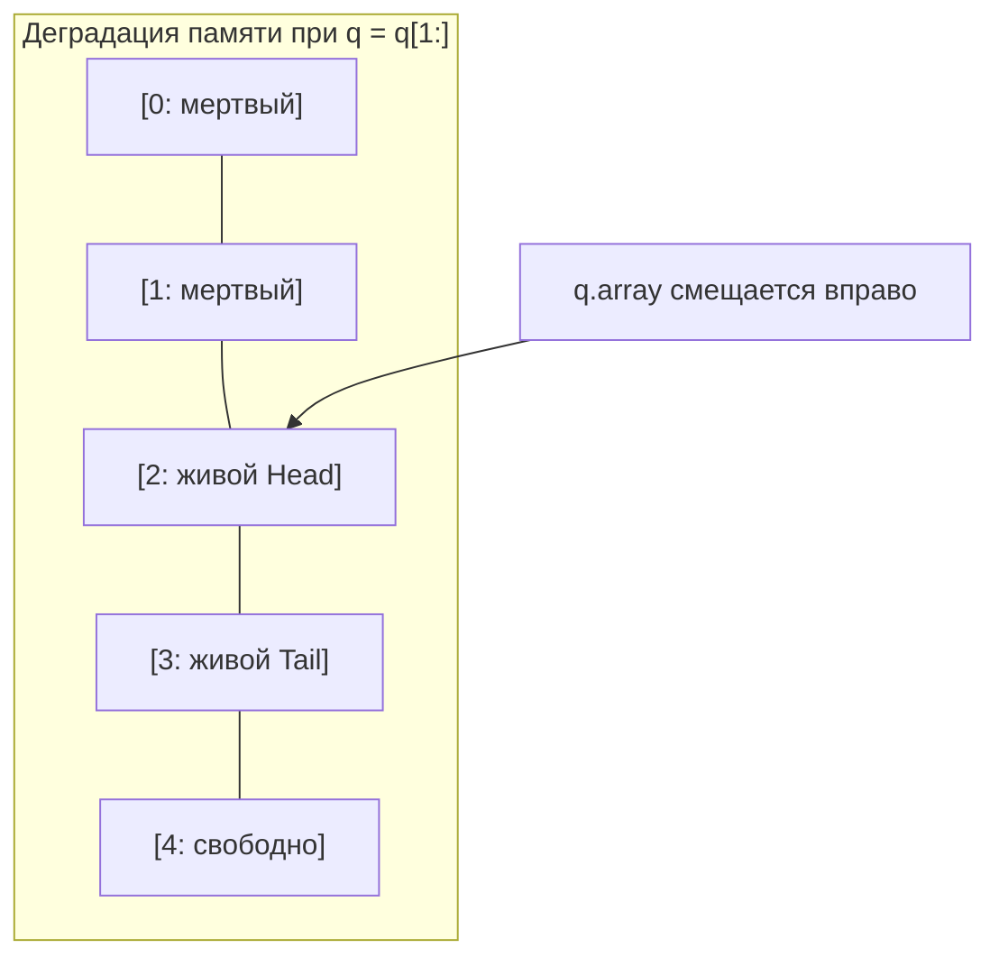
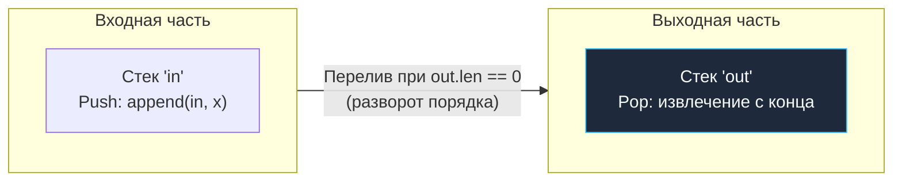
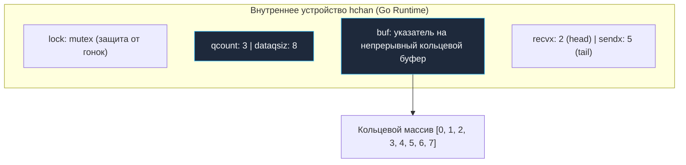

## Очередь: дисциплина FIFO, буферизация и механика каналов

В предыдущей статье [[4. Стек]] мы подробно исследовали дисциплину LIFO (Last-In, First-Out), которая незаменима при возврате по цепочке вызовов и синтаксическом разборе. Однако в реальной архитектуре распределенных систем и серверного бэкенда доминируют задачи совершенно иного характера: честное распределение входящих сетевых запросов, диспетчеризация фоновых воркеров, буферизация сообщений в очередях задач и потоковая обработка событий.

Для реализации этих сценариев применяется **Очередь (Queue)** — абстрактный тип данных, строго следующий принципу **FIFO (First-In, First-Out — «Первым пришел, первым ушел»)**.

---

## Архитектура и операции

Поведенческая модель очереди интуитивно понятна каждому: она в точности воспроизводит очередь покупателей к кассе в супермаркете. В очереди определены две базовые операции:
*   **Enqueue (Push):** добавление нового элемента строго в хвост очереди (**Tail**).
*   **Dequeue (Pop):** извлечение самого старого элемента строго из головы очереди (**Head**).

```mermaid
flowchart LR
    classDef process  fill:#1e293b,stroke:#38bdf8,stroke-width:1px,color:#f8fafc
    classDef success  fill:#064e3b,stroke:#34d399,stroke-width:1px,color:#f8fafc
    classDef error    fill:#7f1d1d,stroke:#f87171,stroke-width:1px,color:#f8fafc
    classDef warning  fill:#78350f,stroke:#fbbf24,stroke-width:1px,color:#f8fafc
    classDef entry    fill:#1e3a5f,stroke:#38bdf8,stroke-width:2px,color:#f8fafc
    classDef aux      fill:#334155,stroke:#64748b,stroke-width:1px,color:#f8fafc
    classDef system   fill:#312e81,stroke:#a78bfa,stroke-width:1px,color:#f8fafc
    classDef data     fill:#132d29,stroke:#2dd4bf,stroke-width:1px,color:#f8fafc
    classDef network  fill:#881337,stroke:#fb7185,stroke-width:1px,color:#f8fafc
    classDef accent   fill:#1e1b4b,stroke:#818cf8,stroke-width:1px,color:#f8fafc
    Push["Enqueue(item):::process<br/>Вставка в хвост"] --> Tail["Tail (Хвост)"]
    Tail --> E3["Элемент 3"]
    E3 --> E2["Элемент 2"]
    E2 --> E1["Элемент 1"]
    E1 --> Head["Head (Голова)"]
    Head --> Pop["Dequeue() -> item<br/>Извлечение из головы"]
```



Дополнительно в контракт очереди часто включают операцию `Peek()` (или `Front()`) для инспекции элемента в голове без его фактического удаления.

---

## Mechanical Sympathy: Проблема реализации на массивах

Если для стека обычный срез (`slice`) в Go оказался идеальной аппаратной платформой, то при попытке наивно построить очередь на базе непрерывного массива разработчик сталкивается с жесткими аппаратными и алгоритмическими противоречиями.

Представим статический массив из 4 элементов: `[A, B, C, D]`.  
Клиент выполняет операцию `Dequeue()`, забирая головной элемент `A`. Что делать с оставшимися ячейками памяти?

1.  **Сдвиг всех элементов влево:** Массив преобразуется в `[B, C, D, _]`.  
    Это операция сложности **$O(n)$**. Если в очереди хранится 100 000 элементов, каждый вызов `Dequeue` потребует вызова ассемблерной инструкции `memmove` для побайтового копирования сотен килобайт памяти. Процессор сожжет все такты на перетасовку данных в конвейере.
2.  **Сдвиг головного указателя (Head):** Мы просто смещаем индекс начала: `[_ , B, C, D]`.  
    Это операция $O(1)$. Но массив конечен! При постоянном добавлении в хвост и сдвиге головы наша очередь начнет неумолимо «ползти» вправо по виртуальному адресному пространству, оставляя за собой расширяющуюся мертвую зону неиспользуемой памяти. Рано или поздно мы упремся в границу выделенной емкости `capacity`, даже если в очереди в каждый момент времени находится всего один элемент.

> [!warning] Ловушка / Gotcha: Наивная очередь на слайсах в Go
> Самый распространенный и разрушительный антипаттерн в высоконагруженных микросервисах на Go:
> ```go
> q := make([]int, 0)
> q = append(q, 1)       // Enqueue
> val := q[0]; q = q[1:] // Dequeue
> ```
> **Почему этот код убивает сервис под нагрузкой?**  
> Операция среза `q = q[1:]` физически не освобождает память и не сдвигает байты. Она лишь создает новый 24-байтный заголовок слайса со смещенным на 8 байт вперед базовым указателем `array`. Базовый массив продолжает разрастаться вправо при каждом вызове `append`. Когда выделенная емкость `cap` исчерпывается, рантайм Go вынужден аллоцировать в куче новый, увеличенный массив, копировать туда активный хвост, а старый многомегабайтный блок отдавать сборщику мусора.
> В непрерывном цикле обработки входящих сообщений это порождает жесточайший **GC Churn** — непрерывные тяжелые аллокации и постоянные паузы сборщика. Кроме того, старые ссылки в «отрезанной» левой части массива продолжают висеть в памяти, вызывая скрытые утечки памяти.



---

## Правильные способы реализации в Go

### 1. Очередь на базе связного списка

Если предельный размер очереди заранее неизвестен и может динамически колебаться от единиц до миллионов элементов (**Unbounded Queue**), классическим решением служит односвязный список с двумя указателями: `Head` и `Tail` (см. [[3. Связные списки]]).

*   Добавление в хвост (`Tail.Next = node; Tail = node`) занимает строго **$O(1)$**.
*   Извлечение из головы (`Head = Head.Next`) занимает строго **$O(1)$**.
*   **Архитектурный компромисс:** Разрозненное расположение узлов в куче порождает промахи кэша процессора (Cache Misses) и создает нагрузку на аллокатор рантайма при каждом вызове `Enqueue`.

---

### 2. Очередь на двух стеках (Amortized Array)

Как объединить идеальную кэш-локальность непрерывных слайсов и строгую константную сложность без сдвига памяти? Применить классический алгоритмический прием — **очередь на двух стеках (Amortized Queue)**.

Мы заводим два независимых плотных слайса:
*   Входной стек `in` — принимает новые элементы через `append` за $O(1)$.
*   Выходной стек `out` — отдает элементы с конца за $O(1)$.

> [!tip] Собеседование
> **Вопрос:** Реализуйте структуру данных очереди со сложностью операций $O(1)$ амортизированно, используя исключительно стеки (слайсы). Это классическая задача LeetCode №232 («Implement Queue using Stacks»).
>
> **Решение:**

```go
package main

import "errors"

var ErrQueueEmpty = errors.New("queue is empty")

// Queue реализует FIFO через два LIFO стека (слайса)
type Queue[T any] struct {
	in  []T // Слайс для Enqueue
	out []T // Слайс для Dequeue
}

func NewQueue[T any]() *Queue[T] {
	return &Queue[T]{
		in:  make([]T, 0, 64),
		out: make([]T, 0, 64),
	}
}

// Enqueue добавляет элемент за O(1)
func (q *Queue[T]) Enqueue(val T) {
	q.in = append(q.in, val)
}

// Dequeue извлекает элемент за амортизированное O(1)
func (q *Queue[T]) Dequeue() (T, error) {
	var zero T
	
	// Если out пуст, перекладываем всё из in в out в обратном порядке
	if len(q.out) == 0 {
		if len(q.in) == 0 {
			return zero, ErrQueueEmpty
		}
		
		// Переносим элементы. Последний вошедший в 'in' станет первым на выход в 'out'
		for i := len(q.in) - 1; i >= 0; i-- {
			q.out = append(q.out, q.in[i])
		}
		
		// Очищаем 'in', сохраняя capacity
		clear(q.in) // Встроенная функция clear появилась в Go 1.21
		q.in = q.in[:0]
	}

	// Извлекаем с конца 'out' (как из обычного стека)
	lastIdx := len(q.out) - 1
	val := q.out[lastIdx]
	q.out[lastIdx] = zero // Защита от утечек памяти
	q.out = q.out[:lastIdx]

	return val, nil
}
```



**Почему это эффективно?**  
Хотя единичный перенос элементов из `in` в `out` занимает $O(n)$ времени, каждый отдельный элемент за всю историю жизни в очереди перемещается ровно три раза: один раз добавляется в `in`, один раз переносится в `out` и один раз извлекается из `out`. Суммарная амортизированная стоимость каждой операции составляет строго **$O(1)$**, при этом процессор работает с монолитными кэш-линиями L1.

---

### 3. Ограниченная очередь (Bounded Queue) / Ring Buffer

Если максимальная емкость очереди известна заранее (например, пул соединений к СУБД или буфер сетевого драйвера), абсолютным лидером по производительности является **Кольцевой буфер (Ring Buffer)**.

В кольцевом буфере массив имеет строго фиксированный размер, а указатели `head` и `tail` двигаются по кругу, используя операцию остатка от деления (`%`):
$$\text{nextIndex} = (\text{currentIndex} + 1) \pmod{\text{size}}$$

Это дает $O(1)$ без аллокаций вообще. Подробно эту красивую структуру мы разберем в отдельной статье: [[7. Кольцевой буфер]].

---

## Под капотом Go: Каналы (Channels)

Для любого Go-разработчика фундаментальной реализацией очереди в рантайме являются встроенные **каналы (`chan T`)**. Буферизированный канал — это не что иное, как высокооптимизированная потокобезопасная очередь FIFO.

> [!info] Под капотом: Структура hchan
> В исходниках Go (`src/runtime/chan.go`) канал описан структурой `hchan`. 
> ```go
> type hchan struct {
> 	qcount   uint           // Количество элементов в очереди
> 	dataqsiz uint           // Размер буфера
> 	buf      unsafe.Pointer // Указатель на массив (Ring Buffer)
> 	sendx    uint           // Индекс для Enqueue (tail)
> 	recvx    uint           // Индекс для Dequeue (head)
> 	lock     mutex          // Мьютекс для синхронизации горутин
> }
> ```
> Как видите, под капотом канала лежит тот самый **Кольцевой буфер** (`buf`, `sendx`, `recvx`), защищенный мьютексом. Поэтому отправка в буферизированный канал работает исключительно быстро, не аллоцирует новую память и не сдвигает элементы, а просто инкрементирует `sendx` по модулю размера буфера.



---

## Итог

1.  **Очередь (FIFO)** — базовый примитив для справедливой последовательной обработки задач и сетевых пакетов.
2.  **Опасность наивного слайса:** Выражение `q = q[1:]` в цикле провоцирует постоянный рост базового массива, фрагментацию кучи и катастрофический GC Churn.
3.  **Неограниченные очереди:** Реализуются либо через двунаправленный связный список, либо через высокоэффективный паттерн двух стеков на слайсах с амортизированной сложностью $O(1)$.
4.  **Ограниченные очереди:** Золотым стандартом системного программирования является Ring Buffer (кольцевой буфер фиксированной емкости).
5.  **Рантайм Go:** Буферизированные каналы `chan T` в своей основе представляют потокобезопасный кольцевой буфер `hchan`, координирующий горутины через списки ожидания `sudog`.

Однако на практике нередко требуется еще более гибкая структура: возможность добавлять и извлекать элементы как с головы, так и с хвоста за константное время $O(1)$ (например, в алгоритмах кражи задач — Work Stealing в планировщике Go). Для этого мы переходим к следующей лекции: [[6. Дек - двусторонняя очередь]].