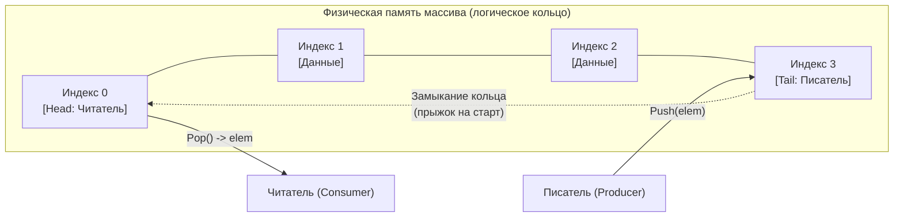
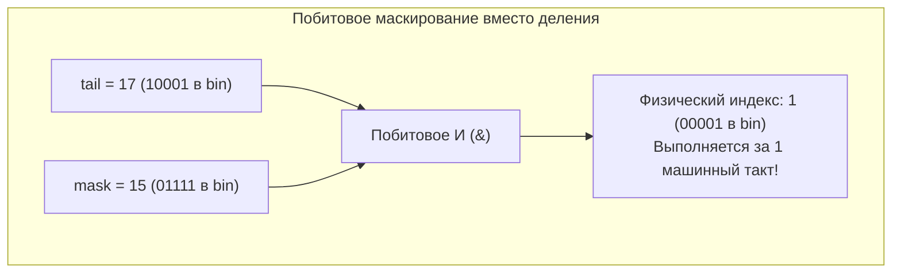
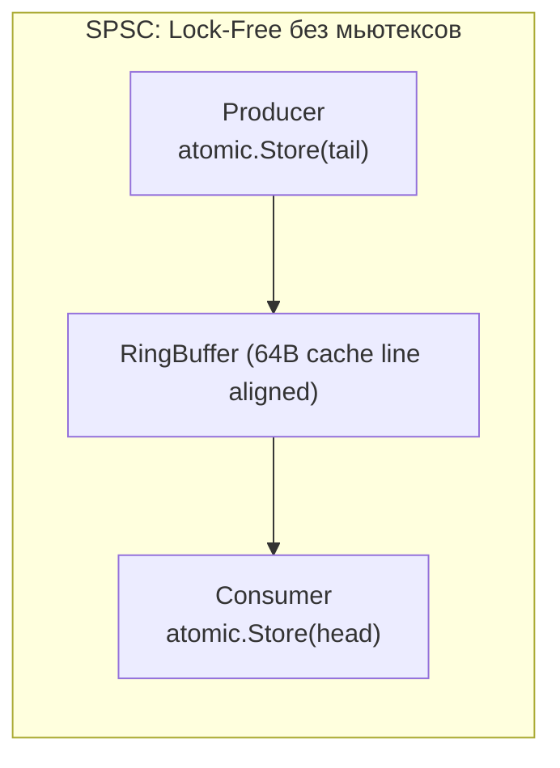

## Кольцевой буфер: венец очередей фиксированного размера и магия битовых масок

В предыдущих статьях мы прошли путь от монолитных [[1. Массивы и динамические массивы]] до универсальных конструкций вроде [[6. Дек - двусторонняя очередь]]. Мы увидели, как техника динамического изменения емкости (реаллокация) выручает при переменном объеме данных, но неизбежно создает скрытую цену в виде фрагментации памяти и циклов сборки мусора (GC Churn).

Однако в фундаментальных компонентах серверного ядра — будь то сетевой стек ядра Linux, драйверы высокоскоростных сетевых карт (NIC Ring Buffers), дисковый I/O или планировщик рантайма Go — динамические аллокации на лету строго табуированы. Когда сервис принимает миллионы сетевых пакетов в секунду, даже одна дополнительная аллокация в куче на пакет способна парализовать сборщик мусора.

Здесь вступает в свои права **Кольцевой буфер (Ring Buffer / Circular Buffer)** — вершина инженерной эволюции ограниченных очередей.

---

## Архитектура кольцевого буфера

Кольцевой буфер — это непрерывный статический массив строго фиксированного размера, концы которого логически замкнуты в кольцо. У него нет физического конца в обычном понимании. Когда указатель доходит до последней физической ячейки массива, он бесшовно перепрыгивает обратно на нулевой индекс.

Буфер управляется двумя независимыми виртуальными указателями:
*   **Tail (Хвост / Писатель):** позиция, куда будет записан следующий поступающий элемент.
*   **Head (Голова / Читатель):** позиция, откуда будет извлечен самый старый находящийся в буфере элемент.



---

## Mechanical Sympathy: Почему это так быстро?

Кольцевой буфер признан эталоном системной производительности по трем физическим причинам:

1.  **Zero Allocations (Ноль аллокаций):** Буфер создается один раз при старте приложения (или при установке сетевого соединения). Больше не происходит ни одного вызова `malloc`. Garbage Collector в Go может спать спокойно — метрика GC Churn равна нулю.
2.  **Perfect Cache Locality (Безупречная кэш-локальность):** Так как под капотом находится монолитный непрерывный срез `[]T`, аппаратный Prefetcher процессора легко улавливает линейный шаг обхода и гарантированно удерживает целевые кэш-линии в горячем L1/L2 кэше.
3.  **Отсутствие сдвига памяти:** При чтении (`Pop`) нам не требуется физически переносить остальные элементы влево (как это происходило в наивной очереди). Мы лишь инкрементируем счетчик `Head` на единицу.

---

## Хардкорная реализация: Магия степени двойки

В статье про Дек мы упоминали классический способ зацикливания индексов через остаток от деления: `index = tail % capacity`. 
Однако операция деления (и взятия остатка `%`) — одна из самых медленных инструкций в современных процессорах (занимает от 10 до 40 тактов).

**Секрет Senior-инженеров и создателей ядра Linux (знаменитый алгоритм `kfifo`):**  
Если принудительно зафиксировать емкость буфера равной **степени двойки** ($2^k$: 2, 4, 8, 16, 32, 64...), то тяжелую операцию остатка от деления можно эквивалентно заменить на мгновенную побитовую операцию И (`&`):
$$\text{index} = \text{tail} \ \& \ (\text{capacity} - 1)$$

Инструкция побитового И (`ANDQ` в x86-64) выполняется конвейером процессора ровно за **1 такт**!

Для массива размером 16 ($2^4$, в двоичном виде `10000_2`), битовая маска `capacity - 1` равна 15 (`01111_2`).
* Если `tail` растет бесконечно и достигает 17 (`10001`):
* `17 & 15` = `10001 & 01111` = `00001` (индекс 1). Мы элегантно "срезали" лишние биты и вернулись в начало кольца!



---

### Production-Ready код на Go

Напишем эталонный кольцевой буфер. Мы позволим 64-битным счетчикам `head` и `tail` расти бесконечно: при обработке миллиарда операций в секунду переполнение `uint64` наступит более чем через 500 лет непрерывной работы. Разность `tail - head` в любой момент времени точно отражает количество элементов в буфере.

```go
package main

import (
	"errors"
)

var (
	ErrBufferFull  = errors.New("ring buffer is full")
	ErrBufferEmpty = errors.New("ring buffer is empty")
)

// RingBuffer реализует быструю ограниченную очередь.
type RingBuffer[T any] struct {
	buf  []T
	head uint64 // Бесконечный счетчик прочитанных
	tail uint64 // Бесконечный счетчик записанных
	mask uint64 // Битовая маска (capacity - 1)
}

// roundUpToPowerOfTwo округляет число до ближайшей степени двойки сверху.
// Классический битовый хак из системного программирования.
func roundUpToPowerOfTwo(v uint64) uint64 {
	v--
	v |= v >> 1
	v |= v >> 2
	v |= v >> 4
	v |= v >> 8
	v |= v >> 16
	v |= v >> 32
	v++
	return v
}

// NewRingBuffer создает буфер. Реальный размер будет округлен до степени двойки.
func NewRingBuffer[T any](minCapacity uint64) *RingBuffer[T] {
	if minCapacity < 2 {
		minCapacity = 2
	}
	cap := roundUpToPowerOfTwo(minCapacity)
	return &RingBuffer[T]{
		buf:  make([]T, cap),
		mask: cap - 1,
	}
}

// Push добавляет элемент в буфер.
func (rb *RingBuffer[T]) Push(val T) error {
	// Если разница между писателем и читателем равна размеру буфера — места нет
	if rb.tail-rb.head == uint64(len(rb.buf)) {
		return ErrBufferFull
	}
	
	// Накладываем битовую маску для получения реального индекса массива
	idx := rb.tail & rb.mask
	rb.buf[idx] = val
	rb.tail++ // Просто инкрементируем виртуальный указатель
	
	return nil
}

// Pop извлекает элемент из буфера.
func (rb *RingBuffer[T]) Pop() (T, error) {
	var zero T
	
	// Если писатели и читатели на одной отметке — буфер пуст
	if rb.head == rb.tail {
		return zero, ErrBufferEmpty
	}
	
	idx := rb.head & rb.mask
	val := rb.buf[idx]
	
	// ОЧЕНЬ ВАЖНО: Зачищаем старое значение для Garbage Collector-а!
	rb.buf[idx] = zero 
	
	rb.head++
	return val, nil
}

// Len возвращает текущее количество элементов за O(1)
func (rb *RingBuffer[T]) Len() uint64 {
	return rb.tail - rb.head
}
```

> [!warning] Ловушка / Gotcha: Lossy vs Lossless поведение
> В приведенном коде метод `Push` возвращает ошибку `ErrBufferFull`, когда свободные слоты исчерпаны — это строгий режим без потерь данных (**Lossless**).
> Однако в распределенных системах телеметрии, сбора логов и медиастриминга часто применяется режим с контролируемой потерей данных (**Lossy**). Если буфер переполнен, новый элемент просто **перезаписывает** самый старый `(head++)`, сдвигая читателя вперед. Это позволяет приложению никогда не блокироваться на вводе-выводе логов.

---

## Где это используется в Go?

### 1. Буферизированные каналы (hchan)

Каждый Go-разработчик использует кольцевые буферы непрерывно. Конструкция `make(chan int, 100)` аллоцирует внутри рантайма (`src/runtime/chan.go`) заголовок `hchan`, чьим ядром является кольцевой массив:
*   Горутины-писатели инкрементируют счетчик `sendx` (tail).
*   Горутины-читатели инкрементируют счетчик `recvx` (head).
*   Встроенный спинлок `lock mutex` защищает эти указатели от состояния гонки.

### 2. Сетевой I/O (пакет bufio)

Если читать данные из сетевого TCP-сокета по одному байту, сервис захлебнется в накладных расходах системных вызовов `read(2)` и переключениях контекста ядра. Стандартный пакет `bufio` создает кольцевой буфер в пространстве пользователя (User Space). Он единым системным вызовом вычитывает сразу блок данных (обычно 4 КБ) в локальный буфер, позволяя приложению парсить строки и токены прямо из оперативной памяти со скоростью L1-кэша.

> [!tip] Собеседование на Senior: Lock-Free структуры
> **Вопрос:** Как сделать кольцевой буфер потокобезопасным (Thread-Safe) для параллельного межгорутинного обмена без использования блокирующего `sync.Mutex`?
>
> **Ответ:** Применить паттерн **Lock-Free Ring Buffer** (классическая архитектура LMAX Disruptor):
> Идея в том, чтобы использовать атомарные операции (`sync/atomic.AddUint64` и `CompareAndSwap`) для инкремента счетчиков `head` и `tail`. Горутина атомарно "столбит" за собой слот в массиве, записывает туда данные и затем публикует изменение. Это позволяет достичь пропускной способности в десятки миллионов сообщений в секунду между горутинами, полностью избегая переключений контекста ОС, которые вызывает мьютекс.
> 1. Для сценария Single-Producer Single-Consumer (SPSC) мьютексы вообще не требуются: достаточно использовать атомарные операции загрузки и сохранения с барьерами памяти Acquire/Release (`sync/atomic`). Писатель монопольно модифицирует `tail`, читатель — `head`.
> 2. Для сценария Multi-Producer Multi-Consumer (MPMC) бронирование слотов осуществляется через атомарную инструкцию `atomic.CompareAndSwapUint64` (CAS). Горутина атомарно «столбит» за собой диапазон индексов, записывает данные и выставляет флаг готовности. Это обеспечивает пропускную способность в десятки миллионов сообщений в секунду, полностью исключая засыпание горутин и переключение контекста планировщика.



---

## Итог

1.  **Кольцевой буфер** — это ограниченная очередь фиксированной емкости (Bounded Queue), закольцованная в непрерывном блоке памяти.
2.  **Аппаратная эффективность:** Гарантирует строгое константное время $O(1)$ для всех операций без единой аллокации памяти во время работы.
3.  **Битовая оптимизация ядра:** Выравнивание размера буфера по степени двойки ($2^k$) позволяет заменить медленную инструкцию деления `%` на побитовую маску `& (cap - 1)`, выполняемую за 1 такт CPU.
4.  **Защита от утечек:** При извлечении элемента (`Pop`) обнуление освободившегося слота (`rb.buf[idx] = zero`) обязательно для снятия нагрузки со сборщика мусора.
5.  **Системный фундамент:** Кольцевые буферы лежат в основе каналов Go (`hchan`), буферизированного ввода-вывода `bufio`, драйверов сетевых карт и lock-free очередей LMAX Disruptor.

На этом мы полностью завершаем подраздел «Базовые структуры данных», посвященный линейным последовательностям и непосредственному управлению физической памятью. Впереди нас ждет принципиально иной класс структур данных, которые отказываются от идеи пространственного порядка ради мгновенного поиска по ключу.

В следующем подразделе мы откроем мир ассоциативных структур данных и начнем с математического фундамента: [[1. Хеш функции и равномерность распределения]].