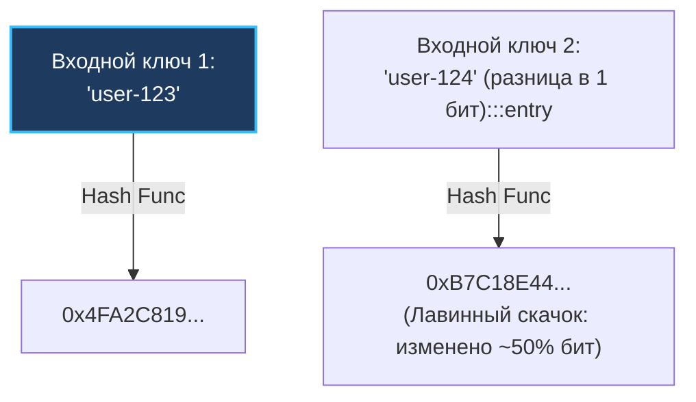
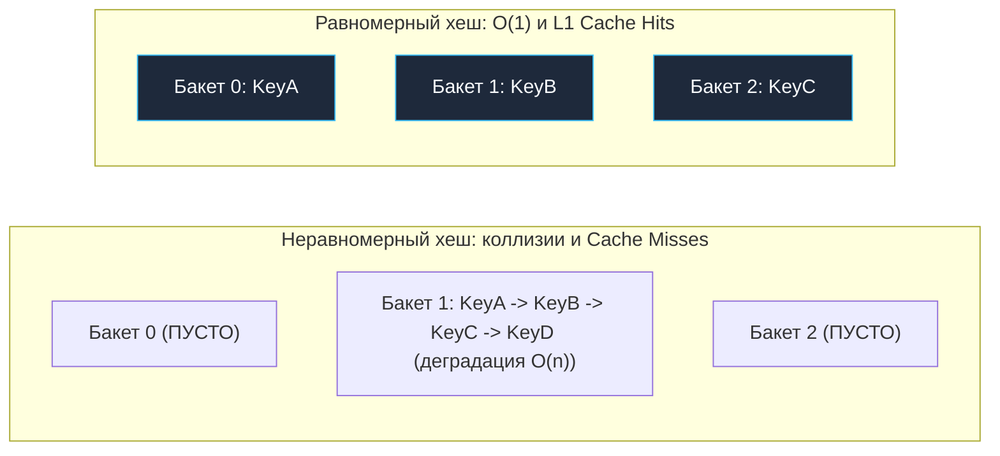
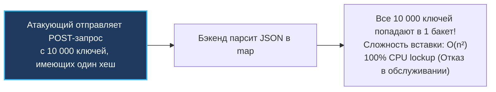

## Хеш-функции: математический фундамент и кремниевое ускорение

Хеширование — это математический фундамент подавляющего большинства высокопроизводительных систем современного бэкенда. Без него невозможно представить быстрые реляционные и NoSQL базы данных, балансировщики сетевой нагрузки (Consistent Hashing), распределенные кэши (Memcached, Redis) и встроенные ассоциативные массивы (`map`).

На абстрактном уровне хеш-функция — это математический алгоритм, преобразующий входные данные произвольного размера в битовую последовательность фиксированной длины (хеш-код, дайджест или хеш-сумму).

Но для практикующего бэкенд-инженера хеш-функция — это не просто абстрактная формула из учебника дискретной математики. Это прецизионный инструмент управления L1/L2 кэшами процессора, первая линия криптографической обороны от сетевых атак типа Hash DoS и физическая основа для обеспечения амортизированного времени доступа $O(1)$.

---

## Анатомия идеальной хеш-функции

Для применения в структурах данных (прежде всего в ассоциативных массивах и хеш-таблицах) хеш-функция обязана удовлетворять трем фундаментальным инженерным критериям.

### 1. Детерминированность

Одни и те же входные данные **всегда** обязаны возвращать строго идентичное выходное значение. Если сегодня вызов `hash("go") == 42`, то и спустя год на той же машине (при неизменном значении соли `seed`, о которой мы поговорим ниже) результат обязан оставаться равным `42`. Без детерминизма поиск ранее записанного ключа в таблице становится невозможным.

### 2. Скорость вычисления

Хеш-таблицы проектируются ради молниеносного точечного поиска. Если процедура вычисления хеша от строки требует больше тактов процессора, чем простой последовательный обход массива, алгоритмический смысл хеш-таблицы аннулируется. 

Именно поэтому некриптографические хеш-функции создаются в тесном сочувствии к кремнию (Mechanical Sympathy): они оперируют базовыми однотактовыми инструкциями процессора — побитовыми сдвигами `<<` и `>>`, побитовым сложением по модулю два `^` (XOR) и быстрым умножением `*`.

### 3. Равномерность распределения и лавинный эффект

Это главное математическое свойство, определяющее производительность всей системы. Качественная хеш-функция обязана равномерно рассеивать ключи по всему доступному адресному пространству бакетов, независимо от степени схожести входных данных.

**Лавинный эффект (Avalanche effect)** — фундаментальное свойство: инверсия хотя бы одного бита во входных данных должна приводить к непредсказуемому псевдослучайному изменению в среднем **ровно половины** битов выходного хеша.



---

## Mechanical Sympathy: Почему равномерность так важна?

Представим, что хеш-функция обладает скрытым математическим дефектом и генерирует кластеры (скопления близких значений). В хеш-таблице это неминуемо порождает **коллизии** — ситуации, когда совершенно разные ключи дают одинаковый хеш или после наложения маски бакета попадают в одну и ту же корзину памяти (`hash % array_size`).

На уровне физического «железа» коллизии катастрофически обрушивают производительность:
1.  **Алгоритмическая деградация:** Время поиска по ключу деградирует из константного $O(1)$ в линейное $O(n)$, заставляя программу побайтово сканировать все элементы, сваленные в один бакет (подробнее в [[4. Открытая адресация и метод цепочек]]).
2.  **Уничтожение Cache Locality:** Если коллизии разрешаются методом цепочек (связанными списками), каждый новый узел оказывается в случайной области виртуальной памяти кучи. При переходе по указателям `next` процессор натыкается на постоянные промахи кэша (**Cache Misses**). Вместо чтения данных из сверхбыстрого L1-кэша за 3–4 такта, конвейер процессора замирает на сотни тактов в ожидании ответа от DRAM.



> [!info] Под капотом
> Чтобы минимизировать промахи кэша, рантайм Go в своей реализации `map` группирует элементы в бакеты (структура `bmap`) по 8 штук. Размер бакета подобран так, чтобы он и ключи в нем оптимально помещались в кэш-линию современного процессора (обычно 64 байта). Если хеш-функция равномерна, бакеты заполняются равномерно, и CPU эффективно подтягивает целые бакеты в L1-кэш за одно чтение памяти. Подробности будут в статье [[5. Внутреннее устройство map в Go]].

---

## Некриптографические vs Криптографические хеши

В промышленной разработке важно четко разграничивать эти два класса алгоритмов:

| Характеристика | Криптографические хеш-функции | Некриптографические хеш-функции |
|---|---|---|
| **Представители** | SHA-256, SHA-512, BLAKE3, `golang.org/x/crypto/...` | MurmurHash, FNV-1a, CityHash, xxHash, Wyhash |
| **Ключевая цель** | Криптографическая стойкость: необратимость (one-way), невозможность подбора прообраза и коллизий | Максимальная скорость вычисления и равномерное распределение битов |
| **Скорость на CPU** | Медленные (сотни тактов на блок) | Экстремально быстрые (единицы тактов, гигабайты/сек) |
| **Область применения** | Хранение паролей, ЭЦП, валидация целостности файлов, блокчейн | Хеш-таблицы (`map`), Consistent Hashing, фильтры Блума (Bloom Filters) |

---

### Пример простой некриптографической функции: FNV-1a

Алгоритм Фаулера-Нолла-Во (FNV-1a) — канонический пример того, как лавинный эффект достигается минимальным набором побитовых инструкций:

```go
package main

import (
	"fmt"
)

// FNV-1a 64-bit константы
const (
	offsetBasis uint64 = 14695981039346656037
	fnvPrime    uint64 = 1099511628211
)

// HashStringFNV1a вычисляет 64-битный FNV-1a хеш для строки.
// Функция невероятно проста, но дает отличное распределение.
func HashStringFNV1a(data string) uint64 {
	hash := offsetBasis
	for i := 0; i < len(data); i++ {
		// 1. XOR текущего байта с хешом (смешивание)
		hash ^= uint64(data[i])
		// 2. Умножение на простое число (рассеивание/лавинный эффект)
		hash *= fnvPrime
	}
	return hash
}

func main() {
	// Обратите внимание: изменение одного символа полностью меняет результат
	fmt.Printf("user_1: %x\n", HashStringFNV1a("user_1")) // 8e2e9c15d7e48347
	fmt.Printf("user_2: %x\n", HashStringFNV1a("user_2")) // 8e2e9f15d7e48860
}
```

---

## Hash DoS и как Go с ним борется

На заре веб-разработки многие популярные платформы (ранние версии Java, PHP, Python, Ruby) использовали статические, детерминированные алгоритмы хеширования вроде MurmurHash или FNV.

> [!warning] Ловушка / Gotcha
> Хакеры поняли: если заранее вычислить множество строк, которые дают **одинаковый хеш** в целевом языке, и отправить их в JSON-payload (например, в теле POST-запроса), бэкенд попытается положить их все в один бакет `map`. Вставка деградирует до $O(n^2)$, процессор зависнет на 100%, обрабатывая крошечный запрос в 1-2 мегабайта. Это называется **Hash DoS** (Hash Denial of Service).



---

### Как это устроено в Go?

Чтобы сделать атаки класса Hash DoS математически невозможными, современные компиляторы применяют **рандомизацию хеш-функций (SipHash / Random Seed)**.

Когда рантайм Go инициализирует новый экземпляр `map`, он генерирует уникальное случайное 32-битное число — соль (в исходниках `hmap.hash0`). Этот псевдослучайный `hash0` подмешивается в качестве базового состояния алгоритма хеширования.

В результате строка `"password"` в одной мапе будет иметь `hash = 0x123`, а в другой мапе (даже в рамках того же процесса, но созданной в другой момент) — `hash = 0x999`. Злоумышленник больше не может предсказать хеш, так как он не знает случайный `hash0`.

> [!info] Под капотом
> Рантайм Go не использует FNV или MurmurHash для `map`. На x86-64 процессорах Go использует **аппаратное ускорение**. 
> В функции `runtime.aeshash` язык задействует инструкции процессора **AES-NI** (Advanced Encryption Standard New Instructions). Да, Go использует раунды AES шифрования для хеширования ключей мапы! Это дает потрясающую равномерность, защиту от Hash DoS и, благодаря аппаратному ускорению на уровне кремния, работает невероятно быстро. 
> Если процессор не поддерживает AES-NI (например, старые ARM или экзотические архитектуры), Go откатывается на программную реализацию `memhash` (вариация алгоритма Wyhash).

---

## Что можно хешировать в Go?

В отличие от языков вроде C++ (где можно перегрузить функтор `std::hash<T>`) или Java (где переопределяется метод `hashCode()`), в языке Go программисту **запрещено переопределять хеш-функцию для стандартной `map`**. Рантайм Go автоматически генерирует специализированные алгоритмы хеширования на этапе компиляции для всех типов, удовлетворяющих языковому ограничению `comparable`.

> [!tip] Собеседование
> **Вопрос:** Какие типы можно использовать в качестве ключа для `map` в Go? Почему нельзя использовать `slice`?
>
> **Ответ:** Ключом может быть любой тип, для которого определена операция `==` (ограничение `comparable`): примитивы, строки, каналы, указатели, интерфейсы, массивы (arrays, фиксированной длины) и структуры, если все их поля `comparable`. 
> Слайсы (`slice`), мапы (`map`) и функции использовать нельзя, так как для них не определено глубокое сравнение `==` на уровне рантайма (только проверка на `nil`), а значит, рантайм не может безопасно разрешать коллизии, когда хеши совпадают. Если нужно использовать слайс как ключ — его нужно конвертировать в строку (с аллокацией) или в фиксированный массив `[N]T` (без аллокации).

---

## Итог

1.  **Хеш-функция** преобразует данные произвольного объема в детерминированное число фиксированной длины за константное время.
2.  **Лавинный эффект и равномерность** критичны для системного программирования: неравномерный хеш провоцирует коллизии, вырождая $O(1)$ в $O(n)$ и вызывая постоянные промахи кэша процессора.
3.  **Криптографические хеши** (SHA-256) ориентированы на необратимость и вычислительно дороги; **некриптографические** (xxHash, Wyhash) оптимизированы под предельную пропускную способность памяти.
4.  **Защита от Hash DoS в Go:** Рантайм генерирует случайный seed (`hmap.hash0`) для каждой создаваемой мапы, делая невозможным преднамеренное создание коллизий извне.
5.  **Аппаратный AES-NI:** Go вычисляет хеши ключей через аппаратные инструкции AES процессора (`runtime.aeshash`), перекладывая вычисления на кремний.

Понимая, как устроена идеальная хеш-функция и как важно равномерное распределение для защиты кэша процессора от промахов, мы можем перейти к исследованию того, как эти хеши физически укладываются в память. В следующей статье мы разберем архитектуру ассоциативной таблицы: [[2. Хеш таблица. Реализация]].