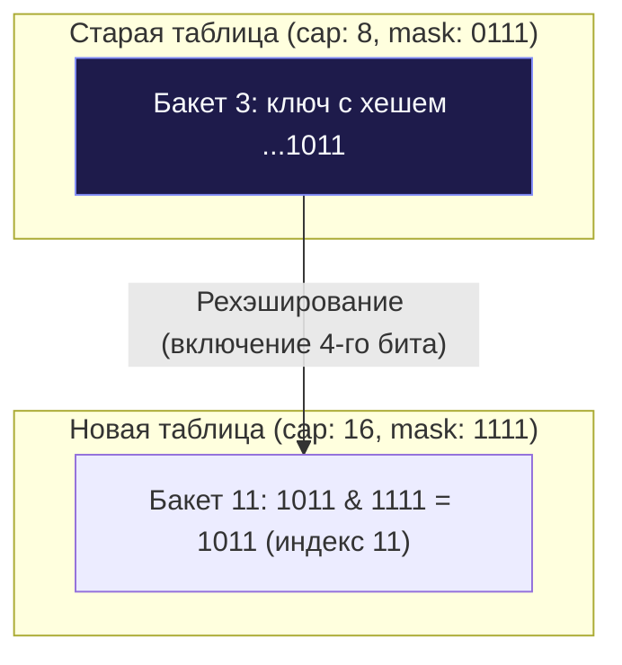

## Хеш-таблица: физическая адресация, битовые маски и рехэширование

В предыдущей статье [[1. Хеш функции и равномерность распределения]] мы разобрали, как превратить произвольные входные данные в псевдослучайное 64-битное число с превосходным лавинным эффектом. Однако само по себе это абстрактное математическое число не хранит данные. Чтобы получить структуру данных с константным временем доступа $O(1)$, нам необходимо бесшовно связать этот хеш-код с физическими адресами ячеек в оперативной памяти.

Хеш-таблица (Hash Table, словарь, ассоциативный массив) — это, по своей архитектурной сути, специализированная надстройка над непрерывным массивом, использующая хеш-функцию для мгновенного прямого вычисления индекса в памяти.

---

## Как достигается $O(1)$? Mechanical Sympathy

Процессорный кремний ничего не знает об абстрактных словарях, строковых ключах или JSON-документах. Единственная базовая структура данных, к которой исполнительный блок CPU способен обратиться за истинное аппаратное $O(1)$ — это непрерывный блок памяти (статический массив).

Доступ к ячейке массива выполняется за 1 машинный такт, поскольку вычисление физического адреса сводится к элементарной адресной арифметике:

```
Адрес = Базовый_Адрес_Массива + (Индекс * Размер_Элемента)
```

Задача хеш-таблицы — максимально быстро, детерминированно и без дорогостоящих вычислений преобразовать произвольный ключ (строку, структуру, UUID) в целочисленный **индекс** ячейки этого базового массива.

```mermaid
flowchart LR
    classDef process  fill:#1e293b,stroke:#38bdf8,stroke-width:1px,color:#f8fafc
    classDef success  fill:#064e3b,stroke:#34d399,stroke-width:1px,color:#f8fafc
    classDef error    fill:#7f1d1d,stroke:#f87171,stroke-width:1px,color:#f8fafc
    classDef warning  fill:#78350f,stroke:#fbbf24,stroke-width:1px,color:#f8fafc
    classDef entry    fill:#1e3a5f,stroke:#38bdf8,stroke-width:2px,color:#f8fafc
    classDef aux      fill:#334155,stroke:#64748b,stroke-width:1px,color:#f8fafc
    classDef system   fill:#312e81,stroke:#a78bfa,stroke-width:1px,color:#f8fafc
    classDef data     fill:#132d29,stroke:#2dd4bf,stroke-width:1px,color:#f8fafc
    classDef network  fill:#881337,stroke:#fb7185,stroke-width:1px,color:#f8fafc
    classDef accent   fill:#1e1b4b,stroke:#818cf8,stroke-width:1px,color:#f8fafc
    A["Ключ:<br/>'user-123'"]:::entry -->|"1. Hash Func (AES-NI / Wyhash)"| B["64-битный Хеш:<br/>0x8F3A2..."]
    B -->|"2. Битовое И (& mask)"| C["Индекс бакета:<br/>Бакет 5"]
    C -->|"3. Адресная арифметика"| D["RAM:<br/>Array[5] (1 такт)"]
```



---

## Магия вычисления индекса (Деление vs Битовое И)

Получив 64-битный хеш от функции (например, `12034912389123`), мы не можем просто создать массив такого размера — нам не хватит всей оперативной памяти мира. Мы выделяем массив разумного размера (например, 8 бакетов) и должны "сжать" огромный хеш до диапазона `[0...7]`.

Классический академический подход, кочующий из одного вводного курса в другой — это деление по модулю (Modulo):

```
index = hash % capacity
```

> [!info] Под капотом
> 
> Операция взятия остатка от деления (`DIV` в ассемблере x86) — это одна из самых медленных арифметических инструкций в современном процессоре. Она занимает от 20 до 40 тактов CPU. Для структуры данных, которая должна работать за наносекунды, тратить 40 тактов только на вычисление индекса — непозволительная роскошь.

**Как эта проблема решается в production-ready системах (включая рантайм Go)?**

Емкость внутреннего массива (`capacity`) **всегда** выбирается строго равной **степени двойки** ($2^N$: 8, 16, 32, 64, 128 и т.д.).

Если размер массива является степенью двойки, математическая операция взятия остатка эквивалентно заменяется на сверхбыстрое побитовое И (`AND`, `&`), выполняемое конвейером процессора ровно за **1 машинный такт**:

```
hash % (2^N) == hash & (2^N - 1)
```

Математическое обоснование: если емкость массива равна 8 ($2^3$), то `capacity - 1` равно 7. В двоичном представлении число 7 выглядит как `00000111_2`. Наложение побитовой маски `& 7` зануляет абсолютно все старшие разряды хеша, оставляя нетронутыми ровно 3 младших бита. А 3 бита в двоичной системе могут принимать значения строго от `000` (0) до `111` (7) — идеальный индекс для нашего массива из 8 элементов!

---

## Базовая реализация на Go

Напишем чистый каркас хеш-таблицы на Go с использованием стандартного пакета `hash/maphash`. В этой образовательной реализации мы воспользуемся простым методом цепочек для разрешения коллизий, сосредоточившись на битовых операциях и управлении памятью:

```go
package hashtable

import (
	"fmt"
	"hash/maphash"
)

// bucket представляет собой ячейку массива. 
// В реальном map в Go бакет хранит до 8 элементов для оптимизации L1 кэша.
type bucket struct {
	key   string
	value any
	// Указатель на следующий элемент нужен для разрешения коллизий (метод цепочек)
	next  *bucket 
}

// HashTable - структура нашей хеш-таблицы
type HashTable struct {
	buckets []*bucket
	size    uint64 // Текущее количество элементов
	mask    uint64 // Битовая маска для вычисления индекса (capacity - 1)
	seed    maphash.Seed // Защита от Hash DoS
}

// New создает новую хеш-таблицу.
// initialCapacity ОБЯЗАТЕЛЬНО должна быть степенью двойки.
func New(initialCapacity uint64) *HashTable {
	// Проверка на степень двойки: (n & (n-1)) == 0
	if initialCapacity == 0 || (initialCapacity&(initialCapacity-1)) != 0 {
		panic("capacity must be a power of 2")
	}

	return &HashTable{
		buckets: make([]*bucket, initialCapacity),
		mask:    initialCapacity - 1,
		seed:    maphash.MakeSeed(),
	}
}

// getIndex вычисляет индекс массива за 1 такт CPU
func (ht *HashTable) getIndex(key string) uint64 {
	var h maphash.Hash
	h.SetSeed(ht.seed)
	_, _ = h.WriteString(key) // Ошибок здесь не бывает
	hashValue := h.Sum64()
	
	// Механическое сочувствие (Mechanical Sympathy) в действии
	// Быстрая альтернатива hashValue % len(ht.buckets)
	return hashValue & ht.mask 
}

// Set добавляет или обновляет значение
func (ht *HashTable) Set(key string, value any) {
	index := ht.getIndex(key)
	
	// Если бакет пуст, просто кладем туда элемент
	if ht.buckets[index] == nil {
		ht.buckets[index] = &bucket{key: key, value: value}
		ht.size++
		return
	}

	// Если бакет занят, идем по цепочке (разрешение коллизий)
	curr := ht.buckets[index]
	for {
		// Если ключ уже существует, обновляем значение
		if curr.key == key {
			curr.value = value
			return
		}
		// Если дошли до конца цепочки, добавляем новый узел
		if curr.next == nil {
			curr.next = &bucket{key: key, value: value}
			ht.size++
			return
		}
		curr = curr.next
	}
}
```

---

## Load Factor и Реаллокация (Rehashing)

Что произойдет, когда число сохраняемых элементов существенно превысит размер массива бакетов? Если в массив на 8 бакетов вставить 200 ключей, неизбежно возникнет катастрофическая плотность коллизий. В каждом бакете вырастут длинные цепочки связанных узлов, и наше константное время поиска $O(1)$ деградирует в линейное сканирование $O(n)$ с разрушением кэш-локальности.

Для контроля плотности заполнения таблицы используется ключевая системная метрика — **Load Factor (Коэффициент заполнения)**:

$$\text{Load Factor} = \frac{\text{Количество\_элементов}}{\text{Размер\_массива}}$$

В зависимости от архитектуры таблицы устанавливается критический порог: в Java `HashMap` он равен 0.75, а в рантайме Go для `map` этот предел составляет **6.5 элементов на бакет** (так как бакет `bmap` физически вмещает 8 записей). При превышении этого порога таблица обязана инициировать процедуру перестройки — **Рехэширование (Rehashing)**.

---

### Как происходит эвакуация памяти:

1. В куче выделяется новый массив бакетов, емкость которого в 2 раза превышает старую ($N \times 2$, чтобы сохранить фундаментальное свойство степени двойки).
2. Вычисляется новая битовая маска: `new_mask = new_capacity - 1`.
3. Каждый элемент из старых бакетов извлекается, для него **заново рассчитывается индекс** в новом массиве (так как с увеличением маски в расчет включается дополнительный бит хеша!) и переносится в новый блок памяти.
4. После завершения эвакуации старый массив отдается на утилизацию Garbage Collector'у.



> [!warning] Ловушка / Gotcha
> 
> Rehashing — это операция сложности $O(N)$. Если в вашей мапе лежат миллионы элементов, внезапный ресайз вызовет спайк задержки (latency spike). Процессор остановится, перекладывая мегабайты данных из одного места памяти в другое.
> 
> **Идиоматичный Go:** Если вы заранее знаете, сколько элементов будет в мапе, всегда инициализируйте ее с нужным объемом (capacity): `make(map[string]int, 100000)`. Это избавит рантайм от необходимости делать дорогостоящие ресайзы на лету.

> [!tip] Собеседование
> 
> **Вопрос:** Почему при ресайзе элементы часто оказываются совершенно в других бакетах, а не остаются на своих местах?
> 
> **Ответ:** Потому что меняется маска. Допустим, хеш ключа заканчивается на биты `...1011`. При маске старого массива (размер 8, маска `0111`) индекс был `011` (бакет 3). При новом размере 16, маска становится `1111`. Теперь индекс будет `1011` (бакет 11). Элемент "переехал". В Go внутренний механизм эвакуации устроен еще умнее и распределяет эвакуацию во времени (Incremental Resizing), чтобы не останавливать работу программы надолго, о чем мы детальнее поговорим в [[5. Внутреннее устройство map в Go]].

---

## Итог

1.  **Прямая адресация памяти:** Хеш-таблица достигает $O(1)$ благодаря преобразованию хеша в числовой индекс статического массива в памяти.
2.  **Битовое маскирование:** Фиксация емкости массива степенью двойки ($2^N$) позволяет заменить медленное 40-тактовое деление по модулю `%` на 1-тактовую побитовую маску `& (capacity - 1)`.
3.  **Контроль Load Factor:** Превышение критического порога заполнения бакетов разрушает производительность, требуя своевременного удвоения емкости.
4.  **Рехэширование и эвакуация:** Изменение маски при ресайзе приводит к перераспределению элементов по новым позициям за счет дополнительного старшего бита хеша.
5.  **Предупреждение задержек:** Предварительное выделение емкости `make(map[K]V, cap)` защищает продакшен-сервисы от пиков задержек, вызванных аллокациями и копированием данных при росте.

Мы рассмотрели фундамент — как ключи превращаются в индексы внутреннего массива. Но даже при идеальной хеш-функции коллизии (когда разные ключи получают один индекс) неизбежны (привет, Парадокс дней рождений). В нашей базовой реализации мы использовали `next *bucket` для решения этой проблемы. В следующей статье мы подробно и на глубоком уровне разберем все способы борьбы с этой физической неизбежностью: [[3. Разрешение коллизий]].