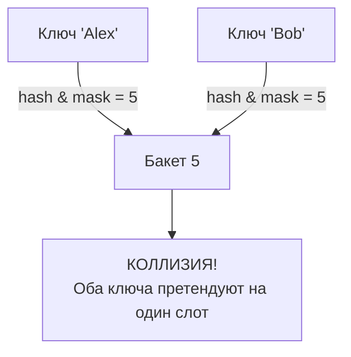
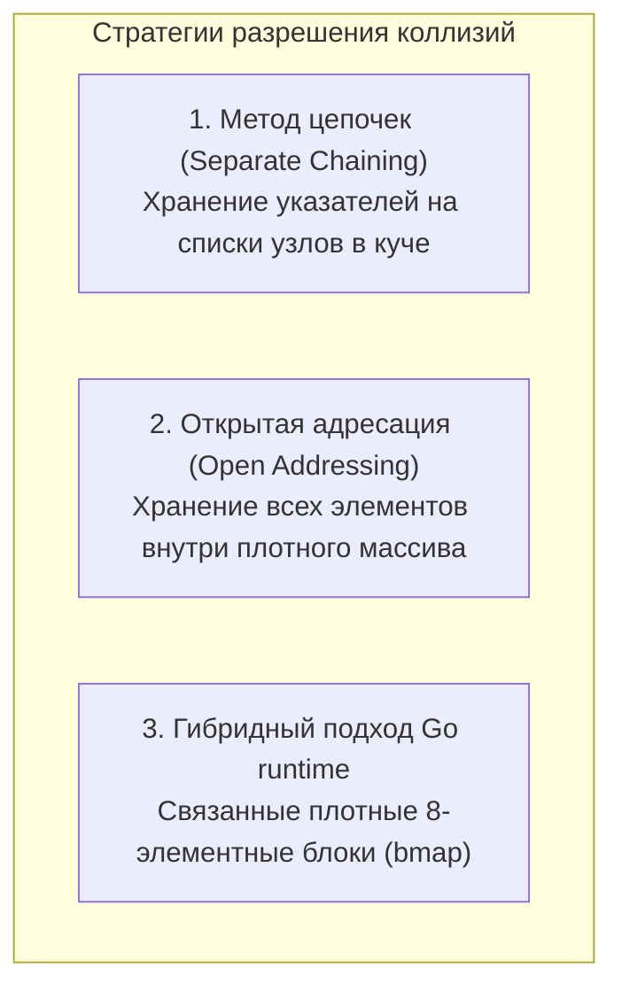

## Разрешение коллизий: математическая неизбежность и цена промаха

Давайте отбросим академические иллюзии: идеальных универсальных хеш-функций для динамических наборов данных в природе не существует. Как бы тщательно ваша функция ни перемешивала биты и сколь бы совершенным ни был лавинный эффект, рано или поздно два совершенно разных ключа после проецирования на размер таблицы укажут на одну и ту же физическую ячейку памяти. Эта ситуация называется **коллизией**.

Для квалифицированного бэкенд-инженера возникновение коллизии — это не досадный программный баг, а строгая математическая неизбежность, с которой архитектура обязана эффективно сосуществовать. Способность структуры данных быстро, предсказуемо и с минимальным уроном для процессорных кэшей разрешать конфликты адресации отличает зрелые production-системы от учебных набросков.

---

## Математика неизбежности

Почему коллизии гарантированно происходят даже в гигантских хеш-таблицах с высококлассными криптографическими или некриптографическими хеш-функциями? Ответ диктуется двумя законами комбинаторики и теории вероятностей.

### 1. Принцип Дирихле (Pigeonhole Principle)

Если у вас есть $N$ ящиков (бакетов) и $N+1$ голубей (ключей), как минимум в одном ящике неизбежно окажется не менее двух голубей. Поскольку пространство потенциальных входных ключей (например, произвольные строки произвольной длины) теоретически бесконечно, а объем доступной оперативной памяти строго ограничен несколькими гигабайтами, множество различных ключей **математически обязано** проецироваться в одни и те же дискретные индексы массива.

### 2. Парадокс дней рождений (Birthday Paradox)

Контринтуитивный вероятностный закон, который регулярно проверяют на технических собеседованиях уровня Senior / Staff:

> [!tip] Собеседование
> **Вопрос:** Если мы используем 32-битный хеш (более 4 миллиардов возможных значений), сколько ключей нужно добавить, чтобы вероятность коллизии превысила 50%?
>
> **Ответ:** Около $65\,536$ ключей ($\sqrt{2^{32}}$). 
> Человеческий мозг думает линейно: "Ну, если бакетов 4 миллиарда, то коллизия будет где-то на 2-х миллиардах". Но математика работает иначе: каждый новый добавленный элемент может столкнуться со **всеми** ранее добавленными. Вероятность растет экспоненциально.

Вероятность отсутствия коллизий при добавлении $k$ элементов в таблицу размера $M$ оценивается формулой:
$$P(\text{no collision}) \approx e^{-\frac{k^2}{2M}}$$
Чтобы вероятность коллизии достигла 50%, число элементов $k$ должно составить всего $\approx 1.177 \sqrt{M}$. Для 32-битного пространства это ничтожные 77 000 ключей, а для 64-битного — порядка $5 \times 10^9$ ключей.

Именно поэтому надежные структуры данных обязаны проектироваться с расчетом на неизбежность коллизий с первых же минут работы.

---

## Mechanical Sympathy: Цена коллизии для процессора

В идеальном сценарии без коллизий чтение из хеш-таблицы выполняется за один непрерывный такт: вычисляем хеш $\to$ накладываем битовую маску $\to$ считываем ячейку массива. Это занимает около 5–10 наносекунд, и целевая строка памяти с вероятностью свыше 95% уже находится в горячем L1-кэше ядра.

Когда возникает коллизия, алгоритмическая сложность точечного поиска начинает деградировать от идеального $O(1)$ в худший сценарий $O(n)$. Но гораздо драматичнее то, что происходит на физическом уровне процессорного кремния:

1.  **Сброс конвейера (Branch Misprediction):** Коллизии вынуждают код вводить проверки `if key == targetKey` в циклах обхода коллизий. Процессорный блок предсказания переходов (Branch Predictor) пытается угадать направление ветвления, но при хаотичном распределении ключей постоянно ошибается. Ошибка предсказания приводит к принудительному сбросу конвейера команд (Pipeline Flush), сжигая 15–20 тактов CPU на каждый холостой проход.
2.  **Промахи кэша (Cache Misses):** Если алгоритм разрешения коллизий уводит исполнительный поток по ссылкам в разрозненные адреса кучи, процессор получает сокрушительный L1/L2 Cache Miss. Ядро замирает в простое (pipeline stall) на 100–200 тактов в ожидании ответа контроллера DRAM.

---

## Глобальные стратегии разрешения коллизий

За десятилетия развития вычислительной техники инженеры разработали два фундаментально различных подхода к разрешению конфликтов адресации:

---

### 1. Метод цепочек (Separate Chaining / Closed Addressing)

Суть подхода: ячейки базового массива содержат не сами полезные данные, а **указатели на динамические связанные списки** (или сбалансированные деревья поиска). При возникновении коллизии новый элемент просто добавляется в соответствующий связный список данного бакета.

*   **Преимущества:** Таблица никогда не переполняется физически. Даже если коэффициент заполнения $\text{Load Factor} > 1$, структура сохраняет работоспособность, просто удлиняя цепочки. Удаление элементов выполняется тривиальным перенаправлением указателей `prev.next = curr.next`.
*   **Аппаратные недостатки:** Катастрофическое поведение на уровне процессорного кэша. Узлы связных списков аллоцируются в случайных адресах кучи. Проход по цепочке выливается в непрерывный Pointer Chasing и промахи кэша.
*   **Где применяется:** Классическая реализация Java `HashMap` (с оптимизацией в красно-черные деревья при превышении длины цепочки в 8 элементов) и C++ `std::unordered_map`.

---

### 2. Открытая адресация (Open Addressing)

Суть подхода: все элементы хранятся **строго внутри монолитного непрерывного массива**. Никаких внешних узлов, списков и вспомогательных указателей. Если бакет, вычисленный хеш-функцией, уже занят чужим ключом, алгоритм начинает искать альтернативную свободную ячейку по детерминированному правилу исследования (**Probe Sequence**): линейное пробирование, квадратичное пробирование или двойное хеширование.

*   **Преимущества (Hardware):** Идеальное использование пространственной локальности (Cache Locality). При линейном пробировании соседние ячейки массива уже подтянуты блоком Prefetcher в 64-байтную кэш-линию L1, поэтому проверка занятости соседнего слота обходится практически бесплатно.
*   **Недостатки:** Сложность алгоритмов удаления элементов (требуется расстановка специальных маркеров-надгробий — Tombstones / «Мертвые души») и явление первичной/вторичной кластеризации (слипание занятых слотов в длинные монолитные полосы, замедляющие вставку).
*   **Где применяется:** Python `dict`, Rust `hashbrown` (Swiss Tables на SIMD-инструкциях), высокопроизводительные in-memory кэши.

---

> [!info] Под капотом
> Рантайм Go в своей `map` использует хитрый **гибридный подход**. Он применяет идею "цепочек" (Chaining), но связывает не отдельные узлы (что убило бы кэш), а целые **блоки-массивы** (структура `bmap`), каждый из которых вмещает ровно 8 пар ключ-значение.
> Если бакет из 8 элементов заполняется, Go аллоцирует новый бакет-переполнение (overflow bucket) и связывает их указателем. Это дает идеальный баланс: внутри бакета элементы лежат плотно (как в открытой адресации, радуя кэш CPU), а при переполнении таблица элегантно растет (как в методе цепочек). Подробнее об этом мы поговорим в статье про внутренности `map`.

---

## Идеальное хеширование (Perfect Hashing)

Существует редкий, но исключительно мощный архитектурный класс хеширования — **полное отсутствие коллизий (Zero Collisions)**.

Если множество входных ключей известно разработчику **заранее на этапе компиляции** и гарантированно не меняется во времени (например, зарезервированные ключевые слова языка программирования, список HTTP-глаголов или коды валют ISO), мы можем применить генераторы идеальных хеш-функций (например, классическую утилиту `gperf`). 

Такой алгоритм называется **Perfect Hashing (Идеальное хеширование)**. Он подбирает специальные константы хеш-функции так, чтобы для заданного множества ключей не возникло ни единого совпадения индексов. Идеальное хеширование обеспечивает строгую гарантию времени доступа **$O(1)$ в худшем случае (Worst-Case)** без ветвлений и проверок цепочек, однако принципиально неприменимо для динамических коллекций пользовательских данных.

---

## Резюме для архитектора

Коллизии — главный естественный вызов при проектировании ассоциативных структур данных. Выбор архитектуры разрешения коллизий определяет не только теоретическое соотношение $O(1)$ против $O(n)$, но и физический профиль системы: количество аллокаций памяти, нагрузку на сборщик мусора Go, утилизацию процессорных кэшей L1/L2 и частоту сброса конвейера.

В следующей статье мы погрузимся в программную реализацию обоих классических подходов, побайтово разберем алгоритмы линейного пробирования, маркеры Tombstones и увидим, как абстрактная математика превращается в эффективный ассемблерный код: [[4. Открытая адресация и метод цепочек]].