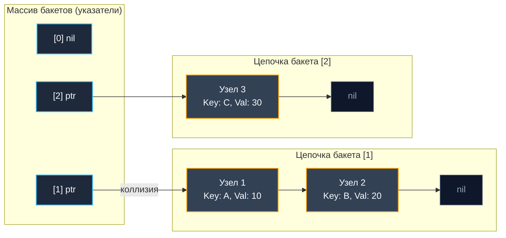
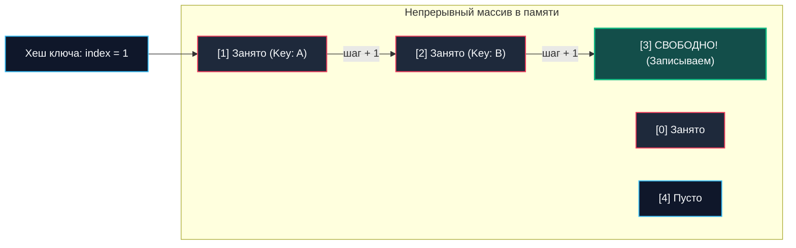

В предыдущих статьях мы установили непреложный математический факт: коллизии неизбежны в силу парадокса дней рождения и принципа Дирихле. Когда два совершенно разных ключа при делении хеша на размер таблицы получают один и тот же целевой индекс (бакет), мы не можем просто записать значение в ячейку — она уже занята.

Для преодоления этой неизбежности компьютерная инженерия выработала два фундаментальных пути: **Метод цепочек (Separate Chaining)** и **Открытая адресация (Open Addressing)**. Понимание того, как эти две стратегии ведут себя на физическом кремнии процессора и шине памяти, отличает рядового разработчика от инженера, способного создавать сверхэффективные in-memory кэши и высоконагруженные хранилища.

---

## Метод цепочек (Separate Chaining)

Классическая и интуитивно понятная идея метода цепочек заключается в следующем: массив бакетов хеш-таблицы хранит не сами элементы, а указатели на связанные списки. Если при вставке бакет уже занят другим ключом, мы просто создаем новый узел (Node) в памяти и прикрепляем его к связному списку в этой ячейке (в начало или в конец).



### Mechanical Sympathy: Боль для процессора

С чисто алгоритмической точки зрения метод цепочек выглядит привлекательно:
- **Устойчивость к высокому коэффициенту заполнения (Load Factor):** Даже если элементов в таблице становится больше, чем бакетов ($\alpha > 1.0$), таблица не перестает работать. Цепочки просто удлиняются, а сложность плавно деградирует.
- **Простота удаления:** Удалить элемент тривиально — достаточно изменить указатели `prev.next = curr.next` и освободить память узла.

Однако на уровне современного кремния метод цепочек порождает серьезные аппаратные издержки:

1. **Pointer Chasing (Погоня за указателями):** Узлы связного списка выделяются индивидуально и разбросаны по всей виртуальной памяти кучи (Heap). Чтобы прочесть следующий узел, CPU обязан дождаться завершения загрузки адреса из предыдущего узла.
2. **Убийство Cache Locality:** Каждое обращение к новому узлу в куче — это почти гарантированный **Cache Miss** (промах кэша L1/L2/L3). Процессор отправляет запрос контроллеру памяти и простаивает 150–250 тактов (до 50–70 нс), ожидая данные из оперативной памяти (RAM). Аппаратный предсказатель ветвлений и упреждающей выборки (Hardware Prefetcher) бессилен угадать хаотичные адреса в куче.
3. **Нагрузка на сборщик мусора (GC):** Каждая вставка узла — это отдельная аллокация в куче (`malloc` или рантайм `runtime.newobject`). Для высоконагруженного Go-бэкенда с миллионами мелких объектов это многократно увеличивает объем работы GC, учащая циклы разметки и порождая микрозадержки (STW и фоновый Pacer).

> [!info] Под капотом
> Именно из-за этих проблем стандартный `std::unordered_map` в C++ часто уступает современным плоским хеш-таблицам (вроде `absl::flat_hash_map` от Google). Стандарт C++ требует, чтобы ссылки и итераторы на элементы оставались валидными при реаллокациях таблицы, что де-факто вынуждает реализовывать контейнер через метод цепочек (отдельные аллокации узлов).

---

## Открытая адресация (Open Addressing)

Открытая адресация предлагает радикально иной инженерный принцип: **все данные хранятся внутри одного непрерывного плоского массива**. Никаких связных списков, никаких указателей на узлы и никаких дополнительных аллокаций.

Если целевой бакет уже занят, алгоритм не создает список, а ищет **следующую свободную ячейку** в том же самом массиве по строго определенной формуле (Probe Sequence). Простейший и самый популярный вариант — **Линейное пробирование (Linear Probing)**: если индекс `i` занят, проверяем `i+1`, затем `i+2` и так далее (с зацикливанием по модулю размера таблицы).



### Mechanical Sympathy: Радость процессорного кэша

Открытая адресация максимально дружелюбна к архитектуре CPU:
1. **Идеальная пространственная локальность (Cache Locality):** Массив лежит в памяти одним монолитным сегментом. При обращении к ячейке `[1]` контроллер памяти подтягивает в L1-кэш целую **кэш-линию (Cache Line)** размером 64 байта, куда сразу попадают соседние ячейки `[2]`, `[3]` и т.д.
2. **Отсутствие промахов кэша:** Последовательная проверка соседних ячеек при линейном пробировании выполняется практически со скоростью регистров процессора (1–4 такта CPU), поскольку данные уже находятся в L1/L2 кэше.
3. **Zero Allocations (Ноль аллокаций):** Вставка нового элемента не требует вызова `malloc` или выделения памяти в куче — запись идет в заранее аллоцированный буфер.

> [!warning] Ловушка / Gotcha (Проблема удаления)
> Представьте: мы положили ключ `X` в ячейку `[1]`. Из-за коллизии ключ `Y` (который тоже должен был быть в `[1]`) мы положили в `[2]`. 
> Что будет, если мы удалим `X` (очистим ячейку `[1]`), а потом попытаемся найти `Y`? Мы вычислим хеш для `Y` -> `[1]`. Увидим, что ячейка `[1]` пуста, и алгоритм скажет: "Ключа `Y` в таблице нет!".
> **Решение:** При удалении элементы нельзя просто стирать. Их нужно помечать специальным флагом **Tombstone (Надгробие / Мертвая душа)**. Этот флаг говорит поиску: "Иди дальше, элемент был удален", а при вставке: "Сюда можно писать новый элемент". Обилие Tombstone-ов сильно загрязняет массив и требует частых реаллокаций.

Вторая проблема открытой адресации — **Кластеризация (Clustering)**. При линейном пробировании занятые ячейки имеют свойство слипаться в огромные непрерывные блоки (первичная кластеризация). Поиск и вставка в такой блок вырождаются в линейный обход $O(N)$. Чтобы таблица сохраняла эффективность, Load Factor при открытой адресации стараются удерживать не выше 0.6–0.7.

---

## Архитектурный компромисс в Go

Создатели Go (Кен Томпсон, Роб Пайк) проектировали язык для системного программирования и высоконагруженных сетевых сервисов. Они глубоко понимали изъяны обоих подходов: классический метод цепочек губит производительность кэша, а чистая открытая адресация страдает от кластеризации и требует громоздкого механизма надгробий (Tombstones).

> [!tip] Собеседование
> **Вопрос:** Какой метод разрешения коллизий используется в `map` в Go?
> **Ответ:** Go использует **гибридный подход**, сочетающий лучшие качества обоих методов.

В основе хэш-таблицы Go лежит массив структур `bmap` (бакетов). Главное инженерное решение заключается в том, что `bmap` — это не одиночный узел списка, а плотный мини-массив, вмещающий ровно **8 пар ключ-значение**:

```
+-------------------------------------------------------------+
| bmap (Bucket)                                               |
|  tophash: [8]uint8  (хранит старшие 8 бит хешей)             |
|  keys:    [8]KeyType                                        |
|  elems:   [8]ElemType                                       |
|  overflow: *bmap    (указатель на следующий бакет при нужде)|
+-------------------------------------------------------------+
```

1. **Внутри бакета — Открытая адресация и SIMD-дружественность:** 8 ключей и 8 значений лежат последовательно в одном блоке памяти. Массив `tophash` размером всего 8 байт мгновенно проверяется процессором (в 1 инструкцию или короткий цикл) без заглядывания в сами ключи. При попадании в бакет все 8 элементов уже находятся в одной кэш-линии CPU.
2. **Между бакетами — Метод цепочек:** Если все 8 слотов бакета заполнены (коллизия 9-го уровня для одного бакета), рантайм Go выделяет **overflow bucket** (бакет переполнения) и связывает его указателем `overflow`, как в методе цепочек.

Благодаря этому гибридному дизайну рантайм Go практически полностью устраняет эффект кластеризации (типичный для открытой адресации) и сводит к минимуму хождение по указателям в памяти: обращение к следующему узлу кучи происходит только после быстрой проверки 8 элементов в быстром кэше.

Теперь, заложив надежный фундамент теории, математики и методов борьбы с коллизиями, мы готовы препарировать главную встроенную структуру данных Go до последнего байта. В следующей статье мы разберем: [[5. Внутреннее устройство map в Go]].