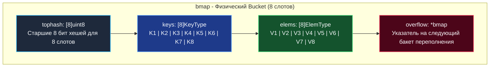
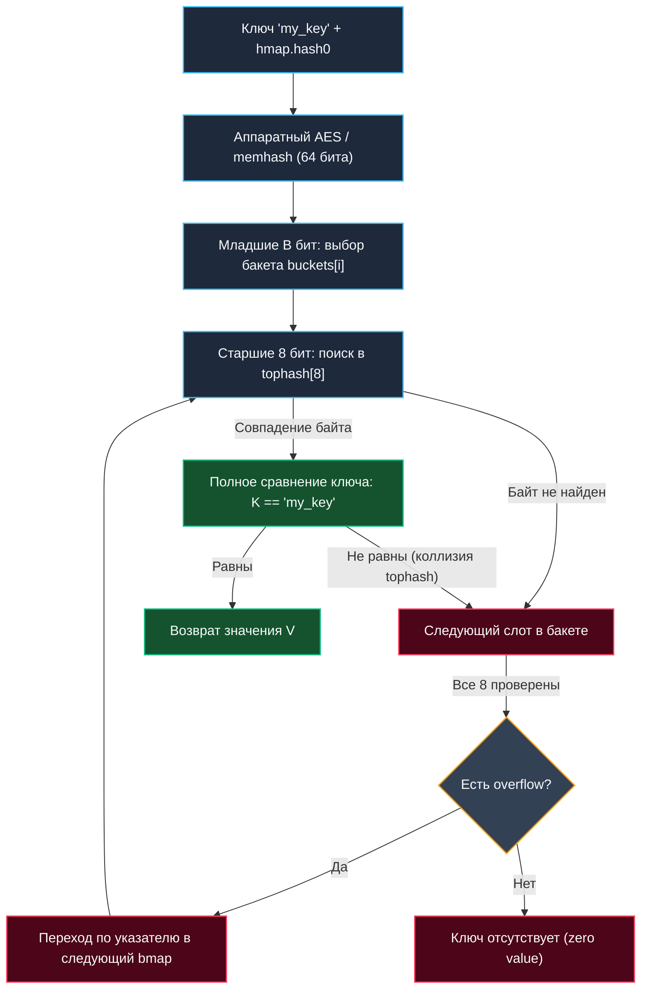

В предыдущих статьях мы подробно разобрали фундаментальную теорию: устройство хеш-функций, битовые маски для мгновенного взятия индекса и способы разрешения неизбежных коллизий ([[4. Открытая адресация и метод цепочек]]). Теперь мы спустимся в машинное отделение языка Go — пакет `runtime`, файл `map.go` — и посмотрим, как эти абстрактные математические концепции воплощены в одной из самых востребованных и оптимизированных структур данных бэкендера — встроенной `map`.

В Go `map` — это классическая хеш-таблица, но она скрывает под капотом филигранные инженерные решения, направленные на идеальное взаимодействие с кэшем процессора (Mechanical Sympathy), минимизацию лишних аллокаций памяти и плавную дефрагментацию под нагрузкой.

---

## Структура hmap: Заголовок словаря

Когда вы пишете `m := make(map[string]int)`, рантайм Go возвращает вам вовсе не саму хеш-таблицу как значение на стеке. Он возвращает **указатель** на заголовочную структуру `hmap` (Header of map). Именно по этой причине `map` в Go передается в функции по значению указателя (по ссылке на данные): любые мутации мапы внутри функции немедленно отражаются на оригинале.

Вот как выглядит структура `hmap` в рантайме Go (упрощенная выжимка из исходного кода):

```go
// runtime/map.go
type hmap struct {
	count     int            // Количество элементов в мапе (возвращается функцией len(m))
	flags     uint8          // Битовые флаги состояния (например, флаг конкурентной записи)
	B         uint8          // Двоичный логарифм количества бакетов (capacity = 2^B бакетов)
	noverflow uint16         // Приблизительное число бакетов переполнения (overflow)
	hash0     uint32         // Случайный seed для хеш-функции (защита от Hash DoS атак)

	buckets    unsafe.Pointer // Указатель на непрерывный массив из 2^B бакетов (bmap)
	oldbuckets unsafe.Pointer // Указатель на старый массив при ресайзе (эвакуации)
	nevacuate  uintptr        // Индекс бакета, который эвакуируется прямо сейчас
}
```

Ключевой параметр в заголовке — поле `B`. Рантайм Go всегда поддерживает общее количество бакетов равным степени двойки ($2^B$). Это позволяет вместо тяжелой операции деления `hash % capacity` применять сверхбыстрое побитовое И (`&`):
$$\text{bucket\_index} = \text{hash} \ \& \ ((1 \ll B) - 1)$$

---

## Структура bmap: Искусство упаковки памяти

Поле `buckets` в структуре `hmap` указывает на массив структур `bmap` (Bucket map). И именно здесь начинается подлинное торжество низкоуровневой оптимизации.

В исходном коде `runtime/map.go` структура `bmap` намеренно описана лаконично:

```go
type bmap struct {
	tophash [8]uint8 // Массив из 8 байт для быстрых проверок
}
```

Кажется, что в бакете нет ничего, кроме 8 байт. Но это лишь синтаксическая иллюзия для компилятора: размер ключа и значения неизвестен до момента компиляции конкретной программы. На этапе компиляции Go динамически генерирует реальную структуру бакета в памяти под конкретные типы ключа и значения.

В оперативной памяти реальный `bmap` всегда строго вмещает **8 пар ключ-значение** и имеет следующий вид:



Каждый бакет всегда вмещает ровно **8 пар ключ-значение**.

### Умное выравнивание (Memory Alignment)

Обратите внимание на последовательность расположения полей в памяти: сначала идут подряд **все ключи**, а затем подряд **все значения**. Почему не парами: ключ 1, значение 1, ключ 2, значение 2?

Это блестящий пример Mechanical Sympathy и учета требований процессорной шины. Если ключ и значение обладают разным размером (например, ключ `int64` занимает 8 байт, а значение `int8` — всего 1 байт), чередование привело бы к колоссальным потерям памяти из-за аппаратного выравнивания адресов (Memory Padding).

Сравните два подхода:
- При чередовании `K V K V`:
  `8 байт (K)` + `1 байт (V)` + `7 байт (Padding)` + `8 байт (K)` ...
  Мы бы впустую теряли 7 байт на каждом элементе (56 байт на бакет!).
- При группировке `K K K K ... V V V V`:
  `8+8+8+8 (Ключи)` + `1+1+1+1 (Значения)` + `4 байта (Padding в самом конце)`.
  Мы экономим десятки байт на каждом бакете и делаем данные максимально компактными для процессорного L1-кэша.

---

## Как работает чтение (Read Path)

Когда в программе выполняется операция поиска `val := m["my_key"]`, рантайм Go запускает следующую цепочку действий:



1. **Вычисление хеша**: Рантайм берет ключ `"my_key"`, подмешивает случайную затравку `hmap.hash0` и вычисляет 64-битный хеш с помощью аппаратных инструкций AES-NI процессора или алгоритма Wyhash (`runtime.memhash`).
2. **Выбор бакета (Low bits)**: Из 64-битного хеша берутся младшие `B` бит. Например, если `B=3`, мы берем 3 младших бита (комбинация `101` дает индекс 5). Значит, целевой бакет — `buckets[5]`.
3. **Поиск внутри бакета (High bits и tophash)**: Процессор не выполняет сразу тяжелое сравнение строк или структур. Он извлекает **старшие 8 бит** того же 64-битного хеша и сравнивает этот единственный байт с массивом `tophash` в бакете.

> [!info] Под капотом
> Массив `tophash` из 8 байт целиком помещается в один 64-битный машинный регистр процессора. Сравнение старшего байта хеша со всеми 8 ячейками `tophash` выполняется за **1 такт CPU** без единого промаха кэша.
> И только в том редком случае, когда байты `tophash` совпали, Go обращается к памяти ключа и производит точное сравнение (`K1 == "my_key"`).

4. **Разрешение переполнения (Overflow)**: Если все 8 слотов бакета проверены, а искомый ключ не найден, рантайм следует по указателю `overflow` в следующий бакет переполнения (гибридный метод цепочек).

---

## Инкрементальная эвакуация (Incremental Resizing)

Когда средняя загрузка таблицы (Load Factor — отношение общего количества элементов к числу бакетов) превышает критический порог **6.5** (в среднем больше 6.5 элементов на бакет), либо в мапе скапливается слишком много полупустых `overflow`-бакетов, `map` инициирует процедуру ресайза.

Количество бакетов удваивается ($B \to B+1$, массив `buckets` вырастает ровно в 2 раза). Однако если в таблице хранятся миллионы записей, мгновенный перенос всех элементов вызвал бы многомиллисекундную заморозку программы (Stop-the-World лаг).

Чтобы избежать деградации latency, Go применяет **инкрементальную эвакуацию (Incremental Evacuation)**:
1. Текущий массив бакетов сохраняется по ссылке `oldbuckets`.
2. В куче выделяется новый массив `buckets` удвоенного объема.
3. Мапа продолжает непрерывно обслуживать запросы. При этом **при каждой последующей операции записи или удаления** (`m[k] = v` или `delete(m, k)`) рантайм берет ровно **2 бакета** из `oldbuckets` и переносит их данные в новый массив `buckets`.
4. Специальный счетчик `nevacuate` сдвигается вперед, фиксируя завершенный прогресс.

Такой подход элегантно распределяет тяжелую нагрузку по времени, гарантируя амортизированную сложность $O(1)$ для всех мутирующих операций.

> [!warning] Ловушка / Gotcha
> Во время процесса эвакуации `map` временно удерживает в памяти как старый массив, так и новый удвоенный (суммарно примерно в 3 раза больше памяти, чем до ресайза). Серия непрерывных неконтролируемых ресайзов способна мгновенно вызвать резкий скачок потребления RAM и перегрузить сборщик мусора.
> **Всегда задавайте начальную емкость через `make(map[K]V, capacity)`**, если примерное количество элементов известно заранее!

> [!tip] Собеседование
> **Вопрос:** Почему обход `map` в Go (через конструкцию `for k, v := range m`) не гарантирует стабильного порядка элементов, и при каждом запуске программы порядок оказывается другим?
> **Ответ:** Во-первых, хеш-таблица по своей природе неупорядочена: индекс элемента определяется хешем, а не хронологией вставки. Во-вторых, защита от Hash DoS использует уникальный случайный `seed` (`hash0`) при каждом создании таблицы, из-за чего хеши одних и тех же ключей различаются между запусками. В-третьих, рантайм Go **намеренно рандомизирует** точку старта обхода: итерация всегда начинается со случайного бакета и случайного смещения внутри него. Это сделано намеренно разработчиками языка, чтобы программисты не вырабатывали скрытую зависимость от псевдослучайного порядка обхода.

---

## Потокобезопасность (Concurrency)

Встроенная структура `map` в Go **не является потокобезопасной (thread-safe)**.

Если одна горутина читает данные из `map`, а другая в этот же момент производит запись, рантайм Go мгновенно детектирует гонку данных, выбрасывает фатальную системную ошибку `fatal error: concurrent map read and map write` (или `fatal error. concurrent map read and map write`) и немедленно завершает весь процесс аварийно — перехватить эту ошибку через `recover` невозможно.

Почему создатели языка не встроили мьютекс прямо в заголовок `hmap`?  
Ответ снова кроется в **Mechanical Sympathy**. Захват и освобождение системных блокировок (Mutex) требуют сотен тактов процессора и атомарных инструкций шины памяти. Блокировка всей таблицы на каждую элементарную операцию чтения обрушила бы производительность языка. В подавляющем большинстве сценариев мапы используются локально внутри одной горутины, где накладные расходы на синхронизацию были бы чистой тратой ресурсов.

Аппаратная защита от конкурентной записи реализована через битовое поле `flags` в заголовке `hmap`. Когда горутина приступает к мутации таблицы, она устанавливает служебный бит `hashWriting`. Любая параллельная горутина, обратившаяся к мапе и обнаружившая активный флаг `hashWriting`, немедленно паникует на уровне рантайма.

Для многопоточной работы следует защищать стандартную мапу с помощью мьютекса `sync.RWMutex`, либо применять специализированную структуру `sync.Map` из стандартной библиотеки (к детальному анализу которой мы еще вернемся).

Разобравшись с глубинным устройством хеш-таблиц, мы завершаем тему точного ассоциативного поиска. В следующей статье мы познакомимся с удивительным миром вероятностных структур данных, позволяющих ценой минимального расхода памяти отвечать на вопрос о наличии элемента в гигантских массивах: [[6. Bloom filter - вероятностная структура данных]].