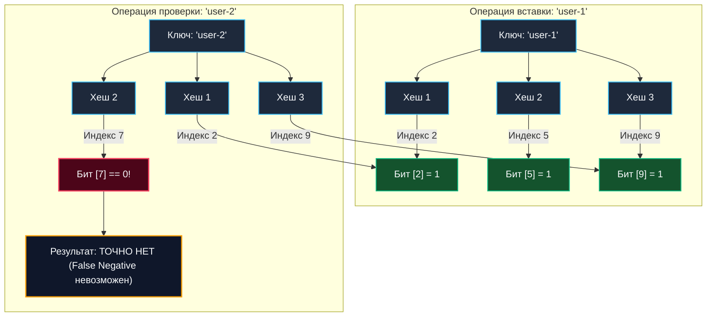

В предыдущей статье [[5. Внутреннее устройство map в Go]] мы досконально изучили классическую хеш-таблицу, которая дает 100% гарантию точного ответа на вопрос: «Есть ли такой ключ в словаре, и если да, то каково ассоциированное с ним значение?». Но за эту кристальную математическую точность мы платим немалую цену оперативной памятью: структура `map` вынуждена хранить сами ключи, значения и комплекс служебных метаданных (`bmap`, `tophash`).

В мире высоконагруженных распределенных систем (особенно в дисковых СУБД, кэширующих слоях и сетевых шлюзах) регулярно возникает принципиально иная инженерная задача: нам вообще не нужно значение ключа, нам нужно **с минимальным расходом памяти и за минимальное количество тактов CPU определить, существует ли элемент в гигантском наборе данных**.

Если элементов сотни миллионов или миллиарды, обычная хеш-таблица мгновенно исчерпает терабайты RAM. И здесь на сцену выходит **Bloom filter (Фильтр Блума)** — компактная вероятностная структура данных, изобретенная Бертоном Блумом в 1970 году. Она сжимает информацию о присутствии миллиардов ключей в скромные мегабайты памяти, жертвуя абсолютной точностью ради фантастической экономии ресурсов.

---

## Суть вероятностного подхода

Фильтр Блума отвечает на вопрос «Присутствует ли элемент в множестве?» с характерной вероятностной асимметрией:
1. **«Абсолютно точно НЕТ»** — ложноотрицательные срабатывания (**False Negatives**) математически невозможны.
2. **«Возможно ДА»** — вероятны ложноположительные срабатывания (**False Positives**).

Если фильтр Блума ответил «нет», инженерная система может быть на 100% уверена в отсутствии записи: можно смело пропустить дорогостоящее обращение к медленному NVMe-диску, реляционной базе данных или внешнему микросервису. Если же фильтр ответил «да», элемент *весьма вероятно* существует, но сохраняется небольшая контролируемая вероятность (например, 1%), что это ложная тревога из-за битовых коллизий, и системе придется перепроверить исходное хранилище.

---

## Архитектура фильтра Блума

Внутри фильтр Блума устроен предельно минималистично и состоит всего из двух компонентов:
1. **Битовый массив (Bit array)** длины `m`, изначально целиком инициализированный нулями.
2. **Набор из `k` независимых хеш-функций**, каждая из которых равномерно проецирует ключ в диапазон индексов от `0` до `m-1`.



### Операция вставки (Add)
При добавлении нового элемента он последовательно передается на вход всем `k` хеш-функциям. Каждая хеш-функция вычисляет позицию бита. В битовом массиве биты по этим `k` индексам выставляются в значение `1` с помощью побитового `OR`.

### Операция проверки (Contains)
При проверке наличия элемента он аналогично хешируется теми же `k` функциями. Затем проверяются значения битов по всем вычисленным позициям:
- Если **хотя бы один** проверяемый бит равен `0` — элемента **гарантированно нет** в множестве.
- Если **все** `k` битов равны `1` — элемент **с высокой вероятностью присутствует**.

Почему «вероятно»? Потому что все эти биты могли быть независимо установлены в `1` комбинацией других ранее добавленных элементов (битовая коллизия).

> [!tip] Собеседование
> **Вопрос:** Можно ли удалить элемент из классического фильтра Блума?
> **Ответ:** Нет, из классического фильтра Блума удалять элементы категорически нельзя. Поскольку один и тот же бит в массиве может быть выставлен в `1` сразу несколькими независимыми ключами, сброс любого бита в `0` при попытке удалить один ключ неизбежно приведет к порче проверки для других ключей: фильтр начнет возвращать "Точно нет" (False Negative) для реально существующих элементов, что полностью разрушает его математическую инварианту.
> Если удаление строго необходимо, применяют модификацию **Counting Bloom Filter**, в которой вместо одиночных битов хранятся компактные счетчики (например, 4-битные ячейки). При вставке счетчик инкрементируется, при удалении — декрементируется. Плата за это — четырехкратный расход памяти.

---

## Математика ложных срабатываний (False Positives)

Инженеру важно понимать математическую связь между ключевыми параметрами фильтра. Вероятность ложноположительного ответа $p$ детерминируется тремя величинами:
* $n$ — ожидаемое число уникальных элементов, которые будут загружены в фильтр.
* $m$ — общий объем битового массива (в битах).
* $k$ — количество независимых хеш-функций.

Если сделать массив $m$ чересчур компактным, он мгновенно заполнится единицами, и на любой входящий запрос фильтр будет отвечать «Возможно ДА» (вероятность ошибки устремится к 100%). Если же задействовать слишком много хеш-функций $k$, каждый ключ будет взводить слишком много битов, что также приведет к преждевременному насыщению массива.

На практике инженеру не приходится гадать наугад. Задав ожидаемое количество элементов $n$ и допустимую границу погрешности $p$ (например, $p = 0.01$, то есть 1% ложных срабатываний), оптимальные значения вычисляются по аналитическим формулам:

$$m = -\frac{n \ln p}{(\ln 2)^2}$$
$$k = \frac{m}{n} \ln 2$$

Для обеспечения вероятности ложного срабатывания всего в 1% требуется приблизительно **9.6 бит на один элемент**. Это означает, что каталог из 100 миллионов строковых URL-адресов можно индексировать в фильтре объемом всего около **120 МБ**! Если бы мы сохранили эти же 100 миллионов строк в стандартную `map[string]struct{}`, расход памяти превысил бы 4–6 гигабайт.

---

## Mechanical Sympathy: Экономия диска и кэша

Почему фильтр Блума столь популярен в бэкенд-архитектурах? Его главная инженерная миссия — служить легковесным экраном, отсекающим дорогие дисковые и сетевые операции ввода-вывода (I/O — Input/Output).

Классический пример из мира высоконагруженных баз данных — СУБД на основе [[4. LSM дерево]] (Apache Cassandra, ClickHouse, RocksDB, ScyllaDB). В таких системах данные сохраняются на диск иммутабельными блоками — SSTables. Если клиент выполняет запрос вида `SELECT * FROM users WHERE id = 999`, а пользователя с таким идентификатором в системе никогда не существовало, без фильтра Блума движку СУБД пришлось бы последовательно прочесть с диска все SSTables-файлы, чтобы окончательно удостовериться в отсутствии записи. Чтение с диска (даже со скоростного NVMe) требует сотен тысяч тактов CPU и миллисекунд ожидания.

Вместо этого СУБД держит в оперативной памяти (RAM) миниатюрный фильтр Блума для каждого SSTable-файла:
1. CPU проверяет фильтр в памяти: несколько быстрых битовых операций `AND` занимают считанные наносекунды, а битовый срез отлично ложится в процессорный L1/L2 кэш.
2. Фильтр Блума мгновенно отвечает "Точно нет".
3. База данных моментально отдает ответ `Not Found`, не совершив **ни единого** физического обращения к диску.

---

## Реализация на Go: Идиоматичный подход

Для эффективной реализации на Go нам требуется компактный битовый массив. Поскольку в Go отсутствует элементарный тип `bit`, мы моделируем битовый массив через срез машинных слов `[]uint64`. Это позволяет центральному процессору оперировать данными естественными 64-битными машинными словами без накладных расходов.

Кроме того, вычислять 5–7 независимых криптографических хешей для каждой строчки недопустимо дорого. В production-коде используется элегантный алгоритм Кирша-Митценмахера — **Double Hashing** (Двойное хеширование). Из двух независимых хешей ($h_1$ и $h_2$) симулируется любое желаемое количество $k$ псевдонезависимых хеш-функций по формуле:
$$h_i = h_1 + i \cdot h_2$$

В стандартной библиотеке Go доступен высокопроизводительный пакет `hash/maphash`, задействующий аппаратные инструкции AES-NI (тот же механизм, что работает под капотом встроенной `map`, как мы рассматривали в [[1. Хеш функции и равномерность распределения]]).

```go
package bloom

import (
	"hash/maphash"
)

// BloomFilter представляет собой вероятностную структуру данных.
type BloomFilter struct {
	bitset []uint64     // Наш битовый массив (слайс 64-битных слов)
	m      uint64       // Общее количество бит
	k      uint64       // Количество хеш-функций
	seed1  maphash.Seed // Seed для первой хеш-функции
	seed2  maphash.Seed // Seed для второй хеш-функции
}

// New создает новый фильтр Блума.
// На практике m и k должны вычисляться по формулам на основе n и p.
func New(mBits uint64, k uint64) *BloomFilter {
	return &BloomFilter{
		// Делим на 64 с округлением вверх, чтобы узнать количество uint64
		bitset: make([]uint64, (mBits+63)/64),
		m:      mBits,
		k:      k,
		seed1:  maphash.MakeSeed(),
		seed2:  maphash.MakeSeed(),
	}
}

// getHashes вычисляет два базовых хеша для трюка Double Hashing
func (b *BloomFilter) getHashes(data string) (uint64, uint64) {
	var h maphash.Hash

	h.SetSeed(b.seed1)
	_, _ = h.WriteString(data)
	h1 := h.Sum64()

	h.Reset()
	h.SetSeed(b.seed2)
	_, _ = h.WriteString(data)
	h2 := h.Sum64()

	return h1, h2
}

// Add вставляет элемент в фильтр.
func (b *BloomFilter) Add(data string) {
	h1, h2 := b.getHashes(data)

	for i := uint64(0); i < b.k; i++ {
		// Трюк: Double Hashing. Симулируем k функций.
		idx := (h1 + i*h2) % b.m

		// Битовая магия
		wordIdx := idx / 64 // Находим нужный uint64 в слайсе
		bitIdx := idx % 64  // Находим нужный бит внутри этого uint64

		// Устанавливаем бит в 1 с помощью побитового ИЛИ (OR)
		b.bitset[wordIdx] |= (1 << bitIdx)
	}
}

// Contains проверяет, возможно ли наличие элемента в фильтре.
func (b *BloomFilter) Contains(data string) bool {
	h1, h2 := b.getHashes(data)

	for i := uint64(0); i < b.k; i++ {
		idx := (h1 + i*h2) % b.m
		wordIdx := idx / 64
		bitIdx := idx % 64

		// Проверяем, установлен ли бит, с помощью побитового И (AND)
		if (b.bitset[wordIdx] & (1 << bitIdx)) == 0 {
			return false // Если хотя бы один бит 0, элемента ТОЧНО НЕТ
		}
	}
	return true // Все биты 1, элемент ВОЗМОЖНО ЕСТЬ
}
```

> [!warning] Ловушка / Gotcha
> Классический фильтр Блума **нельзя динамически расширять (resize)**. Если вы инициализировали фильтр емкостью на 1 миллион записей, а залили 10 миллионов, программа не выбросит панику (ведь это просто установка битов). Однако почти все биты станут единицами, и фильтр начнет возвращать `true` для любого случайного ключа, полностью обесценивая свою пользу.
> Если итоговый объем множества невозможно спрогнозировать заранее, в архитектуре применяют **Scalable Bloom Filter** — каскад независимых фильтров Блума, где при заполнении текущего уровня динамически аллоцируется новый фильтр со сниженной вероятностью погрешности.

---

## Итог

Фильтр Блума — это идеальный архитектурный щит высоконагруженной системы. Он перехватывает "холостые" запросы (несуществующие идентификаторы, скомпрометированные пароли, вредоносные спам-URL) непосредственно в оперативной памяти за считанные наносекунды, оберегая дисковые массивы и реплики баз данных от перегрузок.

До сих пор мы анализировали хеширование, где коллизии считаются неизбежным злом (в обычных мапах) или полезным компромиссом (в фильтрах Блума). Но можно ли построить хеш-таблицу с жестко гарантированным временем поиска в худшем случае $O(1)$, которая сама вытесняет элементы при возникновении коллизий? В следующей статье мы разберем красивый и мощный алгоритм, применяемый в высокопроизводительных роутерах и распределенных кэшах: [[7. Cuckoo hashing]].