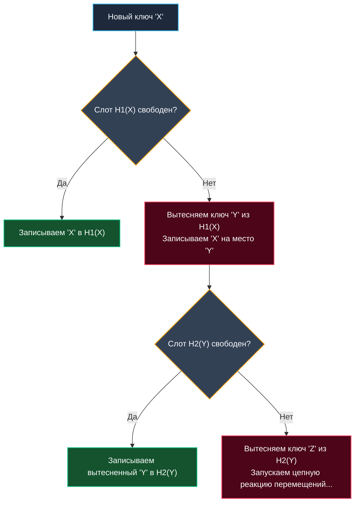

Встроенная структура `map` в Go и подавляющее большинство стандартных хеш-таблиц (как с открытой адресацией, так и с методом цепочек) гарантируют алгоритмическую сложность поиска $O(1)$ лишь **в среднем** (амортизированное время). В худшем сценарии (Worst-case), когда серия неудачных коллизий выстраивается в длинную цепочку или непрерывный кластер, сложность поиска неизбежно деградирует до линейного сканирования $O(N)$.

Для стандартного бэкенда (CRUD-сервисы, REST API, бизнес-логика) такое поведение вполне терпимо. Однако если перед вами стоит задача разработки сетевого маршрутизатора уровня ядра (Data Plane Development Kit — DPDK), высокочастотной торговой платформы (HFT) или in-memory кэша с жесткими требованиями SLA (Service Level Agreement), **непредсказуемые задержки latency в хвосте распределения (p99/p99.9) категорически недопустимы**. Системе требуется строго детерминированный ответ за гарантированное константное время, независимо от характера входящих коллизий.

Именно эту фундаментальную инженерную задачу решает **Кукушкино хеширование (Cuckoo Hashing)**, предложенное Расмусом Пахом и Флеммингом Родлером в 2001 году.

---

## Концепция: Поведение птицы кукушки

Название алгоритма остроумно заимствовано из живой природы: птица кукушка подкладывает свои яйца в чужие птичьи гнезда, а вылупившийся птенец безжалостно выталкивает законные яйца или птенцов хозяев гнезда.

В классической схеме Cuckoo Hashing используются:
1. **Две независимые хеш-функции** ($H_1$ и $H_2$).
2. **Две таблицы** (или единый массив, логически разделенный пополам: первая половина адресуется через $H_1$, вторая — через $H_2$).

Главное математическое правило алгоритма: **Каждый ключ может находиться только в двух строго фиксированных ячейках**. Никаких бесконечных связных списков и никакого последовательного линейного пробирования по десяткам ячеек.

### Чтение — Строго гарантированный $O(1)$
Чтобы найти ключ в таблице, процессор проверяет **ровно две ячейки памяти**: $H_1(\text{key})$ и $H_2(\text{key})$.
- Если искомый ключ находится в одной из этих двух позиций — значение найдено.
- Если ключа нет ни в первой, ни во второй ячейке — элемента гарантированно нет во всей таблице.

Всего два прямых чтения из памяти. Никаких исключений и деградаций: строжайший худший случай — Worst-case $O(1)$.

### Вставка — Каскадное вытеснение
Вставка нового элемента протекает по агрессивному сценарию вытеснения:
1. Вычисляем первый индекс `idx1 = H1(key)`. Если ячейка свободна — записываем ключ туда.
2. Если ячейка `idx1` занята, вычисляем альтернативный индекс `idx2 = H2(key)`. Если эта ячейка свободна — пишем туда.
3. Если **обе целевые ячейки уже заняты**, новый ключ действует как кукушонок: он бесцеремонно занимает слот `idx1`, а ранее живший там ключ принудительно "выселяется" (становится сиротой).
4. Выселенный ключ отправляется на поиски своего альтернативного дома: для него вычисляется *его* второе гнездо (`H2(old_key)`).
5. Если второе гнездо сироты тоже занято, он выселяет следующего жильца.
6. Запускается каскадная цепная реакция переселений, пока каждый элемент не обретет свободную ячейку.



---

## Mechanical Sympathy: Почему это критично для процессора?

Для современного процессора ключевой фактор скорости — архитектурная предсказуемость исполнения.

В классической открытой адресации (Linear Probing) при плотном заполнении CPU вынужден последовательно перебирать ячейки памяти. Хотя они лежат компактно в кэш-линии, длинная серия условных переходов (`CMP`, `JNE`) нагружает конвейер инструкций и сбивает предсказатель ветвлений (Branch Predictor).

В кукушкином хешировании процессор выполняет **ровно два независимых запроса в память**.  
Да, из-за псевдослучайности хеш-функций эти два обращения могут прийтись на разные сегменты памяти и повлечь два промаха кэша (Cache Miss). Но это **предельно возможная глубина падения**. Время реакции системы становится идеально детерминированным — профиль задержек Latency (включая p99 и p100) выравнивается в горизонтальную прямую. Для систем жесткого реального времени и сетевых коммутаторов эта предсказуемость бесценна.

---

## Проблема зацикливания (Cycles) и Ресайз

Что произойдет, если цепочка выселений замкнется в кольцо? Например: ключ `X` вытесняет `Y`, `Y` вытесняет `Z`, а `Z` снова вытесняет `X`. Возникает бесконечный цикл.

> [!warning] Ловушка / Gotcha
> Бесконечные циклы — фундаментальная ахиллесова пята Cuckoo Hashing. Чтобы предотвратить зависание программы, в алгоритм вводится жесткий предел цепочки выселений — счетчик **Max Kicks** (обычно константа порядка нескольких сотен, либо логарифмическая функция от размера таблицы).
> Если число шагов вытеснения превышает лимит `Max Kicks`, алгоритм констатирует зацикливание. В этой ситуации таблица обязана провести операцию **Rehash**: сгенерировать новые случайные затравки (seeds) для хеш-функций и полностью перестроить хранилище с нуля (или удвоить его емкость).

> [!info] Под капотом
> Математически доказано, что при двух независимых хеш-функциях вероятность зацикливания экспоненциально возрастает, как только коэффициент заполнения таблицы (**Load Factor**) достигает критического порога **50%** (`Load Factor = 0.5`). Это значит, что половина ячеек памяти должна оставаться незанятой.
> Чтобы преодолеть это ограничение и поднять коэффициент заполнения до 85–95%, инженеры применяют:
> 1. Увеличение числа хеш-функций до 3–4 (**D-ary Cuckoo Hashing**).
> 2. Блочную организацию бакетов (хранение 2–4 слотов в каждом бакете, аналогично архитектуре `bmap` в Go-рантайме, как мы разбирали в [[5. Внутреннее устройство map в Go]]).

---

## Базовая реализация на Go

Реализуем рабочее ядро Cuckoo-таблицы для пар ключ-значение типа `map[string]string`. Для компактности используем единый массив структур, но генерируем два независимых хеша с помощью разных `seed` из пакета `hash/maphash`.

```go
package cuckoo

import (
	"errors"
	"hash/maphash"
)

const maxKicks = 500

type entry struct {
	key   string
	value string
	empty bool
}

type CuckooTable struct {
	table []entry
	size  uint64
	seed1 maphash.Seed
	seed2 maphash.Seed
}

func New(capacity uint64) *CuckooTable {
	// Инициализируем массив структур с флагом empty
	t := make([]entry, capacity)
	for i := range t {
		t[i].empty = true
	}
	return &CuckooTable{
		table: t,
		size:  capacity,
		seed1: maphash.MakeSeed(),
		seed2: maphash.MakeSeed(),
	}
}

// hash вычисляет индекс для переданного seed
func (c *CuckooTable) hash(key string, seed maphash.Seed) uint64 {
	var h maphash.Hash
	h.SetSeed(seed)
	_, _ = h.WriteString(key)
	return h.Sum64() % c.size // Для демонстрации взят %; в production-коде используется побитовая маска
}

// Get гарантирует O(1) (O-1) доступ в самом неблагоприятном Worst-case сценарии
func (c *CuckooTable) Get(key string) (string, bool) {
	idx1 := c.hash(key, c.seed1)
	if !c.table[idx1].empty && c.table[idx1].key == key {
		return c.table[idx1].value, true
	}

	idx2 := c.hash(key, c.seed2)
	if !c.table[idx2].empty && c.table[idx2].key == key {
		return c.table[idx2].value, true
	}

	return "", false
}

// Set вставляет элемент с логикой каскадного вытеснения
func (c *CuckooTable) Set(key string, value string) error {
	// Если ключ уже присутствует в одной из ячеек — обновляем значение
	idx1 := c.hash(key, c.seed1)
	if !c.table[idx1].empty && c.table[idx1].key == key {
		c.table[idx1].value = value
		return nil
	}
	idx2 := c.hash(key, c.seed2)
	if !c.table[idx2].empty && c.table[idx2].key == key {
		c.table[idx2].value = value
		return nil
	}

	currEntry := entry{key: key, value: value, empty: false}

	for i := 0; i < maxKicks; i++ {
		p1 := c.hash(currEntry.key, c.seed1)
		if c.table[p1].empty {
			c.table[p1] = currEntry
			return nil
		}

		p2 := c.hash(currEntry.key, c.seed2)
		if c.table[p2].empty {
			c.table[p2] = currEntry
			return nil
		}

		// Обе ячейки заняты: выселяем жильца из первого гнезда
		evicted := c.table[p1]
		c.table[p1] = currEntry
		currEntry = evicted // Сирота становится текущим элементом для следующего шага вытеснения
	}

	// Если лимит перемещений исчерпан — обнаружен цикл
	return errors.New("нужен rehash - превышен maxKicks")
}
```

---

## Cuckoo Filter: Эволюция фильтра Блума

В предыдущей лекции мы разбирали [[6. Bloom filter - вероятностная структура данных]]. При всей своей колоссальной эффективности классический фильтр Блума обладает органическим дефектом: **он принципиально не поддерживает удаление элементов**.

> [!tip] Собеседование
> **Вопрос:** Как построить высокопроизводительную вероятностную структуру данных с полноценной поддержкой удаления записей, избегая при этом раздувания памяти счетчиками (как в Counting Bloom Filter)?
> **Ответ:** Использовать **Cuckoo Filter** (Фильтр Кукушки).

**Cuckoo Filter** представляет собой развитие кукушкиного хеширования. В нем вместо полных ключей и значений в ячейках хранятся только компактные криптографические отпечатки (**Fingerprints**, как правило, 8 или 12 бит хеша).  
Поскольку для любого отпечатка в таблице строго зафиксированы ровно две возможные позиции размещения, удаление ключа выполняется элементарно: мы находим отпечаток в одной из двух ячеек и очищаем этот слот памяти.

Благодаря этому Cuckoo Filter обеспечивает аналогичную или превосходящую экономию памяти по сравнению с фильтром Блума, полностью поддерживает операцию `Delete` и сегодня активно внедряется в современные высоконагруженные хранилища (такие как Redis и исследовательские сетевые стеки).

---

## Резюме по разделу Хеширования

Завершая наш экскурс в мир хеширования, подведем инженерный итог:
1. **Качество хеш-функции:** Равномерность распределения и независимость битов — фундамент защиты от вырождения таблицы и уязвимостей Hash DoS.
2. **Степени двойки и битовые маски:** Замена операции деления по модулю на побитовое умножение (`&`) экономит десятки тактов CPU на каждом обращении.
3. **Mechanical Sympathy:** Открытая адресация безупречно дружит с процессорным L1-кэшем (Cache Locality), тогда как классический метод цепочек порождает дорогостоящий Pointer Chasing в оперативной памяти.
4. **Внутреннее устройство Go map:** Стандартный рантайм Go филигранно объединяет оба мира: бакеты `bmap` по 8 элементов упакованы для мгновенного чтения одной кэш-линией с помощью массива `tophash`, а переполнения связываются через цепочки `overflow`.
5. **Вероятностные алгоритмы:** Фильтры Блума выступают надежным щитом перед медленным дисковым I/O ценой малого процента False Positives, а структуры Cuckoo Hashing гарантируют непоколебимый Worst-case $O(1)$ и открывают дорогу безопасным удалениям.

Хеширование обеспечивает нам молниеносный $O(1)$ для точечного поиска по конкретному ключу. Однако хеш-функции полностью разрушают естественный порядок данных. Что делать, если перед сервисом встает задача: найти «все заказы в диапазоне дат» или «всех пользователей с балансом больше X»? Для интервальных запросов (Range Queries) хеш-таблицы бесполезны. Нам потребуется фундаментально иная геометрия связей между элементами.

Мы переходим к следующему грандиозному разделу, управляющему архитектурой всех современных баз данных и файловых систем — деревьям поиска. Начнем с классических основ: [[1. Деревья и обходы]].