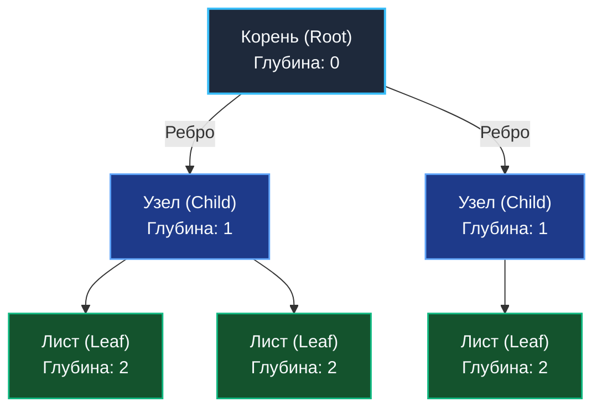
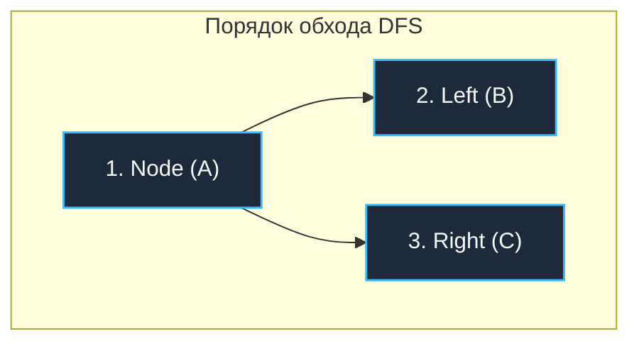
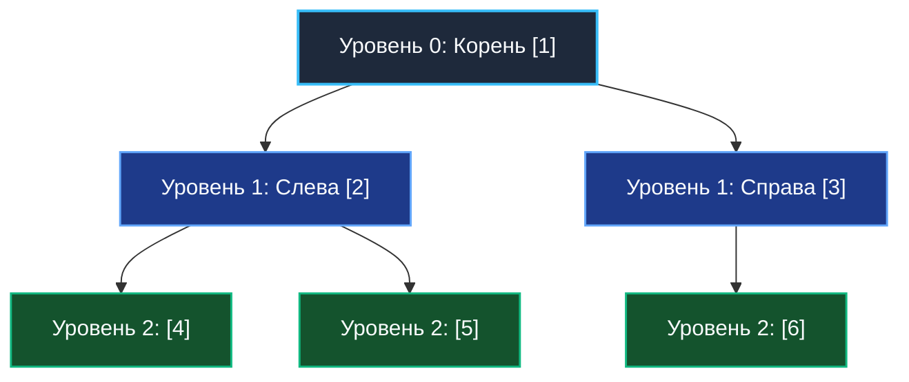

До сих пор мы рассматривали линейные структуры данных: [[1. Массивы и динамические массивы]] и [[3. Связные списки]]. В них каждый элемент имеет строго максимум одного предшественника и одного непосредственного последователя. Такая геометрия идеальна для хранения плоских списков и очередей, но окружающий физический мир и большинство архитектурных задач иерархичны по своей природе.

Файловые системы операционных систем, DOM-дерево в браузерах, таблицы маршрутизации URL в современных веб-фреймворках (например, Radix tree в `echo` или `gin`), индексы высоконагруженных СУБД — всё это опирается на фундаментальную нелинейную структуру данных: **Дерево (Tree)**.

---

## Анатомия и терминология

В теории графов дерево определяется строго: это **связный ациклический граф** (граф без петель и замкнутых циклов). В отличие от ботанических деревьев, в компьютерных науках деревья традиционно растут «вниз» — от корня к периферийным листьям.

* **Корень (Root):** Самый верхний узел иерархии, не имеющий родительского узла.
* **Узел (Node):** Базовая элементарная единица дерева, содержащая полезную нагрузку (значение) и ссылки на дочерние узлы.
* **Ребро (Edge):** Направленная связь между родительским и дочерним узлами.
* **Родитель / Ребенок (Parent / Child):** Отношение субординации. Узел, из которого исходит ребро — родитель; узел, в который ребро входит — ребенок.
* **Лист (Leaf):** Терминальный узел дерева, не имеющий ни одного потомка.
* **Высота (Height) дерева:** Максимальное число ребер на пути от корня до самого удаленного листа.
* **Глубина (Depth) узла:** Длина пути (количество ребер) от корня до данного конкретного узла.



---

## Mechanical Sympathy: Деревья и аппаратное железо

С точки зрения архитектуры современного процессора, наивное дерево на указателях — это **наихудший сценарий для подсистемы памяти**.

В непрерывных массивах мы наслаждались идеальной пространственной локальностью (Spatial Locality) и предсказуемой работой аппаратного Prefetcher-а, который автоматически подтягивал данные в L1-кэш целыми линиями по 64 байта. В классическом же дереве каждый узел создается независимой аллокацией в куче (Heap). В результате узлы оказываются хаотично разбросаны по виртуальному адресному пространству.

Каждый шаг спуска по дереву от родителя к ребенку (`node.Left` или `node.Right`) превращается в **Pointer Chasing (погоню за указателями)**. Процессор не в состоянии предугадать адрес следующего узла и вынужден простаивать сотни тактов, ожидая доставку данных из медленной RAM через контроллер шины памяти.

> [!info] Под капотом: Нагрузка на GC
> Дерево из 1 миллиона узлов в Go — это ровно 1 миллион независимых объектов в куче. Во время фазы разметки (Mark Phase) сборщик мусора Go обязан обойти и провалидировать *каждый* из этих указателей. Это создает колоссальное давление на рантайм (GC Pressure).
> Именно поэтому создатели реляционных СУБД (PostgreSQL, MySQL) никогда не используют классические бинарные деревья для дисковых индексов. Они применяют B-деревья, где каждый узел — это плотный непрерывный массив (страница размером 4–8 КБ), вмещающий сотни ключей. Это минимизирует количество указателей и обеспечивает максимальный коэффициент попадания в кэш-линии. Подробнее об этой структуре мы поговорим в статье [[3. B дерево и B+ дерево]].

---

## Представление дерева в Go

В языке Go деревья конструируются через структуры с рекурсивными типизированными указателями. В алгоритмической практике чаще всего используется **Бинарное дерево** (у каждого узла не более двух потомков — `Left` и `Right`):

```go
package main

// Node представляет узел бинарного дерева с generic-типом T
type Node[T any] struct {
	Value T
	Left  *Node[T]
	Right *Node[T]
}
```

---

## Алгоритмы обхода (Traversals)

Поскольку дерево представляет собой ветвящуюся структуру, мы не можем просто пройти по нему элементарным циклом `for i := 0; i < len; i++`. Нам требуются специализированные дисциплины навигации. Они подразделяются на два фундаментальных класса: **Поиск в глубину (DFS)** и **Поиск в ширину (BFS)**.

---

### 1. Поиск в глубину (DFS — Depth-First Search)

Алгоритм DFS стремится спуститься от корня как можно глубже вдоль ветви, пока не упрется в лист, и лишь затем откатывается назад для исследования соседних поддеревьев. В основе DFS фундаментально лежит дисциплина **Стек (LIFO)** — либо явная структура данных, либо стек вызовов функций (Call Stack).

Существует три канонических порядка обхода бинарного дерева:

#### A. Прямой обход (Pre-order: Root -> Left -> Right)
Сначала обрабатывается текущий узел (корень поддерева), затем рекурсивно обходится левое поддерево, затем правое.  
*Практическое применение:* Сериализация дерева в плоский поток байт, глубокое клонирование (копирование) древовидных структур.

#### B. Симметричный обход (In-order: Left -> Root -> Right)
Сначала полностью обходится левое поддерево, затем обрабатывается корень, и лишь затем правое поддерево.  
*Практическое применение:* В бинарном дереве поиска (BST) данный порядок гарантирует обход элементов в строго **отсортированном порядке** по возрастанию ключей.

#### C. Обратный обход (Post-order: Left -> Right -> Root)
Сначала полностью обрабатываются все дочерние узлы (слева и справа), а родительский узел обрабатывается в самую последнюю очередь.  
*Практическое применение:* Освобождение памяти / удаление дерева (в языках без автоматического GC требуется освободить всех потомков до уничтожения родителя), вычисление размера каталога на диске (необходимо сложить размеры всех вложенных папок, прежде чем вычислить размер родительской директории).



> [!tip] Собеседование
> Алгоритмические задачи на деревья на интервью и LeetCode в 90% случаев сводятся к выбору правильного типа обхода DFS и пониманию направления передачи состояния: «сверху вниз» (через параметры рекурсивной функции) или «снизу вверх» (через возвращаемые значения).

#### Реализация DFS на Go (Рекурсивно)

Рекурсивный подход — наиболее лаконичный и естественный способ навигации по дереву:

```go
// PreOrder выполняет прямой обход дерева: Корень -> Лево -> Право
func PreOrder[T any](node *Node[T], action func(T)) {
	if node == nil {
		return
	}
	action(node.Value)          // 1. Обработка текущего узла
	PreOrder(node.Left, action)  // 2. Спуск в левое поддерево
	PreOrder(node.Right, action) // 3. Спуск в правое поддерево
}

// InOrder выполняет симметричный обход: Лево -> Корень -> Право
func InOrder[T any](node *Node[T], action func(T)) {
	if node == nil {
		return
	}
	InOrder(node.Left, action)
	action(node.Value)
	InOrder(node.Right, action)
}

// PostOrder выполняет обратный обход: Лево -> Право -> Корень
func PostOrder[T any](node *Node[T], action func(T)) {
	if node == nil {
		return
	}
	PostOrder(node.Left, action)
	PostOrder(node.Right, action)
	action(node.Value)
}
```

> [!warning] Ловушка / Gotcha: Stack Overflow и Go
> В средах со статическим стеком фиксированного размера (C++, Java) глубокая рекурсия на вырожденном дереве из 100 000 узлов неминуемо приведет к аварийному падению программы с фатальной ошибкой `StackOverflowError`.
> В Go архитектура стека горутин принципиально иная. Как мы подробно разбирали в статье [[4. Стек]], стек горутины в Go является динамическим и начинается всего с 2 КБ, масштабируясь вплоть до 1 ГБ (на 64-битных системах). При нехватке места рантайм вызывает процедуру `runtime.morestack`, аллоцирует в куче новый фрейм удвоенного размера и копирует стек. Поэтому рекурсивный DFS в Go практически никогда не падает по переполнению стека. Однако непрерывные переаллокации стека создают заметный CPU-overhead. Для высоконагруженных production-сценариев DFS реализуют **итеративно**, используя собственный управляемый `Stack` на базе плоского слайса.

---

### 2. Поиск в ширину (BFS — Breadth-First Search)

В отличие от DFS, алгоритм BFS исследует пространство дерева строго горизонтальными слоями — **по уровням (Level-order)**: сначала исследуется корень, затем все непосредственные потомки (уровень 1), затем все внуки (уровень 2) и так далее.

Рекурсия для BFS неприменима, поскольку стек вызовов естественным образом углубляет поиск. Архитектурным сердцем BFS всегда является структура данных **Очередь (Queue)** с дисциплиной FIFO («первым пришел — первым ушел»). См. подробности в [[5. Очередь]].

#### Механика работы BFS:
1. Помещаем корневой узел в очередь.
2. Пока очередь содержит элементы:
   - Извлекаем узел из головы очереди (Dequeue).
   - Обрабатываем его полезную нагрузку.
   - Если у узла есть левый потомок — добавляем его в хвост очереди (Enqueue).
   - Если у узла есть правый потомок — добавляем его в хвост очереди (Enqueue).



#### Реализация BFS на Go

Для небольших деревьев в демонстрационных целях допустимо использовать встроенный слайс Go в роли очереди:

```go
func BFS[T any](root *Node[T], action func(T)) {
	if root == nil {
		return
	}

	// Инициализируем очередь корневым элементом
	queue := []*Node[T]{root}

	for len(queue) > 0 {
		// Извлекаем элемент из начала очереди (Dequeue)
		current := queue[0]
		queue = queue[1:] // Внимание: в highload-коде используйте кольцевой буфер во избежание утечек!

		// Выполняем пользовательскую обработку
		action(current.Value)

		// Добавляем дочерние узлы в конец очереди (Enqueue)
		if current.Left != nil {
			queue = append(queue, current.Left)
		}
		if current.Right != nil {
			queue = append(queue, current.Right)
		}
	}
}
```

*Сферы применения BFS:* Нахождение кратчайшего пути в невзвешенных графах, поуровневая визуализация и форматирование деревьев, сериализация иерархических структур с контролем ширины связей.

---

## Итог

1. **Деревья** решают фундаментальную задачу представления иерархических отношений. Базовый строительный блок — узел (`Node`), удерживающий ссылки на своих потомков.
2. С позиций **Mechanical Sympathy**, классические деревья на независимых узлах кучи создают заметную нагрузку на сборщик мусора (GC Pressure) и порождают множественные промахи кэша (Cache Misses) из-за погони за указателями (Pointer Chasing).
3. **DFS (Поиск в глубину)** реализуется через рекурсию либо явный Стек. Классифицируется на прямой (Pre-order), симметричный (In-order) и обратный (Post-order) обходы.
4. **BFS (Поиск в ширину)** методично обходит узлы по слоям (уровням) и строго требует применения структуры Очередь (FIFO).
5. Рантайм Go нивелирует риск классического переполнения стека благодаря динамическим масштабируемым стекам (`runtime.morestack`), однако цена постоянного копирования памяти ощутима в CPU-профилях.

Освоив анатомию деревьев и алгоритмы навигации по ним, мы переходим к исследованию самой знаменитой и востребованной их разновидности в компьютерных науках — структуре, лежащей в основе эффективного поиска и сортировки. В следующей статье: [[2. Бинарное дерево]].