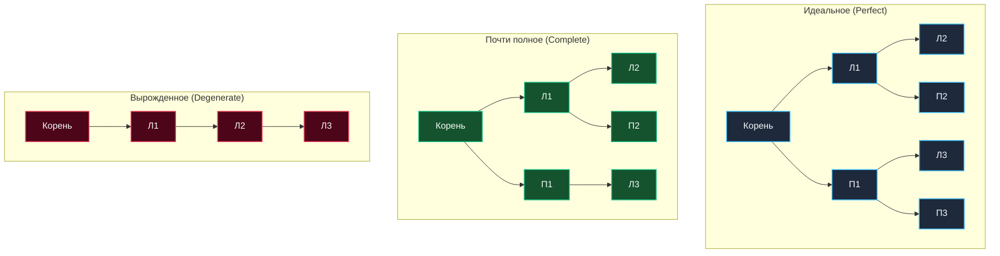
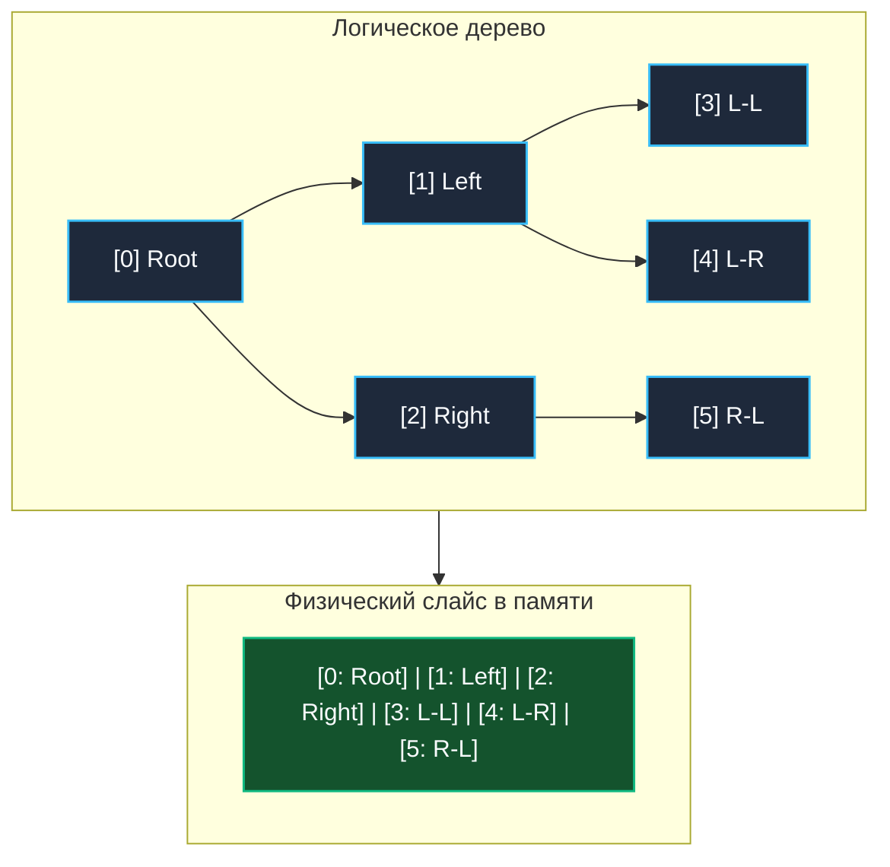

В предыдущей статье [[1. Деревья и обходы]] мы детально разобрали общую природу иерархических графов и базовые алгоритмы навигации по ним (DFS и BFS). Теперь мы сфокусируемся на самой изученной, стройной и востребованной в программировании разновидности — **Бинарном дереве (Binary Tree)**.

Бинарное дерево — это иерархическая структура данных, в которой каждый узел содержит **не более двух дочерних элементов** (традиционно именуемых левым и правым потомками — `Left` и `Right`). Это жесткое математическое ограничение кардинально упрощает алгоритмы обхода, минимизирует служебные накладные расходы и открывает дорогу для элегантных оптимизаций на уровне процессорного кэша и аппаратной адресации.

---

## Виды бинарных деревьев

Для уверенного прохождения технического интервью уровня Senior/Staff и проектирования надежных структур данных (от LSM-деревьев до бинарных куч) инженер обязан свободно владеть строгой классификацией топологий:

1. **Строгое / Полное (Full Binary Tree):**
   Каждый узел имеет ровно 0 либо 2 дочерних элемента. Узлы с единственным потомком в таком дереве отсутствуют в принципе.
2. **Идеальное / Совершенное (Perfect Binary Tree):**
   Все внутренние узлы обладают ровно 2 потомками, а **все листья расположены строго на одном и том же максимальном уровне глубины**. Это эталонное симметричное дерево. Общее число узлов в нем строго равно $2^h - 1$, где $h$ — высота дерева (при отсчете уровней от 1).
3. **Почти полное (Complete Binary Tree):**
   Дерево заполняется строго по уровням сверху вниз, а внутри последнего уровня — строго слева направо без пропусков. Последний уровень может быть заполнен частично, но все узлы на нем максимально плотно «прижаты» к левому краю. Именно эта строгая геометрия позволяет хранить деревья в плоских массивах без указателей.
4. **Вырожденное (Degenerate / Pathological Tree):**
   Каждый внутренний узел имеет ровно одного ребенка. Структурно такое дерево полностью вырождается в классический односвязный список, а поиск в нем превращается в медленное линейное сканирование $O(N)$.



---

## Mechanical Sympathy: Два фундаментальных способа хранения

В языке Go бинарное дерево может быть представлено в памяти двумя принципиально различными способами. Выбор конкретной схемы кардинально влияет на использование CPU-кэша и нагрузку на подсистему памяти.

### Способ 1. Узлы на указателях (Pointer-based)

Классическое представление, применяемое в подавляющем большинстве учебных примеров, алгоритмических задач и динамических структур общего назначения:

```go
type TreeNode[T any] struct {
	Val   T
	Left  *TreeNode[T]
	Right *TreeNode[T]
}
```

* **Преимущества:** Дерево может динамически менять топологию произвольным образом (добавлять и удалять ветви любой длины) без необходимости перемещать существующие узлы в памяти.
* **Аппаратные издержки (Mechanical Sympathy):** Каждый узел выделяется в куче независимым вызовом аллокатора. Навигация по указателям `Left` и `Right` вызывает классический **Pointer Chasing** — хаотичные прыжки по страницам виртуальной памяти, порождающие множественные промахи L1/L2/L3 кэшей (Cache Misses). Кроме того, миллион отдельных узлов создает значительное давление на сборщик мусора Go при фазе трассировки указателей.

### Способ 2. Непрерывный плоский массив (Array-based)

Если мы гарантируем, что дерево является **Почти полным (Complete Binary Tree)** или **Идеальным (Perfect)**, от указателей можно отказаться полностью! Дерево превосходно укладывается в обычный статический массив или Go-слайс.

Связи между родителями и потомками вычисляются с помощью элементарной целочисленной арифметики:
* Корень дерева всегда размещается в ячейке `array[0]`.
* Левый потомок узла с индексом `i` гарантированно находится по формуле: `2i + 1`.
* Правый потомок узла с индексом `i` находится по формуле: `2i + 2`.
* Родитель узла с индексом `i` вычисляется целочисленным делением: `(i - 1) / 2`.



> [!info] Под капотом: Массивные деревья
> Представление дерева в виде плоского массива — вершина инженерной оптимизации:
> 1. **Zero Pointer Overhead:** Отсутствие указателей экономит до 16 байт на узел (на 64-битных системах).
> 2. **Идеальная пространственная локальность (Spatial Locality):** Данные расположены строго последовательно в памяти. Аппаратный Prefetcher CPU заблаговременно подгружает уровни дерева в L1/L2 кэш линиями по 64 байта.
> 3. **Минимальная нагрузка на GC:** Один монолитный слайс вместо миллионов мелких объектов в куче снижает нагрузку на сборщик мусора до нуля.
> Именно на этой технике строятся высокопроизводительные двоичные кучи и очереди с приоритетом, которые мы разберем в статье [[1. Куча как структура данных]].

> [!warning] Ловушка / Gotcha: Массив для вырожденного дерева
> Почему бы не хранить все бинарные деревья исключительно в массивах?  
> Если дерево оказывается вырожденным (например, цепочка из 10 элементов, вытянутая вправо), для хранения узла на глубине 10 по формуле `2i + 2` потребуется массив размером $2^{10} - 1 = 1023$ ячейки. 1013 ячеек останутся абсолютно пустыми (перерасход памяти более чем в 100 раз!).  
> Плоский массив эффективен **только** для плотных и сбалансированных деревьев.

---

## Классические задачи собеседований

Бинарные деревья на указателях — постоянный фаворит технического скрининга в топовые IT-компании. Любой бэкенд-инженер обязан уметь реализовывать эти алгоритмы чисто и без колебаний. Почти все они элегантно решаются через рекурсивный DFS (Depth-First Search).

### 1. Инвертирование бинарного дерева (Invert Binary Tree)
*Каноническая задача (LeetCode 226), ставшая интернет-мемом после истории с автором менеджера пакетов Homebrew Максом Хауэллом.*  
Суть алгоритма: зеркально отразить дерево, поменяв местами левое и правое поддеревья для каждого узла.

```go
package main

type TreeNode struct {
	Val   int
	Left  *TreeNode
	Right *TreeNode
}

// InvertTree зеркально меняет местами левое и правое поддеревья
func InvertTree(root *TreeNode) *TreeNode {
	// Базовый случай рекурсии (Base Case)
	if root == nil {
		return nil
	}

	// 1. Сохраняем ссылки на поддеревья
	left := root.Left
	right := root.Right

	// 2. Рекурсивно инвертируем детей и переназначаем указатели
	root.Left = InvertTree(right)
	root.Right = InvertTree(left)

	return root
}
```
**Вычислительная сложность:** Время $O(N)$ (необходимо посетить ровно каждый узел). Пространственная сложность $O(H)$ в глубину стека вызовов, где $H$ — высота дерева.

---

### 2. Максимальная глубина дерева (Maximum Depth)
Задача (LeetCode 104): найти длину максимального пути от корня до самого удаленного листа.

```go
// MaxDepth вычисляет высоту дерева методом обратного обхода (Post-order DFS).
// Мы запрашиваем глубину у детей, выбираем максимум и прибавляем 1 (текущий уровень).
func MaxDepth(root *TreeNode) int {
	if root == nil {
		return 0
	}

	leftDepth := MaxDepth(root.Left)
	rightDepth := MaxDepth(root.Right)

	if leftDepth > rightDepth {
		return leftDepth + 1
	}
	return rightDepth + 1
}
```

> [!tip] Собеседование: Хвостовая рекурсия в Go
> **Вопрос:** Если глубина вырожденного дерева составит 1 миллион узлов, упадет ли рекурсивная функция `MaxDepth` с ошибкой переполнения стека?
> **Ответ:** В компиляторе Go отсутствует оптимизация хвостовой рекурсии (Tail Call Optimization — TCO), характерная для функциональных языков или компиляторов C/C++ (при оптимизации `-O2`). Однако стек горутины в Go не имеет жесткого низкого лимита (как стандартные 1–2 МБ потоков ОС): он расширяется динамически с помощью `runtime.morestack` вплоть до 1 ГБ памяти. Вызов `MaxDepth` на миллион фреймов потребует порядка 30–40 МБ стековой памяти, и программа выполнится без паники, хотя и с потерями на перевыделение стека. На интервью подчеркните: для критичных к надежности систем в таких сценариях следует предпочесть итеративный обход в ширину (BFS) с явной очередью [[5. Очередь]].

---

### 3. Одинаковые ли деревья (Same Tree)
Задача (LeetCode 100): определить, абсолютно ли совпадают два бинарных дерева по своей геометрической структуре и значениям узлов.

```go
func IsSameTree(p *TreeNode, q *TreeNode) bool {
	// Оба узла достигли nil — ветви совпали
	if p == nil && q == nil {
		return true
	}
	// Только один из узлов nil — геометрия нарушена
	if p == nil || q == nil {
		return false
	}
	// Значения в узлах не равны
	if p.Val != q.Val {
		return false
	}

	// Рекурсивно сопоставляем левые и правые поддеревья
	return IsSameTree(p.Left, q.Left) && IsSameTree(p.Right, q.Right)
}
```

---

## Итог

1. **Бинарное дерево** налагает строгое структурное ограничение: «не более 2 потомков на узел», что делает его идеальным объектом для рекурсивных алгоритмов типа «Разделяй и властвуй».
2. Различие между **Полным**, **Совершенным** и **Вырожденным** деревьями определяет асимптотическую высоту дерева $H$: в идеальном сбалансированном случае $H = \log_2(N)$, в наихудшем вырожденном — $H = N$.
3. Дерево можно хранить на указателях (гибко при мутациях, но неоптимально для кэша CPU) либо в плоском массиве (идеальный Cache Locality, отсутствие нагрузки на GC, но требует компактной геометрии Complete Binary Tree).
4. Рекурсивный подход в Go надежен благодаря динамическому стеку горутин, однако отсутствие компиляторной TCO требует осторожности при работе с потенциально несбалансированными деревьями большой глубины.

Само по себе неупорядоченное бинарное дерево редко используется для хранения поисковых индексов, поскольку поиск произвольного элемента в нем по-прежнему требует полного обхода за линейное время $O(N)$.  
Чтобы превратить бинарное дерево в инструмент молниеносного логарифмического поиска $O(\log N)$, необходимо наложить строгий инвариант порядка на ключи узлов. В следующей статье мы разберем фундамент алгоритмического поиска: [[3. Двоичное дерево поиска]].