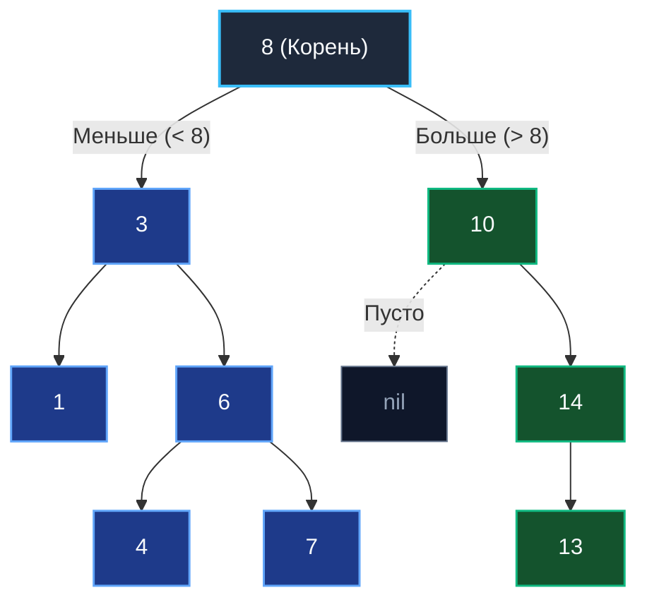
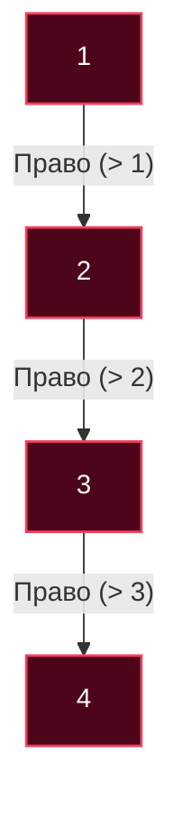

В предыдущей статье [[2. Бинарное дерево]] мы детально исследовали структуру, где каждый узел хранит ссылки максимум на двух потомков. Однако само по себе абстрактное бинарное дерево не дает никаких преимуществ в скорости выборки: чтобы найти произвольное значение, нам всё равно придется обойти все $N$ узлов графа (асимптотическая сложность $O(N)$).

Чтобы превратить ветвящуюся структуру в мощный инструмент поиска, способный на равных соперничать с хеш-таблицами и отсортированными массивами, мы обязаны наложить на узлы строгий **инвариант порядка**. Так возникает фундаментальная структура компьютерных наук — **Двоичное дерево поиска (Binary Search Tree, BST)**.

---

## Инвариант BST

Двоичное дерево поиска — это бинарное дерево, для **каждого** узла которого выполняется непреложный математический инвариант:
1. Значения всех ключей в **левом поддереве** строго *меньше* значения ключа текущего узла.
2. Значения всех ключей в **правом поддереве** строго *больше* значения ключа текущего узла.
3. Дубликаты ключей в классическом BST обычно запрещены (либо агрегируются в отдельный счетчик частоты внутри узла).

Этот инвариант обязан рекурсивно выполняться для абсолютно каждого поддерева на любой глубине, а не только для корневого элемента.



---

## Mechanical Sympathy: BST против Отсортированного Слайса

Главным конкурентом BST в прикладной инженерии выступает компактный отсортированный слайс, в котором элементы разыскиваются с помощью классического алгоритма [[2. Бинарный поиск]]. Сопоставим их с точки зрения взаимодействия с аппаратным кремнием:

| Операция | Отсортированный Слайс | BST (Сбалансированное) |
| :--- | :--- | :--- |
| **Поиск** | $O(\log N)$ — идеальный кэш (Spatial Locality) | $O(\log N)$ — промахи кэша (Pointer Chasing) |
| **Вставка** | $O(N)$ — нужно сдвигать элементы в памяти | $O(\log N)$ — аллокация одного узла в куче |
| **Удаление**| $O(N)$ — нужно сдвигать элементы | $O(\log N)$ — переброска указателей |

**Вердикт системного архитектора:**  
Отсортированный слайс читается центральным процессором в десятки раз быстрее благодаря аппаратному Prefetcher-у: последовательные элементы массива загружаются в быстрые L1/L2 кэш-линии монолитными 64-байтными порциями. Однако если система находится под непрерывным потоком мутаций (частые вставки и удаления записей в произвольные позиции), непрерывный массив парализует CPU тяжелыми системными вызовами перемещения памяти `memmove`. 

BST предлагает фундаментальный архитектурный компромисс: мы соглашаемся на некоторую потерю скорости чтения (из-за разбросанных по куче узлов и промахов кэша) в обмен на дешевые динамические вставки и удаления за логарифмическое время $O(\log N)$.

---

## Реализация на Go (Idiomatic & Production-Ready)

Начиная с Go 1.21, стандартная библиотека предоставляет универсальный пакет `cmp`. С помощью встроенного generic-ограничения `cmp.Ordered` мы можем построить строго типизированное и безопасное дерево поиска без рефлексии и интерфейсных аллокаций:

```go
package main

import (
	"cmp"
)

// Node представляет узел BST.
// Ограничение cmp.Ordered позволяет использовать операторы < и > для типа T.
type Node[T cmp.Ordered] struct {
	Value T
	Left  *Node[T]
	Right *Node[T]
}

// BST — обертка над корнем дерева
type BST[T cmp.Ordered] struct {
	root *Node[T]
}
```

### Поиск (Итеративный подход)

В академической литературе поиск в BST традиционно иллюстрируют через рекурсию. В языке Go при разработке системного и бэкенд-кода предпочтителен **итеративный алгоритм** (на базе обычного цикла `for`). Это исключает лишнее создание фреймов стека горутины и выполняется быстрее, поскольку компилятор Go не производит оптимизацию хвостовой рекурсии (TCO).

```go
// Search возвращает true, если элемент найден
func (tree *BST[T]) Search(val T) bool {
	current := tree.root

	for current != nil {
		if val == current.Value {
			return true // Элемент найден
		} else if val < current.Value {
			current = current.Left // Идем влево
		} else {
			current = current.Right // Идем вправо
		}
	}

	return false // Достигли листа, элемент отсутствует
}
```

### Вставка элемента

Вставка нового ключа реализуется аналогичным итеративным спуском: мы двигаемся вниз по дереву в соответствии с инвариантом, пока не обнаружим свободный `nil`-слот:

```go
func (tree *BST[T]) Insert(val T) {
	newNode := &Node[T]{Value: val}

	if tree.root == nil {
		tree.root = newNode
		return
	}

	current := tree.root
	for {
		if val == current.Value {
			return // Дубликаты игнорируем
		}

		if val < current.Value {
			if current.Left == nil {
				current.Left = newNode
				return
			}
			current = current.Left
		} else {
			if current.Right == nil {
				current.Right = newNode
				return
			}
			current = current.Right
		}
	}
}
```

### Удаление элемента (Главная сложность)

Операция удаления (Deletion) — наиболее деликатная процедура в алгоритмах деревьев. В зависимости от структуры окружения возможны три сценария:

1. **Удаляемый узел является листом (детей нет):**  
   Простейший случай — достаточно обнулить ссылку на него в родительском узле.
2. **У узла ровно один ребенок:**  
   Удаляемый узел вырезается из цепочки: родитель перенаправляет свою ссылку напрямую на единственного ребенка удаляемого узла (подтягивание ветви вверх).
3. **У узла два ребенка:**  
   Ключевая задача на собеседованиях. Удалить узел напрямую нельзя — поддерево распадется на несвязные части. Необходимо найти корректного преемника:
   - **In-order Successor** (наименьший элемент в *правом* поддереве) или
   - **In-order Predecessor** (наибольший элемент в *левом* поддереве).
   
   Мы копируем значение найденного Successor в целевой узел, а затем рекурсивно удаляем сам Successor из правого поддерева (при этом гарантируется, что у Successor не более одного ребенка).

> [!info] Под капотом: Garbage Collection
> При удалении узла в Go программисту не требуется вручную освобождать память вызовом `free()`, как в C. Как только родительский указатель перезаписан (`parent.Left = nil`), удаленный подграф становится недостижимым из корневых объектов (Root Set). Сборщик мусора Go во время фазы Sweep автоматически вернет занятые страницы в аллокатор рантайма. Главное инженерное правило — удостовериться, что ссылка на удаленный узел не осталась случайно зафиксированной во внешних слайсах кэша или глобальных структурах.

---

## Паттерны с собеседований (LeetCode)

### 1. Валидация BST (Validate Binary Search Tree)
**Задача (LeetCode 98):** Проверить, удовлетворяет ли произвольное бинарное дерево строгому инварианту BST.

> [!warning] Ловушка / Gotcha: Наивная проверка
> Самая распространенная ошибка начинающих инженеров — локальная валидация только непосредственных детей: `if node.Left.Val < node.Val && node.Right.Val > node.Val`. Этот код некорректен! Правый потомок в левом поддереве может оказаться больше корня всего дерева, что грубо нарушит глобальный инвариант.

**Каноническое решение:** Выполнить рекурсивный спуск (DFS), пробрасывая строгие границы допустимого диапазона `[min, max]` сверху вниз:

```go
package main

import "math"

// IsValidBST запускает валидацию дерева с бесконечными границами диапазона
func IsValidBST(root *Node[int]) bool {
	return validate(root, math.MinInt64, math.MaxInt64)
}

func validate(node *Node[int], min, max int) bool {
	if node == nil {
		return true // Пустое поддерево по определению валидно
	}

	// Проверка нарушения инварианта BST
	if node.Value <= min || node.Value >= max {
		return false
	}

	// Для левого поддерева текущее значение узла задает строгую верхнюю границу (max)
	// Для правого поддерева текущее значение узла задает строгую нижнюю границу (min)
	return validate(node.Left, min, node.Value) &&
		validate(node.Right, node.Value, max)
}
```

### 2. Сортировка деревом (Tree Sort)
**Вопрос:** Как трансформировать двоичное дерево поиска в отсортированный массив?  
**Ответ:** Выполнить **Симметричный обход (In-order Traversal)**, с которым мы познакомились в статье [[1. Деревья и обходы]]. Порядок обхода `Лево -> Корень -> Право` в силу инварианта BST гарантированно посещает узлы в строгой последовательности возрастания ключей за линейное время $O(N)$.

---

## Ахиллесова пята BST

Мы восхищались логарифмической скоростью поиска $O(\log N)$. Но что произойдет, если ключи поступают на вход программы в уже отсортированном порядке: `Insert(1), Insert(2), Insert(3), Insert(4)`?

Первый элемент `1` станет корнем. Элемент `2` уйдет вправо. Элемент `3` разместится справа от `2`, а `4` — справа от `3`. В результате наше дерево **выродится** в классический односвязный список (Degenerate Tree):



В таком вырожденном дереве глубина $H = N$. Поиск числа `4` потребует $O(N)$ шагов. Вся математическая магия логарифмической сложности исчезает. Именно по этой причине наивные несбалансированные BST **никогда не используются в production-базах данных и критических сервисах**.

Чтобы дерево поиска сохраняло гарантированную логарифмическую производительность при любом порядке входных данных, оно обязано поддерживать динамический баланс высоты. В следующей статье мы подробно изучим анатомию перекоса и механизмы деградации: [[4. Проблемы несбалансированных деревьев]].