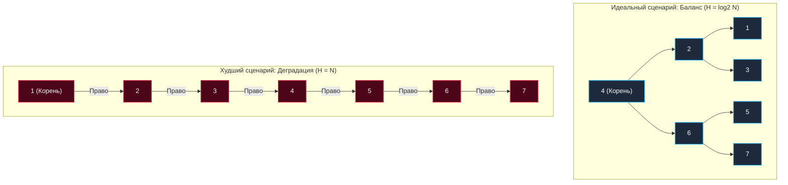

В предыдущей статье [[3. Двоичное дерево поиска]] мы построили структуру данных, которая в теории обещает нам логарифмическую $O(\log N)$ асимптотику для операций поиска, вставки и удаления. Это элегантная математика бинарного поиска, перенесенная на динамическую ссылочную топологию.

Однако у наивного Двоичного дерева поиска (BST) существует один фатальный архитектурный изъян, который делает его абсолютно непригодным для использования в реальных production-системах, высоконагруженных сетевых демонах и хранилищах данных. Этот фундаментальный изъян — **критическая зависимость геометрии дерева от порядка поступления входных данных**.

---

## Анатомия деградации

Инвариант BST формулируется предельно строго: элементы со значением меньше корня направляются в левое поддерево, а элементы больше корня — в правое поддерево.

Представьте типичный бэкенд-сценарий: в сервис поступают метрики телеметрии с датчиков температуры, монотонные временные метки событий или автоинкрементные числовые идентификаторы (Primary Key ID) из реляционной базы данных. Иными словами, ключи поступают на вход системы **в уже строго отсортированном порядке**: 1, 2, 3, 4, 5, 6, 7.

Что произойдет с классическим наивным BST при такой хронологии вставок?
1. Вставляем ключ `1`. Он становится корнем дерева.
2. Вставляем ключ `2`. Значение `2` больше `1` — оно становится правым потомком корня.
3. Вставляем ключ `3`. Значение `3` больше `1`, больше `2` — оно становится правым потомком узла `2`.
4. Каждый последующий элемент будет неизменно прикрепляться к крайнему правому листу предыдущего.



Наше дерево **выродилось (Degenerated)**. Его геометрия перестала быть ветвящейся и превратилась в обыкновенный односвязный список (см. [[3. Связные списки]]).

---

## Mechanical Sympathy: Двойной удар по производительности

Деградация дерева до односвязного списка — это не только академическая проблема сползания асимптотической сложности с логарифмической $O(\log N)$ к линейной $O(N)$. С точки зрения системного программирования и работы физического кремния, вырожденное дерево — это наименее эффективная структура данных из всех существующих в индустрии.

### 1. Pointer Chasing (Погоня за указателями)
Если вы выполняете линейный поиск элемента за $O(N)$ в плоском массиве (слайсе), центральный процессор работает на пределе возможностей: аппаратный Prefetcher распознает линейный паттерн доступа и заблаговременно подтягивает последовательные **кэш-линии (Cache Lines)** из RAM в регистры L1-кэша.  
Если же вы ищете элемент в вырожденном дереве за то же самое $O(N)$, каждый шаг `node = node.Right` превращается в гарантированный промах кэша (**Cache Miss**). Узлы распределены по куче (Heap) в хаотичном порядке: шина памяти забита запросами, а процессорные конвейеры простаивают сотни тактов, ожидая доставки данных.

**Следствие:** При совершенно одинаковой формальной сложности $O(N)$ поиск в вырожденном дереве на реальном железе выполняется в 20–50 раз медленнее, чем в непрерывном слайсе того же размера.

### 2. Угроза Stack Overflow (Истощение стека)
Рекурсивные алгоритмы навигации (DFS), рассмотренные нами в [[1. Деревья и обходы]], напрямую зависят от высоты дерева $H$.
- Для сбалансированного бинарного дерева из 1 миллиона узлов высота составляет всего $H \approx \log_2(10^6) \approx 20$. Двадцать легковесных фреймов в стеке вызовов — совершенно незаметная нагрузка.
- Для вырожденного дерева из 1 миллиона узлов высота составляет $H = 1\,000\,000$.

В средах со статическим стеком фиксированного размера (Java, C++, Rust) миллион рекурсивных вызовов мгновенно вызовет аварийный сбой `StackOverflowError` и крах процесса.  
В рантайме Go горутина начнет лавинообразно расширять стек через системный вызов `runtime.morestack`, непрерывно выделяя и копируя страницы памяти. Хотя программа может не упасть немедленно, расход оперативной памяти резко подскочит на десятки мегабайт (Memory Spike), а процессор будет парализован копированием стеков. В условиях жесткого Highload это неизбежно спровоцирует завершение процесса сигналом операционной системы (OOM Killed).

> [!tip] Собеседование: Algorithmic Complexity Attack
> **Вопрос:** Почему в публичных API и веб-сервисах опасно использовать наивные деревья поиска или хеш-таблицы без защиты от коллизий?
> **Ответ:** Это создает критический вектор для «Атаки на алгоритмическую сложность» (**Algorithmic Complexity DoS / Hash-flooding**). Внешний злоумышленник может целенаправленно отправить в открытый эндпоинт массив из 100 000 предварительно отсортированных ключей. Сервер, спроектированный в предположении, что обработка займет $O(N \log N)$ времени, увязнет в квадратичной сложности $O(N^2)$ при последовательных вставках в вырожденное дерево. Загрузка CPU мгновенно достигнет 100%, и сервис перестанет отвечать на легитимный трафик.
> *Именно по этой причине разработчики Java 8 внедрили в `HashMap` автоматическую трансформацию длинных цепочек коллизий из связных списков в сбалансированные красно-черные деревья при превышении порога в 8 элементов. В Go встроенная `map` применяет аппаратный рандомизированный `seed` (`hash0`), делающий вычисление коллизий для злоумышленника математически невозможным.*

---

## Как измерить глубину проблемы? Фактор баланса

Чтобы структура данных могла бороться с геометрическим искривлением, она должна обладать точной математической метрикой оценки дисбаланса. Для этой цели вводится фундаментальное понятие **Фактор баланса (Balance Factor, BF)**.

Фактор баланса для каждого узла вычисляется по формуле:
$$BF = Height(LeftSubtree) - Height(RightSubtree)$$

где $Height$ представляет собой высоту соответствующего поддерева (максимальную длину пути от корня поддерева до его самого глубокого листа). Для пустого поддерева высота условно принимается равной $0$.

* $BF = 0$: Идеальное геометрическое равновесие (высоты обоих поддеревьев строго совпадают).
* $BF = +1$ или $BF = -1$: Допустимый минимальный дисбаланс, не влияющий на логарифмическую асимптотику.
* $BF > 1$ или $BF < -1$: **Критический дисбаланс**. Ветка критически перекошена, структура начала необратимо деградировать.

```go
package main

type Node struct {
	Value int
	Left  *Node
	Right *Node
}

// GetHeight вычисляет высоту узла (O(N) операция для наивного дерева)
func GetHeight(node *Node) int {
	if node == nil {
		return 0
	}
	leftH := GetHeight(node.Left)
	rightH := GetHeight(node.Right)

	if leftH > rightH {
		return leftH + 1
	}
	return rightH + 1
}

// GetBalanceFactor показывает, насколько "перекошен" узел
func GetBalanceFactor(node *Node) int {
	if node == nil {
		return 0
	}
	return GetHeight(node.Left) - GetHeight(node.Right)
}
```

> [!warning] Ловушка / Gotcha: Вычисление высоты на лету
> В приведенном выше демонстрационном коде высота рассчитывается рекурсивным обходом за линейное время $O(N)$. Если производить подобное вычисление при каждой вставке или удалении ключа, суммарная сложность мутации структуры превратится в катастрофические $O(N^2)$.
> В настоящих production-структурах высота (или ранг/вес/цвет) узла **кэшируется** непосредственно в теле самого узла (`type Node struct { ... height int }`) и пересчитывается строго за константное время $O(1)$ при локальных перестроениях связей.

---

## Итог

1. Наивное двоичное дерево поиска (BST) органически беззащитно перед монотонно отсортированными входными данными. Последовательные ключи вытягивают его ветви в односвязный список.
2. Деградация топологии уничтожает логарифмическую производительность, снижая скорость операций до $O(N)$, умноженного на тяжелые системные накладные расходы от Pointer Chasing и постоянных Cache Misses.
3. Подобная уязвимость открывает прямой вектор для разрушительных DoS-атак на бэкенд, исчерпывающих процессорное время и стековую память горутин.
4. Математическим индикатором кривизны поддеревьев служит **Фактор баланса (Balance Factor)**.

Для преодоления этой уязвимости компьютерные ученые создали класс **самобалансирующихся деревьев**. Это саморегулирующиеся структуры данных, способные «на лету» (непосредственно во время операций вставки и удаления) обнаруживать возникновение дисбаланса ($|BF| > 1$) и локально восстанавливать идеальную форму с помощью быстрых топологических поворотов (Tree Rotations) за строго гарантированное время $O(\log N)$.

О том, какие разновидности самобалансирующихся структур существуют, в чем кроются различия между деревьями АВЛ и красно-черными деревьями, и почему в базах данных безраздельно правят B-деревья — мы подробно поговорим в следующей статье: [[5. Обзор сбалансированных деревьев]].