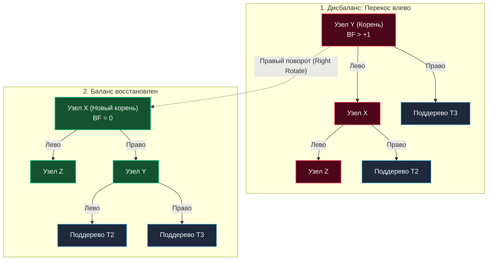

В предыдущей статье [[4. Проблемы несбалансированных деревьев]] мы наглядно увидели, как наивное Двоичное дерево поиска (BST) превращается в тыкву (обыкновенный односвязный список), если передавать ему на вход упорядоченные данные. Деградация алгоритмической сложности до $O(N)$ открывает опасные векторы для DoS-атак и обрушивает производительность центрального процессора из-за лавинообразных промахов кэша (Cache Misses).

Чтобы дерево поиска гарантированно обеспечивало строгую логарифмическую сложность $O(\log N)$ при любых мыслимых сценариях входящего потока данных, оно обязано непрерывно сопротивляться внутренним перекосам. Этот важнейший класс алгоритмических конструкций называется **Самобалансирующимися деревьями (Self-Balancing Trees)**.

В этой статье мы подробно разберем механику балансировки и совершим системный инженерный экскурс по ключевым деревьям в Computer Science: почему в ядре Linux трудится красно-черное дерево, а в СУБД PostgreSQL — принципиально иные B-деревья.

---

## Механика спасения: Повороты дерева (Tree Rotations)

Каким образом дерево способно самостоятельно восстанавливать симметрию формы прямо во время выполнения программы? Универсальным ответом служит элементарная операция, именуемая **Поворотом дерева (Tree Rotation)**.

Поворот — это сугубо локальная операция со сложностью $O(1)$, которая изменяет пространственную геометрию связей между родительскими и дочерними узлами, перенаправляя указатели, но при этом **строго и неизменно сохраняя инвариант бинарного поиска** (все ключи левее узла остаются строго меньше его, а правее — строго больше).



> [!info] Под капотом: Атомарность поворотов
> С точки зрения рантайма Go, правый поворот вокруг узла `y` представляет собой всего три элементарные операции переприсваивания указателей в оперативной памяти:
> ```go
> func rightRotate(y *Node) *Node {
>     x := y.Left
>     T2 := x.Right
>     
>     // Выполняем поворот связей
>     x.Right = y
>     y.Left = T2
>     
>     return x // Возвращаем новый корень поддерева
> }
> ```
> Ноль аллокаций в куче, ноль дополнительных структур, нулевая нагрузка на сборщик мусора Go. Процессор исполняет этот ассемблерный блок за считанные такты. Вся алгоритмическая сложность самобалансирующихся структур сводится к тому, чтобы безошибочно определить, **в какой момент**, **вокруг какого узла** и **какую комбинацию поворотов** (одинарный или двойной) необходимо применить.

---

## Зоопарк сбалансированных деревьев: Что выбрать?

В практической инженерии не существует универсального «идеального дерева на все случаи жизни». Любой алгоритм балансировки — это прагматичный компромисс между скоростью чтения и стоимостью операций модификации (записи). Как архитектор высоконагруженных систем, вы обязаны понимать сильные и слабые стороны каждого представителя:

### 1. AVL дерево (Строгий баланс)
Исторически первая самобалансирующаяся структура данных, изобретенная советскими учеными Г. М. Адельсоном-Вельским и Е. М. Ландисом в 1962 году. AVL-дерево требует жесткого соблюдения правила: разность высот (Фактор баланса) правого и левого поддеревьев любого узла по модулю не должна превышать единицу ($|BF| \le 1$).
* **Чтение (Search):** Предельно быстрое среди всех бинарных деревьев поиска, поскольку дерево поддерживается максимально компактным и плотным.
* **Запись и удаление (Insert/Delete):** Более ресурсоемкие. Из-за строгого критерия равновесия вставка или удаление даже одного ключа способны вызвать цепную реакцию поворотов вверх по дереву вплоть до самого корня.
* **Сфера применения:** In-memory структуры с подавляющим преобладанием поисковых запросов над обновлениями (Read-heavy workload, статические словари).
* **Подробно в:** [[1. AVL дерево]].

### 2. Красно-черное дерево (Гибкий баланс)
Red-Black Tree (RBT) использует оригинальную идею цветовой разметки узлов (Red и Black) для регулирования глубины ветвей. Инвариант сбалансированности здесь более мягок: самый длинный путь от корня до листа может максимум в 2 раза превышать самый короткий путь.
* **Чтение:** Незначительно уступает AVL-дереву (поскольку его высота теоретически может быть чуть больше).
* **Запись и удаление:** Заметно быстрее, чем в AVL. Вставка нового узла требует не более двух поворотов, а операция удаления — не более трех, остальная балансировка выполняется дешевой сменой цветов (Color Flip).
* **Сфера применения:** Индустриальный золотой стандарт для стандартных библиотек: `std::map` в C++, `TreeMap` в Java, а также системный планировщик задач ядра Linux (Completely Fair Scheduler — CFS) опираются именно на красно-черные деревья.
* **Подробно в:** [[2. Красно черное дерево]].

### 3. B-дерево и B+ дерево (Убийцы кэш-промахов)
Классические бинарные деревья (AVL и RBT) безупречны с точки зрения математики, но не дружат с физической архитектурой дисков и шины памяти (Mechanical Sympathy), так как каждый узел хранит лишь один ключ и требует отдельной аллокации памяти с неизбежным промахом кэша.  
B-деревья отказываются от ограничения «не более 2 потомков». Узел B-дерева представляет собой плотный плоский массив, вмещающий сотни ключей и указателей. Размер узла строго калибруется под размер блока файловой системы или дисковой страницы (обычно 4 КБ, 8 КБ или 16 КБ).
* **Сфера применения:** Реляционные базы данных (PostgreSQL, MySQL / InnoDB, SQLite) и промышленные файловые системы (NTFS, ext4, APFS). Любой индекс `CREATE INDEX` в реляционной СУБД строит под капотом именно разновидность B+ Tree.
* **Подробно в:** [[3. B дерево и B+ дерево]].

### 4. LSM-дерево (Повелитель SSD)
Log-Structured Merge-Tree — это принципиально иной архитектурный класс, оптимизированный под экстремальную скорость непрерывной записи на диски SSD/NVMe через модель Append-only. Данные буферизуются в оперативной памяти (MemTable на базе красно-черного дерева или SkipList), а затем последовательными большими сбросами фиксируются на диск в неизменяемые SSTables.
* **Сфера применения:** Высоконагруженные NoSQL и аналитические СУБД с преобладанием интенсивной записи (Apache Cassandra, ClickHouse, RocksDB, LevelDB).
* **Подробно в:** [[4. LSM дерево]].

### 5. Trie (Префиксное дерево)
Специализированная древовидная структура, оптимизированная для индексации строк и строковых ключей. Ребра графа кодируют отдельные символы, а путь от корня к терминальному узлу определяет префикс слова.
* **Сфера применения:** Подсказки поисковой строки (Autocomplete), проверка орфографии, а также молниеносные HTTP-роутеры в Go (например, пакет `httprouter`, на базе которого спроектирован фреймворк `Gin`, использует компактную оптимизированную версию Trie — Radix Tree).
* **Подробно в:** [[5. Trie - префиксное дерево]].

---

## Сбалансированные деревья в экосистеме Go

Внимательный разработчик заметит, что в стандартной библиотеке Go нет готовых структур `RedBlackTree` или `AVLTree`. Почему архитекторы языка приняли такое решение?

Философия создателей Go всегда базировалась на максимальном инженерном прагматизме. Для подавляющего большинства сценариев ассоциативного доступа по ключу (Exact Match) применяется стандартная хеш-таблица `map`. Она глубоко оптимизирована в рантайме языка на уровне ассемблерных вставок и обеспечивает гарантированную амортизированную сложность $O(1)$, тогда как любое сбалансированное дерево дает $O(\log N)$. Глубинное устройство стандартных мап мы детально изучили в статье [[5. Внутреннее устройство map в Go]].

> [!tip] Собеседование
> **Вопрос:** Если в языке Go существует сверхбыстрая хеш-таблица (`map`), зачем вообще бэкенд-инженеру могут понадобиться сбалансированные деревья?
> **Ответ:** Стандартная `map` в Go **абсолютно не упорядочена**. При обходе словаря `for k, v := range m` рантайм Go намеренно рандомизирует порядок выдачи пар ключ-значение. Деревья становятся незаменимыми, когда бизнес-логика сервиса требует:
> 1. **Запросов по диапазону (Range queries):** «Найти все заказы с суммой от 1 000 до 5 000 руб.» или «Выбрать события за последние 15 минут». Дерево выполняет такую выборку за $O(\log N + K)$, где $K$ — размер результата. Хеш-таблица вынудит вас просканировать абсолютно всю коллекцию за $O(N)$.
> 2. **Строгого порядка итерации (Ordered iteration):** Формирование рейтинговых таблиц (Leaderboards), постраничная пагинация по отсортированным ключам без дополнительных ресурсоемких сортировок.

Если вам требуется сбалансированное дерево в реальном Go-проекте, промышленным стандартом считается библиотека `github.com/google/btree` (высокопроизводительное B-дерево in-memory от Google, превосходящее красно-черные деревья по скорости за счет непрерывных массивов внутри узлов) либо универсальный набор структур данных `github.com/emirpasic/gods`.

---

## Итог

Мы завершили вводный концептуальный модуль по анатомии деревьев. Вы познакомились с их топологией, поняли корневые причины деградации наивных структур поиска и изучили фундаментальный механизм самобалансировки через локальные повороты (Rotations).

Теперь мы полностью вооружены, чтобы исследовать внутреннее математическое устройство каждого из индустриальных типов сбалансированных деревьев. Мы начнем следующий модуль с изучения строгой классики: [[1. AVL дерево]].