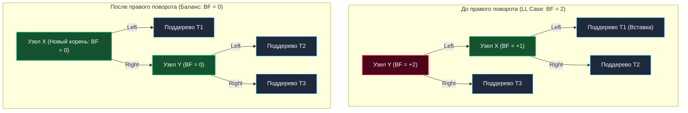

Если мы возьмем обычное Двоичное дерево поиска (BST) и начнем последовательно вставлять в него отсортированные данные (например, монотонные ключи `1, 2, 3, 4, 5`), оно неминуемо выродится в обыкновенный односвязный список. Вся алгоритмическая магия логарифмической сложности испарится, а производительность поиска деградирует до линейного $O(N)$.

Чтобы предотвратить подобное искривление, структуры данных обязаны уметь **самобалансироваться** непосредственно во время выполнения мутирующих операций. Первым в истории компьютерных наук алгоритмом, успешно решившим эту фундаментальную задачу еще в 1962 году, стало **AVL-дерево** (названное в честь советских математиков Георгия Максимовича Адельсона-Вельского и Евгения Михайловича Ландиса).

---

## Концепция: Идеальный баланс

В отличие от хеш-таблиц, которые хаотично распределяют ключи по бакетам, деревья сохраняют естественный **порядок** (Order). Это открывает возможность эффективного выполнения интервальных запросов (Range Queries, например `SELECT * WHERE id BETWEEN 10 AND 50`). Однако за поддержание строгого порядка приходится платить постоянной топологической дисциплиной.

**Главный инвариант (правило) AVL-дерева:**
> Для любого узла дерева высота его левого поддерева и высота его правого поддерева могут отличаться **не более чем на 1**.

Эта разность высот формально называется **Фактором баланса (Balance Factor, BF)**:
$$BF = Height(Left) - Height(Right)$$

В корректном AVL-дереве `BF` для каждого узла может принимать исключительно три допустимых значения: `-1`, `0` или `+1`. Если после очередной операции вставки или удаления фактор баланса становится равным `+2` или `-2`, узел теряет равновесие, и алгоритм обязан немедленно восстановить инвариант с помощью локальных топологических перестроений.

---

## Структура узла в Go: Mechanical Sympathy

Спроектируем структуру узла для AVL-дерева на Go. В академических учебниках в узле часто хранят непосредственно поле `BalanceFactor` или высоту как тип `int`. Но мы инженеры высоконагруженных систем, и обязаны оценивать структуру сквозь призму архитектуры процессора и выравнивания памяти:

```go
package avl

// Node представляет узел AVL-дерева
type Node struct {
	Key    int    // 8 байт (на 64-битной архитектуре)
	Value  string // 16 байт (указатель на данные + длина)
	Left   *Node  // 8 байт
	Right  *Node  // 8 байт
	Height int8   // 1 байт
	// padding: 7 байт (аппаратное выравнивание компилятора до границы 8 байт)
}
```

> [!info] Под капотом
> Почему мы выбрали тип `int8` для поля `Height`?  
> Максимальная высота AVL-дерева математически строго ограничена логарифмической зависимостью: $h < 1.44 \log_2(N+2)$.  
> Даже если вы загрузите в дерево **10 миллиардов элементов**, его предельная высота не превысит скромных **48** уровней! Диапазон значений `int8` (от -128 до +127) с гигантским запасом покрывает деревья с числом узлов, превышающим количество атомов в наблюдаемой Вселенной. Мы экономим 7 байт полезного размера поля, что при плотной упаковке или оптимизации смежных полей дает существенный выигрыш в объеме L1-кэша.

---

## Магия восстановления баланса: Повороты (Rotations)

Когда алгоритм обнаруживает нарушение баланса узла ($BF = +2$ или $BF = -2$), он инициирует процедуру **Поворота (Rotation)**. Это строго локальная операция перепривязки указателей с константной сложностью $O(1)$, которая восстанавливает допустимую разность высот, абсолютно не нарушая порядок бинарного поиска (все ключи слева остаются меньше текущего, справа — больше).

В зависимости от направления искривления выделяют 4 типа дисбаланса и 4 соответствующих поворота:

### 1. Правый поворот (LL Case - Левое-Левое)
Дерево критически перевешивает влево (новый ключ был вставлен в левое поддерево левого потомка). Мы «тянем» структуру вправо: узел `X` поднимается на место родителя, а узел `Y` смещается вправо, становясь его правым ребенком.



### 2. Левый поворот (RR Case - Правое-Правое)
Зеркальная ситуация. Дерево перевешивает вправо ($BF = -2$) из-за вставки в правое поддерево правого потомка. Мы «тянем» структуру влево: правый потомок становится новым корнем поддерева.

### 3. Лево-Правый поворот (LR Case - Левое-Правое)
Дерево перекошено влево ($BF = +2$), однако дисбаланс спровоцирован вставкой в **правое** поддерево левого потомка (форма «зигзага»).  
Одиночный правый поворот здесь бессилен: он лишь перекинет зигзаг на противоположную сторону.  
**Алгоритмическое решение:** Проблема решается в два этапа:
1. Выполняем малый **Левый поворот** вокруг левого ребенка `X`, выпрямляя зигзаг в прямую линию (сводя к классическому случаю LL).
2. Выполняем большой **Правый поворот** вокруг разбалансированного узла `Y`.

### 4. Право-Левый поворот (RL Case)
Зеркальный аналог случая LR. Ветка перевешивает вправо ($BF = -2$), но новый элемент попал в левое поддерево правого потомка. Сначала выполняется малый Правый поворот на ребенке, затем большой Левый поворот на корневом узле.

---

## Идиоматичная реализация на Go

Реализуем алгоритмическое ядро AVL-дерева на Go. Для надежности создадим безопасную функцию-хелпер `height()`, которая защищает от паники при обращении к `nil`-указателям:

```go
package avl

// height безопасно возвращает высоту узла
func height(n *Node) int8 {
	if n == nil {
		return 0
	}
	return n.Height
}

// max возвращает большее из двух int8
func max(a, b int8) int8 {
	if a > b {
		return a
	}
	return b
}

// getBalance вычисляет фактор баланса
func getBalance(n *Node) int8 {
	if n == nil {
		return 0
	}
	return height(n.Left) - height(n.Right)
}

// rightRotate выполняет правый поворот вокруг узла y
func rightRotate(y *Node) *Node {
	x := y.Left
	T2 := x.Right

	// Выполняем поворот связей: меняем указатели
	x.Right = y
	y.Left = T2

	// Обновляем высоты (сначала y, так как он опустился ниже, затем x)
	y.Height = max(height(y.Left), height(y.Right)) + 1
	x.Height = max(height(x.Left), height(x.Right)) + 1

	// Возвращаем новый корень поддерева
	return x
}

// leftRotate выполняет левый поворот вокруг узла x
func leftRotate(x *Node) *Node {
	y := x.Right
	T2 := y.Left

	y.Left = x
	x.Right = T2

	x.Height = max(height(x.Left), height(x.Right)) + 1
	y.Height = max(height(y.Left), height(y.Right)) + 1

	return y
}
```

> [!warning] Ловушка / Gotcha (Рекурсия vs Стек)
> В большинстве реализаций вставка в AVL (`Insert`) оформляется через элегантную рекурсию. Завершив спуск до листа и вставив узел, алгоритм «всплывает» обратно вверх по стеку вызовов (Call Stack), обновляя высоты родителей и выполняя повороты на пути к корню.
> В Go горутины стартуют с ультракомпактным стеком всего в **2 КБ**. Рекурсивный спуск в сбалансированном дереве со сложностью $O(\log N)$ абсолютно безопасен: глубина стека гарантированно не превысит 40–50 фреймов. Однако для критически нагруженных систем вызовы функций создают лишние накладные расходы. В высокопроизводительных специализированных библиотеках операцию `Insert` реализуют **итеративно** (через цикл `for`), вручную удерживая небольшой локальный массив указателей на пройденный путь, чтобы избежать накладных расходов на вызовы функций.

---

## Вставка с балансировкой

Посмотрим на целостную реализацию рекурсивной вставки, использующей наши повороты:

```go
// Insert вставляет новый ключ и возвращает обновленный корень
func Insert(node *Node, key int, value string) *Node {
	// 1. Обычная вставка для BST
	if node == nil {
		return &Node{Key: key, Value: value, Height: 1}
	}

	if key < node.Key {
		node.Left = Insert(node.Left, key, value)
	} else if key > node.Key {
		node.Right = Insert(node.Right, key, value)
	} else {
		// Ключ уже существует, обновляем значение
		node.Value = value
		return node
	}

	// 2. Обновляем высоту текущего узла
	node.Height = max(height(node.Left), height(node.Right)) + 1

	// 3. Получаем фактор баланса
	balance := getBalance(node)

	// 4. Если узел потерял баланс, есть 4 случая:

	// LL Case
	if balance > 1 && key < node.Left.Key {
		return rightRotate(node)
	}

	// RR Case
	if balance < -1 && key > node.Right.Key {
		return leftRotate(node)
	}

	// LR Case
	if balance > 1 && key > node.Left.Key {
		node.Left = leftRotate(node.Left)
		return rightRotate(node)
	}

	// RL Case
	if balance < -1 && key < node.Right.Key {
		node.Right = rightRotate(node.Right)
		return leftRotate(node)
	}

	// Возвращаем неизмененный узел, если баланс в норме
	return node
}
```

---

## AVL-дерево на собеседованиях: Битва деревьев

На техническом интервью уровня Senior/Lead вас редко попросят написать код всех четырех поворотов наизусть. Интервьюера интересует архитектурная глубина вашего понимания trade-off-ов.

> [!tip] Собеседование
> **Вопрос:** Если AVL-дерево обеспечивает строгую логарифмическую скорость поиска ($O(\log N)$), почему в стандартной библиотеке C++ (`std::map`), планировщике задач Linux (CFS) и стандартных структурах данных чаще используется **Красно-черное дерево (Red-Black Tree)**, а не AVL?
> **Ответ:** Ключевой фактор — соотношение затрат на чтение и мутацию (запись/удаление).
> AVL-дерево **строго сбалансировано** ($|BF| \le 1$). Это гарантирует минимально возможную высоту дерева и максимально быстрый поиск среди всех бинарных структур. Однако за эту бескомпромиссную строгость приходится расплачиваться частыми поворотами при модификациях: при удалении узла ребалансировка может каскадно подняться до самого корня, потребовав до $O(\log N)$ поворотов.
> Красно-черное дерево **сбалансировано мягче** (длинная ветка может превышать короткую в 2 раза). В обмен на это RBT дает железную математическую гарантию: при любой вставке потребуется **не более двух поворотов**, а при удалении — **не более трех**, остальная корректировка сводится к быстрой перекраске битов.
> **Итог:** AVL идеально подходит для систем с доминирующим чтением и редкими вставками (Read-Heavy workload). RBT является безусловным универсалом для сценариев с интенсивной записью и удалением (Write-Heavy).

### Почему деревья не используются в БД? (Проблема Cache Locality)

Мы детально изучили работу AVL-дерева в оперативной памяти. Но если вы попытаетесь построить дисковый индекс базы данных на основе классического AVL или RBT, система окажется катастрофически неэффективной.

Каждый узел в Go создается через аллокатор рантайма (`malloc`) и оказывается произвольно размещен в куче (Heap). Навигация по ссылкам — это постоянный **Pointer Chasing (погоня за указателями)**, генерирующий непрерывные промахи процессорного кэша (Cache Miss). Но самое главное: чтение одного легковесного узла размером 32–48 байт с дискового накопителя чудовищно расточительно, так как контроллеры SSD и операционные системы оперируют данными страницами по 4–16 КБ.

Для преодоления этого разрыва концепция деревьев была фундаментально модернизирована: узлы сделали «широкими», чтобы один узел целиком заполнял дисковую страницу или кэш-линию CPU.

Однако прежде чем перейти к архитектуре дисковых хранилищ, мы обязаны досконально изучить классику оперативной памяти. В следующей статье мы разберем главного индустриального соперника AVL: [[2. Красно черное дерево]].