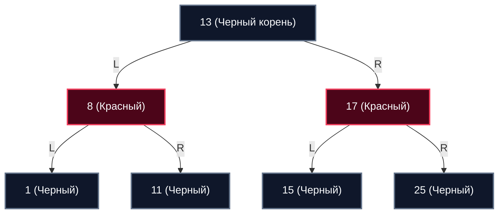

В предыдущей статье [[1. AVL дерево]] мы детально исследовали концепцию строгой математической самобалансировки. AVL-дерево эталонно подходит для поисковых операций: его жесткий инвариант ($|BF| \le 1$) поддерживает суммарную высоту минимально возможной. Однако за эту бескомпромиссную строгость приходится платить высокую вычислительную цену: при интенсивном потоке вставок (`Insert`) и удалений (`Delete`) AVL-дерево вынуждено непрерывно выполнять каскадные цепочки поворотов (Tree Rotations), поднимаясь от листьев к самому корню, что сжигает драгоценные такты процессора.

Инженерам системного программирования требовалась структура данных, обеспечивающая гарантированную логарифмическую сложность $O(\log N)$, но минимизирующая количество дорогих структурных перестановок при частых мутациях коллекции. Таким индустриальным триумфом стало **Красно-черное дерево (Red-Black Tree, RBT)**, математически обоснованное Рудольфом Байером и Робертом Седжвиком.

---

## Концепция: Ослабленный баланс

Вместо того чтобы непрерывно измерять и выравнивать разность физических высот поддеревьев каждого узла, Красно-черное дерево вводит остроумную систему **двухцветной разметки узлов** (Red и Black) и набор строгих структурных ограничений.

Ключевое архитектурное отличие RBT от AVL-дерева:  
**Оно допускает, чтобы одна ветвь была длиннее другой, но не более чем в 2 раза.** Это так называемый «ослабленный (мягкий) баланс». Благодаря этому допущению дерево требует на порядок меньше поворотов при добавлении и удалении элементов.

### 5 святых инвариантов RBT
Чтобы дерево оставалось валидным Красно-черным деревом и гарантировало строгую оценку поиска $O(\log N)$, в нем обязаны непрерывно соблюдаться 5 базовых правил:
1. Каждый узел окрашен строго либо в **Красный**, либо в **Черный** цвет.
2. **Корень** дерева всегда является **Черным**.
3. Все фиктивные пустые листья (`NIL` / `null`) считаются **Черными**.
4. **Красное правило:** Если узел Красный, оба его непосредственных ребенка обязаны быть **Черными** (два красных узла подряд на одном пути категорически запрещены).
5. **Черная высота:** Любой простой путь от заданного узла до любого из его листьев (`NIL`) содержит **строго одинаковое количество Черных узлов**.

Именно синергия правил 4 и 5 создает баланс: самый длинный возможный путь (строгое чередование Черный-Красный-Черный-Красный) ровно в 2 раза длиннее самого короткого пути (состоящего исключительно из Черных узлов).



---

## Mechanical Sympathy: Память и Pointer Tagging

Спроектируем представление узла RBT на языке Go. Нам необходимо хранить полезную нагрузку, ссылки на потомков и родителя, а также флаг цвета:

```go
package rbt

type Color bool

const (
	Black Color = true
	Red   Color = false
)

type Node struct {
	Key    int    // 8 байт
	Value  string // 16 байт
	Left   *Node  // 8 байт
	Right  *Node  // 8 байт
	Parent *Node  // 8 байт (необходим для навигации вверх при балансировке)
	Color  Color  // 1 байт (bool)
	// 7 байт Padding для выравнивания компилятором
}
```

> [!info] Под капотом
> В языках системного программирования без сборщика мусора (C, C++, Rust) для Красно-черных деревьев применяется трюк экстра-класса — **Pointer Tagging (Тегирование указателей)**.
> Указатели в 64-битных системах всегда выравниваются по границе 8 байт. Это означает, что 3 младших бита любого валидного адреса всегда равны `000`. Системные программисты "крадут" один младший свободный бит в указателе `Parent` и записывают цвет узла прямо туда (`0` — красный, `1` — черный). Это экономит 8 байт (байт цвета плюс padding) на каждом узле!
> 
> В языке Go подобный трюк **категорически запрещен**. Сборщик мусора Go (GC) непрерывно сканирует кучу (Heap) в поисках валидных адресов для построения графа достижимости. Если мы искусственно запишем единицу в младший бит указателя, рантайм сочтет указатель поврежденным, потеряет объект и при попытке обращения выбросит фатальную системную панику `panic: invalid memory address`. Поэтому в Go мы честно платим памятью за явное поле `bool` и padding.

---

## Балансировка: Перекраска vs Повороты

Каждый вновь создаваемый узел **всегда вставляется Красным** (чтобы ни в коем случае не нарушить правило 5 о черной высоте). Если родительский узел оказался Черным — инварианты не нарушены, вставка завершена. Но если родитель тоже Красный — возникает запрещенная коллизия «два красных узла подряд» (нарушение правила 4).

Для устранения коллизии RBT использует два фундаментальных механизма:
1. **Перекраска (Recoloring):** Сверхлегковесная операция $O(1)$. Мы просто инвертируем флаги `Color` у узлов. Процессор выполняет эту операцию со скоростью регистров, так как затрагиваемые узлы уже подтянуты в L1-кэш.
2. **Поворот (Rotation):** Локальная перепривязка указателей (аналогично AVL-дереву).

Выбор конкретного действия всецело определяется цветом «**Дяди**» (родного брата родительского узла):
* **Случай 1: Дядя Красный.**  
  Идеальный сценарий: достаточно выполнить **Перекраску (Recoloring)**. Мы перекрашиваем родителя и дядю в Черный цвет, а дедушку — в Красный. Ноль поворотов! Проблема поднимается на два уровня выше (к дедушке) и проверяется рекурсивно.
* **Случай 2: Дядя Черный (или NIL).**  
  Перекраской обойтись невозможно: выполняется 1 или 2 локальных **Поворота (Rotation)** вокруг дедушки/родителя, после чего цвета корректируются.

В худшем сценарии при любой операции вставки в RBT потребуется **не более двух поворотов**. При удалении узла — **не более трех поворотов**. Это математически доказанная граница, делающая Красно-черное дерево абсолютным чемпионом по скорости модификаций.

---

## Идиоматичная реализация на Go: Каркас

Полная реализация RBT со всеми сценариями удаления занимает более 350 строк кода. Сфокусируемся на архитектурном каркасе и важнейшем паттерне обработки граничных условий.

> [!warning] Ловушка / Gotcha
> Обработка терминальных листьев `NIL` в RBT порождает сотни коварных багов. Если использовать стандартный `nil` Go, попытка прочесть цвет несуществующего листа `nil.Color` вызовет мгновенный `nil pointer dereference`.  
> Промышленный архитектурный паттерн: создается один глобальный **Sentinel Node (Узел-страж)**, олицетворяющий абстрактный лист `NIL`. Страж инициализируется Черным цветом (`Color: Black`). Все терминальные ссылки дерева указывают на этого стража вместо `nil`. Это избавляет кодовую базу от десятков громоздких проверок `if node != nil`.

```go
package rbt

var sentinel = &Node{Color: Black} // Глобальный узел-страж (NIL)

type RedBlackTree struct {
	Root *Node
}

func New() *RedBlackTree {
	return &RedBlackTree{Root: sentinel}
}

// leftRotate выполняет левый поворот вокруг x
func (tree *RedBlackTree) leftRotate(x *Node) {
	y := x.Right
	x.Right = y.Left

	if y.Left != sentinel {
		y.Left.Parent = x
	}
	y.Parent = x.Parent

	if x.Parent == sentinel {
		tree.Root = y
	} else if x == x.Parent.Left {
		x.Parent.Left = y
	} else {
		x.Parent.Right = y
	}
	y.Left = x
	x.Parent = y
}

// rightRotate выполняет правый поворот вокруг y (зеркально leftRotate)
func (tree *RedBlackTree) rightRotate(y *Node) {
	x := y.Left
	y.Left = x.Right

	if x.Right != sentinel {
		x.Right.Parent = y
	}
	x.Parent = y.Parent

	if y.Parent == sentinel {
		tree.Root = x
	} else if y == y.Parent.Left {
		y.Parent.Left = x
	} else {
		y.Parent.Right = x
	}
	x.Right = y
	y.Parent = x
}

// Вставка и fixup (восстановление свойств RBT)
func (tree *RedBlackTree) Insert(key int, value string) {
	z := &Node{
		Key:    key,
		Value:  value,
		Color:  Red,
		Left:   sentinel,
		Right:  sentinel,
		Parent: sentinel,
	}

	// Стандартный спуск BST для поиска места вставки
	var y *Node = sentinel
	x := tree.Root

	for x != sentinel {
		y = x
		if z.Key < x.Key {
			x = x.Left
		} else {
			x = x.Right
		}
	}

	z.Parent = y
	if y == sentinel {
		tree.Root = z
	} else if z.Key < y.Key {
		y.Left = z
	} else {
		y.Right = z
	}

	tree.insertFixup(z)
}

func (tree *RedBlackTree) insertFixup(z *Node) {
	// Пока родитель красный — инвариант нарушен (два красных узла подряд)
	for z.Parent.Color == Red {
		if z.Parent == z.Parent.Parent.Left {
			y := z.Parent.Parent.Right // Дядя
			if y.Color == Red {
				// Случай 1: Дядя красный. Только перекраска!
				z.Parent.Color = Black
				y.Color = Black
				z.Parent.Parent.Color = Red
				z = z.Parent.Parent // Поднимаемся к дедушке
			} else {
				// Случай 2: Дядя черный. Нужны повороты
				if z == z.Parent.Right {
					z = z.Parent
					tree.leftRotate(z) // LR случай
				}
				z.Parent.Color = Black
				z.Parent.Parent.Color = Red
				tree.rightRotate(z.Parent.Parent) // LL случай
			}
		} else {
			// Зеркальный случай: родитель является правым потомком дедушки
			y := z.Parent.Parent.Left // Дядя слева
			if y.Color == Red {
				z.Parent.Color = Black
				y.Color = Black
				z.Parent.Parent.Color = Red
				z = z.Parent.Parent
			} else {
				if z == z.Parent.Left {
					z = z.Parent
					tree.rightRotate(z)
				}
				z.Parent.Color = Black
				z.Parent.Parent.Color = Red
				tree.leftRotate(z.Parent.Parent)
			}
		}
	}
	tree.Root.Color = Black // Корень всегда черный
}
```

---

## Где применяется Красно-Черное дерево?

Красно-черное дерево — это универсальная «рабочая лошадка» мировой индустрии системного ПО. Если в технической документации упоминается «сбалансированное дерево поиска» или упорядоченный словарь (Ordered Map), в 99% случаев ядро построено на RBT:

1. **Планировщик ядра Linux (CFS — Completely Fair Scheduler):** Планировщик Linux непрерывно регистрирует и снимает с выполнения сотни потоков ОС, выбирая задачу с минимальным виртуальным временем работы (`vruntime`). RBT подходит идеально: узел с минимальным `vruntime` всегда находится в крайней левой позиции дерева ($O(1)$ доступ через кэшированный указатель), а добавление и удаление завершаются практически мгновенно благодаря минимальному числу поворотов.
2. **C++ `std::map` и `std::set`:** Базовые упорядоченные контейнеры стандартной библиотеки C++ реализованы через RBT.
3. **Java `TreeMap` и защита `HashMap`:** Когда в хэш-таблице Java скапливается критическая масса коллизий (более 8 элементов в одном бакете), цепочка связного списка автоматически трансформируется в Красно-черное дерево, надежно защищая сервис от атак Hash DoS.

> [!tip] Собеседование
> **Вопрос:** Почему в стандартной библиотеке Go нет структуры `std::map` на основе дерева? Почему доступна только хеш-таблица?
> **Ответ:** Философия Go — абсолютный инженерный прагматизм и ориентация на сетевой бэкенд. Встроенная хеш-таблица обеспечивает скорость доступа $O(1)$, что значительно опережает логарифмические переходы $O(\log N)$ с их неизбежными промахами кэша. В 95% задач бэкенда (десериализация JSON, кэширование, маршрутизация) порядок ключей не имеет значения. Если же порядок строго необходим, Go-разработчики комбинируют слайс (для сохранения хронологии) и мапу (для мгновенного поиска), либо подключают специализированную внешнюю библиотеку. Это решение спасает стандартную библиотеку от избыточного усложнения.

---

## Переход к базам данных

И деревья AVL, и Красно-черные деревья безупречно справляются со своими задачами... пока их узлы находятся в пределах оперативной памяти (RAM).

Но как только объемы данных вырастают до сотен гигабайт и терабайт, дерево неизбежно приходится размещать на вторичном хранилище — SSD или жестком диске HDD (как это устроено в СУБД PostgreSQL, MySQL, SQLite). И в этой среде бинарные деревья терпят сокрушительный крах.

Один узел RBT хранит всего один ключ и занимает 32–48 байт памяти. Физический диск оперирует данными строго фиксированными блоками — **Страницами (Pages)** размером **4096 байт** (`4KB`) или 8 КБ. Чтобы найти ключ на глубине 20 в классическом дереве, RBT заставит контроллер диска совершить 20 независимых случайных операций чтения. Это означает чтение $20 \times 4\text{KB} = 80\text{KB}$ физических данных ради одного крошечного 8-байтового числа! Дисковый I/O мгновенно парализует любую базу данных.

Чтобы адаптировать древовидные структуры под физику дисковых накопителей, инженеры пошли на смелый шаг: они сделали узлы «широкими и плоскими», разместив в одном узле сразу сотни и тысячи ключей, тем самым сократив высоту дерева до 3–4 уровней. Так родились структуры данных, на которых держится вся мировая индустрия баз данных. В следующей статье мы разберем их во всех деталях: [[3. B дерево и B+ дерево]].