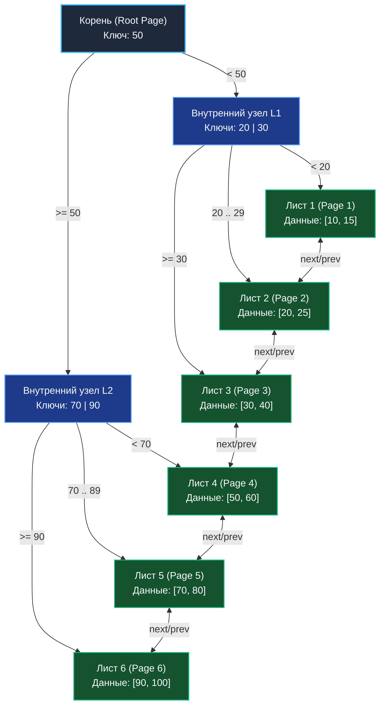

В предыдущей статье [[2. Красно черное дерево]] мы подробно изучили in-memory деревья поиска. Они демонстрируют выдающуюся эффективность до тех пор, пока весь рабочий объем данных свободно помещается в оперативную память (RAM). Однако когда массив информации разрастается до сотен гигабайт и терабайт, мы неизбежно сталкиваемся с необходимостью хранить его на вторичных энергонезависимых накопителях (NVMe SSD, HDD).

И именно в этой физической среде классические бинарные деревья (как AVL, так и RBT) терпят сокрушительное архитектурное фиаско. Чтобы понять, почему все ведущие промышленные реляционные СУБД (PostgreSQL, MySQL / InnoDB, Oracle, SQLite) отказались от бинарных деревьев в пользу B-семейства, мы обязаны проанализировать физику подсистемы дискового ввода-вывода (I/O).

---

## Mechanical Sympathy: Проблема дискового IO

Оперативная память (RAM) позволяет адресовать данные по случайным байтовым адресам с ультранизкой задержкой порядка 50–100 наносекунд.  
Физический диск устроен принципиально иначе. Во-первых, он на порядки медленнее (микросекунды для быстрого SSD, миллисекунды для вращающегося HDD). Во-вторых, операционная система и аппаратный дисковый контроллер никогда не считывают и не записывают единичные байты. Весь обмен данными на шине хранения происходит исключительно фиксированными блоками — **Страницами (Pages)** или **Секторами**. Стандартный размер страницы в ядре Linux и большинстве СУБД составляет **4 КБ (4096 байт)** или **8 КБ**.

> [!warning] Ловушка / Gotcha
> Представьте, что мы попытались разместить классическое Красно-черное дерево на диске. Один узел RBT весит около 32 байт.
> Чтобы найти ключ на глубине 20 (в коллекции из одного миллиона записей), движку базы данных потребуется совершить 20 последовательных переходов по указателям. Каждый такой указатель ссылается на произвольный сектор на накопителе.
> В результате СУБД будет вынуждена выполнить 20 независимых операций дискового чтения: каждый раз считывая со скоростного диска **4096 байт** физической страницы, чтобы извлечь крошечные **32 байта** полезных данных, а оставшиеся 4064 байта просто отбросить в мусор! Это катастрофически исчерпает пропускную способность шины NVMe и убьет производительность базы данных.

Для преодоления дискового бутылочного горлышка потребовалась структура данных принципиально иной геометрии: не высокая и тонкая, а **«широкая и плоская»**, где размер каждого узла идеально откалиброван под размер аппаратной страницы диска (4 КБ). Так на свет появилось **B-дерево (B-Tree)**, предложенное Рудольфом Байером и Эдвардом Маккрейтом в 1970 году.

---

## B-дерево: Широкое и плоское

В названии структуры литера "B" вовсе не означает "Binary" (бинарное). Авторская семантика термина трактуется как "Balanced" (сбалансированное), "Broad" (широкое) или "Boeing" (в честь исследовательской лаборатории Boeing Scientific Research Labs).

В отличие от бинарного дерева, где узел удерживает не более двух потомков, узел B-дерева может ветвиться на $M$ дочерних узлов (где $M$ — это порядок / Degree дерева).  
Один узел B-дерева представляет собой непрерывный отсортированный массив ключей. Если размер страницы диска составляет 4096 байт, а один целочисленный ключ с указателем занимает 16 байт, мы можем упаковать в **один узел около 255 ключей и 256 указателей на детей**.

* **Экстремально низкая высота дерева:** Если каждый узел ветвится на 250 детей, то на глубине всего 3 уровней дерево способно адресовать $250^3 \approx 15.6$ миллионов записей!
* **Минимум дисковых операций IO:** Поиск ключа среди 15 миллионов записей потребует всего **3 чтений с диска** (вместо 24 чтений в бинарном дереве поиска). Более того, корневой узел и верхние уровни постоянно удерживаются в кэше оперативной памяти СУБД (Buffer Pool), поэтому реальное физическое обращение к диску при поиске сводится к **всего одному IO-запросу**!

---

## B+ дерево: Стандарт реляционных баз данных

Классическое B-дерево хранит полезную нагрузку (значения строк или указатели на кортежи) прямо во внутренних узлах вперемешку с ключами. Это порождает системный недостаток: «тяжелые» значения строк быстро съедают объем 4-килобайтной страницы, из-за чего в один узел помещается значительно меньше ключей-роутеров. Степень ветвления падает, высота дерева растет, а число дисковых чтений увеличивается.

Чтобы решить эту проблему, инженеры разработали модификацию — **B+ дерево (B+ Tree)**. Сегодня это безоговорочный золотой стандарт де-факто для индексов в движке InnoDB (MySQL), СУБД PostgreSQL и файловых системах.

### Отличия B+ дерева:
1. **Строгое разделение ролей:** Внутренние узлы (Internal Nodes) хранят **исключительно ключи** (индексные роутеры-указатели). Они работают как дорожные указатели на развилках. Вся фактическая полезная нагрузка (строки базы данных или ссылки на них) хранится **строго в Листьях (Leaf Nodes)** на самом нижнем уровне иерархии.
2. **Связанные листья (Linked Leaves):** Все листовые узлы нижнего уровня физически соединены между собой ссылками в непрерывный двусвязный список.



### Зачем связывать листья? (Range Queries)

Связный список листьев — главная архитектурная победа B+ дерева. В прикладном бэкенде мы непрерывно выполняем интервальные запросы (Range Queries):  
`SELECT * FROM orders WHERE created_at BETWEEN '2023-01-01' AND '2023-01-31'`.

В классическом дереве для выборки диапазона движку пришлось бы непрерывно подниматься к родителям и спускаться по соседним веткам (Tree Traversal), совершая десятки хаотичных операций чтения.  
В B+ дереве выполнение запроса протекает идеально:
1. За время $O(\log_M N)$ движок спускается от корня строго к тому листу, где расположен первый ключ `'2023-01-01'` (всего 2–3 чтения страниц).
2. Начиная с этого листа, СУБД больше не трогает дерево: она просто шагает вправо по указателю `next` двусвязного списка, считывая строки подряд, пока не встретит дату `'2023-01-31'`.

Страницы листьев на диске СУБД старается размещать физически последовательно (Extent allocation). Поэтому обход листьев превращается в **Sequential IO (Последовательное чтение)**, которое аппаратно выполняется контроллерами SSD и HDD в десятки раз быстрее случайного доступа.

---

## Проектирование узла B+ дерева в Go

При реализации собственного дискового движка или in-memory кэша на Go необходимо структурировать узел так, чтобы исключить фрагментацию кучи и гарантировать Mechanical Sympathy:

> [!info] Под капотом
> Использование динамических слайсов (`[]Key`) внутри узла порождает фрагментацию памяти, так как заголовок слайса лежит в теле узла, а его буфер — в отдельном блоке кучи (лишний Pointer Chasing). В высокопроизводительных хранилищах на Go (таких как CockroachDB или движок `etcd/bbolt`) узел моделируют монолитным статическим массивом фиксированной длины `[N]Key`, чтобы весь узел целиком гарантированно ложился в кэш-линию процессора либо в дисковую страницу.

```go
package btree

import "sort"

// Degree определяет порядок дерева (максимальное число детей).
// В реальной БД подбирается так, чтобы sizeof(Node) == PageSize (напр. 4096 байт)
const Degree = 256

type Key int
type Value []byte // Данные строки для листовых узлов

// Node представляет узел B+ дерева.
type Node struct {
	IsLeaf   bool
	NumKeys  int         // Текущее количество ключей в узле
	Keys     [Degree]Key // Монолитный массив отсортированных ключей

	// В Go мы используем указатели на узлы в памяти.
	// В реальном дисковом движке здесь хранятся uint64 — байтовые смещения (offsets) страниц в файле БД.
	Children [Degree + 1]*Node

	// Полезная нагрузка (хранится только если IsLeaf == true)
	Values [Degree]Value
	Next   *Node // Указатель на следующий лист для интервального сканирования
}

// Search выполняет поиск значения по ключу внутри узла.
// Использует бинарный поиск, так как массив ключей строго отсортирован.
func (n *Node) Search(target Key) (Value, bool) {
	// Ищем индекс первого ключа, который >= target
	idx := sort.Search(n.NumKeys, func(i int) bool {
		return n.Keys[i] >= target
	})

	if n.IsLeaf {
		// Если мы находимся в листе и ключ совпал — возвращаем значение
		if idx < n.NumKeys && n.Keys[idx] == target {
			return n.Values[idx], true
		}
		return nil, false
	}

	// Если мы во внутреннем узле, используем idx для спуска к нужному ребенку
	if idx < n.NumKeys && n.Keys[idx] == target {
		idx++
	}

	// Рекурсивный спуск (на диске это означало бы чтение страницы по адресу Children[idx])
	return n.Children[idx].Search(target)
}
```

Когда 4-килобайтная страница загружена в память, функция `sort.Search` выполняет бинарный поиск по массиву `Keys` всего за несколько наносекунд: плотный массив уже целиком находится в L1/L2 кэше CPU.

---

## Сплит и балансировка (Split and Merge)

Вставка новых записей в B+ дерево всегда производится строго в листовой узел. Что происходит, когда лист переполняется (число ключей достигает предела `Degree`)?

Вместо вращений и перекрасок B+ дерево применяет элегантную операцию **Расщепления (Split)**:
1. Переполненный узел делится ровно пополам: аллоцируется новая страница (новый узел).
2. Правая половина ключей перемещается в новый узел.
3. Разделительный «средний» ключ (медиана) выталкивается на один уровень вверх — в родительский узел, где регистрируется как новый индексный ориентир (роутер).
4. Если родительский узел также оказывается переполнен, операция сплита каскадно поднимается выше. Если расщепляется корень — над ним создается новый корень с двумя детьми, и вся глубина дерева увеличивается строго на +1 для абсолютно всех листьев одновременно!

> [!tip] Собеседование
> **Вопрос:** Почему добавление вторичных индексов на таблицу в PostgreSQL или MySQL замедляет выполнение операций вставки (`INSERT`)?
> **Ответ:** Без индексов новая строка просто дописывается в конец файла таблицы (Append-only операция). При наличии индекса на базе B+ дерева СУБД обязана синхронно обновить структуру дерева: найти целевой лист, вставить ключ в отсортированный массив, а в случае переполнения страницы выполнить тяжелый сплит узла (**Page Split**), обновить указатели родителя и зафиксировать модифицированные «грязные» страницы (**Dirty Pages**) в журнале WAL и на диске. Чем больше индексов навешено на таблицу, тем больше B+ деревьев приходится синхронно модифицировать на каждый `INSERT`.

---

## Итог и ограничения B+ деревьев

B+ дерево — величайший триумф инженерной мысли в эпоху блочных устройств хранения (HDD и классических SSD). Оно минимизирует дисковый I/O, обеспечивает плоскую логарифмическую глубину с огромным основанием и безупречно ускоряет интервальные Range-запросы.

Однако развитие технологий и лавинообразный рост потоков данных (Big Data, IoT, распределенное логирование, кликстрим) вскрыли фундаментальное физическое ограничение B+ деревьев.

При интенсивной вставке данных с неупорядоченными ключами (например, случайными строками или UUID) B+ дерево производит непрерывные **случайные дисковые записи (Random Writes)**: алгоритм вынужден обновлять случайные страницы в разных секторах файла базы данных. Для твердотельных накопителей SSD/NVMe случайные мелкие перезаписи губительны: возникает эффект **усиления записи (Write Amplification)**, контроллер диска перегружается фоновой сборкой мусора (Garbage Collection), а пропускная способность резко падает.

Для систем, где нагрузка на **запись** превосходит чтение в соотношении 10:1 или 100:1 (Time-Series базы, сбор логов, Cassandra, ClickHouse, RocksDB), архитектура B+ деревьев оказывается узким местом. На смену им пришла совершенно иная парадигма, трансформирующая хаотичные случайные записи в строго непрерывный последовательный поток (Sequential IO). Эту инженерную революцию мы изучим в следующей статье: [[4. LSM дерево]].