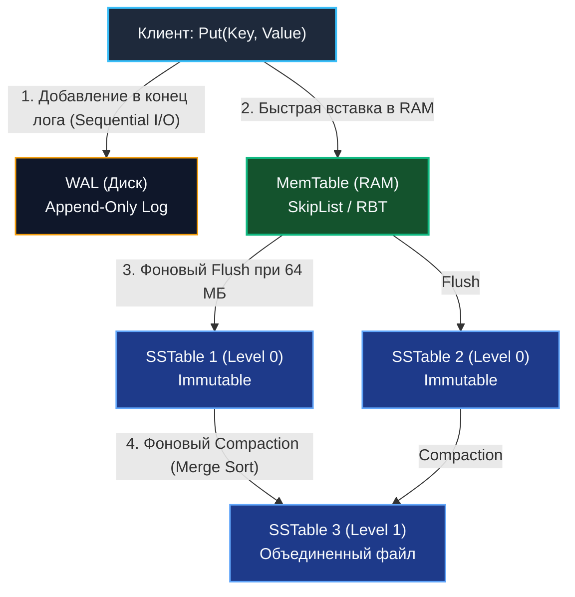

В предыдущей статье [[3. B дерево и B+ дерево]] мы выяснили, что в мире классических реляционных СУБД безраздельно властвуют B+ деревья. Они идеальны для нагрузок, где преобладает чтение (Read-Heavy workload). Однако мы также обнажили их фатальный физический недостаток: при интенсивной вставке B+ дерево непрерывно обновляет произвольные страницы в теле файлов, порождая поток **случайных записей (Random Writes)**.

В современную эпоху Big Data, телеметрии IoT-сенсоров, высоконагруженного сбора логов и финансовых транзакций индустрии потребовались хранилища, способные бесперебойно проглатывать миллионы событий в секунду (Write-Heavy workload). Классические дисковые деревья на это не способны чисто физически.

Чтобы преодолеть дисковый барьер, инженеры перевернули традиционный подход к дисковому вводу-выводу с ног на голову и создали архитектуру **LSM-дерева (Log-Structured Merge-tree)**. Сегодня эта модель лежит в основе Apache Cassandra, ClickHouse, RocksDB, LevelDB, InfluxDB и ScyllaDB.

---

## Mechanical Sympathy: Почему диски ненавидят Random Write?

Чтобы оценить изящество архитектуры LSM, необходимо спуститься на микроскопический уровень физики полупроводниковых твердотельных накопителей (NAND Flash SSD).

В отличие от оперативной памяти, вы физически не можете перезаписать произвольный байт на SSD «поверх» старого. Вся внутренняя флэш-память жестко разделена на **Страницы (Pages)** размером 4–16 КБ, которые логически объединены в крупные **Блоки стирания (Blocks)** размером по 2–8 МБ.  
При этом чтение и запись аппаратно производятся страницами, но **стирать старые данные ячейки могут только целиком блоками** (Flash Memory Block Erase).

Если СУБД на базе B+ дерева хочет изменить всего 100 байт внутри существующей 4-килобайтной страницы, контроллер накопителя вынужден выполнить тяжелый комплекс операций:
1. Вычитать весь 2-мегабайтный блок в свой внутренний DRAM-буфер.
2. Модифицировать 100 байт в буфере.
3. Подать высокое напряжение и физически стереть весь блок на кристалле кремния.
4. Записать обновленный блок (2 МБ) обратно во флэш-ячейки.

Этот феномен в системной инженерии называется **Write Amplification (Усиление записи)**. Программа наивно полагает, что сбросила на диск 100 байт, а контроллер SSD фактически перезаписал 2 Мегабайта! Это исчерпывает аппаратную пропускную способность шины (Bandwidth) и приводит к катастрофически быстрому физическому износу ячеек памяти накопителя.

### Решение: Append-Only (Только добавление)

Единственный математически и физически обоснованный способ писать данные на накопитель с предельной скоростью шины (гигабайты в секунду) — это **Sequential Write (Последовательная запись)**.  
Мы обязаны записывать новые события строго друг за другом в конец файла (модель **Append-Only**), категорически никогда не возвращаясь назад для модификации уже сохраненных байтов.

Именно этот фундаментальный принцип реализует LSM-дерево: **оно превращает хаотичный поток случайных записей в строго непрерывный монолитный последовательный поток**.

---

## Анатомия LSM-дерева

LSM-дерево — это не одиночная монолитная древовидная структура (как B-дерево), а многоуровневый конвейер хранения, состоящий из нескольких согласованных компонентов, распределенных между оперативной памятью (RAM) и дисковым пространством.

### 1. WAL (Write-Ahead Log) - Диск
Первая точка входа для любой входящей мутации (операция `Put` или `Insert`). Это журнал упреждающей записи на диске, куда новые команды дописываются исключительно в конец (Append-only). Журнал WAL выполняет сугубо защитную функцию обеспечения персистентности и долговечности (Durability по ACID): если в дата-центре внезапно пропадет питание, при перезапуске движок полностью восстановит состояние оперативной памяти из журнала WAL.

### 2. MemTable (Таблица в памяти) - RAM
Параллельно с записью в WAL данные попадают в структуру **MemTable** в оперативной памяти. Это in-memory самобалансирующееся дерево, поддерживающее ключи в строго отсортированном порядке. Традиционно в теории для этого применяют Красно-черное дерево (см. [[2. Красно черное дерево]]), однако в промышленном коде на Go стандартом стал **Skip List** (о котором мы подробно поговорим в [[5. Skip list]]).  
Поскольку MemTable целиком живет в RAM, случайные вставки ключей в него обходятся процессору практически бесплатно.

### 3. SSTable (Sorted String Table) - Диск
Когда размер MemTable достигает заданного порога емкости (например, 64 МБ), таблица «замораживается» (становится неизменяемой — **Immutable**), а для новых записей создается свежий активный MemTable.  
Замороженный буфер в фоновом режиме сбрасывается (**Flush**) на диск в виде нового структурированного файла — **SSTable**.  
Поскольку данные в MemTable уже были отсортированы по ключу, сброс на диск происходит **строго последовательно (Sequential IO)** на предельной скорости накопителя, без какого-либо Write Amplification!  
Фундаментальный закон LSM-архитектуры: **файлы SSTable являются абсолютно иммутабельными (Immutable) и никогда не перезаписываются**.



---

## Архитектурные компромиссы (Read Path и Tombstones)

Если вставка в LSM-дерево протекает с фантастической скоростью, то за эту асимметрию приходится расплачиваться при чтении (Read) и удалении (Delete).

### Как работает удаление? (Tombstones)
Поскольку созданные SSTable-файлы иммутабельны, мы не можем стереть запись `user_123` на диске.  
Вместо этого операция удаления записывает специальный маркер — **Надгробие (Tombstone)**: `user_123 = <TOMBSTONE>`.  
При последующем чтении, если поисковый алгоритм наталкивается на Tombstone в самом свежем уровне, он констатирует, что ключ удален, полностью игнорируя старые версии этого ключа в глубинных файлах на диске.

### Как работает чтение? (Read Amplification)
Чтобы разыскать значение по ключу `user_123`, алгоритм чтения вынужден проверять уровни строго от самых свежих к архивным:
1. Поиск в активном **MemTable** в оперативной памяти (самое свежее состояние).
2. Поиск в очереди замороженных (Frozen) MemTable, ожидающих записи на диск.
3. Поиск в файлах **SSTable Уровня 0** (Level 0).
4. Последовательный спуск по нижележащим уровням SSTable (Level 1, Level 2...), пока ключ не будет найден (или не будут исчерпаны все файлы).

Подобная цепочка проверок порождает эффект **Read Amplification (Усиление чтения)**: ради поиска одного ключа базе потенциально приходится обращаться к десяткам файлов на диске!

> [!tip] Собеседование
> **Вопрос:** Как высокопроизводительные LSM-хранилища (Cassandra, RocksDB, ScyllaDB) нейтрализуют катастрофическую деградацию чтения из-за проверки множества разрозненных SSTables?
> **Ответ:** С помощью вероятностных **Фильтров Блума (Bloom Filters)**, детально разобранных нами в статье [[6. Bloom filter - вероятностная структура данных]].
> Для каждого файла SSTable база генерирует компактный Bloom-фильтр, который постоянно удерживается в оперативной памяти. Перед тем как выполнить дорогое физическое обращение к файлу на диске, движок за несколько наносекунд опрашивает фильтр в RAM: «Присутствует ли ключ X в данном SSTable?». В 99% случаев фильтр категорически отвечает «Точно нет!», и база мгновенно пропускает файл, экономя колоссальное количество дисковых IO-операций.

---

## Слияние и сборка мусора (Compaction)

Со временем на диске накапливаются тысячи мелких файлов SSTable. В них скапливается колоссальное количество устаревших версий (если один и тот же ключ обновлялся 10 раз, на диске хранится 10 версий значения) и мертвых данных (Tombstones). Дисковое пространство нерационально расходуется, а чтение замедляется.

Для наведения порядка в фоновом режиме непрерывно работает процесс **Compaction (Уплотнение)**:  
Движок берет несколько перекрывающихся по диапазонам ключей файлов SSTable с одного уровня (Level 0), объединяет их потоковым слиянием в памяти (аналог стадии Merge алгоритма Merge Sort), отбрасывает перезаписанные дубликаты и «схлопывает» надгробия Tombstones, после чего записывает один монолитный отсортированный файл SSTable на следующий уровень (Level 1).

> [!warning] Ловушка / Gotcha
> Фоновый процесс Compaction — ахиллесова пята LSM-хранилищ. Слияние гигабайтов данных на диске создает мощную нагрузку на процессор и шину дискового ввода-вывода.  
> Если входящий поток записей превышает пропускную способность фонового уплотнения, возникает эффект застревания записей — **Write Stalls**: база данных принудительно задерживает входящие запросы клиентов на запись, искусственно сдерживая нагрузку до тех пор, пока Compaction не освободит ресурсы подсистемы I/O.

---

## Проектирование LSM в контексте Go

В экосистеме Go существует ряд высококлассных production-движков на базе LSM: `goleveldb` и `pebble` (разработанный инженерами Cockroach Labs для распределенной реляционной базы CockroachDB).

В Go-реализациях особое внимание уделяется выбору структуры данных для MemTable. Хотя в академических статьях традиционно упоминаются Красно-черные деревья, в Go-практике для MemTable практически всегда используют **Skip List (Список с пропусками)**.

Причина кроется в конкурентности: при одновременной записи сотен параллельных горутин балансировка Красно-черного дерева (повороты) требует синхронного изменения указателей сразу у нескольких связанных узлов. Реализовать это без захвата тяжелого блокирующего мьютекса (`sync.RWMutex`) невозможно.  
Skip List же, напротив, позволяет построить **Lock-Free вставку** на базе низкоуровневых атомарных операций (`sync/atomic`), что обеспечивает линейную масштабируемость по ядрам CPU при тысячах пишущих горутин.

Вот как выглядит концептуальная архитектура LSM-движка на Go:

```go
package lsm

import (
	"os"
	"sync"
)

const MaxMemTableSize = 64 * 1024 * 1024 // 64 МБ

// LSMEngine представляет архитектурный каркас хранилища
type LSMEngine struct {
	mu         sync.RWMutex
	activeMem  *MemTable   // Активная таблица в памяти (SkipList)
	frozenMems []*MemTable // Замороженные таблицы, ожидающие фонового сброса
	walFile    *os.File    // Журнал упреждающей записи (Write-Ahead Log)
	sstManager *SSTManager // Менеджер дисковых файлов (Compaction, Bloom Filters)
}

// Put выполняет молниеносную последовательную запись
func (e *LSMEngine) Put(key []byte, value []byte) error {
	// 1. Атомарно дописываем запись в лог для надежности (Sequential Write)
	if _, err := e.walFile.Write(formatLogEntry(key, value)); err != nil {
		return err
	}

	e.mu.Lock()
	defer e.mu.Unlock()

	// 2. Вставляем ключ в память MemTable
	e.activeMem.Insert(key, value)

	// 3. Если MemTable заполнился — замораживаем и запускаем фоновый Flush
	if e.activeMem.Size() >= MaxMemTableSize {
		e.frozenMems = append(e.frozenMems, e.activeMem)
		e.activeMem = NewMemTable()
		// Асинхронный сброс на диск
		go e.flushFrozen()
	}

	return nil
}

// Get производит чтение ключа по каскаду уровней от RAM к диску
func (e *LSMEngine) Get(key []byte) ([]byte, bool) {
	e.mu.RLock()
	// Проверяем активный MemTable
	if val, ok, isTombstone := e.activeMem.Search(key); ok {
		e.mu.RUnlock()
		return val, !isTombstone
	}

	// Проверяем замороженные таблицы в порядке от новых к старым
	for i := len(e.frozenMems) - 1; i >= 0; i-- {
		if val, ok, isTombstone := e.frozenMems[i].Search(key); ok {
			e.mu.RUnlock()
			return val, !isTombstone
		}
	}
	e.mu.RUnlock()

	// 4. Ищем на диске (SSTManager опрашивает Bloom Filters для каждого SSTable)
	return e.sstManager.SearchOnDisk(key)
}
```

---

## Резюме: B+ Tree против LSM Tree

Это классический фундаментальный вопрос на собеседованиях по архитектуре распределенных систем (System Design):

| Характеристика | B+ Tree (PostgreSQL, MySQL) | LSM Tree (Cassandra, ClickHouse) |
| :--- | :--- | :--- |
| **Главное достоинство** | Предсказуемое и быстрое чтение. | Феноменальная пропускная способность записи. |
| **Паттерн записи на диск** | Случайный (Random Write in-place). | Строго последовательный (Sequential IO). |
| **Проблема дисковой шины** | Write Amplification (износ ячеек SSD). | Read Amplification (обращение к нескольким файлам). |
| **Мутация данных** | In-place (перезапись 4 КБ страницы). | Append-only (добавление новой версии). |
| **Фоновые накладные расходы**| Дефрагментация, Page Splits, Vacuum. | Фоновое уплотнение (Compaction). |

Мы завершили детальный анализ тяжеловесных древовидных архитектур, управляющих хранением данных на диске. Но деревья способны организовывать не только скалярные числовые ключи, но и строковые префиксы.  
Для задач автодополнения поисковых запросов, лексикографической фильтрации и молниеносной маршрутизации URL в сетевых сервисах на Go используется принципиально иная геометрия. В следующей статье мы разберем фундамент строкового поиска: [[5. Trie - префиксное дерево]].