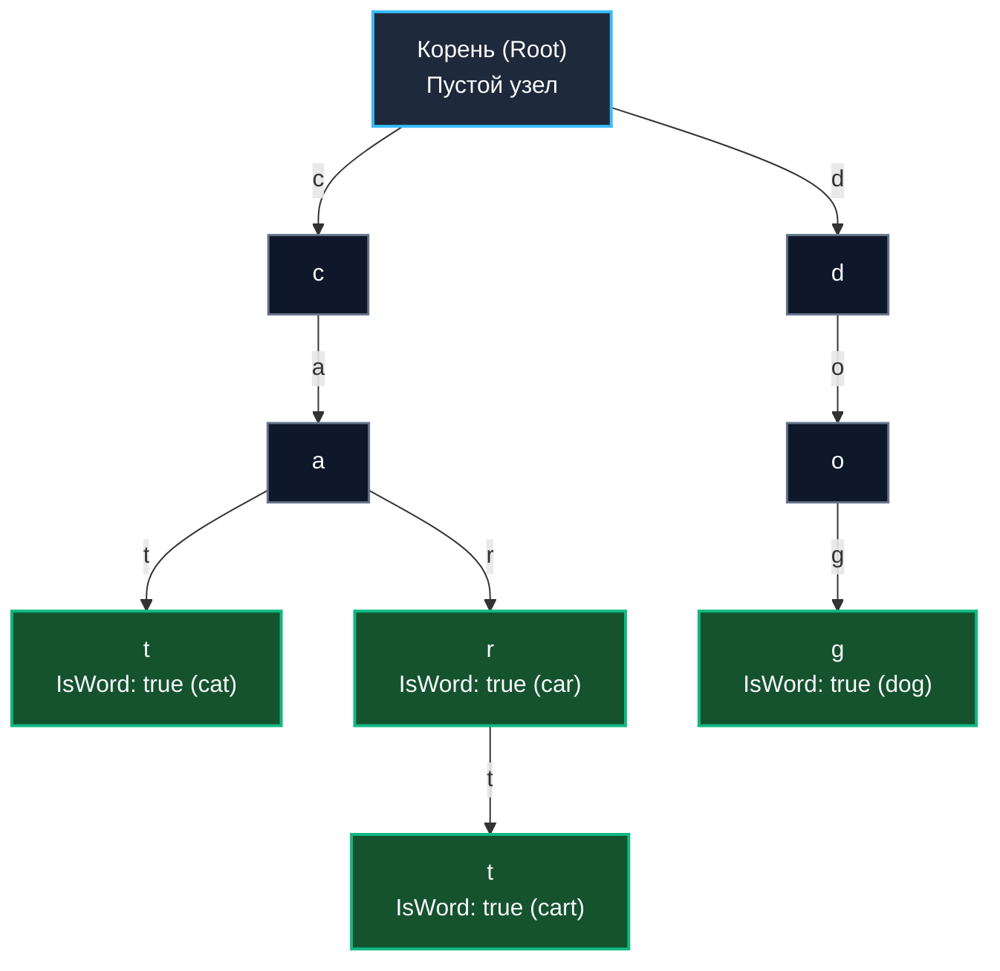
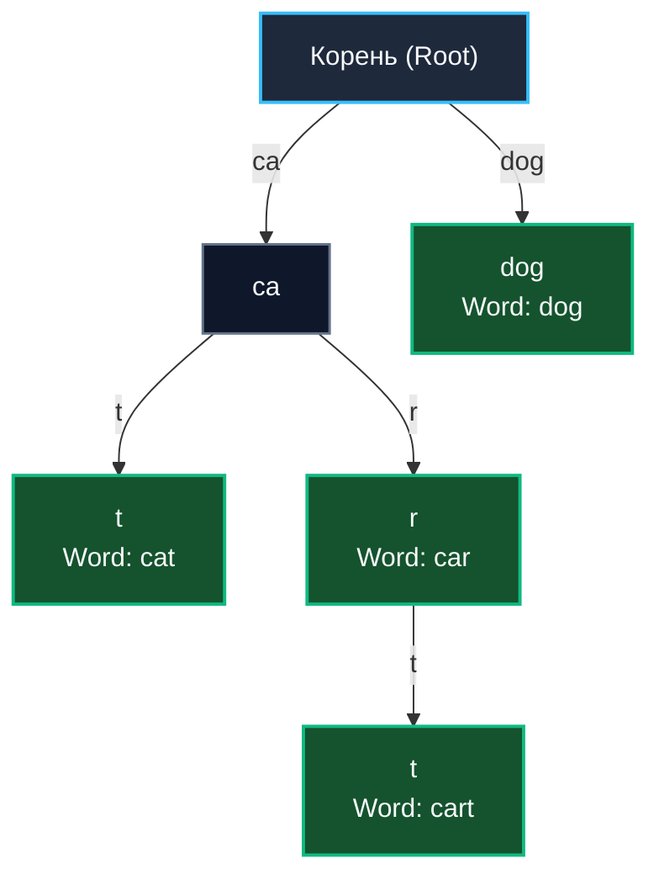

До сих пор мы рассматривали структуры данных, оперирующие скалярными неделимыми ключами: классические хеш-таблицы сравнивают ключи на строгое побайтовое совпадение, а сбалансированные B-деревья упорядочивают их по отношению больше/меньше.

Однако в реальной практике бэкенд-разработки мы непрерывно сталкиваемся с задачами поиска по **префиксу**, иерархическому шаблону или частичному строковому совпадению:
* Мгновенное автодополнение (Autocomplete) в поисковой строке («показать все товары, начинающиеся на "iph..."»).
* Высокоскоростная маршрутизация входящих HTTP-запросов (`/api/v1/users/profile`).
* Поиск по префиксам IP-подсетей в сетевых коммутаторах (CIDR routing).
* Лексикографические словари, стемминг и проверка орфографии (Spell Checkers).

Обычная хеш-таблица для таких сценариев абсолютно бессильна: хеш-код от префикса `"iph"` математически никак не связан с хеш-кодом полного слова `"iphone"`. Двоичные деревья поиска могут осуществлять интервальный поиск, однако посимвольное лексикографическое сравнение длинных строк на каждом шаге спуска сжигает сотни тактов CPU.

Для решения этого класса задач компьютерная инженерия разработала специализированную топологию — **Trie (Префиксное дерево / Бор)**. Термин происходит от английского слова re**trie**val (извлечение информации), но традиционно произносится как «трай» (try), чтобы на слух отличать его от классического «три» (tree).

---

## Концепция: Путь — это и есть ключ

Главное фундаментальное отличие префиксного дерева от абсолютно всех ранее рассмотренных нами структур заключается в следующем: **узлы Trie вообще не хранят сам ключ целиком**.

Ключ формируется динамически как **маршрут (путь)** от корня дерева до конкретного целевого узла. Каждое направленное ребро графа кодирует ровно один неделимый квант информации: букву алфавита, байт или сегмент URL-пути.

Рассмотрим топологию Trie, в которое последовательно добавлены слова `cat`, `car`, `cart` и `dog`:



Обратите внимание на архитектурную красоту: общий префикс `ca` физически существует в оперативной памяти **строго в единственном экземпляре**, обслуживая сразу три независимых слова (`cat`, `car`, `cart`). Это явление называется **сжатием префиксов**.  
Булевый флаг `IsWord` (зеленые терминальные узлы) фиксирует границу завершения семантически самостоятельного слова: так, слово `car` является полноправным словом и одновременно префиксом для более длинного слова `cart`.

---

## Mechanical Sympathy: Массивы vs Мапы

При проектировании узла Trie перед системным инженером встает жесткий архитектурный выбор: каким образом хранить ссылки на дочерние узлы? От этого решения напрямую зависит поведение подсистемы памяти и процессорного кэша.

### Подход 1: Фиксированный статический массив (Array)
Если предметная область строго ограничена алфавитом ASCII (например, строчные латинские буквы или байты протокола):

```go
type TrieNodeASCII struct {
	children [26]*TrieNodeASCII // Либо [256] для полного покрытия байтов
	isWord   bool
}
```

* **Преимущества для CPU:** Идеальная дружба с регистрами процессора. Чтобы перейти к букве `'c'`, вычисляется индекс со смещением `children['c' - 'a']`. Ассемблерная инструкция вычисляет адрес за 1 такт CPU, а чтение указателя происходит молниеносно.
* **Катастрофический оверхед по памяти (RAM):** На 64-битной архитектуре один узел с массивом на 26 указателей занимает $26 \times 8 + 1 = 209$ байт (с учетом выравнивания — 216 байт). Если в словаре присутствует редкое слово `hippopotamus`, цепочка из 12 узлов поглотит около 2.5 КБ памяти, причем более 96% указателей в массивах будут хранить бесполезный `nil`.

### Подход 2: Динамическая хэш-таблица (Map)
Идиоматичный подход для работы с произвольными символами национальных алфавитов и UTF-8 (`rune` в Go):

```go
type TrieNode struct {
	children map[rune]*TrieNode
	isWord   bool
}
```

* **Экономия RAM:** Память выделяется исключительно под реально существующие ветви и символы.
* **Потери в скорости CPU:** Каждый шаг по символу превращается в полноценный лукап во встроенную хеш-таблицу Go (вычисление хеша, проверка бакетов, разрешение коллизий). Это на порядок медленнее прямого индексирования массива.

> [!tip] Собеседование
> **Вопрос:** Что работает быстрее: поиск строки длиной $L$ символов в классической хеш-таблице (с хорошим разрешением коллизий) или в дереве Trie?
> **Ответ:** С точки зрения формальной асимптотики (Big O) они эквивалентны: и там, и там поиск занимает $O(L)$ времени. В хеш-таблице мы вычисляем хеш-код строки длиной $L$, а в Trie совершаем ровно $L$ переходов по ребрам.
> Однако с точки зрения **Mechanical Sympathy** и архитектуры железа хеш-таблица выигрывает с колоссальным отрывом. Вычисление аппаратного хеша (`aeshash` или `murmurhash`) непрерывной строки в памяти целиком укладывается в регистры и L1-кэш CPU. В префиксном же дереве каждый переход по букве — это прыжок по случайному адресу кучи (Pointer Chasing), порождающий каскад Cache Misses.

---

## Базовая реализация на Go

Реализуем типобезопасный Trie на Go с ленивой инициализацией мапы для минимизации расхода памяти:

```go
package trie

// Node представляет узел префиксного дерева
type Node struct {
	children map[rune]*Node // Поддержка любых символов Unicode (UTF-8)
	isWord   bool
}

// Trie представляет само дерево
type Trie struct {
	root *Node
}

// New создает новое пустое дерево
func New() *Trie {
	return &Trie{
		root: &Node{}, // Мапу не аллоцируем до момента первой реальной вставки
	}
}

// Insert добавляет слово в дерево за O(L), где L — длина строки
func (t *Trie) Insert(word string) {
	curr := t.root
	for _, char := range word {
		// Ленивая аллокация мапы
		if curr.children == nil {
			curr.children = make(map[rune]*Node)
		}

		if _, exists := curr.children[char]; !exists {
			curr.children[char] = &Node{}
		}
		curr = curr.children[char]
	}
	curr.isWord = true
}

// Search проверяет наличие точного слова в словаре
func (t *Trie) Search(word string) bool {
	node := t.findNode(word)
	return node != nil && node.isWord
}

// StartsWith проверяет, существует ли в дереве хотя бы одно слово с заданным префиксом
func (t *Trie) StartsWith(prefix string) bool {
	return t.findNode(prefix) != nil
}

// findNode выполняет вспомогательный проход по символьному пути
func (t *Trie) findNode(path string) *Node {
	curr := t.root
	for _, char := range path {
		if curr.children == nil {
			return nil
		}
		if next, exists := curr.children[char]; exists {
			curr = next
		} else {
			return nil
		}
	}
	return curr
}
```

---

## Эволюция для Бэкенда: Radix Tree (Patricia Trie)

Классическое наивное префиксное дерево страдает фундаментальным пороком: **проблемой длинных неразветвленных хвостов**.  
Если мы вставим в Trie слово `orchestration`, алгоритм породит неразветвленную цепочку из 13 промежуточных узлов, у каждого из которых будет ровно один потомок. Это чудовищная трата оперативной памяти и череда холостых прыжков по указателям.

Для устранения этой проблемы было разработано **Сжатое префиксное дерево (Radix Tree / Patricia Trie)**.  
Фундаментальный принцип оптимизации: **Если у узла есть только один потомок, эти узлы схлопываются (сливаются) в один узел.** Ребро графа больше не кодирует одиночный символ — оно кодирует целую монолитную подстроку!



Слово `dog` теперь хранится ровно в одном компактном узле вместо трех!

### Radix Tree в Go: Основа веб-фреймворков

Radix Tree — это не абстрактная теория, а важнейший алгоритм, на котором держится производительность современного веб-бэкенда на Go.

> [!info] Под капотом
> Если в ваших микросервисах используются фреймворки **Gin**, **Echo**, **Fiber** или стандартный мультиплексор `net/http` (начиная с революционного обновления маршрутизации в Go 1.22), ядром их роутеров является именно **Radix Tree**.  
> Знаменитый пакет `httprouter` Жюльена Шмидта (на котором спроектирован Gin) представляет собой экстремально оптимизированную реализацию Radix Tree.

Когда в приложении регистрируются эндпоинты:
```http
GET /api/v1/users
GET /api/v1/posts/:id
```

Роутер компилирует их в Radix Tree, узлами которого выступают общие сегменты путей (`/api/v1/`, `users`, `posts/`). При поступлении HTTP-запроса движок за десятки наносекунд спускается по дереву, сопоставляя подстроки URL, и мгновенно извлекает именованные параметры пути (Path Parameters, такие как `:id`). Это обеспечивает обработку сотен тысяч сетевых запросов в секунду без единой лишней аллокации в куче (**Zero Allocation Routing**).

---

## Итог раздела

Мы завершили фундаментальный модуль по анатомии и архитектуре сбалансированных деревьев. Сведем ключевые инженерные выводы в единый ориентир:
1. **AVL дерево**: Строжайший баланс высоты ($|BF| \le 1$), непревзойденная скорость чтения $O(\log N)$, но высокая стоимость каскадных поворотов при частых мутациях.
2. **Красно-черное дерево (RBT)**: Смягченный баланс через цвета, абсолютный стандарт для универсальных in-memory коллекций с сохранением порядка (CFS ядра Linux, `std::map`).
3. **B-дерево и B+ дерево**: Широкие плоские деревья, откалиброванные под размер физической дисковой страницы (4 КБ). Золотой стандарт индексов реляционных баз данных (PostgreSQL, MySQL).
4. **LSM-дерево**: Многоуровневый конвейер из памяти (MemTable) и иммутабельных файлов на диске (SSTables). Архитектурное спасение для колоссальных потоков последовательной записи (Cassandra, ClickHouse, RocksDB).
5. **Trie / Radix Tree**: Топология строковых путей. Фундамент систем автодополнения текста и молниеносных Zero-Allocation HTTP-роутеров в Go.

Деревья превосходно справляются с поиском и упорядочиванием данных. Однако в высоконагруженных бэкенд-системах регулярно возникает иная критическая потребность: нам нужно не просто «найти элемент», а постоянно и мгновенно **извлекать самый приоритетный объект** — задачу с наивысшим приоритетом, таймер, чей дедлайн истекает первым, или транзакцию с наибольшим весом.  
Для этой цели геометрия бинарных деревьев трансформируется в принципиально иную форму — компактную структуру, упакованную в плоский непрерывный массив.

Мы открываем следующий фундаментальный раздел структур данных — приоритетные очереди и кучи. В следующей статье: [[1. Куча как структура данных]].