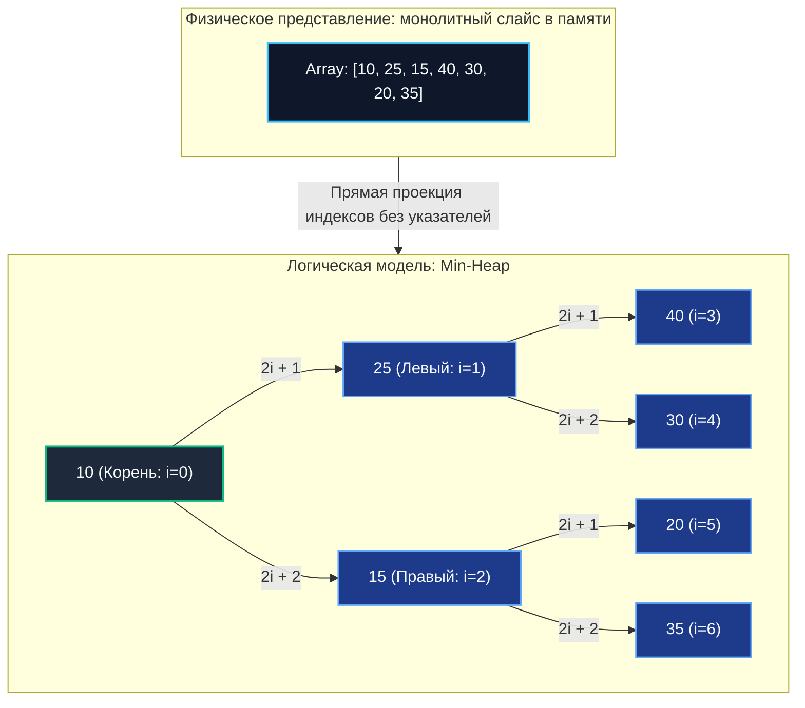

## Введение: Двойственность термина

В компьютерных науках слово «куча» (Heap) обозначает две принципиально разные системные сущности, и их смешение — классический маркер поверхностного понимания архитектуры:
1. **Memory Heap (Куча памяти)** — физическая область динамической виртуальной памяти процесса, где аллокатор рантайма размещает объекты с непредсказуемым временем жизни, убежавшие со стека (Escape Analysis). В Go это главная вотчина [[7. Глубокий Go (Внутреннее устройство)|сборщика мусора]].
2. **Heap Data Structure (Структура данных «Куча»)** — абстрактный тип данных и строгая древовидная топология для эффективного управления приоритетами, поддерживающая инвариант частичной упорядоченности.

В данном разделе мы говорим исключительно о второй сущности. Понимание того, как приоритетные структуры функционируют под капотом, критически важно для проектирования систем жесткого реального времени, планировщиков фоновых горутин, агрегации метрик и алгоритмов маршрутизации графов, где минимальная задержка (Latency) доступа к «самому важному» элементу определяет SLA всего сервиса.

---

## 1. Математические основы: Complete Binary Tree и свойство кучи

Куча представляет собой **почти полное бинарное дерево** (Complete Binary Tree), строго удовлетворяющее фундаментальному **свойству кучи** (Heap Property):
* **Min-Heap (Минимальная куча):** значение ключа любого родительского узла меньше либо равно значениям ключей всех его потомков. Корень дерева всегда гарантированно удерживает абсолютный минимум всей структуры.
* **Max-Heap (Максимальная куча):** значение ключа любого узла больше либо равно значениям ключей его потомков. В корне дерева всегда находится глобальный максимум коллекции.

Почему ключевым требованием выступает именно «почти полное бинарное дерево»?  
Потому что все уровни такого дерева (кроме, возможно, последнего) заполнены абсолютно целиком, а узлы последнего уровня плотно прижаты к левому краю. Это не академическая прихоть, а гениальное инженерное решение, позволяющее полностью отказаться от ссылок `Left` и `Right` и упаковать все дерево в компактный плоский массив!

Математическая адресация узлов в массиве задается элементарными формулами:
* Родитель узла с индексом `i`: `(i - 1) / 2` (целочисленное деление с отбрасыванием остатка)
* Левый дочерний узел: `2*i + 1`
* Правый дочерний узел: `2*i + 2`



---

## 2. Представление в памяти: почему массив, а не узлы

Начинающие разработчики часто пытаются конструировать кучу по аналогии с бинарными деревьями поиска через ссылочные структуры вида `Node{Left, Right, Value}`. В реальном бэкенде на Go такой подход является грубейшим антипаттерном.

> [!info] Под капотом
> **Проблема указательных деревьев:**
> * Каждый узел — это независимая аллокация в куче памяти Go (`runtime.newobject`).
> * Указатели `*Node` разбрасывают узлы по случайным страницам виртуальной памяти (Memory Fragmentation).
> * При спуске по дереву алгоритм порождает непрерывный Pointer Chasing: для дерева высотой 20 уровней это до 40 промахов кэша процессора (Cache Misses).
> * Колоссальное давление на сборщик мусора Go (GC Pressure): миллионы мелких узлов удлиняют фазу трассировки Mark.
>
> **Решение: неявная куча на массиве (Implicit Heap):**
> * Все элементы располагаются в монолитном непрерывном буфере оперативной памяти.
> * Алгоритмы `siftUp` и `siftDown` работают исключительно с целочисленными индексами и локальными перестановками байтов.
> * Аппаратный Prefetcher CPU автоматически предзагружает соседние ячейки массива в ультрабыстрый L1-кэш (Spatial Locality).
> * Ноль дополнительных аллокаций: сборщик мусора видит один непрерывный регион вместо сотен тысяч мелких структур.

В стандартной библиотеке Go пакет `container/heap` реализован именно поверх `[]any`. Это осознанное и бескомпромиссное следование философии Mechanical Sympathy.

---

## 3. Основные операции и амортизированная сложность

Куча не предназначена для произвольного поиска элементов или удаления из произвольной середины. Ее главная инженерная сила — мгновенный доступ к экстремуму и строгая поддержка инварианта при модификациях.

| Операция | Сложность | Архитектурная механика |
|:---|:---:|:---|
| **Peek** | $O(1)$ | Чтение корня `arr[0]`. Доступ к минимуму или максимуму мгновенный. |
| **Insert (Push)** | $O(\log N)$ | Элемент помещается в конец массива, после чего запускается процедура `siftUp` (всплытие) до восстановления инварианта кучи. |
| **Extract-Min/Max (Pop)** | $O(\log N)$ | Корень меняется местами с последним элементом массива, последний элемент отсекается, а новый временный корень «погружается» (`siftDown`) на законное место. |
| **Build-Heap** | $O(N)$ | Линейное построение кучи из произвольного неупорядоченного массива снизу вверх. Это радикально быстрее, чем $N$ последовательных вставок $O(N \log N)$. |
| **DecreaseKey / Remove** | $O(\log N)$ | Требует знания точного индекса элемента. После мутации приоритета вызывается `siftUp` либо `siftDown`. |

> [!tip] Собеседование
> **Вопрос:** «Почему операция `Build-Heap` (построение кучи из сырого массива) работает за линейное время $O(N)$, а не за $O(N \log N)$?»
> **Ответ:** Все дело в геометрии бинарного дерева. Алгоритм Флойда (1964 год) выполняет процедуру `siftDown` снизу вверх:
> - Ровно половина узлов дерева ($N/2$) являются листьями (уровень $h=0$) и вообще не требуют погружения (0 операций).
> - Четверть узлов ($N/4$) на высоте $h=1$ могут опуститься максимум на 1 шаг.
> - Восьмая часть узлов ($N/8$) опускаются максимум на 2 шага, и так далее.
> 
> Сумма работы: `n/4 * 1 + n/8 * 2 + n/16 * 3 + ...` Эта геометрическая прогрессия сходится к линейному времени $O(N)$. Математически доказано Флойдом в 1964 году.

---

## 4. Реализация в Go: `container/heap` и контракт `heap.Interface`

В Go нет встроенного generic-типа `Heap[T]`. Вместо этого используется паттерн интерфейсной композиции. Вместо монолитного generic-контейнера пакет `container/heap` предоставляет компактный контракт, расширяющий стандартный `sort.Interface`:

```go
type Interface interface {
	sort.Interface
	Push(x any) // Добавляет элемент в конец лежащего в основе слайса
	Pop() any   // Удаляет и возвращает последний элемент слайса
}
```

Обратите внимание: методы `Push` и `Pop` пользовательского интерфейса **не содержат алгоритмов всплытия и просеивания**. Они лишь манипулируют срезом памяти. Всю сложнейшую алгоритмику берут на себя системные функции пакета: `heap.Init(h)`, `heap.Push(h, x)`, `heap.Pop(h)`, `heap.Fix(h, i)`, `heap.Remove(h, i)`.

```go
package main

import (
	"container/heap"
	"fmt"
)

// IntMinHeap реализует контракт heap.Interface поверх обычного слайса
type IntMinHeap []int

func (h IntMinHeap) Len() int           { return len(h) }
func (h IntMinHeap) Less(i, j int) bool { return h[i] < h[j] } // Для Min-Heap: родитель меньше потомка
func (h IntMinHeap) Swap(i, j int)      { h[i], h[j] = h[j], h[i] }

func (h *IntMinHeap) Push(x any) {
	*h = append(*h, x.(int))
}

func (h *IntMinHeap) Pop() any {
	old := *h
	n := len(old)
	x := old[n-1]
	*h = old[0 : n-1]
	return x
}

func main() {
	h := &IntMinHeap{20, 15, 30, 5, 10}

	// heap.Init реорганизует слайс в валидную кучу за O(N)
	heap.Init(h)

	// Последовательное извлечение элементов строго по приоритету возрастания
	for h.Len() > 0 {
		min := heap.Pop(h).(int)
		fmt.Printf("%d ", min)
	}
	// Вывод в консоль: 5 10 15 20 30
}
```

> [!warning] Ловушка / Gotcha
> **Категорически запрещено напрямую менять значения элементов слайса в обход функций пакета `heap`!**  
> Если вы выполните прямое присваивание `(*h)[i] = newValue`, математический инвариант кучи будет мгновенно разрушен. Последующие вызовы `heap.Pop` начнут возвращать непредсказуемый мусор вместо минимального элемента.  
> Любое обновление приоритета обязано сопровождаться вызовом `heap.Fix(h, index)` либо комбинацией `heap.Remove` + `heap.Push`.

---

## 5. Механическая симпатия: кэш, аллокации и GC

Сравним физическое поведение кучи в контексте рантайма языка Go:

**Аллокации и утечки памяти (Memory Leaks)**
```go
//go:build ignore

package main

import (
	"container/heap"
	"testing"
)

type Task struct {
	Priority int
	Payload  [64]byte // Имитация полезной нагрузки задачи
}

type TaskHeap []*Task

func (h TaskHeap) Len() int           { return len(h) }
func (h TaskHeap) Less(i, j int) bool { return h[i].Priority < h[j].Priority }
func (h TaskHeap) Swap(i, j int)      { h[i], h[j] = h[j], h[i] }
func (h *TaskHeap) Push(x any)        { *h = append(*h, x.(*Task)) }
func (h *TaskHeap) Pop() any {
	n := len(*h)
	item := (*h)[n-1]
	(*h)[n-1] = nil // КРИТИЧНО ДЛЯ СБОРЩИКА МУСОРА: обнуляем висячий указатель!
	*h = (*h)[:n-1]
	return item
}

func BenchmarkHeapOps(b *testing.B) {
	const n = 10000
	b.ReportAllocs()
	for i := 0; i < b.N; i++ {
		h := &TaskHeap{}
		heap.Init(h)
		for j := 0; j < n; j++ {
			heap.Push(h, &Task{Priority: j})
		}
		for h.Len() > 0 {
			heap.Pop(h)
		}
	}
}
```

В этом бенчмарке основная нагрузка на GC создаётся аллокацией `&Task{...}` вне кучи. Сама структура кучи (`TaskHeap`) растёт через `append`, что даёт амортизированно O(1) аллокаций. Обратите особое внимание на строку `(*h)[n-1] = nil` в методе `Pop`. Если опустить это обнуление, базовый массив слайса продолжит удерживать указатели на уже семантически извлеченные объекты в своей невидимой емкости (capacity). Сборщик мусора Go сочтет эти объекты достижимыми из корней и не освободит память. В долгоживущих микросервисах это классический источник тихих **утечек памяти (Memory Leaks)**.

**Пространственная локальность кэша (Cache Locality)**  
При погружении элемента `siftDown` в куче из 1 миллиона узлов алгоритм совершает около 20 шагов. Так как данные лежат непрерывно в слайсе, потомки узла `2*i + 1` и `2*i + 2` расположены физически рядом и с высокой вероятностью оказываются в пределах одной 64-байтной кэш-линии CPU. Это обеспечивает кратно меньшую латентность по сравнению с графовыми деревьями поиска.

---

## 6. Ловушки production-разработки и вопросы с собеседований

### Когда куча проигрывает сортировке?
Если сервису требуется однократно получить полностью упорядоченный список всех $N$ элементов, классическая сортировка слайса `sort.Slice` (внутренний алгоритм PdqSort в Go) окажется быстрее извлечения из кучи.  
Хотя извлечение всех элементов из кучи формально требует $O(N \log N)$, сортировка `sort.Slice` обладает в разы меньшей константой за счет агрессивной векторизации и линейной предзагрузки кэша.

Куча побеждает сортировку исключительно в динамических сценариях:
* Данные поступают бесконечным непрерывным потоком (Streaming), и общий объем неизвестен заранее.
* Требуется постоянно поддерживать топ-1, топ-K или медиану в скользящем окне.
* Приоритеты задач изменяются в реальном времени.

### Проблема `DecreaseKey` в Dijkstra
Классический алгоритм Дейкстры для поиска кратчайшего пути требует частого уменьшения веса (приоритета) уже находящихся в очереди вершин.  
Стандартный `container/heap` не умеет находить индекс элемента по его ID за $O(1)$.  
**Решение:** Вести параллельную вспомогательную таблицу `map[VertexID]Index`. При изменении веса вершины мы мгновенно берем ее индекс из мапы и вызываем `heap.Fix(h, map[id])`. Сложность перестройки остается $O(\log N)$, а поиск индекса выполняется за константное время $O(1)$.

> [!tip] Собеседование
> **Вопрос:** «В C++ доступен шаблон `std::priority_queue`, в Java — класс `PriorityQueue`. Почему в стандартной библиотеке Go `container/heap` требует явной реализации интерфейса, вместо того чтобы предоставить готовый generic-тип `PriorityQueue[T]`?»
> **Ответ:** Философия Go базируется на композиции и максимальной прозрачности:
> 1. Интерфейс позволяет наложить семантику кучи на уже существующие пользовательские слайсы без промежуточного копирования памяти.
> 2. Разработчик получает полный контроль над компаратором `Less` и обменом `Swap` (например, приоритет по времени с запасным fallback-сравнением по ID транзакции).
> 3. Исключается дублирование кода оберток. До Go 1.21 дженерики отсутствовали вовсе, но даже сегодня интерфейсный контракт `container/heap` остается эталонным идиоматичным решением.

**Сравнительный анализ с другими языковыми экосистемами:**
* **C++:** `std::vector` в связке с алгоритмами `std::push_heap` / `std::pop_heap`. Аналогичное разделение аллокатора и алгоритма, реализованное через шаблоны.
* **Java:** `PriorityQueue<E>` — монолитный класс на базе массива. Требует боксинга/анбоксинга для примитивных типов, создавая скрытые аллокации и дополнительную нагрузку на GC (в Go `[]int` хранит сырые целые числа монолитно).
* **Python:** модуль `heapq` — функции поверх стандартных списков `list`. Синтаксически похож на подход Go, однако динамическая типизация накладывает ощутимый оверхед на интерпретацию.

---

## Итог

* **Куча как структура данных** — это компактный массив, логически моделирующий почти полное бинарное дерево со строгим инвариантом экстремума в корне.
* **Представление в плоском массиве** — ключевое требование Mechanical Sympathy: оно полностью исключает затраты на указатели, обеспечивает мгновенную арифметику индексов и максимизирует кэш-попадания CPU.
* В Go пакет `container/heap` строго отделяет алгоритмику (`heap.Push`, `heap.Fix`) от манипуляций с памятью (`heap.Interface`).
* **Обязательно очищайте ссылки** в методе `Pop` (`arr[n-1] = zero` или `(*h)[n-1] = nil`), чтобы предотвратить утечки памяти в долгоживущих процессах.
* Куча незаменима для алгоритмов **Top-K**, потоковой агрегации и диспетчеризации задач.

В следующей статье мы подробно изучим механику процедур `siftUp` и `siftDown`, исследуем ассемблерные оптимизации компилятора Go и напишем собственную типобезопасную generic-кучу с поддержкой быстрого обновления приоритетов.

[[2. Бинарная куча]]