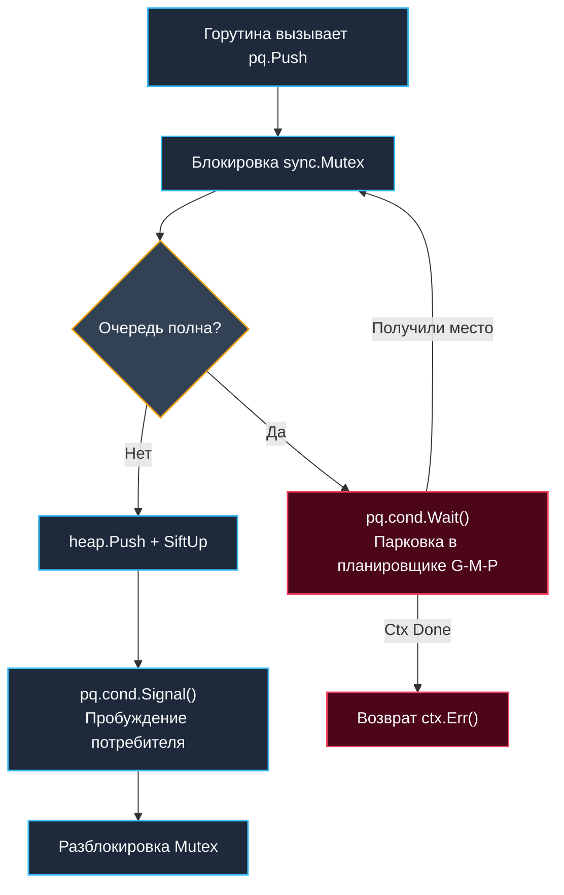

## Очередь с приоритетом как абстрактный тип данных

В предыдущих статьях мы подробно изучили [[2. Бинарная куча]] в качестве низкоуровневой структуры данных. Теперь настало время подняться на более высокий уровень архитектурного осмысления: **Очередь с приоритетом (Priority Queue, PQ)**.

Если сама куча отвечает за компактное размещение в памяти и математические алгоритмы всплытия/погружения, то очередь с приоритетом — это полноценный поведенческий интерфейсный контракт. Она детерминирует дисциплину обслуживания разнородного потока событий, строго гарантируя: критически важные задачи всегда извлекаются и обрабатываются первыми, независимо от хронологического времени их поступления в систему.

В промышленном бэкенде паттерн PQ применяется повсеместно:
* **Планировщики фоновых задач:** распределенные cron-демоны, retry-политики с экспоненциальным backoff, пулы асинхронных воркеров.
* **Сетевой стек и маршрутизация:** механизмы гарантированного качества обслуживания QoS (Quality of Service), приоритизация управляющих TCP-пакетов над тяжелым видеотрафиком.
* **Высоконагруженные транзакционные движки:** скоринг ордеров в торговых стаканах, алертинг в реальном времени, системы антифрода.
* **Ограничение нагрузки (Rate Limiting):** токен-бакеты с выделенным приоритетным коридором пропуска для VIP-клиентов.

Главная инженерная сложность эксплуатации PQ в production — вовсе не алгоритмическая оценка $O(\log N)$, а **конкурентность, надежное управление жизненным циклом записей и гармоничная интеграция с рантаймом планировщика Go**. Голая академическая куча ничего не знает о горутинах, контекстах `context.Context`, отменах и задержках системных потоков. Наша инженерная задача — построить надежный компонент уровня корпоративной инфраструктуры.

---

## 1. Архитектура потокобезопасной реализации

В [[5. Учебник по Go (Основы и синтаксис)|конкурентном Go]] разделяемый изменяемый доступ к памяти строго требует синхронизации. Стандартный пакет `container/heap` изначально не потокобезопасен: одновременные параллельные вызовы `Push`/`Pop` из нескольких горутин гарантированно приведут к гонкам данных (Data Race) и аварийному падению программы.

В индустрии выработано 4 базовых архитектурных подхода к синхронизации PQ:
1. **Мьютексная обёртка:** синхронизация всей структуры через `sync.Mutex`. Просто в реализации, но порождает жесткий contention при высокой частоте запросов. Потоки уходят в блокировку на системных вызовах `futex`, резко увеличивая задержки хвоста распределения (Latency p99/p99.9).
2. **Мьютекс на чтение/запись (`sync.RWMutex`):** не дает выигрыша для очередей, поскольку операции `Push` и `Pop` всегда модифицируют структуру слайса и требуют монопольного `Lock()`. Разделяемый `RLock` допустим лишь для вызовов `Len()` или `Peek()`.
3. **Шардированная очередь (Sharded Priority Queue):** разделение хранилища на $N$ независимых изолированных куч по хешу ключа или ID задачи. Кардинально снижает contention мьютексов, однако разрушает строгий глобальный порядок приоритетов. Отлично подходит для систем с моделью eventual consistency.
4. **Модель акторов (Single-Consumer + Channels):** монопольное владение кучей закрепляется за одной выделенной горутиной-диспетчером, принимающей команды из Go-каналов `chan`. Полностью исключает явные мьютексы, однако требует тщательного управления обратным давлением (Backpressure).

> [!info] Под капотом
> Когда горутина пытается захватить занятый `sync.Mutex`, она не обращается сразу к ядру Linux. Рантайм Go сначала пробует несколько тактов выполнить активное ожидание (Spinlock на инструкциях CPU PAUSE). Если мьютекс не освобождается — горутина переводится рантаймом в состояние `Gwaiting` и принудительно паркуется.
> Планировщик G-M-P немедленно переключает системный тред (M) на выполнение других готовых горутин (`Grunnable`). При освобождении блокировки одна из ожидающих горутин пробуждается и переводится в состояние готовности. Этот переключатель контекста обходится всего в ~100–300 нс, однако при сотнях конкурирующих горутин микрозадержки накапливаются, приводя к эффекту истощения ресурсов (Thread Starvation).

---

## 2. Production-ready реализация на Go

Спроектируем типобезопасную, строго ограниченную по емкости (Bounded) очередь с приоритетами с поддержкой отмены через `context.Context` и ленивым удалением устаревших элементов (Lazy Deletion):

```go
package pq

import (
	"container/heap"
	"context"
	"errors"
	"sync"
	"time"
)

// Item представляет элемент очереди
type Item struct {
	Priority  int
	Value     any
	Deadline  time.Time
	Index     int // Индекс в куче (динамически обновляется методами Swap)
	Cancelled bool
}

// PriorityQueue реализует потокобезопасную очередь с приоритетом
type PriorityQueue struct {
	mu     sync.Mutex
	cond   *sync.Cond
	heap   priorityHeap
	cap    int
	closed bool
}

// priorityHeap — внутренняя куча, реализующая контракт heap.Interface
type priorityHeap []*Item

func (h priorityHeap) Len() int { return len(h) }
func (h priorityHeap) Less(i, j int) bool {
	// Более высокий приоритет идет первым. При равенстве приоритетов — раньше дедлайн
	if h[i].Priority != h[j].Priority {
		return h[i].Priority > h[j].Priority
	}
	return h[i].Deadline.Before(h[j].Deadline)
}
func (h priorityHeap) Swap(i, j int) {
	h[i], h[j] = h[j], h[i]
	h[i].Index = i
	h[j].Index = j
}
func (h *priorityHeap) Push(x any) {
	item := x.(*Item)
	item.Index = len(*h)
	*h = append(*h, item)
}
func (h *priorityHeap) Pop() any {
	old := *h
	n := len(old)
	item := old[n-1]
	old[n-1] = nil // Критично для GC: очищаем ссылку!
	item.Index = -1
	*h = old[:n-1]
	return item
}

func NewPriorityQueue(capacity int) *PriorityQueue {
	pq := &PriorityQueue{
		heap: make(priorityHeap, 0, capacity),
		cap:  capacity,
	}
	pq.cond = sync.NewCond(&pq.mu)
	return pq
}

// Push добавляет элемент в очередь с поддержкой backpressure
func (pq *PriorityQueue) Push(ctx context.Context, item *Item) error {
	pq.mu.Lock()
	defer pq.mu.Unlock()

	if pq.closed {
		return errors.New("queue is closed")
	}

	for len(pq.heap) >= pq.cap {
		// Backpressure: ожидаем освобождения слота либо отмены контекста
		done := make(chan struct{})
		go func() {
			pq.cond.Wait()
			close(done)
		}()
		select {
		case <-ctx.Done():
			return ctx.Err()
		case <-done:
			if pq.closed {
				return errors.New("queue is closed")
			}
		}
	}

	heap.Push(&pq.heap, item)
	pq.cond.Signal() // Будим ожидающего потребителя
	return nil
}

// Pop извлекает наивысший по приоритету элемент, игнорируя отмененные (Lazy Deletion)
func (pq *PriorityQueue) Pop(ctx context.Context) (*Item, error) {
	pq.mu.Lock()
	defer pq.mu.Unlock()

	for {
		if len(pq.heap) > 0 {
			item := heap.Pop(&pq.heap).(*Item)
			if item.Cancelled {
				// Ленивое удаление: пропускаем отмененный объект и продолжаем опрос
				pq.cond.Signal()
				continue
			}
			return item, nil
		}
		if pq.closed {
			return nil, errors.New("queue is closed")
		}
		// Ожидаем появления новых элементов
		pq.cond.Wait()
		if ctx.Err() != nil {
			return nil, ctx.Err()
		}
	}
}

// Close корректно останавливает очередь и будит все заблокированные горутины
func (pq *PriorityQueue) Close() {
	pq.mu.Lock()
	defer pq.mu.Unlock()
	pq.closed = true
	pq.cond.Broadcast()
}
```

Ключевые инженерные решения данной реализации:
* **Связка `sync.Mutex` и `sync.Cond`:** Позволяет элегантно реализовать ограниченную емкость (Bounded Queue) с механизмом честного обратного давления (Backpressure) без накладных расходов на создание промежуточных буферизованных каналов. Метод `cond.Wait()` атомарно освобождает мьютекс и усыпляет горутину.
* **Lazy Deletion (Ленивое удаление):** Вместо поиска и физического вырезания отмененного элемента из середины массива за $O(N)$ мы выставляем флаг `Cancelled = true`. Элемент быстро отбрасывается при естественном извлечении через `Pop`. Это разумный trade-off: моментальная отмена за $O(1)$ в обмен на допустимый временный «балласт» в памяти.
* **Очистка ссылок в `Pop`:** Строка `old[n-1] = nil` фундаментально важна для корректной работы [[7. Глубокий Go (Внутреннее устройство)|сборщика мусора]]. Если оставить ссылку нетронутой, емкость среза памяти продолжит удерживать объект от освобождения в GC.

---

## 3. Механическая симпатия: память, кэши и планировщик

Эффективность приоритетной очереди под жесткой нагрузкой определяется тем, как ее структуры согласуются с иерархией кэшей процессора и планировщиком Go.

### Cache Locality при heap.Pop
Операция извлечения экстремума запускает процедуру `SiftDown`, которая пошагово инспектирует индексы `0 -> 1 -> 3 -> 7...`. В срезе указателей `[]*Item` каждый такой шаг — это переход по указателю в случайную область виртуальной памяти. Это 2–3 промаха кэша (Cache Miss) на каждый уровень высоты. Для очереди на 100 000 элементов накладные расходы могут добавить до 500–1000 нс к задержке каждого извлечения.  
**Решение:** Хранить компактные структуры данных inline (по значению), если размер полезной нагрузки не превышает 16 байт, либо переиспользовать объекты через пул `sync.Pool`, гарантируя их попадание в «горячие» кэш-линии.

### Escape Analysis и аллокации
```go
func process(pq *PriorityQueue) {
    item := &Item{Priority: 10, Value: "task1"} // &item -> escape to heap
    pq.Push(context.Background(), item)
}
```
Каждый вызов `Push` создает аллокацию структуры `Item` в куче процесса. При нагрузке в 10 000 RPS это означает генерацию 10 000 объектов в секунду, создавая мощное давление на рантайм Go. В архитектурах с [[9. Бэкенд на Go (Практика разработки)|генерацией кода]] и современными дженериками целесообразно передавать элементы по значению через специализированные типизированные кучи, подобные разобранным в [[2. Бинарная куча]].



### Влияние на G-M-P
При вызове `cond.Wait()` горутина уходит в парковку рантайма. Если консьюмер не успевает обрабатывать входящие элементы, очередь переполняется, и продюсеры начинают массово блокироваться. В неконтролируемых условиях это провоцирует планировщик Go аллоцировать новые системные треды `M`, раздувая потребление оперативной памяти. Ограниченная очередь (**Bounded Queue**) предотвращает деградацию, создавая предсказуемое обратное давление (Backpressure).

---

## 4. Каналы vs Мьютексы: когда что выбрать

| Архитектурный сценарий | Рекомендуемый примитив | Инженерное обоснование |
|:---|:---:|:---|
| **Строгая FIFO-диспетчеризация, Producer-Consumer** | Канал `chan` | Нативная поддержка рантайма Go, нулевой оверхед, поддержка мультиплексирования через `select`. |
| **Приоритетная обработка, динамический пересчет весов** | `sync.Mutex` + Куча | Каналы принципиально не поддерживают переупорядочивание. Приоритеты требуют древовидной реорганизации. |
| **Экстремальный throughput (>50k ops/sec)** | `sync.Pool` + Sharded Heaps | Одиночный мьютекс становится узким местом. Шардирование устраняет contention ценой слабой консистентности. |
| **Сверхнизкая задержка (Low-latency <100 мкс p99)** | Lock-free очереди на CAS | Мьютексы и `cond` порождают системные переключения. Lock-free структуры исключают паузы ценой сложности кода. |

> [!warning] Ловушка / Gotcha
> **Инверсия приоритетов (Priority Inversion) в системах реального времени:**  
> Если низкоприоритетная горутина захватила разделяемый мьютекс, а высокоприоритетная горутина заблокировалась в ожидании этого ресурса, возникает опасная инверсия: критическая задача простаивает по вине второстепенной.  
> В Go эта проблема решается архитектурно: минимизируйте время удержания критических секций, применяйте неблокирующий опрос через `sync.TryLock` либо разделяйте пулы ресурсов, чтобы высокоприоритетный трафик никогда не зависел от глобальных блокировок.

---

## 5. Ловушки production-разработки

1. **Unbounded Growth (Неограниченный рост):** Очередь без верхнего лимита емкости — верный путь к OOM-падению микросервиса при скачке входящего трафика. Всегда задавайте параметр `cap` и уважайте сигналы `ctx.Done()`.
2. **Stale Entries (Устаревшие записи):** Задачи с истекшим сроком актуальности бесцельно поглощают память. Реализуйте периодическую фоновую очистку либо механизм ленивого удаления (Lazy Deletion).
3. **Global Order vs Throughput (Глобальный порядок против пропускной способности):** Единая глобальная очередь сериализует все входящие потоки в одну точку. В микросервисных архитектурах зачастую эффективнее локальные очереди на независимых шардах в сочетании с Eventual Consistency.
4. **GC Spikes (Всплески задержек сборщика мусора):** Если `Item` содержит массивные вложенные структуры или указатели, их накопление удлиняет паузы `STW` при циклах `GOGC`. Очищайте и компактируйте данные перед постановкой в очередь.

> [!tip] Собеседование
> **Вопрос 1:** «Как реализовать динамическое изменение приоритета уже находящегося в очереди элемента за время $O(\log N)$?»  
> **Ответ:** Поддерживать внешнюю вспомогательную хеш-таблицу `map[TaskID]int` для быстрого поиска текущей позиции элемента в массиве. При изменении веса мы обновляем приоритет в ячейке слайса и вызываем `heap.Fix(h, map[id])`. Мьютекс очереди должен удерживаться на всем протяжении операции `Fix`, чтобы избежать состояния гонки.
> 
> **Вопрос 2:** «Почему в стандартной библиотеке Go нет готового типа Priority Queue?»  
> **Ответ:** Философия Go предоставляет элементарные ортогональные примитивы (`container/heap`, `sync.Mutex`, `chan`), а не перегруженные фреймворки. Различные прикладные задачи требуют диаметрально противоположных контрактов: ограниченные и неограниченные буферы, поддержка TTL, персистентность на диске. Готовый generic-тип сковал бы гибкость API, тогда как интерфейсная композиция позволяет собрать точечное решение под конкретный SLA.
> 
> **Вопрос 3:** «Возможно ли построить полностью lock-free Priority Queue на Go?»  
> **Ответ:** Теоретически да — с использованием атомарных указателей и CAS-циклов (Compare-And-Swap) для пошаговой модификации дерева. Однако на практике в Go это крайне сложно из-за отсутствия `unsafe`-гарантий на порядок выполнения и активного вмешательства сборщика мусора. В 99% сценариев шардированная очередь на мьютексах работает быстрее, надежнее и предсказуемее.

---

## Итог

* **Priority Queue (Очередь с приоритетом)** — это высокоуровневая абстракция над структурой [[1. Куча как структура данных]], добавляющая диспетчеризацию, жизненный цикл и потокобезопасность.
* В Go эталонная реализация строится на тандеме `sync.Mutex` и `sync.Cond` для честного обратного давления (Backpressure) и интеграции с `context.Context`.
* **Паттерн Lazy Deletion** предпочтительнее физического удаления из середины: моментальная отмена за $O(1)$ вместо $O(N)$ перестановок.
* **Mechanical Sympathy:** Избегайте лишних аллокаций, обязательно зануляйте висячие ссылки в `Pop` (`old[n-1] = nil`) и контролируйте размер кучи для предсказуемых пауз GC.
* **Конкурентность:** Одиночный мьютекс эффективно масштабируется до 15 000–25 000 операций в секунду. Для более высоких нагрузок требуется шардирование либо переход на каналы.

Мы освоили бинарную кучу и очереди с приоритетами. Однако в фундаментальной теории алгоритмов существуют экзотические структуры, оптимизированные под специфические паттерны: огромное число операций `insert` при редких `delete-min`. В следующей статье мы познакомимся со структурой, теоретически дающей невероятный константный $O(1)$ на добавление узлов: [[4. Fibonacci heap]].