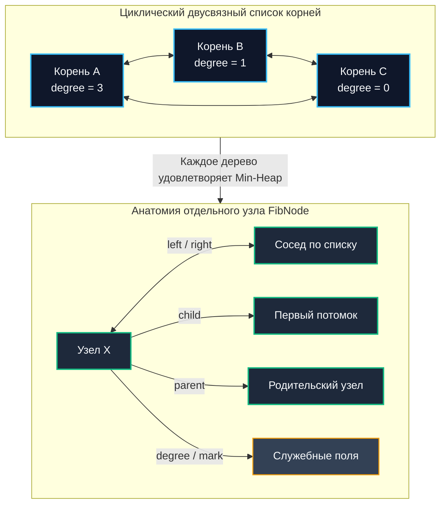

## Теоретический оптимум vs Практическая реальность

Фибоначчиева куча (Fibonacci Heap) — одна из наиболее изощренных и математически элегантных структур данных в академической теории алгоритмов, разработанная Майклом Фредманом и Робертом Тарьяном в 1984 году. Она предлагает теоретически непревзойденные оценки амортизированного времени: строгое константное время $O(1)$ для операций вставки (`insert`), слияния (`merge`) и уменьшения ключа (`decrease-key`), а также логарифмическое $O(\log N)$ для извлечения экстремума (`extract-min`). На бумаге она полностью деклассирует классическую бинарную кучу.

Однако в реальном production-бэкенде на Go вы практически никогда не встретите Фибоначчиеву кучу в критическом горячем пути. Почему?  
Потому что **амортизированная асимптотика скрывает за собой колоссальные скрытые константы, чудовищную пространственную нелокальность и тяжелейшую паутину указателей в куче**.

Изучение Fibonacci Heap фундаментально важно не для бездумного копирования в микросервисы, а для понимания границ абстрактных математических моделей, глубокого освоения метода потенциалов и осознания того, почему в реальной системной инженерии прагматично выбирают структуры с «худшим» Big O, но побеждающие по тактам физического кремния и нагрузке на сборщик мусора.

> [!tip] Собеседование
> **Вопрос:** «Алгоритм Дейкстры для поиска кратчайшего пути на плотном графе с Фибоначчиевой кучей теоретически достигает асимптотики $O(V \log V + E)$ вместо $O(E \log V)$. Почему в реальных сервисах маршрутизации его практически всегда реализуют на бинарной куче или Pairing Heap?»
> **Ответ:** Фибоначчиева куча создает гигантский оверхед на каждый узел (минимум 6 указателей, счетчик степени, битовые метки), что порождает непрерывные промахи кэша (Cache Misses) и фрагментацию виртуальной памяти. Константный множитель операций настолько велик, что для графов реального мира (даже с десятками миллионов вершин) бинарная куча с непрерывным массивом и аппаратным Prefetcher-ом процессора опережает Фибоначчиеву кучу в 2–10 раз по физическому астрономическому времени (Wall-clock time). Теория оценивает скорость роста к бесконечности, а промышленный бэкенд измеряет наносекунды и такты CPU.

---

## Математическая основа: почему именно "Fibonacci"

Название структуры проистекает из строгой математической связи между рангом узла (степенью `degree` — количеством его прямых детей) и минимально возможным размером его поддерева.

В правильно сбалансированной Fibonacci Heap поддерживается инвариант: узел степени `k` содержит как минимум `F_{k+2}` потомков, где `F` — классические числа Фибоначчи (`F_0=0, F_1=1, F_2=1, F_3=2...`).  
Поскольку последовательность Фибоначчи экспоненциально растет с основанием золотого сечения `φ ≈ 1.618`, максимальная степень любого узла в куче из $N$ элементов строго ограничена сверху логарифмической границей:
$$\text{degree}(x) \le O(\log_\varphi N) = O(\log N)$$

Это строгое математическое ограничение критически важно для доказательства амортизированной сложности операции `extract-min`. Без него предельно ленивая стратегия добавления привела бы к вырождению леса деревьев в линейный список, и операция извлечения минимума деградировала бы до катастрофических $O(N)$.

---

## Внутреннее устройство: Лес, ленивая консолидация и каскадные вырезания

В отличие от классической бинарной кучи, которая организуется как единое монолитное дерево, Fibonacci Heap представляет собой **лес (коллекцию)** независимых min-heap-ordered деревьев произвольного порядка. Корни всех деревьев объединены в кольцевой двусвязный циклический список.

Каждый элементарный узел удерживает комплекс указателей:
* `child` — указатель на одного из своих дочерних узлов
* `left`, `right` — указатели на левого и правого соседей в циклическом списке братьев или корней
* `parent` — указатель на родительский узел
* `degree` — целочисленное количество прямых детей
* `mark` — булев флаг, сигнализирующий о потере ребенка после прикрепления к текущему родителю



### Ленивая консолидация
При выполнении операций `insert` или слияния куч (`merge`) алгоритм действует предельно лениво: новые деревья просто вставляются в общий циклический список корней за константное время $O(1)$. Никакой реорганизации и балансировки не производится.  
Вся тяжелая вычислительная работа откладывается на момент вызова `extract-min`:
1. Извлекается корневой узел с минимальным значением ключа.
2. Все его дочерние узлы освобождаются и добавляются в список корней в роли самостоятельных деревьев.
3. Запускается фаза массовой консолидации (**consolidation**): деревья с одинаковыми степенями `degree` попарно связываются друг с другом, пока в корневом списке не останется ни одной пары деревьев одинакового ранга.

### Каскадные вырезания (Cascading Cuts)
При уменьшении значения ключа (`decrease-key`) узел вырезается из своего поддерева и переносится в корневой список.  
Если его родитель уже был предварительно помечен флагом потери ребенка (`mark=true`), родитель также принудительно вырезается и отправляется в список корней, запуская каскадную рекурсивную цепочку вырезаний вверх по дереву. Это гарантирует сохранение компактной логарифмической плотности поддеревьев. Амортизированная стоимость этой цепочки полностью покрывается потенциалом структуры.

В Fibonacci Heap выполняется строгий структурный инвариант: любой узел степени `k` имеет как минимум $F_{k+2}$ потомков, где $F$ — классические числа Фибоначчи. Так как числа Фибоначчи растут экспоненциально с основанием золотого сечения $\varphi \approx 1.618$, максимальная степень любого узла в куче размера $n$ строго ограничена величиной `O(log_φ n) = O(log n)`.

---

## Амортизированная сложность: Магия потенциального метода

Доказательство амортизированного $O(1)$ для `insert` и `decrease-key` строится на методе потенциалов Тарьяна. Вводится скалярная функция потенциала:
`Φ = t + 2m`, где $t$ — число независимых деревьев в списке корней, а $m$ — количество узлов с установленным флагом `mark`.

* **Операция Insert:** добавляет ровно 1 дерево в корневой список, при этом `ΔΦ = +1`. Фактическая стоимость $O(1)$. Амортизированная стоимость: `1 + 1 = O(1)`.
* **Операция Decrease-Key:** вырезает узел, создаёт 1 новое дерево и сбрасывает метки `mark` у затронутых предков. В худшем сценарии освобождённый отрицательный перепад `ΔΦ` компенсирует реальную работу по подъёму. Амортизированная стоимость остаётся $O(1)$.
* **Операция Extract-Min:** фактическая стоимость $O(D + t)$, где $D$ — максимальная степень узла. В процессе консолидации число деревьев $t$ кардинально сокращается, благодаря чему перепад потенциала `ΔΦ` становится большим отрицательным числом, полностью нейтрализуя тяжелую работу цикла слияния. Итог: строгие $O(\log N)$ амортизированно.

> [!info] Под капотом
> Амортизированная сложность гарантирует среднюю эффективность на длинной последовательности операций, но категорически ничего не обещает для единичного конкретного вызова. В высоконагруженных сетевых сервисах с жесткими требованиями SLA (p99/p99.9 latency) **амортизированные алгоритмы представляют скрытую угрозу**.  
> Единственный вызов `extract-min` после серии из миллиона быстрых вставок может внезапно заблокировать поток на сотни микросекунд из-за консолидации тысяч накопленных корней. Для low-latency систем предпочтительны структуры с предсказуемым Worst-case временем отклика.

---

## Механическая симпатия: Указатели, кэш и GC в Go

В точке пересечения абстрактной теории с физической реальностью процессора и рантайма Go проявляются главные недостатки Фибоначчиевой кучи.

### Проблема указательной паутинки
Каждый элементарный узел требует хранения минимум 5 указателей (40 байт на 64-битной архитектуре amd64/arm64) плюс служебных полей. При полезной нагрузке ключа в 8 байт накладные расходы памяти превышают 500%:

```go
// Типичная структура узла Fibonacci Heap в Go
type FibNode[T any] struct {
	Value  T
	Parent *FibNode[T] // Указатель на родителя
	Child  *FibNode[T] // Указатель на первого ребенка
	Left   *FibNode[T] // Кольцевой двусвязный список братьев
	Right  *FibNode[T]
	Degree int         // Количество дочерних узлов
	Mark   bool        // Флаг каскадного вырезания
}

// Размер структуры: 4 указателя (32Б) + int (8Б) + bool (1Б) + padding (7Б) = 48-64 байта
```

В среде выполнения Go это влечет катастрофические последствия:
* **Фрагментация памяти:** Аллокатор Go не способен упаковать такие узлы непрерывно. Они хаотично рассеиваются по страницам виртуальной памяти.
* **Cache Thrashing (Разрушение кэша):** При консолидации или каскадных вырезаниях процессор непрерывно прыгает по случайным адресам RAM. Аппаратный Prefetcher и предсказатель ветвлений бессильны: каждый шаг сопровождается Cache Miss.
* **GC Pressure (Колоссальное давление на сборщик мусора):** Трехцветный трассирующий сборщик мусора Go (Concurrent Mark-and-Sweep) вынужден обходить всю эту сложнейшую паутину указателей, разыменовывая каждый адрес для проверки цвета. Это драматически растягивает фазу разметки Mark и увеличивает системные паузы STW.

> [!warning] Ловушка / Gotcha
> **Escape Analysis уничтожит ваши оптимизации:**  
> Если вы создаете узлы `FibNode` и связываете их циклическими ссылками, компилятор Go принципиально не сможет аллоцировать их на стеке горутины. Узлы гарантированно «убегают» в кучу (Heap Escape).  
> В результате: 100% операций вставки сопровождаются обращением к системному аллокатору `mallocgc` на каждый `Push`. При нагрузке в 50 000 RPS это гарантирует деградацию профиля latency.

---

## Сравнение с альтернативами: когда константы побеждают асимптотику

| Характеристика | Binary Heap (массив) | Fibonacci Heap | Pairing Heap |
|:---|:---:|:---:|:---:|
| **Insert** | $O(\log N)$ | $O(1)$ аморт. | $O(1)$ аморт. |
| **Decrease-Key** | $O(\log N)$ | $O(1)$ аморт. | $O(1)$ аморт. |
| **Merge** | $O(N)$ | $O(1)$ | $O(1)$ |
| **Extract-Min** | $O(\log N)$ | $O(\log N)$ аморт. | $O(\log N)$ аморт. |
| **Память на узел** | 0 байт (монолитный слайс) | 64+ байт + аллокации | ~32–48 байт + аллокации |
| **Cache Locality** | Идеальная (L1/L2 попадания) | Катастрофическая (указатели) | Умеренная |
| **Статус в Go** | Production-стандарт по умолчанию | Академическая теория | Специализированные библиотеки |

В промышленном бэкенде выбор практически безоговорочно отдается классической бинарной куче (`container/heap` или кастомной generic-реализации). Если же приложению строго требуется частое слияние очередей, архитекторы выбирают **шардирование** (Sharded Heaps) либо конкурентный **Skip List** с приоритетами, который на порядок лучше утилизирует память и не перегружает GC.

> [!tip] Собеседование
> **Вопрос 1:** «Почему Fibonacci Heap отсутствует в стандартной библиотеке Go, тогда как `container/heap` включен изначально?»  
> **Ответ:** Философия создателей Go строится на прагматизме, читаемости и предсказуемости исполнения. Фибоначчиева куча чрезмерно сложна в поддержке, разрушает кэш процессора и обладает огромным скрытым константным множителем. Пакет `container/heap` оперирует плоскими слайсами без лишних аллокаций и закрывает 99% практических задач бэкенда.
> 
> **Вопрос 2:** «Как доказать, что процедура `extract-min` выполняется за амортизированное время $O(\log N)$, если она сливает десятки деревьев в цикле?»  
> **Ответ:** Через метод потенциалов. Суммарное число деревьев перед консолидацией ограничено величиной $O(\log N + t)$. Каждый акт слияния двух деревьев сокращает размер корневого списка на единицу, вызывая резкое падение потенциала $\Phi$. Высвобождающийся потенциал математически компенсирует реальные шаги цикла консолидации, гарантируя итоговую амортизированную границу $O(\log N)$.
> 
> **Вопрос 3:** «В каких реальных промышленных системах задействована Fibonacci Heap?»  
> **Ответ:** Практически нигде. Изредка она применяется в академических графовых бенчмарках. В реальных production-ядрах (PostgreSQL, планировщик ядра Linux, рантайм Go) применяются Pairing Heaps, Radix Heaps или оптимизированные бинарные массивы из-за строгой предсказуемости latency.

---

## Практические рекомендации для Go-разработчика

1. **Никогда не внедряйте Fibonacci Heap в production без глубокого профилирования (pprof).** В 95% случаев бинарная куча на плоском слайсе выиграет у нее по реальному астрономическому времени (Wall-clock time) благодаря аппаратным кэш-линиям CPU.
2. **Если архитектуре строго необходим дешевый `merge` за $O(1)$:** Рассмотрите шардирование `[]heap` по хеш-префиксу либо примените [[7. Продвинутые структуры данных/5. Skip list]]. Они на порядок проще в отладке и не создают губительной фрагментации кучи.
3. **Избегайте ссылочных указательных графов в критическом горячем пути:** Для компактных данных применяйте упаковку в массивы `[N]T` или монолитные слайсы `[]T` с целочисленной индексацией. Для крупных объектов подключайте пул `sync.Pool`.
4. **Контролируйте влияние на сборщик мусора (`GOGC`):** Чем больше разрозненных указателей удерживает долгоживущая коллекция, тем дольше длится фаза разметки Mark в GC. Фибоначчиева куча — худший из возможных паттернов для алгоритма Concurrent Mark-and-Sweep.

---

## Итог

* **Fibonacci Heap** — теоретический шедевр компьютерных наук, оптимизированный под преобладание операций `decrease-key` и слияний, однако практически непригодный для высоконагруженных бэкенд-систем.
* **Амортизированный $O(1)$** скрывает тяжелую отложенную фазу консолидации, порождающую непредсказуемые пики задержек (Latency Spikes).
* В Go сложная указательная природа структуры приводит к **катастрофической нелокальности кэша**, высокому оверхеду памяти (до 64+ байт метаданных на узел) и удлинению пауз сборщика мусора.
* **Промышленные альтернативы:** бинарные кучи на слайсах, шардированные очереди и pairing heaps, жертвующие академической асимптотикой ради предсказуемости и скорости физического кремния.

Освоив теоретические и практические аспекты приоритетных структур данных, мы переходим к самому популярному прикладному паттерну их использования в продакшене: потоковому поиску, фильтрации и агрегации k-наибольших элементов. В следующей статье: [[5. Задачи Top K элементов]].