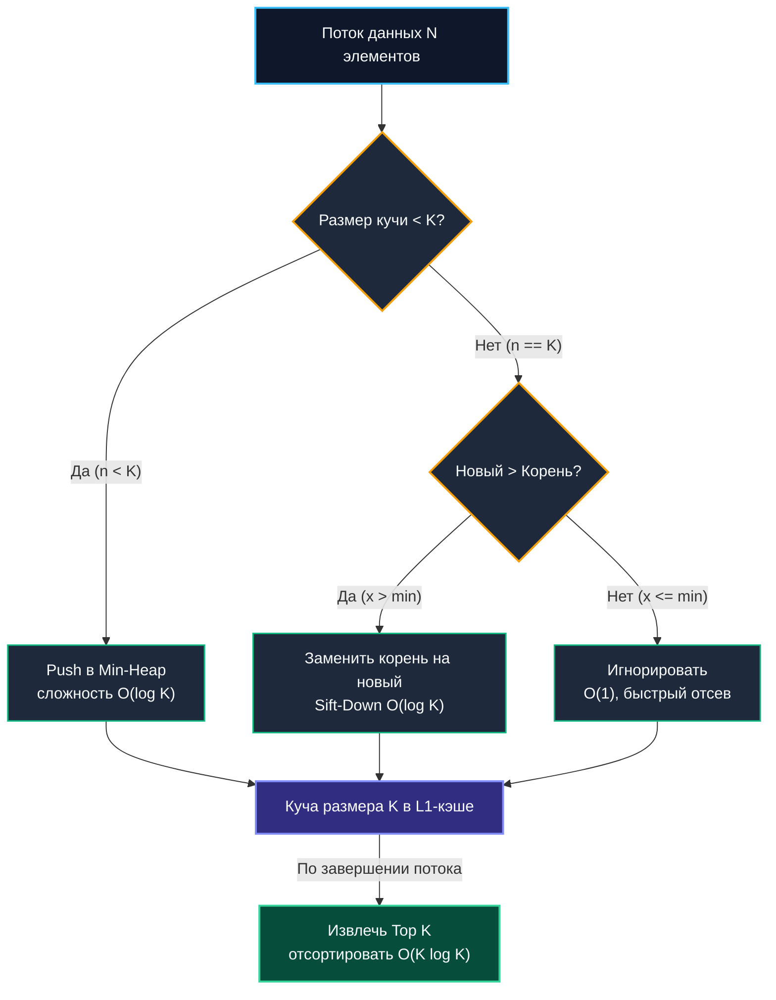
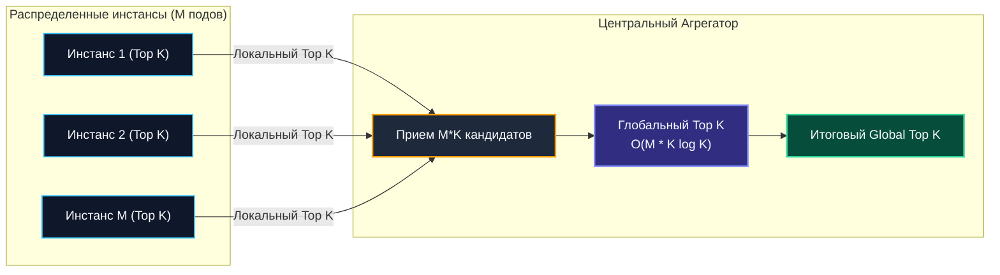

# Задачи Top K элементов

> *«Преждевременная оптимизация — корень всех зол, но когда вам нужно отобрать десять главных элементов из потока в миллиард записей, верный алгоритм отделяет работу на скромном ноутбуке от крушения распределенного кластера».*    
> — Свободная инженерная адаптация

---

## Введение: Почему Top K — это не просто задача для собеседований

В практической инженерии высоконагруженного бэкенда задача поиска **Top K элементов** (K наибольших или наименьших значений) возникает повсеместно:
- Мониторинг и обсервабилити: выявление 10 самых медленных HTTP/gRPC запросов ($p99.9$ outliers) за последний час.
- Гейминг и социальные платформы: расчет живых лидербордов (топ-100 игроков в реальном времени).
- Аналитика и безопасность: обнаружение наиболее активных IP-адресов во время DDoS-атак или учет «тяжелых» тенантов в мультиарендных базах данных.
- Поисковые движки: ранжирование релевантных документов и отсечение «хвоста».

Главная архитектурная особенность этих сценариев выражается формулой:
$$N \gg K$$

Общее число входящих событий $N$ измеряется сотнями миллионов или миллиардами строк в сутки, тогда как параметр $K$ обычно невелик и лежит в диапазоне от 10 до 1000. 

В подобных условиях наивный подход — сложить все $N$ записей в срез и вызвать полную сортировку за $O(N \log N)$ — оборачивается катастрофой. Во-первых, $N$ элементов попросту не поместятся в оперативную память (OOM-killer немедленно уничтожит процесс). Во-вторых, процессор сожжет миллиарды тактов на взаимное упорядочивание элементов из середины и хвоста распределения, которые читателю вовсе не интересны. Инженеру необходим потоковый (streaming) алгоритм с пространственной сложностью $O(K)$, обрабатывающий элементы за один проход по мере их поступления по сети.

---

## 1. Алгоритмические стратегии: когда что применять

Прежде чем приступать к коду, сравним фундаментальные вычислительные стратегии решения задачи Top K:

| Метод | Сложность | Память | Подходит для streaming | Применимость в Go-бэкенде |
|:---|:---:|:---:|:---:|:---|
| **Полная сортировка** | $O(N \log N)$ | $O(N)$ | Нет | Только для малых N или отладки |
| **Quickselect** | $O(N)$ среднее, $O(N^2)$ худшее | $O(N)$ | Нет | In-memory аналитика, но плохая локальность кэша |
| **Min-Heap размера K** | $O(N \log K)$ | $O(K)$ | Да | **Стандарт де-факто** для production |
| **Counting/Bucket Sort** | $O(N)$ | $O(M)$, $M$ — диапазон | Да | Только для целочисленных/дискретных метрик |
| **Approximate (Space-Saving)** | $O(N)$ | $O(1/\varepsilon)$ | Да | Когда K велико, а память ограничена |

### Почему Min-Heap размера K — безусловный фаворит

Для поиска **$K$ наибольших элементов** мы содержим **минимальную кучу (Min-Heap)** строгой емкости $K$. Это кажется парадоксальным только на первый взгляд: в корне Min-Heap всегда находится *самый слабый из кандидатов*, пробившихся в заветную десятку (или сотню).

Алгоритм работает по принципу «элитного клуба с ограниченным числом мест»:
1. Первые $K$ элементов потока беспрепятственно заполняют кучу за время $O(K \log K)$.
2. Для каждого последующего элемента из оставшихся $N - K$ мы выполняем проверку за $O(1)$: сравниваем кандидата с корнем кучи (минимальным из текущих лидеров).
3. **Если кандидат $\le$ корня:** кандидат немедленно отбрасывается. Сложность операции — чистые $O(1)$. На реальных данных с тяжелыми хвостами распределения свыше 99% элементов отсекаются именно на этом шаге!
4. **Если кандидат > корня:** текущий худший лидер вытесняется (корень заменяется на новый элемент), и мы вызываем просеивание вниз `siftDown` на глубину не более $\log_2 K$.



Итоговая вычислительная сложность составляет $O(N \log K)$, а потребление оперативной памяти строго ограничено $O(K)$.

---

## 2. Production-ready реализация: Streaming Top K на Go

Реализация промышленного уровня обязана быть типобезопасной (дженерики Go 1.21+), компактной в памяти и исключать паразитные динамические аллокации в горячем цикле. 

Ниже представлен законченный агрегатор `TopK[T]`, хранящий данные в плоском монолитном срезе и самостоятельно реализующий оптимизированные процедуры `siftUp` и `siftDown` без накладных расходов интерфейса `any`:

```go
package topk

import (
	"sort"
)

// TopK реализует потоковый поиск K наибольших элементов.
// Внутреннее хранилище представляет собой плоский Min-Heap размера не более K.
type TopK[T any] struct {
	heap []T
	k    int
	less func(a, b T) bool
}

// New создаёт агрегатор Top K. Функция less определяет порядок (a < b для Min-Heap).
func New[T any](k int, less func(a, b T) bool) *TopK[T] {
	if k <= 0 {
		k = 1
	}
	return &TopK[T]{
		heap: make([]T, 0, k),
		k:    k,
		less: less,
	}
}

// Process принимает новый элемент. Выполняется за O(log K) в худшем случае
// и за O(1) в подавляющем большинстве вызовов при отсеве.
func (t *TopK[T]) Process(item T) {
	n := len(t.heap)

	// Фаза первоначального наполнения буфера до емкости K
	if n < t.k {
		t.heap = append(t.heap, item)
		t.siftUp(n)
		return
	}

	// Куча заполнена. Сравниваем кандидата с текущим минимумом (корнем)
	// Если item меньше или равен t.heap[0], t.less(t.heap[0], item) вернет false
	if t.less(t.heap[0], item) {
		// Оптимизация: вместо Pop + Push заменяем корень на месте
		t.heap[0] = item
		t.siftDown(0, n)
	}
	// Иначе элемент гарантированно не входит в Top-K и отбрасывается за O(1)
}

// Result возвращает отсортированный срез Top K элементов (от большего к меньшему).
// Вызов модифицирует внутренний срез кучи.
func (t *TopK[T]) Result() []T {
	sort.Slice(t.heap, func(i, j int) bool {
		return !t.less(t.heap[i], t.heap[j])
	})
	return t.heap
}

// siftUp восстанавливает инвариант Min-Heap снизу вверх
func (t *TopK[T]) siftUp(i int) {
	for i > 0 {
		parent := (i - 1) / 2
		if t.less(t.heap[i], t.heap[parent]) {
			t.heap[i], t.heap[parent] = t.heap[parent], t.heap[i]
			i = parent
		} else {
			break
		}
	}
}

// siftDown восстанавливает инвариант Min-Heap сверху вниз
func (t *TopK[T]) siftDown(i, n int) {
	for {
		l, r := 2*i+1, 2*i+2
		smallest := i

		if l < n && t.less(t.heap[l], t.heap[smallest]) {
			smallest = l
		}
		if r < n && t.less(t.heap[r], t.heap[smallest]) {
			smallest = r
		}
		if smallest == i {
			break
		}
		t.heap[i], t.heap[smallest] = t.heap[smallest], t.heap[i]
		i = smallest
	}
}
```

### Практическое применение: Поиск медленных запросов

Посмотрим, как агрегатор интегрируется в реальный код сбора метрик:

```go
type Metric struct {
	ID        string
	Latency   time.Duration
	Timestamp time.Time
}

func ExampleTopK() {
	// Инициализируем агрегатор для Top 10 запросов с наибольшей задержкой
	agg := topk.New(10, func(a, b Metric) bool {
		return a.Latency < b.Latency // Min-Heap по задержке
	})

	var stream []Metric // Поток входящих событий
	for _, m := range stream {
		agg.Process(m)
	}

	slowest := agg.Result() // Срез из 10 самых тяжелых запросов
	_ = slowest
}
```

---

## 3. Механическая симпатия: аллокации, кэш и GC в действии

Понимание того, как высокоуровневый код транслируется в инструкции процессора и структуры рантайма Go, отличает Senior-инженера от теоретика.

### Плотность памяти и Cache Locality
Внутреннее представление кучи `[]T` гарантирует, что все элементы расположены в памяти строго последовательно в едином непрерывном массиве. 

Рассчитаем физический объем: если $K = 100$, а структура `Metric` занимает 32 байта, суммарный размер кучи составит всего:
$$100 \times 32 = 3.2\text{ КБ}$$

Современные процессоры x86-64 и ARM64 выделяют на одно ядро от 32 до 48 КБ кэша данных первого уровня (L1d). Это означает, что **вся куча целиком помещается в L1-кэш процессора**! 

При выполнении операций `siftUp` и `siftDown` процессор оперирует индексами внутри этой крошечной области памяти. Аппаратный префетчер (Hardware Prefetcher) заранее подтягивает соседние кэш-линии (64 байта), поэтому обращение `t.heap[smallest]` обслуживается за 3–4 процессорных такта (менее 1 наносекунды). Если бы мы использовали классическое дерево узлов на указателях (`[]*T`), каждый переход по ссылке вызывал бы промах мимо кэша и обращение к оперативной памяти (DRAM), замедляя обработку в 10–50 раз.

### Escape Analysis и аллокации
При передаче структур по значению в метод `Process(item T)` аргумент копируется через регистры CPU или стек горутины. Если структура компактна ($\le 16\text{--}32$ байта), компилятор Go генерирует векторные инструкции `MOVUPS`, копирующие данные за один такт.

Однако если структура велика и содержит внутренние указатели, компилятор при анализе побегов (`escape to heap`) может решить, что структура покидает стек, порождая скрытую аллокацию кучи на каждый вызов `Process`:

```go
// Плохо для больших объектов: каждая итерация аллоцирует Metric в кучу
for _, val := range hugeData {
    agg.Process(Metric{...}) // escape to heap
}

// Хорошо: переиспользование буфера через sync.Pool
var pool = sync.Pool{New: func() any { return new(Metric) }}
for _, val := range hugeData {
    m := pool.Get().(*Metric)
    *m = Metric{...} // перезапись структуры без системной аллокации
    agg.Process(*m)  // копирование значения в кучу
    pool.Put(m)
}
```

Для сверхнагруженного горячего пути (Hot Path) выгодно хранить в `TopK` легковесные дескрипторы (например, пару `struct { ID uint64; Latency int64 }`), а полные данные извлекать по идентификатору из постоянного хранилища только для финальных $K$ победителей.

### Влияние на G-M-P планировщик
Алгоритм `TopK` абсолютно автономен, синхронен и не совершает системных вызовов (`syscalls`). Горутина, выполняющая `agg.Process()`, непрерывно удерживает логический процессор `P` рантайма Go, не отдавая квант времени ОС и не вызывая переключения контекста ядра. 

Если поток данных поступает из сети через `net.Conn`, используйте эффективную буферизацию (`bufio.Scanner` / `bufio.Reader`), чтобы минимизировать пробуждения горутины сетевым поллером рантайма (`netpoll`).

> [!info] Под капотом
> **Почему не вызывать `sort.Slice` на лету?**  
> Если бы мы при поступлении каждого нового элемента вставляли его в срез и сортировали срез за $O(K \log K)$, суммарная сложность составила бы $O(N \times K \log K)$. 
> При $N = 10^6$ и $K = 100$:
> - Min-Heap подход: $\sim 10^7$ элементарных операций.
> - Подход с регулярной сортировкой: $\sim 10^8$ операций.
>
> Кроме того, стандартный `sort.Slice` производит косвенные вызовы через методы интерфейса `sort.Interface` или рефлексию/замыкания, что блокирует инлайнинг функций компилятором. Наша generic-куча со специализированным компаратором компилируется напрямую в плоские ассемблерные переходы `JMP/JNE`.

---

## 4. Продвинутые паттерны: распределённый агрегатор и временные окна

В распределенной микросервисной инфраструктуре данные генерируются десятками реплик сервиса. Вычисление Top K на отдельном узле дает лишь фрагментарную локальную картину.

### Стратегия Merge Top K (Двухэтапная редукция)
Классический паттерн распределенного поиска:
1. Каждый из $M$ независимых подов сервиса накапливает свой локальный `TopK[K]`.
2. С заданным интервалом (например, раз в 10 секунд) инстансы отправляют свои текущие $K$ лидеров на центральный сервер-агрегатор.
3. Центральный агрегатор получает массив из $M \times K$ кандидатов и прогоняет их через глобальный агрегатор `TopK[K]`.
4. Итоговая сложность слияния: $O(M \times K \log K)$. При $M = 100$ и $K = 100$ суммарный объем данных составляет 10 000 элементов, что обрабатывается центральным узлом за считанные доли миллисекунды.



### Временные окна (Sliding Window)
Для мониторинга задач вида «Top 10 медленных запросов за последние 5 минут» простого накопительного агрегатора недостаточно, так как старые исторические события должны экспайриться (вымываться из окна).

**Инженерные решения:**
- **Бакетный подход (Tumbling Buckets):** Создается кольцевой массив из 5 минутных бакетов. Каждую минуту текущий бакет сбрасывается, а глобальный Top K вычисляется слиянием оставшихся 4 бакетов с текущим.
- **Приоритетная очередь по времени:** Использование [[3. Очередь с приоритетом]], где элементами выступают запросы с меткой времени. Фоновая горутина вытесняет устаревшие записи по таймеру. Для прецизионного учета применимы алгоритмы [[14. Практические паттерны/2. Rate limiting алгоритмы|скользящего окна с двумя очередями]], совмещенные с приоритетными кучами.

---

## 5. Ловушки и вопросы с собеседований

### Ловушка 1: Нестабильность при равных приоритетах
Если два элемента имеют строго равные значения (`a == b` или `a.Latency == b.Latency`), их относительный порядок в куче не детерминирован. В системах мониторинга это приводит к неприятному эффекту «мерцания» лидерборда: запросы с одинаковым временем отклика хаотично меняются местами или вытесняют друг друга при каждом обновлении UI.

> [!tip] Решение проблемы стабильности
> Вводите вторичный детерминированный критерий сравнения:
> ```go
> if a.Latency == b.Latency {
>     return a.Timestamp.After(b.Timestamp) // Более свежий элемент имеет приоритет
> }
> ```
> Это гарантирует строгий порядок и стабильность выборки.

### Ловушка 2: Переполнение K и память
Если размер выборки $K$ конфигурируется динамически через внешний REST/gRPC API, злоумышленник или невнимательный клиент может передать $K = 10^7$. В этом случае массив `heap` потребует сотен мегабайт оперативной памяти, что приведет к деградации сборщика мусора и возможному OOM.

> [!warning] Ограничение параметров
> Всегда валидируйте и жестко ограничивайте входной параметр $K$ на уровне конфигурации:
> ```go
> safeK := min(configuredK, 5000)
> ```
> Если бизнес-логика действительно требует работы с колоссальными выборками ($K > 100\,000$), переходите на вероятностные структуры данных: **Count-Min Sketch** или **Space-Saving Algorithm**, гарантирующие строгий потоковый бюджет памяти ценой контролируемой погрешности.

---

> [!tip] Собеседование
> **Вопрос 1:** «Как найти медиану в непрерывном потоке чисел при минимальном потреблении ресурсов?»  
> **Ответ:** Классический паттерн «Две кучи» (Two Heaps). Поддерживаются две кучи: Max-Heap для чисел, меньших медианы (левая половина), и Min-Heap для чисел, больших медианы (правая половина). Размеры куч балансируются так, чтобы разница их длин не превышала 1. Медиана всегда доступна за $O(1)$ как корень большей кучи или среднее корней. Вставка нового числа занимает $O(\log N)$.
> 
> **Вопрос 2:** «Почему Quickselect с теоретической сложностью $O(N)$ на практике часто проигрывает Min-Heap с $O(N \log K)$?»  
> **Ответ:** Quickselect не способен работать в потоковом режиме (он требует одновременного присутствия всех $N$ элементов в памяти). Кроме того, Quickselect непрерывно переставляет элементы в большом массиве, что разрушает кэш процессора (катастрофический Cache Miss rate), а без сложного алгоритма медианы медиан имеет риск деградации в $O(N^2)$. Min-Heap размера $K$ работает потоково, локализована в L1-кэше и отсекает 99% элементов за одно сравнение.
> 
> **Вопрос 3:** «Как организовать Top K в распределенной системе при сбоях отдельных инстансов?»  
> **Ответ:** Локальные Top K снимки периодически записываются в распределенный брокер или хранилище (Kafka, Redis) с метками времени TTL. Центральный агрегатор рассчитывает глобальный Top K на основе последнего валидного снапшота от каждого живого узла, маскируя временные падения реплик без блокировки общего пайплайна аналитики.

---

## Итог

* **Top K** — фундаментальный практический паттерн проектирования бэкенда, обеспечивающий эффективную фильтрацию потоков данных огромной мощности ($N \gg K$).
* **Min-Heap фиксированного размера K** обеспечивает потоковую обработку со сложностью по времени $O(N \log K)$ и памятью $O(K)$, являясь де-факто промышленным стандартом.
* За счет свойства минимальной кучи более 99% входящих кандидатов отсекаются за **$O(1)$** сравнением с корнем, обеспечивая непревзойденную производительность.
* **Механическая симпатия:** компактный плоский срез размером $K$ целиком умещается в быстрейшем L1-кэше ядра процессора, исключая задержки обращения к оперативной памяти.
* Избегайте паразитных аллокаций в горячем цикле: контролируйте Escape Analysis структур, используйте `sync.Pool` и плоские скалярные ключи.
* В распределенных средах паттерн **Map-Reduce Top K** (локальная фильтрация с последующим глобальным слиянием $M \times K$ элементов) минимизирует сетевой трафик и нагрузку на центральные узлы.

---

Мы полностью завершили исследование приоритетных структур данных и алгоритмов агрегации экстремумов. В следующем модуле мы переходим к **продвинутым структурам данных**, которые позволяют за доли микросекунды объединять непересекающиеся множества, вычислять префиксные суммы в динамически меняющихся массивах и агрегировать данные на отрезках:
[[1. Disjoint Set Union - СНМ]].