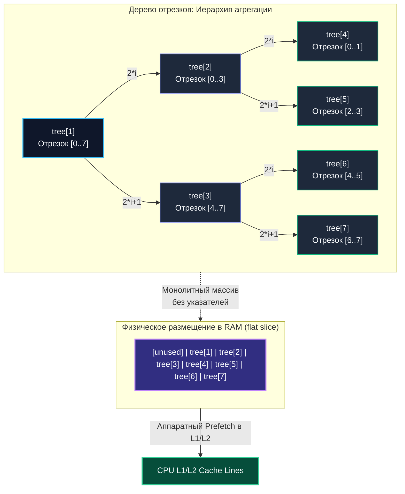

# Дерево отрезков (Segment Tree)

> *«В иерархии абстракций дерево отрезков напоминает пирамиду руководителей: каждый докладывает об агрегированных итогах двух подчиненных, позволяя директору оценить работу любой произвольной ветви компании за логарифмическое время».*    
> — Свободная инженерная адаптация

---

## Введение: от олимпиад к продакшену

Дерево отрезков (Segment Tree) долгое время незаслуженно считалось сугубо академическим инструментом из арсенала олимпиадного программирования (ACM ICPC, Codeforces). Однако в современном высоконагруженном бэкенде эта структура данных решает вполне прикладные и критичные для бизнеса инженерные задачи:
- Потоковая агрегация метрик и телеметрии в скользящих временных окнах.
- Быстрый динамический расчёт перцентилей ($p50$, $p90$, $p99$) и экстремумов без сканирования терабайтных логов.
- Управление квотами и лимитами по диапазонам идентификаторов тенантов.
- Построение интерактивных аналитических витрин с быстрой фильтрацией диапазона `WHERE timestamp BETWEEN` без дорогостоящих Full-Scan запросов к реляционной СУБД.
- Реализация гибких алгоритмов динамического rate-limiting для защитных API-шлюзов.

Главное достоинство дерева отрезков — способность отвечать на диапазонные запросы `Query(l, r)` и производить точечные обновления `Update(i, value)` за строго логарифмическое время $O(\log n)$ при линейном расходе оперативной памяти $O(n)$. В отличие от наивного сканирования среза за `O(n)`, дерево отрезков гарантирует детерминированную микросекундную задержку (SLA) даже при многократном росте объема накопленных данных.

> [!tip] Собеседование
> **Вопрос:** «Вам необходимо поддерживать массив счетчиков и предельно быстро отвечать на запросы суммы элементов на произвольном отрезке. При этом частота точечных обновлений в 10 раз превышает частоту чтений. Что вы предпочтете: Segment Tree, Fenwick Tree или предварительно вычисленные префиксные суммы?»  
> **Ответ:** Префиксные суммы обеспечивают $O(1)$ на чтение, но требуют $O(n)$ на каждое точечное обновление — для системы с частой записью это приведет к перегрузке CPU. Fenwick Tree (BIT) выполняет чтение и запись за $O(\log n)$, при этом занимает вдвое меньше памяти и обладает идеальной локальностью кэша, однако поддерживает только обратимые операции (сложение, вычитание, XOR). Если в будущем бизнес-требования расширятся до вычисления `min/max`, НОД (GCD) или матричных произведений на отрезке, дерево отрезков (Segment Tree) останется единственным надежным выбором. В исходной же постановке (чистые суммы и интенсивная запись) оптимально выбрать Fenwick Tree.

---

## 1. Математическая основа и неявное представление в памяти

Дерево отрезков организует агрегацию данных над структурой, математически известной как **моноид** (множество с ассоциативной бинарной операцией и нейтральным элементом: $(\mathbb{S}, \oplus, \mathbf{e})$).

Каждый лист дерева представляет отдельный элемент исходного массива, а каждый внутренний родительский узел содержит результат агрегации отрезка своих дочерних потомков `[l, r]`.

### Антипаттерн указателей в Go
В продакшене на Go категорически не рекомендуется строить дерево отрезков на базе структур с явными указателями:
```go
// Антипаттерн для hot-path аналитики:
type Node struct {
    Left, Right *Node
    Value       int
}
```
Такая архитектура приводит к катастрофической фрагментации кучи, уничтожает аппаратную локальность кэша процессора и парализует сборщик мусора Go десятками тысяч мелких указателей при фазе трассировки.

### Неявное компактное представление в плоском массиве
Вместо указателей применяется **неявная нумерация узлов в монолитном срезе** `slice`. 
Чтобы исключить ветвления и упростить индексацию, размер массива дополняется до ближайшей степени двойки $P \ge n$ (`P ≥ n`). В этом случае полное дерево от корня до листьев гарантированно помещается в непрерывный массив длиной $2 \times P$ (`2 * P`).

Формулы переходов (при 1-базированной индексации):
- Левый потомок узла `i`: `2 * i`
- Правый потомок узла `i`: `2 * i + 1`
- Родительский узел для узла `i`: `i / 2` (или битовый сдвиг `i >> 1`)



Дополнение размера массива до степени двойки исключает проверки граничных условий в циклах обхода: все листья строго располагаются на нижнем уровне начиная с индекса `size` до `2*size - 1`. Это позволяет реализовать алгоритмы чтения и записи **полностью итеративно**, без использования рекурсии и лишних стековых фреймов.

---

## 2. Production-ready реализация на Go 1.21+

Итеративная архитектура дерева отрезков на базе дженериков компилируется в прямолинейный ассемблерный код, минимизируя накладные расходы рантайма:

```go
package segtree

// SegmentTree реализует компактное итеративное дерево отрезков для произвольного
// моноида (ассоциативная операция merge с нейтральным элементом identity).
type SegmentTree[T any] struct {
	tree     []T
	size     int // Ближайшая степень двойки >= n
	identity T   // Нейтральный элемент (0 для суммы, +Inf для минимума и т.д.)
	merge    func(a, b T) T
}

// New создаёт дерево отрезков заданной базовой емкости n.
func New[T any](n int, identity T, merge func(a, b T) T) *SegmentTree[T] {
	size := 1
	for size < n {
		size <<= 1
	}
	tree := make([]T, 2*size)
	for i := 0; i < 2*size; i++ {
		tree[i] = identity
	}
	return &SegmentTree[T]{
		tree:     tree,
		size:     size,
		identity: identity,
		merge:    merge,
	}
}

// Build инициализирует дерево начальным набором данных за линейное время O(n).
func (st *SegmentTree[T]) Build(data []T) {
	for i, v := range data {
		st.tree[st.size+i] = v
	}
	// Итеративный расчет внутренних узлов снизу вверх
	for i := st.size - 1; i > 0; i-- {
		st.tree[i] = st.merge(st.tree[2*i], st.tree[2*i+1])
	}
}

// Set точечно обновляет элемент по индексу pos за время O(log n).
func (st *SegmentTree[T]) Set(pos int, value T) {
	if pos < 0 || pos >= st.size {
		return
	}
	p := st.size + pos
	st.tree[p] = value

	// Подъем к корню с пересчетом родительских агрегатов
	for p > 1 {
		p >>= 1
		st.tree[p] = st.merge(st.tree[2*p], st.tree[2*p+1])
	}
}

// Query возвращает результат агрегации на полуоткрытом интервале [l, r) за O(log n).
func (st *SegmentTree[T]) Query(l, r int) T {
	if l >= r {
		return st.identity
	}
	l += st.size
	r += st.size
	resL := st.identity
	resR := st.identity

	// Итеративный подъем по дереву с отсечением нечетных границ
	for l < r {
		if l&1 == 1 {
			resL = st.merge(resL, st.tree[l])
			l++
		}
		if r&1 == 1 {
			r--
			resR = st.merge(st.tree[r], resR)
		}
		l >>= 1
		r >>= 1
	}
	return st.merge(resL, resR)
}
```

### Пример использования: Агрегация метрик задержки

```go
func ExampleSegmentTree() {
	// Инициализируем дерево отрезков для вычисления сумм
	st := segtree.New(1000, int(0), func(a, b int) int { return a + b })

	// Пакетная инициализация исходным рядом
	st.Build([]int{1, 2, 3, 4, 5})

	// Точечное обновление: элемент с индексом 2 становится равен 10
	st.Set(2, 10) // массив логически трансформировался в [1, 2, 10, 4, 5, ...]

	// Вычисление суммы на полуоткрытом диапазоне [1, 4) -> индексы 1, 2, 3
	sum := st.Query(1, 4) // 2 + 10 + 4 = 16
	_ = sum
}
```

---

## 3. Mechanical Sympathy: кэш, ветвления и рантайм

Почему непрерывный плоский срез опережает указательные деревья на современных процессорах в десятки раз?

### Пространственная локальность и префетчинг
При выполнении запроса `Query(l, r)` алгоритм движется от листьев к корню. Индексы `l` и `r` на каждом шаге сдвигаются вправо `l >>= 1` и `r >>= 1`. Поскольку все узлы уровня хранятся в непрерывном срезе `[]T` бок о бок, загрузка узла `tree[l]` приводит к автоматической подгрузке всей 64-байтовой кэш-линии CPU. Аппаратный префетчер ядер процессора безошибочно предсказывает восходящий шаблон выборки. 

В противоположность этому, в указательной модели переход `node = node.Left` или `node = node.Right` вынуждает ядро процессора разыменовывать случайный 64-битный адрес виртуальной памяти, порождая остановку конвейера (Pipeline Stall) на 100–250 тактов при каждом обращении к DRAM.

### Ветвления и предсказатель переходов
Внутренний цикл запроса оперирует сверхбыстрыми побитовыми операциями: `l&1`, `r&1`, `l>>=1`, `r>>=1`. Проверки `if l&1 == 1` и `if r&1 == 1` демонстрируют регулярную циклическую периодичность, поэтому двухуровневый предсказатель ветвлений CPU (Branch Target Buffer) достигает точности свыше 90%. В отличие от этого, рекурсивная реализация с хаотичными проверками наподобие `if l <= mid` ломает предсказание переходов конвейера.

### Escape Analysis и давление на GC

```go
func processMetrics(data []float64) {
    st := segtree.New(len(data), 0.0, func(a, b float64) float64 { return a + b })
    st.Build(data) // tree аллоцируется в куче, если size > ~64KB
    // ...
}
```

В приведенном коде компилятор Go выявляет, что срез `tree` переживает локальный фрейм функции (или его емкость превышает стековый лимит), размещая структуру в куче (`escape to heap`). 

Однако ключевое инженерное преимущество плоского дерева отрезков состоит в том, что оно порождает **ровно одну монолитную аллокацию**, а не миллионы разрозненных мелких объектов. При сканировании памяти сборщик мусора Go обрабатывает непрерывный буфер с помощью высокопроизводительных векторных инструкций ядра (таких как `rep movsb` при копировании и плотной трассировки битмапы типов). 

Для систем с экстремальной нагрузкой буфер среза `tree` можно легко переиспользовать через `sync.Pool`, заполняя его нейтральными значениями `identity` перед возвратом.

> [!info] Под капотом
> Если тип `T` является интерфейсом или содержит внутренние указатели, каждый элемент массива `[]T` занимает 16 байт на архитектуре amd64 (пара `type*`, `data*`). Это не только увеличивает объем памяти, но и заставляет сборщик мусора проверять каждую ячейку на фазе Mark.
> Если же параметром `T` выступают примитивные скалярные типы (`int`, `float64`, `uint64`) или компактные структуры без указателей (`struct` без полей-указателей), компилятор помечает срез флагом `noscan`. В этом случае GC мгновенно пропускает весь мегабайтный массив, снижая длительность фазы STW до нуля!

---

## 4. Ленивая коррекция (Lazy Propagation): когда не стоит рисковать

Классическое расширение дерева отрезков из спортивного программирования — поддержка групповых модификаций отрезка `UpdateRange(l, r, delta)` за время $O(\log n)$. Идея заключается в отложенном распространении изменений: узел помечается служебным маркером `lazy`, а реальный пересчет дочерних узлов откладывается до того момента, пока последующий запрос не обратится к его потомкам (процедура `pushDown`).

Однако в боевом распределенном Go-бэкенде внедрение ленивой коррекции сопряжено с высокими архитектурными рисками:
1. **Сложность синхронизации и конкурентность:** Флаги `lazy` требуют модификации дерева даже при операциях **чтения** (`Query`). Это означает, что обычный `sync.RWMutex` теряет свою эффективность: конкурентные чтения вынуждены брать эксклюзивную блокировку на запись для выполнения `pushDown`, превращая структуру в узкое горлышко (bottleneck) при высоких RPS.
2. **Трудности отладки:** Любая ошибка в логике композиции отложенных меток приводит к тихой рассинхронизации агрегатов, которую крайне тяжело воспроизвести под нагрузкой.
3. **Худшие сценарии задержек (Latency Spikes):** Единичный запрос, затронувший давно не обновлявшийся глубокий диапазон, может спровоцировать лавинообразный каскад `pushDown` по всему дереву, порождая опасный выброс задержки на $p99.9$.

**Промышленные альтернативы:**
- Периодическая фоновая пакетная пересборка `Build` по снапшоту данных.
- Корневая декомпозиция (Chunked Array): разбиение диапазона на блоки размера $\sqrt{n}$, где обновление блока выполняется за `O(sqrt(n))` без сложных отложенных деревьев.
- Применение [[2. Fenwick tree - бинарное индексное дерево]]: для префиксных агрегаций диапазонная модификация элегантно сводится к двум точечным обновлениям граничных индексов.

> [!warning] Ловушка / Gotcha
> **Полуоткрытые интервалы `[l, r)` vs закрытые `[l, r]`**  
> В канонических реализациях и стандартной библиотеке Go принят полуоткрытый интервал `[l, r)` (левая граница включается, правая исключается). 
> Если клиентский код по ошибке передаст в метод `Query` закрытый интервал `[l, r]`, цикл `for l < r` никогда не учтет значение в ячейке `r` (либо при наивной корректировке выйдет за границу среза `tree`). Всегда валидируйте и нормализуйте входные параметры перед обработкой:
> ```go
> // Если API принимает закрытый диапазон [start, end], нормализуйте его:
> r = r + 1 // преобразуем закрытую границу в полуоткрытую [l, r)
> result := st.Query(start, end + 1)
> ```

---

## 5. Ловушки и вопросы с собеседований

> [!tip] Собеседование
> **Вопрос 1:** «Почему для хранения дерева отрезков выделяется массив размера `2 * size`, где `size` — ближайшая степень двойки, а не `4 * n`?»  
> **Ответ:** Двоичное дерево с $n$ листьями имеет ровно $n - 1$ внутренних узлов-предков. Суммарное число узлов равно $2n - 1$. Если мы дополняем $n$ до степени двойки $P = \text{nextPowerOfTwo}(n)$, общее количество узлов составит $2P$. Так как $P < 2n$, величина $2P < 4n$. Выделение массива емкостью $4n$ — это исторический хак олимпиадного программирования для защиты от выхода за границы в рекурсивных реализациях. В итеративной архитектуре размер `2 * nextPowerOfTwo(n)` математически достаточен и экономит оперативную память.
> 
> **Вопрос 2:** «Можно ли применить Segment Tree для поиска первого элемента на отрезке, удовлетворяющего определенному предикату (например, первого значения $> X$)?»  
> **Ответ:** Да, за время $O(\log n)$. Если дерево хранит максимум на отрезках, мы проверяем условие `tree[node] > X`. Если максимум в узле `max <= X`, то в этом поддереве подходящих элементов гарантированно нет. В противном случае алгоритм спускается в левого потомка, и только если там поиск не увенчался успехом — в правого. Этот алгоритм называется **спуском по дереву отрезков (walk-down)** и активно применяется в распределенных планировщиках задач и мониторинге.
> 
> **Вопрос 3:** «Как организовать эффективный конкурентный доступ к Segment Tree из сотен горутин?»  
> **Ответ:** Итеративное Segment Tree не является структурой lock-free. В простейшем сценарии используется `sync.RWMutex` (чтение `Query` под `RLock()`, модификация `Set` под `Lock()`). При сверхвысокой частоте конкурентных записей применяется **шардирование (Range Sharding)**: весь диапазон ключей разбивается на $M$ независимых сегментов, каждый из которых обслуживается отдельным инстансом `SegmentTree` со своим независимым мьютексом `Mutex`.

---

## 6. Сравнение с альтернативами

| Характеристика | Segment Tree | Fenwick Tree (BIT) | Префиксные суммы | Sorted Slice + binary search |
|:---|:---:|:---:|:---:|:---:|
| **Query** | $O(\log n)$ | $O(\log n)$ | $O(1)$ | $O(\log n)$ |
| **Update** | $O(\log n)$ | $O(\log n)$ | $O(n)$ | $O(n)$ вставка |
| **Поддерживаемые операции** | Любые моноиды (min, max, sum, gcd) | Только обратимые (sum, xor) | Сумма, разница | Произвольный поиск |
| **Расход памяти** | `2 * nextPow2(n) * sizeof(T)` | `n * sizeof(T)` | `n * sizeof(T)` | `n * sizeof(T)` |
| **Сложность кода** | Средняя (итеративная) | Минимальная | Тривиальная | Низкая |
| **Применимость в Go** | Сложная агрегация, скользящие окна | Счетчики, частотные таблицы | Статические неизменяемые наборы | Range lookup по ключам |

---

## Итог

* **Segment Tree** — фундаментальная универсальная структура для выполнения диапазонных запросов и точечных обновлений за строго логарифмическое время $O(\log n)$.
* В Go промышленным стандартом является **итеративная реализация в плоском непрерывном срезе**, дополненном до ближайшей степени двойки. Она полностью исключает рекурсию и аллокацию замыканий.
* **Mechanical Sympathy:** непрерывное массивное представление идеально утилизирует кэш-линии процессора (L1/L2 data cache prefetch), а побитовые сдвиги гарантируют безошибочную работу аппаратного предсказателя переходов CPU.
* Скалярные типы без указателей активируют флаг `noscan` в рантайме Go, гарантируя **нулевую нагрузку на сборщик мусора (Zero GC Pressure)** при фоновом сканировании.
* Избегайте ленивой коррекции (Lazy Propagation) в многопоточных высоконагруженных сервисах: она разрушает параллелизм операций чтения и провоцирует пиковые всплески задержек.

---

В следующей статье мы изучим структуру, которая жертвует универсальностью моноидов ради феноменальной компактности памяти и максимальной скорости битовой арифметики:
[[2. Fenwick tree - бинарное индексное дерево]].