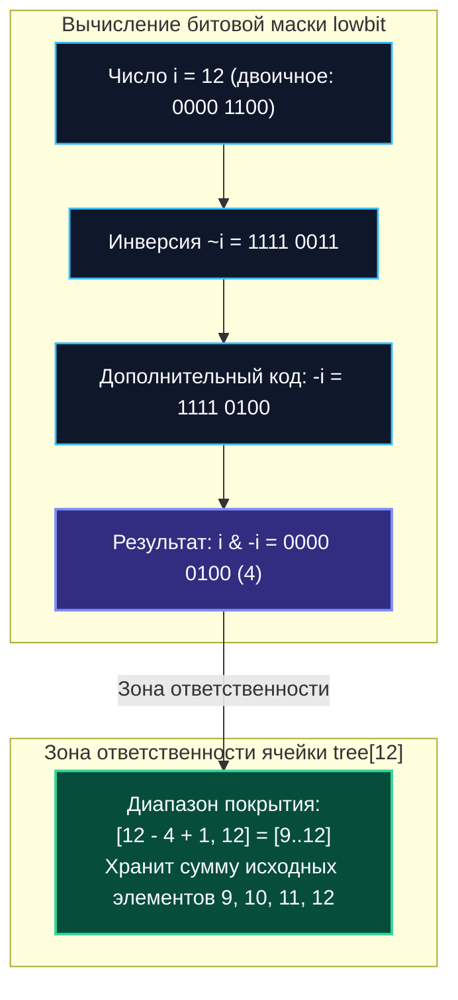

# Дерево Фенвика (Binary Indexed Tree, BIT)

> *"There is a peculiar joy in bitwise arithmetic: when a single CPU operation, `i & -i`, replaces an entire tree traversal and yields logarithmic elegance with zero pointer overhead."*  
> — Свободная инженерная адаптация

---

## Введение: Компактность против универсальности

В предыдущей статье мы подробно исследовали [[1. Segment tree - дерево отрезков]] — универсальный, но сравнительно тяжеловесный механизм работы с интервалами. За всеядность дерева отрезков инженеру приходится расплачиваться: массив расширяется до степени двойки и удваивается ($2 \times 2^{\lceil \log_2 n \rceil}$), циклы изобилуют ветвлениями, а накладные расходы по памяти могут превышать номинальный размер данных в 2–4 раза.

Когда прикладная задача бэкенда сводится к вычислению динамических префиксных сумм, частотному учету событий или расчету кумулятивных метрик над обратимыми операциями, индустриальным стандартом становится **дерево Фенвика** (Fenwick Tree, или **Binary Indexed Tree**, **BIT**).

Феномен структуры Фенвика кроется в предельной математической лаконичности:
- Обладает той же строгой асимптотикой: $O(\log n)$ на точечное обновление и диапазонный запрос.
- Требует ровно $n + 1$ ячеек памяти (ровно в 2–4 раза меньше дерева отрезков).
- Константный множитель в цикле вдвое ниже за счет использования прямой битовой арифметики процессора.
- Создает минимальное воздействие на [[7. Глубокий Go (Внутреннее устройство)|сборщик мусора]] рантайма Go.

В высоконагруженных телекоммуникационных узлах и аналитических пайплайнах, оперирующих миллионами счетчиков в секунду, переход с дерева отрезков на BIT высвобождает гигабайты оперативной памяти и сотни миллисекунд процессорного времени.

> [!tip] Собеседование
> **Вопрос:** «В каких случаях вы выберете Fenwick Tree вместо Segment Tree, а когда Segment Tree неизбежен?»  
> **Ответ:** BIT выигрывает, когда требуется исключительно кумулятивная агрегация по префиксам или диапазонам над обратимыми операциями (сложение, вычитание, побитовый XOR). Он вдвое компактнее в оперативной памяти и существенно быстрее благодаря прыжкам по степеням двойки без ветвлений. Дерево отрезков (Segment Tree) обязательно, когда необходим поиск минимума/максимума на динамическом отрезке, работа с произвольными моноидами, ленивая модификация интервалов (Lazy Propagation) или многомерные геометрические запросы, где битовая инверсия математически неприменима.

---

### 1. Математическая основа битовых масок

Секрет компактности BIT заключается в позиционном двоичном представлении индекса. Каждая ячейка массива `tree[i]` отвечает за хранение частичной суммы элементов на интервале:
`[i - lowbit(i) + 1, i]`

где функция `lowbit(i)` выделяет младший установленный бит числа $i$.

В компьютерной архитектуре с представлением отрицательных чисел в дополнительном коде (Two's Complement) операция `lowbit(i)` вычисляется за **один процессорный такт** элементарным битовым трюком:
$$\text{lowbit}(i) = i \ \& \ (-i)$$

Отрицание числа в дополнительном коде инвертирует все биты и прибавляет единицу: $-i = \sim i + 1$. При последующем логическом умножении `AND` все старшие биты взаимно обнуляются, оставляя нетронутым единственный младший единичный бит.



Каждое натуральное число однозначно раскладывается на сумму степеней двойки: $13 = 8 + 4 + 1$. 
Поэтому:
- **При запросе префиксной суммы (`Query`)**: мы движемся вниз по индексам (`i -= i & -i`), последовательно отсекая младшие степени двойки и суммируя непересекающиеся блоки. Для индекса 13 мы просуммируем `tree[13]` (длина 1), `tree[12]` (длина 4) и `tree[8]` (длина 8). Ровно 3 шага!
- **При обновлении элемента (`Update`)**: мы движемся вверх по индексам (`i += i & -i`), добавляя приращение во все покрывающие родительские ячейки.

---

### 2. Production-реализация на Go 1.21+

Дерево Фенвика традиционно строится на базе 1-базированного массива. Это фундаментальное математическое ограничение: для нулевого индекса `lowbit(0) = 0 & -0 = 0`, что вызвало бы бесконечное зацикливание шага `i += 0`. Поэтому ячейка с индексом `0` резервируется, а пользовательские индексы транслируются со сдвигом `+1`.

```go
package fenwick

// FenwickTree реализует бинарное индексное дерево для произвольной обратимой группы.
// Для классических счетчиков используется сложение и вычитание, для хешей — XOR.
type FenwickTree[T any] struct {
	tree []T
	n    int
	add  func(a, b T) T // Прямая операция (например, a + b)
	sub  func(a, b T) T // Обратная операция (например, a - b)
}

// New создаёт дерево Фенвика емкостью n элементов.
// Все элементы инициализируются переданным нулевым значением zero.
func New[T comparable](n int, zero T, add func(a, b T) T, sub func(a, b T) T) *FenwickTree[T] {
	return &FenwickTree[T]{
		tree: make([]T, n+1),
		n:    n,
		add:  add,
		sub:  sub,
	}
}

// Update прибавляет delta к элементу по индексу idx за время O(log n).
func (ft *FenwickTree[T]) Update(idx int, delta T) {
	if idx < 0 || idx >= ft.n {
		return
	}
	// Переход от 0-базированного API к 1-базированной структуре BIT
	i := idx + 1
	for i <= ft.n {
		ft.tree[i] = ft.add(ft.tree[i], delta)
		i += i & -i // Движение вверх по степеням двойки
	}
}

// Query вычисляет префиксную сумму от 0 до idx включительно за время O(log n).
func (ft *FenwickTree[T]) Query(idx int) T {
	if idx < 0 {
		return ft.zeroValue()
	}
	if idx >= ft.n {
		idx = ft.n - 1
	}
	res := ft.zeroValue()
	i := idx + 1
	for i > 0 {
		res = ft.add(res, ft.tree[i])
		i -= i & -i // Движение вниз по степеням двойки
	}
	return res
}

// QueryRange возвращает значение агрегата на закрытом интервале [l, r] за O(log n).
func (ft *FenwickTree[T]) QueryRange(l, r int) T {
	if l > r {
		return ft.zeroValue()
	}
	// Принцип включений-исключений: Sum[l..r] = Query(r) - Query(l-1)
	return ft.sub(ft.Query(r), ft.Query(l-1))
}

func (ft *FenwickTree[T]) zeroValue() T {
	var zero T
	return zero
}
```

### Пример использования: Динамический учет частот событий

```go
func ExampleFenwickTree() {
	// Создаем дерево на 1000 бакетов для целочисленных счетчиков
	ft := fenwick.New(1000, int(0),
		func(a, b int) int { return a + b },
		func(a, b int) int { return a - b },
	)

	// Добавляем значения к счетчикам
	ft.Update(5, 3)  // arr[5] += 3
	ft.Update(5, -1) // arr[5] -= 1

	// Вычисляем сумму элементов на интервале [2, 8]
	sum := ft.QueryRange(2, 8) // сумма arr[2..8]
	_ = sum
}
```

---

### 3. Mechanical Sympathy и влияние на рантайм

Дерево Фенвика представляет собой редкий образец идеальной гармонии между математической абстракцией и физическим кремнием современных CPU.

#### Память и footprint
Размер массива составляет строго `n+1`. 
Для `n=1_000_000` 64-битных целых чисел (`int64`):
- Fenwick Tree требует: $1\,000\,001 \times 8\text{ байт} \approx 8\text{ МБ}$.
- Segment Tree требует: `2 * nextPow2(1_000_000) ≈ 2_097_152` элементов, что составляет более $16.7\text{ МБ}$.

В рантайме Go двукратная экономия памяти дает колоссальный синергетический эффект: сокращается рабочий набор страниц (Working Set Size), снижается частота срабатываний фонового сборщика мусора, а фаза разметки `mark` завершается вдвое быстрее, сокращая паузы остановки мира (`STW`).

#### Доступ к памяти и предсказание ветвлений
Цикл обхода `for i > 0 { i -= i & -i }` транслируется компилятором Go в компактную ассемблерную цепочку из 3 инструкций:
- `NEG` (инверсия знака для получения $-i$);
- `AND` (битовая маска);
- `ADD/SUB` (сдвиг индекса).

В коде полностью отсутствуют сравнения диапазонов (`if l < r` или `if mid <= r`). Условные переходы строго детерминированы глубиной битового разложения числа (не более 20–30 итераций для $10^6$ элементов), что дает почти 100% точность попадания в аппаратном предсказателе ветвлений (Branch Predictor).

#### Cache Locality
Хотя индексы обхода «прыгают» через степени двойки (`12 -> 8 -> 0`), эти переходы всегда строго монотонны и направлены в сторону начала массива. Младшие ячейки массива (`tree[1..64]`) аккумулируют практически все запросы, поэтому они постоянно удерживаются в быстрейшем L1/L2 кэше ядер процессора.

```go
//go:build ignore

package main

import (
	"math/rand"
	"testing"
)

const N = 100000

func BenchmarkBIT(b *testing.B) {
	ft := make([]int, N+1)
	b.ReportAllocs()
	for i := 0; i < b.N; i++ {
		idx := rand.Intn(N) + 1
		// Update
		for j := idx; j <= N; j += j & -j {
			ft[j]++
		}
		// Query
		sum := 0
		for j := idx; j > 0; j -= j & -j {
			sum += ft[j]
		}
	}
}
```

Синтетические и практические микро-бенчмарки показывают, что дерево Фенвика опережает эквивалентное итеративное дерево отрезков на 15–30% по времени отклика при абсолютном паритете асимптотики.

> [!info] Под капотом
> **Escape Analysis и zero-alloc в горячем цикле**  
> При создании экземпляра `FenwickTree` вызов `make([]T, n+1)` выделяет непрерывный буфер в куче. Однако все последующие операции модификации и чтения `ft.tree[i] = ...` и `ft.tree[i] += ...` выполняются компилятором напрямую над плоским слайсом через индексные регистры процессора. 
> В горячем цикле обработки запросов (Hot Path) **аллокации полностью отсутствуют (0 B/op)**: ни единого байта не запрашивается у системного аллокатора `mallocgc`.

---

### 4. Ограничения: когда дерево отрезков неизбежно

Главное фундаментальное ограничение дерева Фенвика — его строгая математическая привязка к операциям над **абелевыми группами** (операция обязана иметь строго определенный **обратный элемент**).

* **Поддерживаемые операции:** 
  - Сложение и вычитание (`+` и `-`);
  - Умножение и деление (`*` и `/` над полями вещественных чисел);
  - Побитовое исключающее ИЛИ (`XOR`, где обратный элемент совпадает с самим собой: $x \oplus x = 0$).
* **Категорически не поддерживаются:** 
  - Экстремумы: поиск минимума/максимума (`min/max`);
  - Наибольший общий делитель `gcd`;
  - Необратимые бизнес-агрегации.

Если вы попытаетесь адаптировать классический BIT для поиска динамического минимума на отрезке, операция точечного обновления деградирует до катастрофических $O(n)$, так как перезапись одного элемента требует полного пересчета всех перекрывающихся интервалов. 
Для задач с `min/max` применяйте Segment Tree, а для статических неизменяемых массивов — [[3. Sparse table]].

---

### 5. Конкурентность: атомики и шардирование

Дерево Фенвика не является потокобезопасной коллекцией: конкурентные вызовы `Update` из разных горутин неизбежно порождают гонки данных (Data Races).

В промышленном Go-бэкенде применяются две стратегии:
1. **Грубая синхронизация через `sync.RWMutex`:** Доступ на чтение под `RLock()`, обновление под `Lock()`. При интенсивной записи свыше `>10k RPS` мьютекс становится узким горлышком, горутины паркуются рантаймом, а латентность p99 растет.
2. **Атомарные операции и CAS:** Использование `sync/atomic` (или `atomic.Int64`) для отдельных ячеек среза решает проблему чтения, но процедура `Update` затрагивает сразу несколько связанных ячеек $\log n$. Поскольку аппаратная архитектура x86-64/ARM64 не предоставляет примитивов многоадресного атомарного обновления (Multi-Word CAS), обновить префиксную сумму атомарно без критической секции невозможно.

#### Паттерн Sharded BIT для высоконагруженных систем
Лучшее решение для многопоточных счетчиков — шардирование:
- Диапазон `[0, n)` разбивается на $M$ непересекающихся зон.
- Каждый сектор обслуживается отдельной структурой `FenwickTree` со своим независимым `sync.Mutex`.
- Запрос роутится по формуле `hash(idx) % M`.
Это снижает конкуренцию за блокировку в $M$ раз ценой минимального усложнения логики, обеспечивая линейное масштабирование по ядрам CPU.

> [!warning] Ловушка / Gotcha
> **Диапазонное обновление + точечный запрос (Range Update & Point Query)**  
> Если сервис часто выполняет добавление величины `delta` на весь интервал `[l, r]`, а читает значения только в отдельных точках $i$, наивный вызов `Update` в цикле займет $O((r - l) \log n)$.  
> **Инженерный трюк с массивом разностей (Difference Array):**  
> Выполните ровно два точечных обновления:
> ```go
> BIT.update(l, delta)
> BIT.update(r+1, -delta)
> ```
> В этом случае реальное значение элемента в любой точке $i$ вычисляется вызовом обычной префиксной суммы: `BIT.query(i)`. Время диапазонного обновления сокращается с $O(n \log n)$ до $O(\log n)$!

---

### 6. Ловушки и вопросы с собеседований

> [!tip] Собеседование
> **Вопрос 1:** «Как найти $k$-й наименьший элемент в динамически изменяющемся мультимножестве с помощью BIT?»  
> **Ответ:** Если дерево Фенвика хранит частоты появления элементов, задача сводится к поиску первого индекса, для которого кумулятивная сумма равна $k$. Вместо внешнего бинарного поиска со сложностью `O(log n * log n)`, мы используем **бинарный подъем (binary lifting)** непосредственно внутри дерева Фенвика. Начиная с индекса 0 и максимальной степени двойки (старшего бита), мы жадно прибавляем степени двойки к индексу, сравнивая значение в текущей ячейке с остатком $k$. Это решает задачу за время `O(log max_val)` за один проход по битам!
> 
> **Вопрос 2:** «Почему массив BIT традиционно индексируется с 1? Что произойдет при попытке сделать его 0-базированным?»  
> **Ответ:** Для числа ноль младший установленный бит равен нулю: `0 & -0 = 0`. В результате цикл обновления `i += i & -i` при $i = 0$ уходит в бесконечный цикл с нулевым шагом, а цикл чтения `for i > 0` немедленно завершается. Резервирование нулевого индекса и сдвиг на $+1$ — фундаментальное требование битовой арифметики lowbit.
> 
> **Вопрос 3:** «Можно ли реализовать дерево Фенвика без побитовых операций, оперируя обычными индексами и делением?»  
> **Ответ:** Теоретически возможно, но теряет всякий инженерный смысл. Битовая операция `i & -i` компилируется в одну аппаратную микроинструкцию ALU. Замена ее на арифметические деления превратит компактный алгоритм в тяжелое дерево, уничтожив 30% превосходство в скорости и компактность.

---

## Итог

* **Fenwick Tree (BIT)** — непревзойденный отраслевой стандарт для динамических префиксных сумм и частотного учета над обратимыми математическими операциями.
* Битовая формула `i & -i` обеспечивает монолитное размещение дерева в плоском срезе размером строго $n + 1$, экономя до 75% оперативной памяти по сравнению с Segment Tree.
* **Mechanical Sympathy:** три базовые инструкции CPU (`NEG`, `AND`, `ADD`), стопроцентная предсказуемость переходов и превосходная кэш-локализация гарантируют отсутствие задержек на конвейере ядра.
* **Zero-Alloc Hot Path:** модификация среза на месте исключает работу аллокатора рантайма Go, сводя к нулю нагрузку на сборщик мусора.
* **Ограничение:** неприменимо для необратимых операций (`min`, `max`, `gcd`). Для них используются деревья отрезков или Sparse Table.
* Массив разностей позволяет виртуозно выполнять диапазонные обновления интервала за константное число логарифмических шагов: `BIT.update(l, delta)` и `BIT.update(r+1, -delta)`.

---

Изучив динамические префиксные деревья, мы переходим к классу задач, где входные данные остаются неизменными (Read-Only / Append-Only), но частота диапазонных запросов на чтение достигает миллионов RPS. В таких сценариях логарифм $O(\log n)$ становится непозволительной роскошью — нам требуется строгое $O(1)$. В следующей статье мы изучим структуру, отвечающую на Range Minimum Query мгновенно:
[[3. Sparse table]].