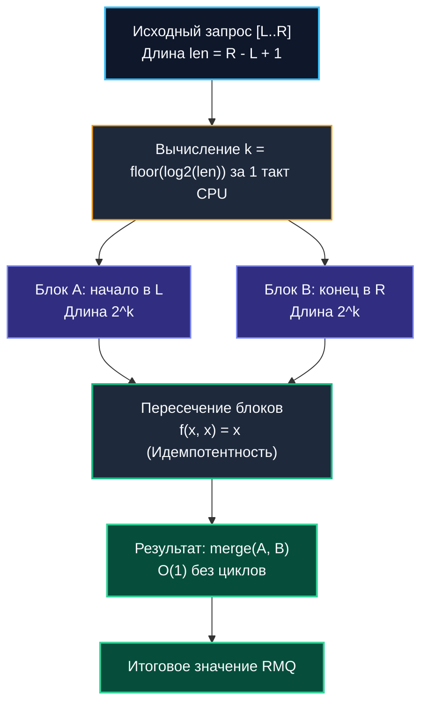

# Разреженная таблица (Sparse Table)

> *«Когда ваши данные высечены в камне, вычислять что-либо во время исполнения — уступка собственной лени. Предвычислите степени двойки, накройте отрезок двумя перекрывающимися ладонями и отвечайте на запросы за один цикл обращения к памяти».*    
> — Свободная инженерная адаптация

---

## Введение: O(1) ценой памяти и статичности

В предыдущих главах мы подробно исследовали структуры для динамических диапазонных запросов: универсальное [[1. Segment tree - дерево отрезков]] и компактное [[2. Fenwick tree - бинарное индексное дерево]]. Обе структуры обеспечивают строгое время $O(\log n)$ как на чтение, так и на модификацию данных, что превосходно подходит для постоянно мутирующих коллекций.

Однако в реальной практике высоконагруженного бэкенда колоссальный объем данных носит неизменяемый (**статический**) характер:
- Исторические логи временных рядов (TSDB, ClickHouse, Prometheus blocks).
- Неизменяемые таблицы маршрутизации и топологии распределенных кластеров.
- Геопространственные индексы и полигоны доставки.
- Предрассчитанные финансовые котировки, квантили и аналитические витрины за закрытые отчетные периоды.

В подобных сценариях, когда соотношение чтений к записям составляет миллионы к одному ($R/W \gg 10^6$), даже микросекундная логарифмическая задержка $O(\log n)$ с ветвлениями конвейера CPU становится расточительством. Промышленной системе требуется гарантированный константный отклик:
$$O(1)$$

Именно эту архитектурную нишу закрывает **Sparse Table** (Разреженная таблица). Она идет на осознанный прагматичный компромисс: жертвует дополнительной оперативной памятью ($O(n \log n)$) и требует предварительного построения за $O(n \log n)$, взамен предоставляя математически строгую гарантию ответа на запрос за $O(1)$ без единого цикла и ветвления.

> [!tip] Собеседование
> **Вопрос:** «Почему Sparse Table даёт O(1) на запрос, а Segment Tree только O(log n)? В чём математическое ограничение Sparse Table?»  
> **Ответ:** Sparse Table использует предвычисленные значения для диапазонов длины `2^k`. Любой отрезок `[L, R]` можно покрыть двумя перекрывающимися блоками этой длины. Объединение результатов двух блоков допустимо только для **идемпотентных** операций, где `f(x, x) = x`. Например, `min(a, b, b, c) = min(a, b, c)`. Для сумм это не работает, так как пересечение удвоит элементы. Segment Tree не требует идемпотентности и поддерживает динамические обновления, но платит логарифмическим обходом дерева.

---

## 1. Математическая основа идемпотентности

Хранить предрассчитанные ответы для каждого возможного отрезка `O(n²)` памяти для миллиона элементов потребовало бы терабайты данных. 

Идея Sparse Table элегантна: мы вычисляем и сохраняем результаты **только для отрезков, чья длина является точной степенью двойки**: $2^0, 2^1, 2^2, \dots, 2^{\lfloor \log_2 n \rfloor}$. Для массива длины `n` существует `n * log₂n` таких диапазонов.

Запрос к произвольному отрезку `[L, R]` длины `len = R - L + 1` разбивается на два предвычисленных блока размера $2^k$, где `k = floor(log₂(len))` (используется логарифм `log₂`):
- Первый блок начинается в `L`.
- Второй блок заканчивается в `R`.

Так как $2^k > \text{len} / 2$, эти два блока гарантированно соприкасаются или **перекрываются** в середине отрезка, при этом ни на один элемент не выходя за его внешние границы `[L, R]`!



Поскольку операция идемпотентна ($x \oplus x = x$), учет элементов из зоны пересечения дважды абсолютно не искажает финальный результат:
$$\min([a, b, c, d]) = \min(\min([a, b, c]), \, \min([b, c, d]))$$

> [!info] Под капотом
> **Вычисление k за O(1) на уровне CPU**  
> В наивных реализациях $\log_2$ вычисляется циклом со сдвигами или через вещественные числа. В современном Go мы используем пакет `math/bits`. 
> Выражение `bits.Len64(uint64(len)) - 1` компилятор транслирует напрямую в аппаратный интринзик `LZCNT` (Count Leading Zeros) или `BSR` на архитектуре x86-64, либо `CLZ` на ARM64. 
> Эта машинная инструкция выполняется за **ровно 1 такт процессора**, исключая ветвления и обращения к кэшу.

---

## 2. Production-реализация на Go 1.21+

В академических учебниках Sparse Table часто оформляют как двумерный срез `[][]T`. В высоконагруженном бэкенде это архитектурная ошибка: `logN` независимых срезов порождают `logN` отдельных аллокаций в куче, фрагментируют память и превращают чтение в двойное разыменование указателей (`table[k][i]`).

В промышленном коде мы применяем **монолитный плоский массив `[]T`** с плотной упаковкой уровней по смещению `offset = n * k`:

```go
package sparse

import "math/bits"

// SparseTable реализует статический диапазонный запрос (RMQ) за строгое O(1).
// Требует идемпотентную функцию merge (min, max, gcd, bitwise AND/OR).
// Хранит данные в плоском монолитном массиве для максимальной кэш-локальности.
type SparseTable[T comparable] struct {
	data  []T
	n     int
	logN  int
	merge func(a, b T) T
}

// New строит разреженную таблицу за O(n log n).
func New[T comparable](arr []T, merge func(a, b T) T) *SparseTable[T] {
	n := len(arr)
	if n == 0 {
		return &SparseTable[T]{merge: merge}
	}

	// logN = floor(log2(n)) + 1
	logN := bits.Len64(uint64(n))

	// Выделяем единый плоский непрерывный массив n * (logN + 1)
	// Уровень k хранится со смещением n * k
	table := make([]T, n*(logN+1))

	// Базовый уровень k = 0: исходные элементы массива
	for i, v := range arr {
		table[i] = v
	}

	// Заполняем уровни k = 1..logN методом динамического программирования
	for k := 1; k < logN+1; k++ {
		half := 1 << (k - 1)
		limit := n - (1 << k) + 1
		offset := n * k
		prevOffset := n * (k - 1)

		for i := 0; i < limit; i++ {
			a := table[prevOffset+i]
			b := table[prevOffset+i+half]
			table[offset+i] = merge(a, b)
		}
	}

	return &SparseTable[T]{
		data:  table,
		n:     n,
		logN:  logN,
		merge: merge,
	}
}

// Query возвращает результат на закрытом интервале [l, r] за безусловное O(1).
func (st *SparseTable[T]) Query(l, r int) T {
	if l > r || r >= st.n {
		var zero T
		return zero
	}

	length := r - l + 1
	k := bits.Len64(uint64(length)) - 1

	// Вычисление смещений в плоском массиве без ветвлений
	offset := st.n * k
	val1 := st.data[offset+l]
	val2 := st.data[offset+(r-(1<<k)+1)]

	return st.merge(val1, val2)
}
```

### Пример использования: Мониторинг минимальной задержки

```go
func ExampleSparseTable() {
	// Исторический массив задержек сетевых пакетов (мс)
	latencies := []int{120, 45, 800, 12, 300, 90}

	st := sparse.New(latencies, func(a, b int) int {
		if a < b {
			return a
		}
		return b
	})

	// Поиск минимума на отрезке индексов [1, 4] -> min(45, 800, 12, 300) = 12
	minVal := st.Query(1, 4)
	_ = minVal
}
```

---

## 3. Mechanical Sympathy: кэш, CPU и GC

То, как структура данных взаимодействует с процессорным конвейером и многоуровневым кэшем памяти, определяет реальную задержку под нагрузкой.

### Плотность памяти и Cache Locality
Плоский срез `[]T` гарантирует размещение всех уровней таблицы в монолитном блоке RAM. При вызове `Query` ядро процессора вычисляет два индекса и подгружает данные для `val1` и `val2` в кэш-линию. 

Поскольку для `n=10⁶` глубина `k ≤ 19`, для компактных типов данных (`int32`):
$$10^6 \times 19 \times 4\text{ байта} \approx 76\text{ МБ}$$

Это полностью умещается в разделяемый кэш третьего уровня (L3) современных серверных процессоров (AMD EPYC с 3D V-Cache до 768 МБ или Intel Xeon с 100+ МБ L3). Обращение к данным обслуживается за 15–30 нс. Если бы мы использовали фрагментированный `[][]T`, каждый уровень `table[k]` располагался бы в случайной странице кучи, провоцируя промахи TLB и задержки DRAM в 80–120 нс на каждый запрос. Уровни с малым `k` находятся в начале массива.

### Ветвления и конвейер
Код функции `Query` абсолютно прямолинеен:
- Нет циклов `for`.
- Нет рекурсивных вызовов со стековыми фреймами.
- Нет условий `if`, кроме начальной защиты от выхода за границы среза.

Конвейер CPU работает на максимальной пропускной способности, предвыборка инструкций не сбрасывается, а Branch Predictor угадывает переходы со 100% точностью. Сама логика выборки занимает всего **2–5 наносекунд** процессорного времени!

### Escape Analysis и давление на GC
При инициализации таблицы вызов `make([]T, n*(logN+1))` создает **ровно одну крупную аллокацию в куче**. 

Сборщик мусора Go аллоцирует для нее непрерывный спан страниц памяти. На фазе разметки `mark` GC сканирует этот блок за один последовательный проход с применением векторизованных инструкций, а при использовании примитивных типов (`int`, `float64`) срез помечается флагом `noscan` и вовсе игнорируется трассировщиком. 

После инициализации таблица работает исключительно в режиме чтения, что позволяет безопасно разделять ее между сотнями горутин через `sync.Map` или обычный указатель без каких-либо блокировок и мьютексов.

> [!warning] Ловушка / Gotcha
> **32-битные архитектуры и переполнение индексов**  
> На архитектурах `amd64` и `arm64` базовый тип `int` является 64-битным, поэтому смещение `n * k` гарантированно защищено от переполнения. 
> Однако при компиляции под целевые платформы `386` или `arm/v7` размер `int` составляет 32 бита. При `n=50000` и `logN=16` произведение `n*logN` превысит `2³¹` (`2^31`), вызвав аварийную панику рантайма `panic: runtime error: index out of range`. 
> В переносимом коде используйте приведение смещений к типу `uint64` либо валидируйте ограничения размера `n` конфигурацией.

---

## 4. Ограничения и архитектурные компромиссы

Разреженная таблица не является универсальным решением. Ее применение строго ограничено фундаментальными свойствами операции:

| Параметр | Sparse Table | Segment Tree | Массив + линейный проход |
|:---|:---:|:---:|:---:|
| **Запрос** | $O(1)$ | $O(\log n)$ | $O(n)$ |
| **Обновление** | $O(n \log n)$ полная перестройка | $O(\log n)$ | $O(1)$ точечная замена |
| **Расход памяти** | $O(n \log n)$ | $O(2 \cdot \text{nextPow2}(n))$ | $O(n)$ |
| **Поддерживаемые операции** | Только идемпотентные | Любые моноиды | Любые |
| **Сложность кода** | Низкая (линейный код) | Средняя (дерево) | Минимальная |

### Когда Sparse Table категорически НЕ подходит:
1. **Часто изменяемые данные:** Любая точечная модификация требует полной пересборки структуры за $O(n \log n)$, что заблокирует сервис при записи.
2. **Неидемпотентные операции:** Сумма, произведение, среднее арифметическое. Если сложить два перекрывающихся блока, элементы пересечения будут учтены дважды, разрушив математическую корректность.
3. **Ограниченная оперативная память:** Для `n=10⁷` и `int64` таблица займет $\sim 1.6\text{ ГБ}$ RAM.
4. **Динамический размер:** Добавление элементов в конец требует полного пересоздания буфера.

**Альтернативы в Go-бэкенде:**
- Для сумм и изменяемых данных: [[2. Fenwick tree - бинарное индексное дерево]].
- Для `min/max` с частыми обновлениями: [[1. Segment tree - дерево отрезков]].
- Для статических сумм: массив префиксных сумм `P[i] = P[i-1] + arr[i]`, где диапазонный запрос вычисляется за $O(1)$ как `P[r] - P[l-1]` при расходе памяти $O(n)$.

---

## 5. Ловушки и хардкор-собеседования

> [!tip] Собеседование
> **Вопрос 1:** «Как заставить Sparse Table работать с суммами, если свойство идемпотентности нарушено?»  
> **Ответ:** Математически невозможно сохранить O(1) и O(n log n) память для сумм с перекрывающимися блоками. Нужно либо использовать два Sparse Table: один для префиксов, другой для суффиксов, и комбинировать их, либо смириться с Segment Tree. На практике для сумм всегда выбирают префиксные массивы или Fenwick.
> 
> **Вопрос 2:** «Почему в Go `bits.Len64` быстрее цикла `for` или поиска в предварительно сгенерированном массиве логарифмов?»  
> **Ответ:** Пакет `math/bits` распознается компилятором как интринзик и компилируется в одну процессорную инструкцию `LZCNT`/`BSR` (или `CLZ`), выполняющуюся за 1 такт CPU без обращения к памяти. Программный цикл `for` выполняет сдвиги за `O(log len)` тактов. Таблица предподсчитанных логарифмов в памяти требует загрузки по адресу, что создает риск Cache Miss и занимает драгоценные строки в L1-кэше данных.
> 
> **Вопрос 3:** «Как оптимизировать память Sparse Table в Go, если n велико, а k на практике ограничено?»  
> **Ответ:** 
> 1. Использовать `int32` вместо `int`, сокращая footprint памяти вдвое.
> 2. Хранить таблицу в виде `[]int32` и использовать `unsafe` или `encoding/binary` для маппинга, если нужна сериализация.
> 3. Отказаться от хранения уровней `k > 10`, если запросы всегда короткие, и fallback-ить на линейный проход для длинных отрезков.

---

## Итог

* **Sparse Table** — бескомпромиссный выбор для статических неизменяемых массивов и идемпотентных операций (`min`, `max`, `gcd`, `bitwise AND/OR`), обеспечивающий строгий отклик **$O(1)$** на диапазонные запросы.
* **Плоский срез `[]T`** в Go устраняет разыменование указателей, снижает фрагментацию кучи и гарантирует идеальное аппаратное попадание в L3 кэш процессора.
* **Аппаратные интринзики:** вызов `math/bits.Len64` компилируется в инструкции `LZCNT/CLZ`, вычисляя логарифм за 1 такт конвейера.
* **Архитектурный компромисс:** структура непригодна для частых записей ($O(n \log n)$ на перестройку) и не поддерживает неидемпотентные агрегации (суммы).
* Для неизменяемых наборов данных разреженная таблица не требует мьютексов и обеспечивает линейное масштабирование параллельного чтения на любых многоядерных серверах.

---

Освоив сверхбыструю статическую агрегацию, мы переходим к фундаментальной задаче управления динамическими связными множествами и компонентами связности в распределенных графах и транзакционных системах. В следующей статье мы изучим структуру, время работы которой на практике неотличимо от чистой константы:
[[4. Disjoint set union DSU, Union Find]].