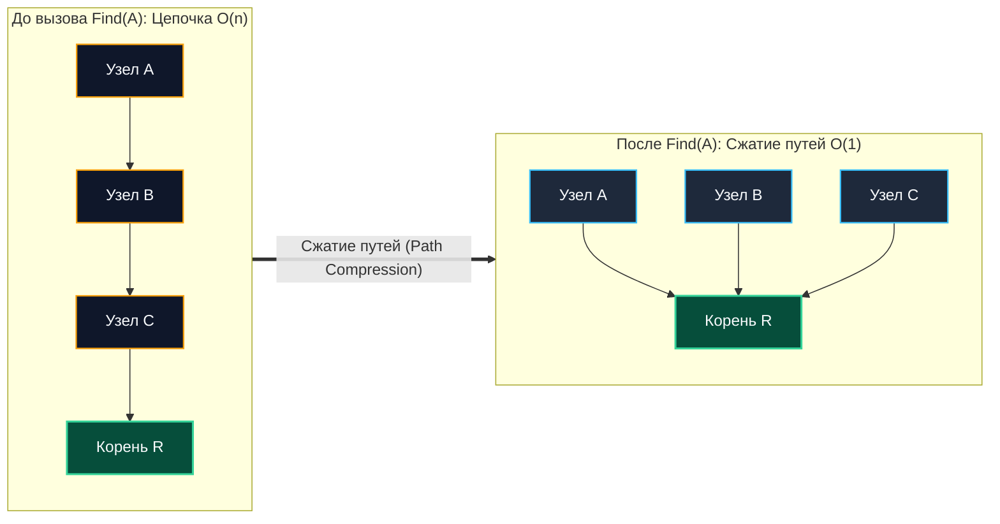
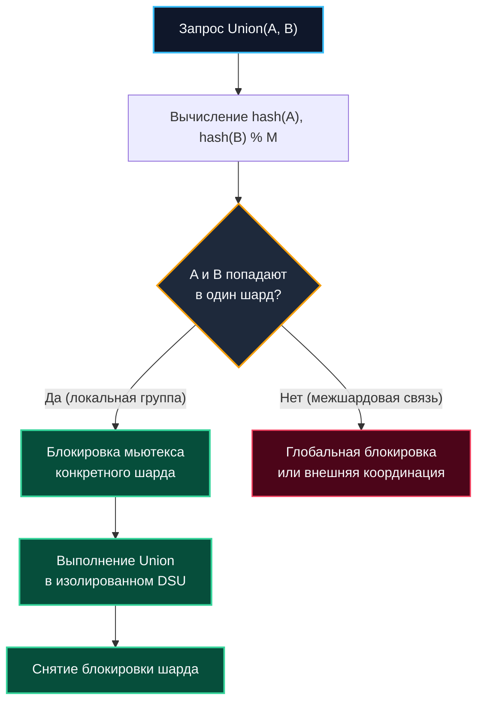

# Система непересекающихся множеств (DSU / Union-Find)

> *«В программировании, как и в жизни, выяснение главы группы и слияние двух организаций совершаются за практически константное время — при условии, что каждый участник ссылается прямо на верховного лидера».*    
> — Свободная инженерная адаптация

---

## Введение: от теории графов к динамической связности

Система непересекающихся множеств (**Disjoint Set Union**, или **Union-Find**) нередко ошибочно воспринимается как олимпиадная структура, ограниченная алгоритмом Крускала для построения минимального остовного дерева. В архитектуре распределенных высоконагруженных бэкенд-систем DSU решает фундаментальную задачу **отслеживания динамической связности и группировки объектов**:
- **Распределенные кластеры:** Мониторинг топологии и связности сотен узлов, обнаружение сетевых расщеплений (Split-Brain) и расчет маршрутов в протоколах сплетен (Gossip).
- **СУБД и транзакционные движки:** Построение ориентированных графов ожидания транзакций (Wait-For Graphs) и мгновенное выявление взаимных блокировок (Deadlock Detection).
- **Социальные графы и антифрод:** Кластеризация пользователей по цифровым отпечаткам, выявление ферм ботов и групп аффилированных лиц в реальном времени.
- **Инфраструктурный инжиниринг:** Динамическое объединение виртуальных сетей (VPC Peering) и управление квотами по пулам ресурсов.

Главная теоретическая и практическая ценность DSU — способность отвечать на вопрос «принадлежат ли два элемента одной группе?» и объединять две произвольные группы за **практически константное время**:
$$O(\alpha(n))$$

где $\alpha$ — обратная функция Аккермана. Функция $\alpha(n)$ растет столь медленно, что для любого мыслимого физического объема данных во Вселенной (вплоть до `10^18` элементов) ее значение строго ограничено:
`α(n) ≤ 4`

Это делает DSU асимптотически одной из быстрейших структур данных в Computer Science, однако ее реальная производительность на физическом кремнии всецело определяется компактностью представления в памяти рантайма Go.

> [!tip] Собеседование
> **Вопрос:** «Почему DSU с оптимизациями имеет сложность O(α(n)), а не O(1)? И почему на практике мы считаем это константой?»  
> **Ответ:** Обратная функция Аккермана растет настолько медленно, что даже для астрономического числа `n = 10^100` ее значение равно 5. Математически это не абсолютно строгий $O(1)$, так как глубина шагов зависит от перестройки высоты дерева при вызове сжатия путей. Но для любых инженерных ограничений (вплоть до `10^18` элементов) она ведет себя как константа. В практических бенчмарках и production-метриках DSU стабильно демонстрирует чистую $O(1)$ латентность после первичной волны сжатия путей.

---

## 1. Алгоритмическое ядро: сжатие путей и объединение по рангу

В наивной реализации без эвристик деревья отношений вырождаются в вытянутые связные списки глубины $O(n)$, превращая процедуру `Find` в медленный линейный поиск $O(n)$, а серию из $n$ операций `Union` — в квадратичные $O(n^2)$.

Превращение DSU в структуру с практически мгновенным откликом строится на двух независимых, но взаимно усиливающих оптимизациях:

### Path Compression (Сжатие путей)
При вызове операции `Find(x)` мы поднимаемся от элемента $x$ вверх к главному корню-представителю. На обратном пути мы принудительно перенаправляем ссылки всех пройденных узлов напрямую на корень. В результате дерево мгновенно уплощается: его глубина становится равной 1, а все последующие обращения к этим узлам выполняются за физическое $O(1)$.



### Union by Rank/Size (Объединение по рангу или размеру)
При слиянии двух деревьев корень меньшего дерева (по высоте ранга или количеству элементов `size`) прикрепляется к корню большего дерева. Это гарантирует, что глубина дерева никогда не превысит $\log_2 n$ даже без сжатия путей.

В промышленном Go-бэкенде предпочтительнее использовать именно **Union by Size**:
1. Размер компоненты связности (`size[root]`) практически всегда востребован прикладной бизнес-логикой (например, расчет размера кластера пользователей или квоты тенанта).
2. Подход **Union by Rank** требует отдельного массива рангов, который не несет никакой полезной смысловой нагрузки вне алгоритма.

---

## 2. Production-реализация на Go 1.21+

Использование указателей и отдельных структур узлов:
```go
// Антипаттерн для high-load:
type Node struct {
    Parent *Node
    Size   int
}
```
в Go считается грубейшим архитектурным просчетом. Миллионы разрозненных объектов в куче разрушают кэш-линии процессора и парализуют [[7. Глубокий Go (Внутреннее устройство)|сборщик мусора]].

Промышленный стандарт Go — **два параллельных монолитных среза**: `parent []int` и `size []int`. Индексами выступают целочисленные идентификаторы элементов от $0$ до $n-1$:

```go
package dsu

import "errors"

// DSU реализует структуру непересекающихся множеств.
// Оптимизирована для Go: использует плоские массивы и Union by Size.
type DSU struct {
	parent []int
	size   []int
	n      int
}

// New создаёт DSU для n элементов. Элементы пронумерованы от 0 до n-1.
func New(n int) (*DSU, error) {
	if n <= 0 {
		return nil, errors.New("dsu: size must be positive")
	}

	d := &DSU{
		parent: make([]int, n),
		size:   make([]int, n),
		n:      n,
	}

	// Инициализация: каждый элемент изначально является собственным корнем
	for i := range d.parent {
		d.parent[i] = i
		d.size[i] = 1
	}

	return d, nil
}

// Find возвращает идентификатор представителя множества для элемента x.
// Применяет итеративное двухпроходное сжатие путей (Path Compression).
// Временная сложность: O(α(n)).
func (d *DSU) Find(x int) (int, error) {
	if x < 0 || x >= d.n {
		return 0, errors.New("dsu: index out of range")
	}

	// Первый проход: находим абсолютный корень
	root := x
	for d.parent[root] != root {
		root = d.parent[root]
	}

	// Второй проход: перепривязываем всех предков напрямую к корню
	for x != root {
		next := d.parent[x]
		d.parent[x] = root
		x = next
	}

	return root, nil
}

// Union объединяет множества, содержащие элементы x и y.
// Возвращает true, если произошло слияние, и false, если элементы уже в одной группе.
func (d *DSU) Union(x, y int) (bool, error) {
	rootX, err := d.Find(x)
	if err != nil {
		return false, err
	}
	rootY, err := d.Find(y)
	if err != nil {
		return false, err
	}

	// Элементы уже принадлежат одному компоненту связности
	if rootX == rootY {
		return false, nil
	}

	// Union by Size: поддерево с меньшим весом прикрепляется к большему
	if d.size[rootX] < d.size[rootY] {
		rootX, rootY = rootY, rootX
	}

	d.parent[rootY] = rootX
	d.size[rootX] += d.size[rootY]

	return true, nil
}
```

> [!tip] Итерация против рекурсии
> Итеративный `Find` в Go принципиально надежнее рекурсивного: он не расходует стек горутины (начальный стек всего 2 КБ), исключает риск переполнения стека (Stack Overflow) до фазы сжатия и компилируется в плотный ассемблерный цикл без создания стековых фреймов.

---

## 3. Mechanical Sympathy: кэш, GC и рантайм

Архитектурные свойства DSU на реальном оборудовании кардинально отличаются от академических абстракций.

### Пространственная локальность и кэш-линии
Массивы `parent` и `size` лежат в непрерывных блоках RAM. При `Find` происходит последовательный доступ `parent[x]`, `parent[parent[x]]`. 

После первой же серии запросов срабатывает алгоритм сжатия путей (**path compression**), после чего подавляющее большинство ссылок указывают на единичные корни-представители. Эти корни оседают в ультрабыстром кэше L1 данных ядер процессора. 

Для `n=10^6` элементов массив занимает ~4 МБ (`int32`) или ~8 МБ (`int` на amd64), что полностью помещается в кэш третьего уровня L3 любого серверного процессора.

### Сборка мусора и аллокации
При выполнении конструктора `New(n)` происходит **две крупные аллокации** в куче:
- Сборщик мусора Go видит два больших непрерывных span'а. Фаза `mark` проходит по ним за счёт векторизованных инструкций, проверяя скаляры (в которых нет указателей).
- Нулевое дробление памяти. Нет миллионов мелких объектов, которые фрагментируют кучу и увеличивают время `STW`.
- Если DSU создается в обработчике HTTP-запроса и возвращается наружу, компилятор при `Escape Analysis` честно аллоцирует его в кучу. Для hot-path сервисов используйте `sync.Pool` для переиспользования экземпляров DSU фиксированного размера.

> [!info] Под капотом
> **Почему int, а не uint?**  
> На 64-битной архитектуре amd64 типы `int` и `uint` занимают идентичные 8 байт. Однако знаковые целочисленные проверки `x < 0` компилируются процессором в более эффективные знаковые инструкции сравнения. 
> Кроме того, стандартная библиотека Go использует знаковый `int` для срезов (`len(slice)`), поэтому выбор `int` устраняет паразитные приведения типов и снижает риск ошибок проверки границ.

---

## 4. Конкурентность в Go: шардирование против мьютексов

DSU по своей природе является динамически мутирующей структурой данных. Прямое оборачивание `Find/Union` в `sync.Mutex` создаёт сериализацию всех операций. При интенсивности трафика свыше `>10k RPS` мьютекс становится точкой отказа, горутины уходят в `futex`-парковку, а задержка $p99$ взлетает.



### Архитектурные паттерны масштабирования DSU:
1. **Шардирование (Sharded DSU):** Диапазон идентификаторов `[0, n)` разбивается на $M$ независимых секторов. Каждый шард содержит собственный экземпляр `DSU` и защищен своим `sync.RWMutex`. Метод роутит запросы по ключу `hash(id) % M`. Это снижает конкуренцию за лок ровно в $M$ раз.
2. **Read-Only Snapshots (Copy-On-Write):** Если операции `Union` происходят редко, а `Find` выполняются непрерывно, обновление структуры организуется через создание новой копии с последующей атомарной подменой указателя через `atomic.Pointer[DSU]`. Читатели получают абсолютно lock-free доступ.
3. **Атомики для ячеек `parent`:** Использование атомарных типов (`atomic.Int32`) теоретически возможно, но алгоритм `Find` требует одновременного чтения двух указателей и цикла `CAS`. При высокой конкуренции это приводит к катастрофическому Livelock. Шардирование на практике всегда обеспечивает больший throughput.

> [!warning] Ловушка / Gotcha
> **Кросс-шардовые объединения (Cross-Shard Union)**  
> Шардирование разрушает глобальную топологию графа. Если вам требуется связать элементы, принадлежащие разным шардам, локальный DSU неприменим.  
> Для поддержания глобальной связности на уровне распределенного кластера применяйте консенсусные протоколы (Raft) или распределенные графовые движки. Попытка синхронизировать несколько шардов каскадными взаимными мьютексами неизбежно завершится взаимной блокировкой (Deadlock).

---

## 5. Ловушки и вопросы с собеседований

> [!tip] Собеседование
> **Вопрос 1:** «Что произойдет, если в реализации DSU отключить сжатие путей и объединение по рангу/размеру?»  
> **Ответ:** Дерево выродится в линейный связный список. Вызов `Find` замедлится до худшего времени $O(n)$, а последовательность из $n$ слияний `Union` потребует квадратичного времени $O(n^2)$. В бэкенде это обернется неконтролируемым падением пропускной способности при росте нагрузки.
> 
> **Вопрос 2:** «Почему в Go `Find` реализован итеративно, а не рекурсивно, как в большинстве академических учебников?»  
> **Ответ:** Рекурсивный обход расходует стек горутины, базовый размер которого в Go составляет всего 2 КБ. До проведения первой фазы сжатия глубина дерева может достигать $O(n)$, что спровоцирует дорогостоящее расширение стека (stack growth) или панику рантайма при нехватке памяти. Итеративный подход оперирует регистрами CPU, предсказуем по памяти и компилируется в прямолинейный ассемблерный цикл.
> 
> **Вопрос 3:** «Как проверить, принадлежат ли два элемента одному множеству, за O(1)?»  
> **Ответ:** Достаточно вызвать `Find(x)` и `Find(y)` и проверить предикат `Find(x) == Find(y)`. Если корни-представители совпали — элементы гарантированно входят в одну связную группу. Сложность проверки определяется вызовом `Find`, то есть $O(\alpha(n))$, что на практике тождественно $O(1)$.
> 
> **Вопрос 4:** «Сравните DSU и [[11. Графы/1. Представление графов|граф смежности]] для поиска связных компонентов.»  
> **Ответ:** Граф смежности требует полного обхода графа (BFS/DFS) за время $O(V + E)$ и не поддерживает инкрементального добавления ребер без повторного пересчета. DSU функционирует потоково: каждое новое ребро добавляется через `Union(u, v)` за $O(\alpha(n))$, а связность проверяется за $O(1)$. Для статических графов предпочтительны BFS/DFS, для динамических потоков ребер — DSU.

---

## Итог

* **DSU (Union-Find)** — безупречная структура данных для инкрементального управления динамическими множествами и мгновенной проверки связности.
* В Go DSU строится на базе **плоских монолитных срезов `[]int`** (`parent` и `size`), категорически отвергая указательные узлы. Это гарантирует непревзойденную локальность кэша и нулевое давление на GC.
* Комбинация **итеративного сжатия путей (Path Compression)** и **объединения по размеру (Union by Size)** обеспечивает теоретическую и практическую сложность $O(\alpha(n)) \approx O(1)$.
* **Конкурентность:** достигается через шардирование по хешу идентификатора или lock-free снапшоты через `atomic.Pointer`. Избегайте единых глобальных мьютексов.
* **Ограничение:** DSU не поддерживает операцию разделения множеств (`Split`), удаление единичных элементов и кросс-шардовые объединения без полной пересборки.

---

Мы детально изучили динамическую связность и группировку множеств. В следующей статье мы перейдем к структуре, которая сочетает упорядоченность массива с быстротой вставки связного списка, заменяя сложные балансировки красно-черных деревьев вероятностными многоуровневыми прыжками и идеально подходя для lock-free структур в базах данных (LevelDB, RocksDB, Redis):
[[5. Skip list]].