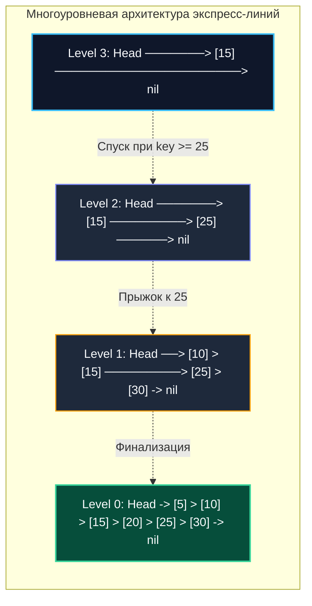

# Список с пропусками (Skip List)

> *"Why bother with complex tree rotations, color invariants, and cascading rebalances, when flipping an honest coin at each insertion yields logarithmic elegance and natural concurrency?"*  
> — Свободная инженерная адаптация

---

## Введение: Вероятностная альтернатива сбалансированным деревьям

В мире высокопроизводительных хранилищ данных сбалансированные деревья поиска (AVL, красно-черные деревья, B-деревья) десятилетиями считались золотым стандартом для поддержания сортированных коллекций и вторичных индексов. Однако их ахиллесова пята проявляется в многопоточной среде: **чрезвычайная сложность организации конкурентного доступа**. 

Любая операция вставки или удаления в красно-черном дереве может инициировать цепочку поворотов и перекрасок узлов, затрагивающую корень и обширные поддеревья. Чтобы предотвратить состояние гонки, поток вынужден блокировать монопольным мьютексом всё дерево целиком (или применять изощренные протоколы Lock Couplings), что при интенсивной параллельной записи приводит к разрушительному Contention и деградации латентности на $p99.9$.

**Skip List (Список с пропусками)**, предложенный Уильямом Пью в 1989 году, решает эту фундаментальную проблему через элегантную **вероятностную балансировку**. Вместо детерминированных жестких правил балансировки высота каждого узла определяется случайным образом по закону геометрического распределения (подбрасыванием «монеты»). 

В среднем это обеспечивает то же гарантированное логарифмическое время:
$$O(\log n)$$

на поиск, вставку и удаление, что и у классических деревьев, но ценой радикально более простого кода и естественной предрасположенности к неблокирующим (lock-free) алгоритмам.

Именно поэтому Skip List стал фундаментальным строительным блоком современных промышленных баз данных:
- `Redis`: реализация сортированных множеств (**ZSET**).
- `LevelDB` и `RocksDB`: организация оперативной таблицы мутаций (**MemTable**).
- Java Standard Library: `ConcurrentSkipListMap`.
- Высоконагруженные Key-Value движки и распределенные кэши в экосистеме Go (BadgerDB, BuntDB).

> [!tip] Собеседование
> **Вопрос:** «Почему в Redis для Sorted Sets используется Skip List, а не B-дерево или хеш-таблица?»  
> **Ответ:** Хеш-таблица даёт $O(1)$ по ключу, но не поддерживает диапазонные запросы и ранжирование. B-дерево оптимизировано под дисковые страницы, а Redis работает в RAM. Skip List занимает меньше памяти, чем полноценное красно-черное дерево, и критически важно: его уровни позволяют эффективно выполнять операции `ZRANGEBYSCORE` и `ZREM` без полной блокировки структуры. Кроме того, реализация Skip List проще, что уменьшает поверхность багов в ядре БД.

---

## 1. Архитектура экспресс-полос и геометрическое распределение

Физическая модель списка с пропусками аналогична многоуровневой транспортной сети железных дорог:
- **Нижний уровень (Level 0):** Обычный односвязный сортированный список, содержащий 100% элементов («пригородная электричка», останавливающаяся на каждом полустанке).
- **Каждый последующий уровень `i`:** является подмножеством уровня `i-1`, куда каждый элемент переходит с вероятностью `p` (обычно `p=0.5`).
- **Уровень 1 (Level 1):** Экспресс-линия, где останавливается каждый 2-й поезд.
- **Уровень 2 (Level 2):** Скоростной экспресс (каждый 4-й элемент).
- **Уровень $k$ (Level $k$):** Сапсан, соединяющий только узловые станции с шагом $2^k$.

Поиск начинается с максимального верхнего уровня `head`. Алгоритм движется вправо по экспресс-линии до тех пор, пока ключ следующего узла строго меньше искомого. Как только следующий элемент оказывается больше или равен цели, поиск «спускается» на один уровень вниз и повторяет горизонтальный проход. Таким образом, верхние слои отсекают гигантские диапазоны данных за 1–2 шага.



### Геометрическое распределение высоты узлов
Высота создаваемого узла вычисляется бросанием виртуальной монетки: пока выпадает «орел», уровень увеличивается на 1.
Математическое ожидание числа уровней для узла выражается формулой:
`1 / (1-p)`

При `p=0.5` средний узел содержит всего $1 / (1-0.5) = 2$ указателя. Вероятность того, что узел достигнет аномальной высоты в 20 уровней, ничтожно мала:
`2^{-20} ≈ 10^{-6}`
что математически гарантирует невозможность раздувания узлов при любых производственных нагрузках.

---

## 2. Production-реализация на Go 1.21+

До появления дженериков Skip List в Go часто реализовался через `interface{}` и приведение типов `type assertion`, что порождало скрытые аллокации в куче. С появлением Go 1.21+ мы можем написать строго типизированный контейнер без лишних накладных расходов:

```go
package skiplist

import (
	"math/rand"
	"sync"
)

const (
	maxLevel = 32  // Достаточно для 2^32 ≈ 4 млрд элементов
	p        = 0.5 // Коэффициент геометрического распределения
)

// Node представляет отдельный узел списка с пропусками.
type Node[T comparable] struct {
	key     T
	value   any
	forward []*Node[T] // Массив указателей на следующие узлы каждого уровня
}

// SkipList реализует упорядоченный потокобезопасный контейнер.
type SkipList[T comparable] struct {
	header *Node[T]
	level  int
	mu     sync.RWMutex
	less   func(a, b T) bool
}

// New создаёт пустой экземпляр Skip List.
func New[T comparable](less func(a, b T) bool) *SkipList[T] {
	header := &Node[T]{
		forward: make([]*Node[T], maxLevel),
	}
	return &SkipList[T]{
		header: header,
		level:  1,
		less:   less,
	}
}

// Search находит элемент по ключу за логарифмическое время O(log n).
func (sl *SkipList[T]) Search(key T) (any, bool) {
	sl.mu.RLock()
	defer sl.mu.RUnlock()

	current := sl.header
	// Нисходящий поиск: от максимального текущего уровня вниз до 0
	for i := sl.level - 1; i >= 0; i-- {
		for current.forward[i] != nil && sl.less(current.forward[i].key, key) {
			current = current.forward[i]
		}
	}

	// Проверяем следующий узел на базовом уровне 0
	candidate := current.forward[0]
	if candidate != nil && candidate.key == key {
		return candidate.value, true
	}
	return nil, false
}

// Insert вставляет или обновляет пару ключ-значение за O(log n).
func (sl *SkipList[T]) Insert(key T, value any) {
	sl.mu.Lock()
	defer sl.mu.Unlock()

	// Вспомогательный срез для фиксации предшественников на каждом уровне
	update := make([]*Node[T], maxLevel)
	current := sl.header

	for i := sl.level - 1; i >= 0; i-- {
		for current.forward[i] != nil && sl.less(current.forward[i].key, key) {
			current = current.forward[i]
		}
		update[i] = current
	}

	// Если ключ уже присутствует в коллекции — обновляем значение
	if next := current.forward[0]; next != nil && next.key == key {
		next.value = value
		return
	}

	// Генерируем случайный уровень для нового узла
	randLevel := 1
	for rand.Float64() < p && randLevel < maxLevel {
		randLevel++
	}

	// Если сгенерированный уровень превышает текущий уровень структуры
	if randLevel > sl.level {
		for i := sl.level; i < randLevel; i++ {
			update[i] = sl.header
		}
		sl.level = randLevel
	}

	newNode := &Node[T]{
		key:     key,
		value:   value,
		forward: make([]*Node[T], randLevel),
	}

	// Вставляем узел на всех сгенерированных уровнях
	for i := 0; i < randLevel; i++ {
		newNode.forward[i] = update[i].forward[i]
		update[i].forward[i] = newNode
	}
}
```

### Инженерные акценты реализации:
- **Массив `update`:** Фиксирует точки разреза на каждом уровне, позволяя привязать новый узел локальными операциями за $O(1)$ на уровень.
- **Лимит `maxLevel = 32`:** При $p = 0.5$ емкость структуры покрывает `2^{32} ≈ 4 млрд` записей. Это исключает необходимость динамического ресайза заголовка `header`.

---

## 3. Mechanical Sympathy: память, кэш и указатели

Skip List демонстрирует жесткие инженерные компромиссы при проецировании на кремний процессора.

### Память и указательный оверхед
Каждый узел содержит динамический срез `forward []*Node[T]`. 
На 64-битной архитектуре amd64 срез `forward` аллоцирует `32 * 8 = 256 байт` для указателей на amd64 (при максимальной высоте), плюс 24 байта на заголовок слайса (`ptr`, `len`, `cap`), плюс память самой структуры узла `Node[T]`.

В промышленном продакшене Go для устранения аллокации заголовка среза часто применяют фиксированный массив `[maxLevel]*Node[T]` либо кастомные пулы `sync.Pool`:

```go
// Оптимизация для production: фиксированный массив вместо слайса
type Node[T comparable] struct {
	key     T
	value   any
	level   int
	forward [maxLevel]*Node[T] // Избегаем аллокации slice header
}
```

### Cache Locality и Pointer Chasing
В отличие от плоского массива, узлы Skip List разбросаны по страницам виртуальной памяти кучи. Каждое смещение `current = current.forward[i]` вынуждает ядро процессора разыменовывать указатель (Pointer Chasing). 

Аппаратный Prefetcher CPU не в силах предугадать адрес следующего узла, что неизбежно ведет к задержкам L1/L2 Cache Miss (около 50–100 нс при обращении к DRAM). 

Однако благодаря тому, что горизонтальный проход идет строго вправо в отсортированном порядке, локальность Skip List на практике оказывается заметно выше, чем у хаотичных ветвлений бинарного дерева поиска (BST).

> [!info] Под капотом
> **Escape Analysis и аллокации**  
> Создание `newNode := &Node[T]{...}` внутри метода `Insert` гарантированно покидает локальный фрейм функции (`escape to heap`). Компилятор Go размещает узел в куче. При темпе записи 100 000 RPS это генерирует 100 000 мелких аллокаций в секунду. 
> В современных версиях Go рантайм использует оптимизированный аллокатор `mallocgc` и флаг `GOEXPERIMENT=noframes`, однако для систем со сверхжесткими требованиями к задержкам рекомендуется пулировать узлы через `sync.Pool` или реализовывать блочные арены памяти.

---

## 4. Конкурентность: от fine-grained locks к lock-free

Главное архитектурное превосходство Skip List над сбалансированными деревьями раскрывается в параллельных вычислительных средах.

### Поуровневые блокировки (Fine-Grained Locking)
Вместо захвата единого монопольного мьютекса `sync.RWMutex` на всю коллекцию, можно использовать массив мьютексов `locks[maxLevel]`:
```go
var locks [maxLevel]sync.Mutex
```
При вставке блокируются только те конкретные уровни, на которых модифицируются указатели. Горутины, читающие или пишущие на других высотах, исполняются полностью параллельно. Чтобы исключить взаимные блокировки (Deadlock), захват мьютексов всегда производится в строго упорядоченном направлении: **сверху вниз**.

### Lock-Free архитектура (CAS-протокол Фрейзера)
В высоконагруженных хранилищах (например, MemTable в RocksDB) Skip List строится без блокировок (Lock-Free) на базе пакета `sync/atomic`, `unsafe.Pointer` и атомарных инструкций `CAS` (Compare-And-Swap):
1. Читающие горутины обходят указатели без единой синхронизации.
2. Пишущая горутина подготавливает новый узел и пытается связать указатели через аппаратную инструкцию процессора `atomic.CompareAndSwapPointer`:

```go
// Упрощённый концепт CAS-обновления указателя
for {
    old := atomic.LoadPointer(&node.forward[i])
    // проверяем, что old всё ещё актуален
    if !atomic.CompareAndSwapPointer(&node.forward[i], old, unsafe.Pointer(newNode)) {
        continue // Retry при конфликте горутин
    }
    break
}
```

> [!warning] Ловушка / Gotcha
> **Проблема ABA (ABA Problem) в Lock-Free структурах**  
> Если горутина $A$ прочитала указатель $P$, была вытеснена планировщиком, а горутина $B$ успела удалить узел $P$, вернуть его в ОС и аллоцировать по тому же физическому адресу новый узел, то последующий вызов `atomic.CompareAndSwapPointer` у горутины $A$ успешно сработает, хотя структура данных кардинально изменилась!  
> В Go эта проблема маскируется сборщиком мусора (GC не перевыделяет адрес, пока на него есть живая ссылка в стеке), но при использовании ручного управления памятью через `sync.Pool` или пакет `unsafe` требуется явное версионирование ссылок (Tagged Pointers).

---

## 5. Ловушки production-разработки и собеседования

### Сравнение с фундаментальными альтернативами

| Аспект | Skip List | RB / AVL Tree | Hash Map |
|:---|:---:|:---:|:---:|
| **Поиск** | $O(\log n)$ ожидаемый | $O(\log n)$ гарантированный | $O(1)$ |
| **Диапазонные запросы** | $O(\log n + k)$ | $O(\log n + k)$ | Не поддерживаются |
| **Память** | Высокая (указательный оверхед) | Средняя | Низкая |
| **Конкурентность** | Отличная (fine-grained или lock-free) | Сложная (вращения блокируют дерево) | Отличная (шардирование) |
| **Реализация** | Простая (вероятностная) | Сложная (балансировка) | Стандартная (`map`) |

---

> [!tip] Собеседование
> **Вопрос 1:** «Может ли Skip List выродиться в O(n)? Как это предотвратить в production?»  
> **Ответ:** Да, при крайне неудачных случайных высотах все узлы окажутся на уровне 0. Вероятность этого экспоненциально мала. В production используют криптографически устойчивые PRNG или deterministic hashing от ключа для вычисления высоты, что гарантирует равномерное распределение независимо от паттерна вставки.
> 
> **Вопрос 2:** «Почему Go не включает Skip List в стандартную библиотеку?»  
> **Ответ:** Философия Go: `container/list` и `container/heap` предоставляют примитивы, а не фреймворки. Skip List требует выбора между thread-safety, памятью и lock-free логикой в зависимости от домена. Стандартизация одного варианта заморозила бы API, тогда как индустрия использует кастомные реализации под конкретные SLA.
> 
> **Вопрос 3:** «Как реализовать удаление элемента без остановки всех читателей?»  
> **Ответ:** Использовать логическое удаление: пометить узел флагом `deleted = true` и пропускать его при поиске. Физическое удаление выполнить асинхронно в фоновой горутине или во время следующей вставки, которая обновит указатели `forward`. Это даёт eventual consistency и нулевые блокировки на чтение.

---

## Итог

* **Skip List** — вероятностный шедевр практических структур данных, гарантирующий математическое ожидание $O(\log n)$ на поиск, вставку и удаление без единого поворота дерева.
* В Go промышленным стандартом является использование **фиксированных массивов `[maxLevel]*Node[T]`** вместо срезов для исключения паразитных аллокаций и снижения нагрузки на [[7. Глубокий Go (Внутреннее устройство)|сборщика мусора]].
* **Непревзойденная конкурентность:** локальный характер модификаций делает Skip List идеальной основой для многопоточных шардированных и lock-free структур с пропускной способностью в сотни тысяч RPS.
* **Применение в архитектуре бэкенда:** оперативные таблицы мутаций (LSM MemTable в RocksDB/LevelDB), сортированные множества Redis ZSET, вторичные индексы в памяти и высоконагруженные кэши с ранжированием.

---

Освоив вероятностные многоуровневые списки, мы переходим к структуре, которая сочетает упорядоченность двоичного дерева поиска с инвариантами приоритетной кучи:
[[6. Treap - декартово дерево]].