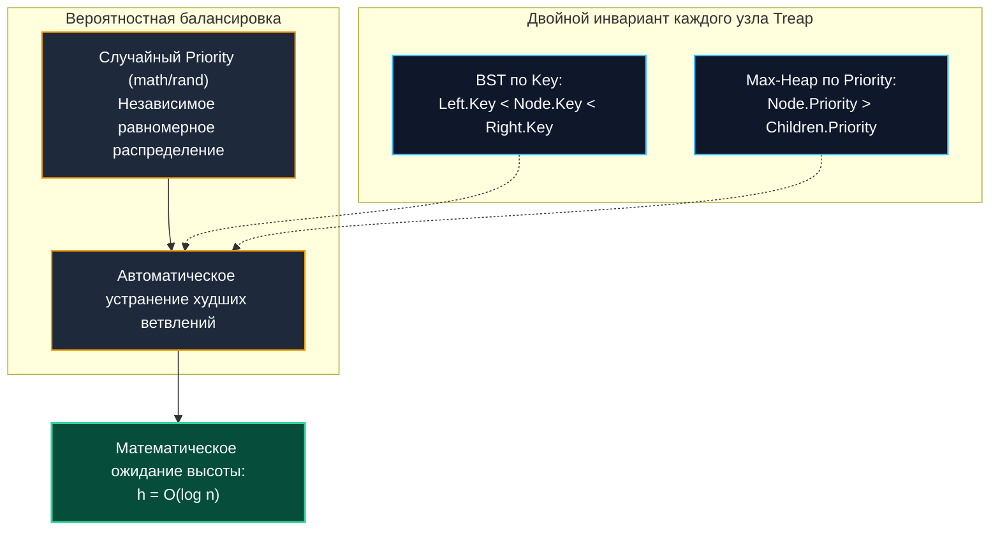

# Декартово дерево (Treap: Tree + Heap)

> *«Красота декартова дерева в том, что оно не борется с хаосом жесткими запретами, а берет случайность в союзники. Упорядочите ключи как в дереве поиска, приоритеты — как в куче, и пусть теория вероятностей заботится о балансе».*    
> — Свободная инженерная адаптация

---

## Введение: Симбиоз BST и Heap

Декартово дерево, или **Treap** (элегантный акроним от **Tree + Heap**), представляет собой гибридную структуру данных. Каждый ее узел несет в себе двойную природу и одновременно подчиняется двум строгим математическим инвариантам:
1. По отношению к **ключам (Keys)** структура является классическим **двоичным деревом поиска (BST)**: все элементы в левом поддереве меньше ключа узла, а в правом — строго больше.
2. По отношению к **приоритетам (Priorities)** структура является **двоичной кучей (Heap)**: приоритет любого родительского узла строго больше приоритетов обоих его непосредственных дочерних потомков (инвариант Max-Heap).

В классических сбалансированных деревьях (AVL, Red-Black Trees) баланс поддерживается сложнейшими детерминированными процедурами вращений (`rotateLeft`/`rotateRight`), контролем цветов и высот. В Treap же балансировка достигается **вероятностным путем**: приоритеты генерируются псевдослучайно при вставке узла. 

В результате форма дерева оказывается эквивалентна дереву поиска, в которое ключи поступали в случайном порядке. Это гарантирует математическое ожидание глубины дерева и времени выполнения основных операций:
$$O(\log n)$$

Для практической инженерии бэкенда Treap ценен двумя фундаментальными свойствами:
1. **Предельная простота реализации:** Вращения полностью заменяются двумя компактными рекурсивными примитивами — разрезанием (**Split**) и слиянием (**Merge**).
2. **Мощь манипуляций с диапазонами:** В форме неявного дерева (Implicit Treap) структура нативно поддерживает вставку в середину, вырезание, слияние и реверс произвольных подотрезков за строгое `O(log n)`, выступая фундаментом для текстовых редакторов, систем контроля версий (VCS) и персистентных функциональных структур данных.

> [!tip] Собеседование
> **Вопрос:** «Почему в некоторых production-системах выбирают Treap вместо красно-чёрного дерева, если у RB-tree гарантированная O log n?»  
> **Ответ:** RB-tree даёт жёсткий worst-case, но сложен в реализации и поддержке. Treap даёт ожидаемую O log n с вероятностью вырождения, экспоненциально малой на практике. Главный выигрыш Treap — простота добавления операций `Split` и `Merge`, которые критичны для функциональных структур данных, работы с диапазонами и построения lock-free copy-on-write версий без сложных блокировок поддеревьев.

---

### 1. Математические инварианты и вероятностная балансировка

Treap обязан соблюдать два строгих правила одновременно:
* **BST-инвариант**: для любого узла все ключи в левом поддереве меньше его ключа, все в правом — больше.
* **Heap-инвариант**: приоритет узла строго больше приоритетов его детей.

При добавлении нового элемента ему присваивается случайный числовой приоритет (через генераторы `math/rand` или `crypto/rand`). Если бы мы вставляли элемент по каноническим правилам BST, инвариант кучи мог бы нарушиться. 

В исторической версии декартова дерева нарушение исправлялось серией локальных вращений вверх к корню. Однако в современной инженерной практике любые вращения полностью упразднены: операции вставки и удаления выражаются через функциональные примитивы `Split` и `Merge`, которые автоматически сохраняют оба инварианта при рекурсивной пересборке затронутых веток.



Математически доказано, что если приоритеты выбираются независимо и равномерно, глубина дерева Treap с вероятностью `1 - O(1/n)` не превышает величины `c * log₂ n`. Это делает его поведение на практике абсолютно неотличимым от идеально сбалансированного двоичного дерева поиска.

---

### 2. Операции Split и Merge: замена вращениям

Ядром алгоритма декартова дерева выступают две элементарные операции, обладающие исключительной выразительностью:

* **`Split(root, key)`**: Разрезает исходное дерево на два независимых поддерева:
  - Левое дерево $L$: содержит все ключи `≤ key`.
  - Правое дерево $R$: содержит все узлы с ключами $> \text{key}$.
  Оба результирующих дерева полностью сохраняют инвариант кучи по приоритетам.
* **`Merge(left, right)`**: Сливает два дерева в единое целое. Предусловие: **все ключи в дереве $left$ обязаны быть строго меньше любого ключа в дереве $right$**. Функция сравнивает приоритеты корней: узел с наибольшим приоритетом становится новым корнем, а оставшееся поддерево рекурсивно прикрепляется к его потомкам.

Временная сложность обеих процедур: `O(h) = O(log n)`, где $h$ — высота дерева.

Любые манипуляции (вставка, удаление, поиск диапазона, изменение подотрезка) выражаются через элегантные композиции `Split` и `Merge` без единого вызова громоздких поворотов.

---

### 3. Production-реализация на Go 1.21+

Ниже представлена промышленная типобезопасная реализация Treap на базе дженериков Go 1.21+:

```go
package treap

import "math/rand"

// Node представляет узел Treap.
// Для исключения лишних аллокаций интерфейсов поля строго типизированы.
type Node[K comparable, V any] struct {
	Key      K
	Value    V
	Priority int64
	Left     *Node[K, V]
	Right    *Node[K, V]
}

// Treap представляет контейнер декартова дерева с настраиваемым компаратором.
type Treap[K comparable, V any] struct {
	root *Node[K, V]
	less func(a, b K) bool
	rand *rand.Rand
}

// New создаёт пустой экземпляр Treap.
func New[K comparable, V any](less func(a, b K) bool) *Treap[K, V] {
	return &Treap[K, V]{
		less: less,
		rand: rand.New(rand.NewSource(rand.Int63())),
	}
}

// Insert добавляет пару ключ-значение. Если ключ уже существует, его значение обновляется.
func (t *Treap[K, V]) Insert(key K, value V) {
	left, right, found := splitByKey(t.root, key, t.less)
	if found != nil {
		found.Value = value
		// Восстанавливаем целостность дерева
		t.root = merge(merge(left, found), right)
		return
	}

	newNode := &Node[K, V]{
		Key:      key,
		Value:    value,
		Priority: t.rand.Int63(),
	}
	t.root = merge(merge(left, newNode), right)
}

// splitByKey разделяет дерево на три компонента: < key, == key, > key.
func splitByKey[K comparable, V any](root *Node[K, V], key K, less func(a, b K) bool) (*Node[K, V], *Node[K, V], *Node[K, V]) {
	if root == nil {
		return nil, nil, nil
	}

	if root.Key == key {
		l := root.Left
		r := root.Right
		root.Left = nil
		root.Right = nil
		return l, root, r
	}

	if less(key, root.Key) {
		l, eq, r := splitByKey(root.Left, key, less)
		root.Left = r
		return l, eq, root
	}

	l, eq, r := splitByKey(root.Right, key, less)
	root.Right = l
	return root, eq, r
}

// merge объединяет два дерева, где все ключи left строго меньше ключей right.
func merge[K comparable, V any](left, right *Node[K, V]) *Node[K, V] {
	if left == nil {
		return right
	}
	if right == nil {
		return left
	}

	// Корень с наивысшим приоритетом побеждает (Max-Heap)
	if left.Priority > right.Priority {
		left.Right = merge(left.Right, right)
		return left
	}

	right.Left = merge(left, right.Left)
	return right
}
```

### Архитектурные детали реализации:
- **`Priority int64`**: 64-битное случайное число, генерируемое через `math/rand.Int63()`. Диапазон от 0 до $2^{63}-1$ полностью исключает коллизии приоритетов в реальных наборах данных.
- **Трехстороннее разделение (`splitByKey`)**: Разрезание сразу на три части ($<, ==, >$) элегантно изолирует узел с искомым ключом, позволяя обновить его `Value` на месте без пересоздания структуры.

---

### 4. Mechanical Sympathy: указатели, кэш и GC

При сопоставлении с физическим устройством памяти и процессора Treap демонстрирует явные аппаратные компромиссы.

#### Проблема Pointer Chasing и промахи L1/L2
Каждое разветвление алгоритма (`root = root.Left`) представляет собой разыменование 64-битного указателя в непредсказуемой области кучи. Для дерева глубиной 30 уровней спуск может потребовать до 30 последовательных чтений из оперативной памяти (DRAM). В противоположность плоским срезам (`slice` или `SegmentTree`), аппаратный префетчер ядер процессора бессилен предугадать ветвления Treap. 

Поэтому Treap выбирают не ради сырой скорости поиска одного ключа (где он уступает хэш-таблицам), а ради уникальных возможностей работы с диапазонами (`Split`/`Merge`).

#### Нагрузка на сборщик мусора Go
Каждый узел `Node[K, V]` является самостоятельным объектом кучи. При интенсивном потоке вставок в 100 000 RPS рантайм Go вынужден аллоцировать 100 000 объектов в секунду. 

На фазе разметки `mark` трехцветный сборщик мусора обязан обойти каждый указатель `Left` и `Right`, раздувая длительность пауз остановки мира (`STW`). 

Для высоконагруженных сценариев узлы пулируют через `sync.Pool` либо задействуют экспериментальные арены памяти (`arena`).

> [!info] Под капотом
> **Выравнивание структуры узла (Struct Alignment)**  
> На архитектуре `amd64` размер `Node[K,V]` зависит от типов. Указатели `Left` и `Right` требуют по 8 байт, поле `Priority int64` — 8 байт. Компилятор Go выравнивает поля по границе 8 байт. Если тип полезной нагрузки `V` является скаляром (например, `int`), он упаковывается компактно. Если же `V` представляет собой слайс или интерфейс, оверхед возрастает до 24–48 байт. Для сокращения внутреннего паддинга (Padding) всегда располагайте поля структуры в порядке убывания их размера.

---

### 5. Неявный Treap: работа с последовательностями

Классический Treap индексирует элементы по явному ключу. **Неявный Treap (Implicit Treap)** делает революционный шаг: он полностью отказывается от хранения явного ключа! 

В качестве виртуального ключа выступает **порядковый номер (индекс) элемента в массиве**. При этом сам индекс в узле не хранится, а динамически вычисляется на лету по формуле:
$$\text{index} = \text{size}(\text{Left}) + 1$$

где размер поддерева `size(left_subtree)` поддерживается в каждом узле. Это превращает Treap в **супермассив**, способный выполнять вставку в середину, удаление и циклический сдвиг любого диапазона за время $O(\log n)$!

Каждый узел содержит поле `Size`, а при любых структурных изменениях вызывается процедура пересчета:
`1 + size(Left) + size(Right)`
которую обновляет вспомогательная функция `updateSize(node)`. 

```go
// Пример: реверс подотрезка [l, r] в неявном Treap
func Reverse(t *Treap, l, r int) {
	left, mid, right := SplitByCount(t.root, l-1)
	midL, midR := SplitByCount(mid, r-l+1)
	midL = applyReverse(midL) // Ленивая коррекция: ставим флаг reverse
	mid = merge(midL, midR)
	t.root = merge(merge(left, mid), right)
}
```

Этот архитектурный паттерн лежит в основе современных движков совместного редактирования текста (Operational Transformation / CRDT), логов с буферизацией и систем версионирования.

---

### 6. Конкурентность и архитектурные ограничения

Treap фундаментально **не является потокобезопасной коллекцией**. Поскольку любая операция `Split` или `Merge` перестраивает дерево, наивная синхронизация через мелкие поуровневые блокировки (fine-grained locking) практически нереализуема и неизбежно ведет к Deadlock.

В промышленном Go применяются три паттерна масштабирования:
1. **Персистентное декартово дерево (Copy-on-Write Treap):** При любой мутации создаются новые узлы только вдоль пути поиска, тогда как нетронутые поддеревья переиспользуются. Читатели получают абсолютно **lock-free доступ** через атомарный указатель `atomic.Pointer`. Это идеальный паттерн для сценариев с доминирующим чтением.
2. **Диапазонное шардирование (Sharding):** Ключевое пространство разбивается на независимые секторы, каждый из которых обслуживается собственным инстансом Treap со своим `sync.RWMutex`.
3. **Пакетная сериализация (Actor / Worker Pattern):** Запросы на изменение отправляются через небуферизированный канал `chan` и обрабатываются единственной выделенной горутиной-владельцем, полностью устраняя состояние гонки.

> [!warning] Ловушка / Gotcha
> **Ленивые флаги и утечка памяти в Persistent-реализациях**  
> При использовании Copy-on-Write без ленивой коррекции каждый вызов `Insert` порождает путь из новых узлов. Если устаревшие снапшоты дерева удерживаются долгоживущими сессиями, потребление оперативной памяти растет экспоненциально. Всегда конфигурируйте жесткие тайм-ауты (TTL) на исторические снимки и возвращайте неиспользуемые узлы в `sync.Pool`.

---

### 7. Ловушки и вопросы с собеседований

> [!tip] Собеседование
> **Вопрос 1:** «Может ли Treap выродиться в список? Какова вероятность этого события?»  
> **Ответ:** Да, декартово дерево может выродиться в связный список, если все сгенерированные приоритеты окажутся строго упорядоченными по возрастанию или убыванию. Для массива из $n$ элементов вероятность такого совпадения равна ровно `1/n!`. Для скромного объема в `n=1000` элементов величина $1/1000!$ исчезающе мала (меньше вероятности одновременного распада всех атомов в процессоре). На практике при использовании качественного PRNG деградация исключена.
> 
> **Вопрос 2:** «Зачем хранить размер поддерева, если это неявный Treap?»  
> **Ответ:** Размер поддерева `size` позволяет за время $O(\log n)$ адресовать элементы по порядковому номеру, вычислять смещения при `SplitByCount` и отсекать границы подотрезков. Без поля размера поиск позиции деградировал бы до линейного $O(n)$, лишая неявный Treap его главного преимущества.
> 
> **Вопрос 3:** «Сравните Treap и [[1. Segment tree - дерево отрезков]] для диапазонных запросов.»  
> **Ответ:** Дерево отрезков идеально подходит для статических или фиксированных массивов, где требуются мгновенные ассоциативные агрегации. Treap незаменим, когда требуются динамические структурные модификации: вставка нового элемента в середину последовательности, удаление диапазона, конкатенация двух потоков данных или разворот (реверс) подотрезка.
> 
> **Вопрос 4:** «Как реализовать Delete в Treap без явных вращений?»  
> **Ответ:** Найти узел через Split, получить три дерева `left, target, right`. Удалить `target` (или просто не включать в результат). Объединить `left` и `right` через `Merge`. Восстановление Heap-инварианта произойдёт автоматически за счёт выбора корня с максимальным приоритетом при слиянии.

---

## Итог

* **Treap (Tree + Heap)** — гармоничный симбиоз бинарного дерева поиска по ключам и кучи по случайным приоритетам, обеспечивающий ожидаемую сложность **$O(\log n)$** на все операции.
* **Split и Merge** полностью вытесняют архаичные вращения узлов, превращая декартово дерево в непревзойденный инструмент для динамических манипуляций с диапазонами.
* В Go древовидная указательная структура требует пристального внимания к аппаратным аспектам: разыменование указателей снижает кэш-локальность, а аллокации узлов нагружают [[7. Глубокий Go (Внутреннее устройство)|GC]]. В Hot Path применяются `sync.Pool` и арены памяти.
* **Неявный Treap** превращает структуру данных в мощнейший динамический супермассив с логарифмической вставкой в середину, вырезанием и реверсом подотрезков по виртуальному индексу.
* **Для чистого точечного поиска** по ключу в Go предпочтительнее стандартная хэш-таблица [[5. Внутреннее устройство map в Go]], а для статических диапазонов — [[1. Segment tree - дерево отрезков]]. Treap выбирают ради бескомпромиссной гибкости при структурных мутациях.

---

Изучив деревья, кучи и вероятностные структуры, мы переходим к практическим паттернам проектирования бэкенда: вытеснению устаревших данных из оперативной памяти. В следующей статье мы детально разберем проектирование кэша наименее востребованных элементов (Least Recently Used) с гарантированным временем доступа $O(1)$ и нулевыми аллокациями:
[[7. LRU кэш]].