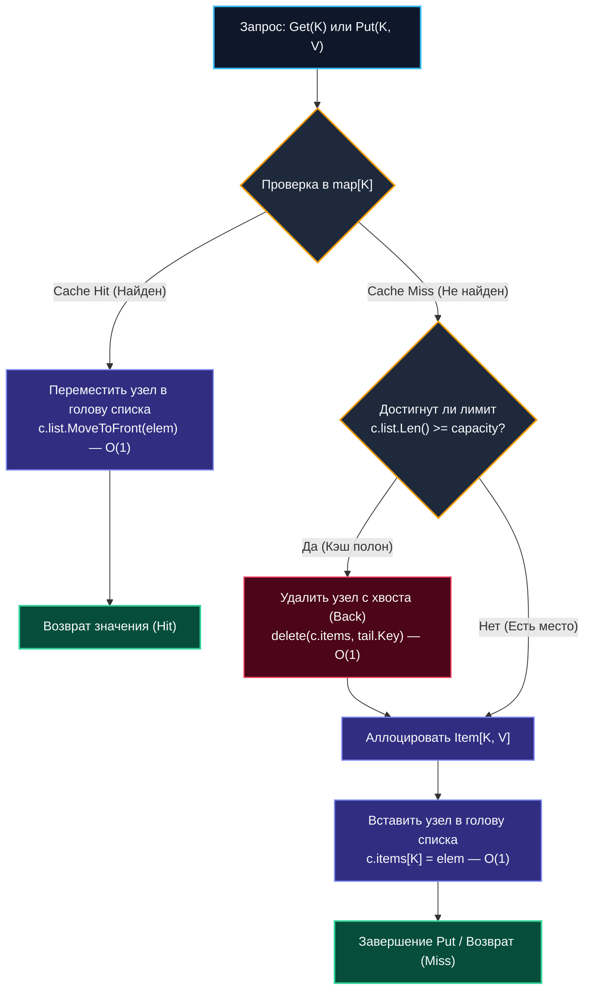
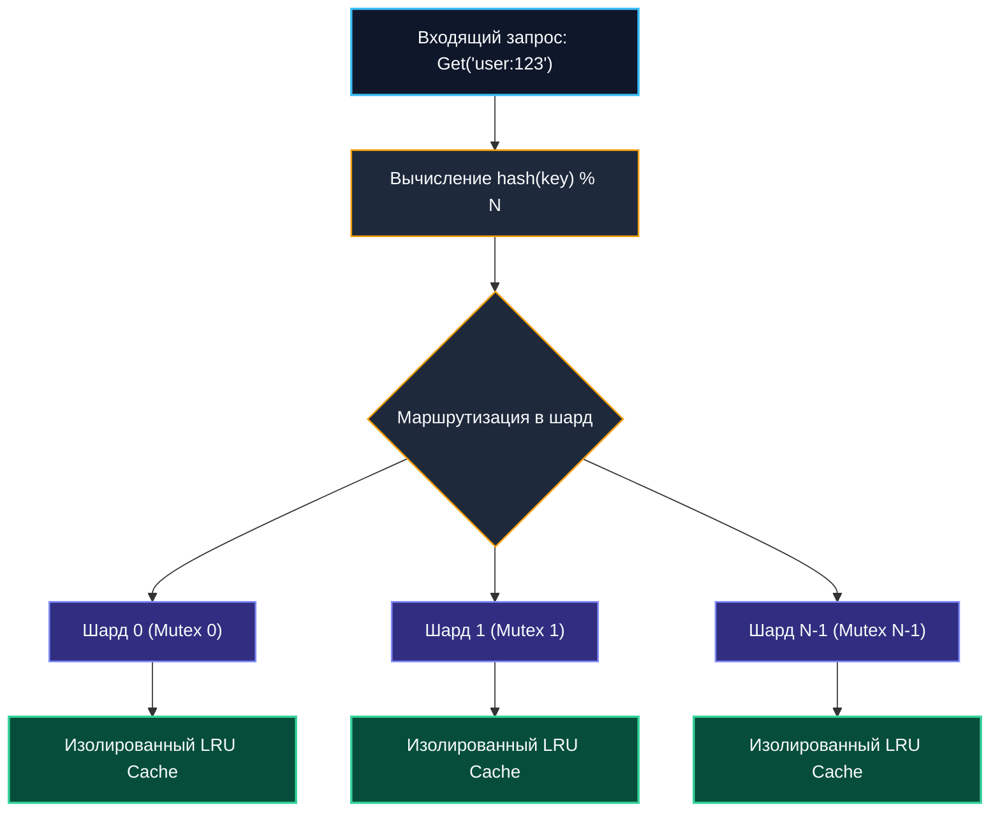

# LRU кэш (Least Recently Used)

> *"Memory is finite, but the stream of user requests is boundless. The art of caching lies in the quiet eviction of the forgotten, making room for what the present moment truly demands."*  
> — Свободная инженерная адаптация

---

## Введение: Баланс памяти и скорости доступа

В архитектуре высокопроизводительного бэкенда оперативная память (RAM) всегда остается самым дорогим и дефицитным ресурсом. Мы физически не можем бесконечно удерживать в памяти все результаты SQL-запросов, профили сотен миллионов пользователей или тяжелые вычисленные JSON-ответы. Рано или поздно наступает момент исчерпания емкости (Capacity Limit), когда система обязана решить: **какой именно элемент должен быть удален, чтобы освободить место новому?**

Стратегия вытеснения **LRU (Least Recently Used — наименее востребованный по времени)** базируется на фундаментальном физическом принципе временной и пространственной локальности (Temporal Locality): если к данным обращались недавно, существует высочайшая вероятность, что они понадобятся снова в ближайшие миллисекунды. Напротив, элементы, к которым давно не прикасались, с наибольшей вероятностью являются «мертвым грузом».

В экосистеме Go паттерн LRU является абсолютным промышленным стандартом:
- Пулы постоянных сетевых соединений (Connection Pools) к PostgreSQL/Redis.
- Кэширование декодированных и верифицированных JWT-токенов авторизации.
- In-memory сессионные хранилища и фильтры горячих ключей перед внешними микросервисами.
- Буферизация и дедупликация событий в брокерах сообщений (Kafka consumer pipeline).

Главный инженерный вызов заключается в обеспечении строгого математического контракта: операции поиска (`Get`), вставки (`Put`) и вытеснения устаревших элементов обязаны выполняться за **гарантированное константное время**:
$$O(1)$$

без просадок латентности, без блокировок параллельных читателей и без провоцирования губительных пауз сборщика мусора.

---

## 1. Архитектурный фундамент: Хеш-таблица + Двусвязный список

Попытка реализовать LRU-кэш на базе какой-то одной классической структуры неизбежно терпит фиаско:
- **Хеш-таблица (`map`)**: обеспечивает мгновенный поиск и модификацию за $O(1)$ по ключу, но абсолютно не сохраняет хронологический порядок обращений. Чтобы найти самый старый элемент, придется сканировать всю таблицу за линейное время $O(n)$.
- **Двусвязный список**: идеально поддерживает порядок использования (голова — самый свежий элемент, хвост — кандидат на удаление). Перемещение узла в голову занимает ровно $O(1)$, но поиск элемента по ключу требует последовательного перебора за $O(n)$.

Решение заключается в **симбиотическом объединении** двух структур:
1. **Двусвязный список** определяет хронологию: голова хранит самый свежий элемент (Most Recently Used), хвост — самый старый (Least Recently Used).
2. **Хеш-таблица (`map[K]*list.Element`)** связывает ключ с прямым физическим указателем на узел внутри двусвязного списка.



При каждом обращении (`Get` или `Put`) найденный узел перемещается в голову списка (`MoveToFront`). Когда емкость кэша исчерпана, узел из хвоста списка удаляется за $O(1)$, а его ключ мгновенно стирается из хеш-таблицы. Все манипуляции затрагивают исключительно локальные указатели `next` и `prev`, не требуя сдвига элементов памяти или копирования массивов.

---

## 2. Production-реализация на Go 1.21+

Стандартный пакет `container/list` в сочетании с generic-синтаксисом Go 1.21+ позволяет реализовать потокобезопасный LRU-кэш без динамического боксинга типов:

```go
package lru

import (
	"container/list"
	"fmt"
	"sync"
)

// Item хранит полезную нагрузку. Наличие Key критично для обратного
// удаления записи из хеш-таблицы map при вытеснении узла из хвоста списка.
type Item[K comparable, V any] struct {
	Key   K
	Value V
}

// Cache реализует потокобезопасный LRU кэш фиксированной емкости.
type Cache[K comparable, V any] struct {
	mu       sync.RWMutex
	capacity int
	list     *list.List
	items    map[K]*list.Element
	onEvict  func(key K, value V) // Callback при вытеснении записи
}

// New создаёт LRU кэш заданной максимальной ёмкости.
func New[K comparable, V any](capacity int, onEvict func(K, V)) (*Cache[K, V], error) {
	if capacity <= 0 {
		return nil, fmt.Errorf("lru: capacity must be positive")
	}
	return &Cache[K, V]{
		capacity: capacity,
		list:     list.New(),
		items:    make(map[K]*list.Element, capacity),
		onEvict:  onEvict,
	}, nil
}

// Get извлекает значение по ключу, обновляя его приоритет (перемещает в голову).
func (c *Cache[K, V]) Get(key K) (V, bool) {
	c.mu.RLock()
	elem, ok := c.items[key]
	c.mu.RUnlock()

	if !ok {
		var zero V
		return zero, false
	}

	// Обновление порядка в списке требует эксклюзивной блокировки
	c.mu.Lock()
	c.list.MoveToFront(elem)
	item := elem.Value.(*Item[K, V])
	val := item.Value
	c.mu.Unlock()

	return val, true
}

// Put вставляет или обновляет пару ключ-значение.
// Возвращает true, если добавление элемента вызвало вытеснение самого старого узла.
func (c *Cache[K, V]) Put(key K, value V) bool {
	c.mu.Lock()
	defer c.mu.Unlock()

	// Сценарий 1: Ключ уже существует в кэше — обновляем значение и двигаем в голову
	if elem, ok := c.items[key]; ok {
		c.list.MoveToFront(elem)
		elem.Value.(*Item[K, V]).Value = value
		return false
	}

	// Сценарий 2: Лимит емкости исчерпан — вытесняем наименее востребованный узел
	evicted := false
	if c.list.Len() >= c.capacity {
		oldest := c.list.Back()
		if oldest != nil {
			c.list.Remove(oldest)
			item := oldest.Value.(*Item[K, V])
			delete(c.items, item.Key)
			evicted = true

			if c.onEvict != nil {
				c.onEvict(item.Key, item.Value)
			}
		}
	}

	// Сценарий 3: Создаем новый узел и сохраняем его в голову двусвязного списка
	newItem := &Item[K, V]{Key: key, Value: value}
	elem := c.list.PushFront(newItem)
	c.items[key] = elem

	return evicted
}

// Remove удаляет произвольный элемент по ключу.
func (c *Cache[K, V]) Remove(key K) bool {
	c.mu.Lock()
	defer c.mu.Unlock()

	if elem, ok := c.items[key]; ok {
		c.list.Remove(elem)
		delete(c.items, key)
		if c.onEvict != nil {
			item := elem.Value.(*Item[K, V])
			c.onEvict(item.Key, item.Value)
		}
		return true
	}
	return false
}
```

> [!info] Под капотом
> **Внутреннее устройство `container/list`**  
> Каждый узел представляет собой структуру `list.Element` со служебными указателями `next, prev *Element`, `list *List` и полезной нагрузкой `Value any`.  
> При вызове `PushFront` аллоцируется новый `Element` в куче. При вызове `MoveToFront` физические данные не перемещаются и не копируются: перепривязываются ровно 4 указателя у соседних элементов. Это гарантирует строгое $O(1)$ без тяжелых манипуляций с памятью. Приведение типов `elem.Value.(*Item[K, V])` является безопасным, поскольку тип узла строго инкапсулирован внутри пакета.

---

## 3. Mechanical Sympathy: GC, кэш-линии и аллокации

Теоретический анализ асимптотики $O(1)$ умалчивает о физическом поведении кремния CPU и рантайма Go под реальной нагрузкой. Канонический `container/list` обладает **катастрофически низкой локальностью данных**:

### Указательный промах кэша (Pointer Chase)
Узлы списка `list.Element` и структуры `Item` аллоцируются в куче в разные моменты времени. Они физически разбросаны по разным страницам оперативной памяти. При каждом вызове `MoveToFront` или `Back` процессор разыменовывает адреса `prev` и `next`, порождая промах L1/L2 кэша и обращение к оперативной памяти (DRAM) с задержкой в 50–100 наносекунд.

### Нагрузка на Garbage Collector
Каждая пара `list.Element` + `Item[K,V]` удерживает от 3 до 4 указателей. Если емкость кэша составляет 1 000 000 записей, сборщик мусора Go на фазе разметки `mark` вынужден обойти 4 миллиона указателей! Это резко растягивает цикл GC и увеличивает длительность задержек `STW`. Для снижения нагрузки применяют `sync.Pool` для переиспользования структур.

### Escape Analysis и аллокации
Создание `newItem := &Item[K, V]{...}` внутри метода `Put` гарантированно приводит к побегу переменной в кучу (`escape to heap`). При частоте записи 50 000 RPS это генерирует сотни мегабайт мусора в секунду.

### Low-Latency оптимизация: Массивный LRU на плоских срезах
В сверхвысоконагруженных системах (High-Frequency Trading, API-шлюзы) `container/list` заменяют на монолитные плоские срезы, где указатели эмулируются целочисленными индексами `[]int`:

```go
type ArrayBasedLRU[V any] struct {
    keys   []int    // или []K, если K примитив
    values []V
    next   []int    // индексы следующего элемента
    prev   []int    // индексы предыдущего
    head   int
    tail   int
    free   int      // голова пула свободных индексов
}
```

Все метаданные хранятся в непрерывных массивах `[]int`/`[]V`. Аппаратный Prefetcher CPU загружает элементы целыми кэш-линиями, сборщик мусора видит монолитные спаны без указательной паутины, а производительность возрастает на 20–50%.

---

## 4. Конкурентность и горизонтальное масштабирование в памяти

Одиночный мьютекс `sync.Mutex` или `sync.RWMutex` отлично справляется с нагрузкой до 10 000 – 20 000 RPS. 

При дальнейшем росте параллельных запросов начинается лавинообразная `futex`-парковка горутин в ядре Linux, время удержания блокировки увеличивается, а задержка $p99$ подскакивает до сотен миллисекунд.

### Паттерн Sharded LRU (Шардирование кэша)
Промышленный стандарт решения проблемы Contention в Go:
1. Создается пул из $N$ независимых изолированных инстансов `Cache` (обычно $N$ выбирается степенью двойки: 16, 32 или 64).
2. Каждый шард защищен собственным независимым `sync.RWMutex`.
3. Запрос маршрутизируется по формуле:
   $$\text{shardIndex} = \text{hash}(key) \pmod N$$
4. Горутина работает строго с выбранным шардом.



Это снижает конкуренцию за блокировку ровно в $N$ раз. Потеря глобальной точности LRU статистически ничтожна: вероятность того, что горячие ключи вытеснят друг друга в одном шарде, мала при `N >= 8`. Популярные библиотеки `hashicorp/golang-lru` и `coocood/freecache` построены именно на этом архитектурном паттерне.

> [!warning] Ловушка / Gotcha
> **Рассинхронизация map и list**  
> Если в процессе вытеснения узел удаляется из списка `c.list.Remove(oldest)`, но вызов `delete(c.items, key)` забыт или завершился паникой, мапа будет удерживать «зомби-указатели» на удаленные элементы. Последующий `Get` прочитает разрушенный узел или вызовет панику рантайма `panic: runtime error`. Модификация map и списка обязана быть строго атомарной внутри критической секции.
>
> **Утечка памяти через замыкание onEvict**  
> Если функция обратного вызова `onEvict` сохраняет ссылку на вытесненный объект в глобальной переменной, срезе или канале, сборщик мусора Go никогда не сможет освободить эту память. Передавайте в callback примитивные идентификаторы либо создавайте полную независимую копию данных.

---

## 5. Интервью: вопросы на понимание архитектуры

> [!tip] Собеседование
> **Вопрос 1:** «Почему нельзя реализовать LRU только на `map`, просто сохраняя timestamp последнего доступа внутри структуры значения?»  
> **Ответ:** При исчерпании емкости поиск наименее свежего элемента для вытеснения потребует полного сканирования всех записей мапы за время $O(n)$. При частых вставках и плотном потоке вытеснений кэш мгновенно превратится в узкое горлышко. Симбиоз хеш-таблицы и двусвязного списка обеспечивает гарантированный eviction за константное время $O(1)$.
> 
> **Вопрос 2:** «Как корректно добавить поддержку TTL (Time To Live) в LRU-кэш?»  
> **Ответ:** Чистый LRU не учитывает абсолютное астрономическое время. Для интеграции TTL применяются две стратегии:
> 1. *Ленивая валидация:* хранить `expiry` внутри узла и проверять его при `Get`, удаляя лениво.
> 2. *Фоновый очиститель:* параллельная приоритетная очередь (Min-Heap по времени) или фоновая горутина, инспектирующая хвост списка по таймеру `time.Ticker`.
> 
> **Вопрос 3:** «В чем принципиальная разница между политиками LRU, LFU и MRU в бэкенде?»  
> **Ответ:** 
> - **LRU (Least Recently Used):** вытесняет элементы, к которым дольше всего не обращались. Идеален для сессий, авторизационных токенов и потоков событий.
> - **LFU (Least Frequently Used):** вытесняет элементы с наименьшим счетчиком частоты обращений. Идеален для каталогов товаров и статичных конфигураций, защищая популярные ключи от случайного вымывания разовыми сканирующими запросами.
> - **MRU (Most Recently Used):** вытесняет самые свежие элементы. Применяется при постраничном обходе тяжелых баз данных (Sequential Scan), где только что прочитанная страница больше никогда не понадобится.
> 
> **Вопрос 4:** «Почему в приведенном методе `Get` сначала берется `RLock`, а затем `Lock` для `MoveToFront`? Не приведет ли это к Deadlock?»  
> **Ответ:** В Go примитив `sync.RWMutex` не поддерживает эскалацию блокировок (Upgrade lock). Попытка вызвать `c.mu.Lock()` не отпустив `RLock()` гарантированно вызовет взаимную блокировку. В нашем коде блокировка `RLock` корректно отпускается до входа в секцию модификации. В боевых high-load системах метод `Get` часто делают полностью неблокирующим (Read-Only), используя `atomic.Pointer` для map и lock-free структуры, либо обновление хронологии переносят в асинхронный кольцевой буфер с пулом `sync.Pool`.

---

## Итог

* **LRU кэш** — классический симбиоз хеш-таблицы (`map[K]*list.Element`) и двусвязного списка (`container/list`), гарантирующий строгое **$O(1)$** на поиск, вставку и вытеснение.
* В Go стандартный `container/list` удобен в реализации, но указательная структура провоцирует частые Cache Miss и нагружает [[7. Глубокий Go (Внутреннее устройство)|GC]]. Для критических latency-sensitive систем применяются плоские массивы на индексах (`ArrayBasedLRU`).
* **Конкурентность:** единый мьютекс упирается в потолок при 20k RPS. **Шардирование кэша по `hash(key) % N`** устраняет contention и масштабирует пропускную способность до миллионов RPS.
* **Транзакционность мутаций:** удаление из списка и удаление из мапы обязаны производиться синхронно во избежание «зомби-ссылок» и утечек памяти.
* Интеграция TTL требует комбинирования с приоритетной очередью или фоновым сборщиком просроченных записей.

---

Мы подробно изучили вытеснение данных на основе фактора новизны (LRU). Однако в реальных сервисах с неравномерным распределением трафика (закон Ципфа: 80% запросов приходятся на 20% топовых ключей) редкий пакетный скан может полностью вымыть из LRU-кэша самые ценные данные. Для решения этой проблемы применяется стратегия вытеснения на основе **частоты обращений**. В следующей статье мы разберем проектирование кэша с частотным учетом:
[[8. LFU кэш]].