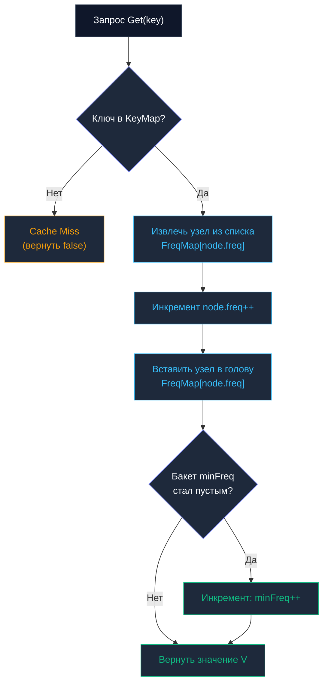

## Введение: Когда новизна уступает популярности

В предыдущей главе мы детально разобрали [[7. LRU кэш]], опирающийся на принцип временной локальности (temporal locality). Если элемент запросили только что, велика вероятность, что к нему обратятся снова. Однако в реальном сетевом трафике распределение нагрузки почти никогда не бывает равномерным. Оно подчиняется степенному закону Парето и распределению Ципфа (`Zipf`): около 20% популярных ключей генерируют более 80% всех обращений.

В таких условиях у LRU обнаруживается фундаментальная уязвимость к сканирующим запросам (scan resistance problem). Стоит ночному batch-скрипту или поисковому боту пройтись по базе данных с миллионом уникальных идентификаторов, как LRU послушно вымоет из оперативной памяти действительно ценные, горячие данные, заменив их одноразовым мусором.

Алгоритм LFU (Least Frequently Used) решает эту проблему принципиально: он отслеживает не время последнего доступа, а **частоту обращений**. Когда лимит памяти исчерпан, из кэша вытесняется элемент с наименьшим счётчиком использования. Это делает LFU идеальным выбором для кэширования статических каталогов товаров, конфигурационных метаданных, скомпилированных SQL-планов, сессий долгоживущих API-клиентов и защиты от сканирующих ботов.

Главная инженерная дилемма LFU кроется в алгоритмической цене: как поддерживать упорядоченность по частоте, не превращая каждую операцию `Get` и `Put` в `O(n log n)` или `O(n)`? Ответ кроется в элегантной композиции структур данных, гарантирующей строгое `O(1)` для всех базовых операций.

> [!tip] Собеседование
> **Вопрос:** «Почему для реализации LFU нельзя просто использовать Min-Heap пар key-frequency?»
> **Ответ:** Двоичная куча даёт `O(1)` для peek минимума, но требует `O(n)` для поиска произвольного ключа при инкременте частоты. При каждом чтении `Get` нам нужно найти элемент и увеличить его счётчик. Без вспомогательной обратной таблицы `key->index` это превращается в полный линейный перебор `O(n)`. Даже если поддерживать мапу индексов, вызовы `decreaseKey`/`increaseKey` требуют перемещения по дереву кучи через `siftUp/siftDown`, что занимает `O(log n)`. При миллионах `RPS` логарифмический оверхед на каждой операцией чтения недопустим. Классический LFU использует архитектуру частотных бакетов, достигая истинного `O(1)`.

---

### 1. Архитектурный фундамент: Двойная маппа и частотные бакеты

Чтобы добиться константного времени `O(1)` для операций поиска, инкремента и вытеснения, классический алгоритм LFU (предложенный Ketan Shah, Anirban Mitra и Dhruv Matani) организует данные в двухуровневую систему:

1. **`KeyMap`**: Хеш-таблица `map[K]*node[K, V]` (или `map[K]*Node[K,V]`), обеспечивающая мгновенный доступ к узлу по ключу за `O(1)`.
2. **`FreqMap`**: Хеш-таблица списков `map[int]*list.List`, где ключом выступает целое число — частота обращений, а значением — двусвязный список узлов с данной частотой. Внутри бакета узлы упорядочены по времени обращения (LRU-тайбрейкер): самый свежий узел находится в голове (`PushFront`), самый старый — в хвосте.
3. **`minFreq`**: Целочисленный указатель на текущую минимальную частоту среди всех присутствующих в кэше элементов. Значение `minFreq` изменяется строго детерминировано.

Рассмотрим поведение системы при операциях чтения и записи:

При `Get(key)`:
* Находим узел в `KeyMap`. Если ключ отсутствует — возвращаем промах.
* Извлекаем узел из списка `FreqMap[node.freq]`.
* Инкрементируем счётчик частоты: `node.freq++`.
* Вставляем узел в начало списка нового бакета `FreqMap[node.freq]`.
* Если старый бакет `minFreq` опустел, инкрементируем `minFreq` (`minFreq++`).
* Возвращаем значение узла.

При `Put(key, value)`:
* Если ключ уже существует, обновляем его значение и продвигаем частоту точно так же, как в операции `Get`.
* Если ключ новый, проверяем текущую ёмкость. Если `KeyMap` заполнен до предела `capacity`, находим список `FreqMap[minFreq]`, удаляем из него самый старый хвостовой узел и стираем его из `KeyMap`. При необходимости вызываем коллбэк `onEvict`.
* Создаём новый узел со значением `freq = 1`.
* Помещаем узел в оба хранилища: `KeyMap` и бакет `FreqMap[1]`.
* Сбрасываем указатель минимума: `minFreq = 1`.



Такая архитектура гарантирует, что поиск, перепривязка частоты и вытеснение выполняются за константное время без перемещения массивов в памяти.

---

### 2. Production-реализация на Go 1.21+

Ниже представлена потокобезопасная обобщённая (generics) реализация LFU-кэша с использованием стандартной библиотеки Go (`container/list`), поддержкой таймстампов `CreatedAt` и настраиваемым хуком вытеснения `onEvict`.

```go
package lfu

import (
	"container/list"
	"fmt"
	"sync"
	"time"
)

// node хранит данные ключа, значение и метаинформацию для LFU-алгоритма
type node[K comparable, V any] struct {
	Key       K
	Value     V
	Freq      int
	CreatedAt time.Time
	listElem  *list.Element // указатель на элемент внутри частотного списка
}

// Cache реализует LFU-кэш с амортизированной сложностью O(1) для всех операций
type Cache[K comparable, V any] struct {
	mu       sync.RWMutex
	capacity int
	keyMap   map[K]*node[K, V]
	freqMap  map[int]*list.List
	minFreq  int
	onEvict  func(K, V)
}

// New создаёт LFU кэш заданной емкости
func New[K comparable, V any](capacity int, onEvict func(K, V)) (*Cache[K, V], error) {
	if capacity <= 0 {
		return nil, fmt.Errorf("lfu: capacity must be positive")
	}
	return &Cache[K, V]{
		capacity: capacity,
		keyMap:   make(map[K]*node[K, V], capacity),
		freqMap:  make(map[int]*list.List),
		minFreq:  1,
		onEvict:  onEvict,
	}, nil
}

// Get возвращает значение и инкрементирует частоту обращения к ключу
func (c *Cache[K, V]) Get(key K) (V, bool) {
	c.mu.RLock()
	n, ok := c.keyMap[key]
	c.mu.RUnlock()
	if !ok {
		var zero V
		return zero, false
	}

	c.mu.Lock()
	c.moveNodeToNextFreq(n)
	val := n.Value
	c.mu.Unlock()
	return val, true
}

// Put добавляет или обновляет элемент в кэше
func (c *Cache[K, V]) Put(key K, value V) bool {
	c.mu.Lock()
	defer c.mu.Unlock()

	if n, ok := c.keyMap[key]; ok {
		n.Value = value
		c.moveNodeToNextFreq(n)
		return false
	}

	if len(c.keyMap) >= c.capacity {
		c.evict()
	}

	newNode := &node[K, V]{
		Key:       key,
		Value:     value,
		Freq:      1,
		CreatedAt: time.Now(),
	}
	c.addToList(newNode)
	c.keyMap[key] = newNode
	c.minFreq = 1
	return true
}

// moveNodeToNextFreq перемещает узел в бакет freq + 1
func (c *Cache[K, V]) moveNodeToNextFreq(n *node[K, V]) {
	c.removeFromList(n)
	n.Freq++
	c.addToList(n)

	// Если старый бакет стал пустым и это был minFreq, увеличиваем minFreq
	if freqList, ok := c.freqMap[n.Freq-1]; ok && freqList.Len() == 0 {
		delete(c.freqMap, n.Freq-1)
		if c.minFreq == n.Freq-1 {
			c.minFreq = n.Freq
		}
	}
}

// evict удаляет наименее часто используемый элемент
func (c *Cache[K, V]) evict() {
	freqList, ok := c.freqMap[c.minFreq]
	if !ok || freqList.Len() == 0 {
		return
	}

	oldest := freqList.Back()
	if oldest == nil {
		return
	}

	n := oldest.Value.(*node[K, V])
	freqList.Remove(oldest)
	if freqList.Len() == 0 {
		delete(c.freqMap, c.minFreq)
	}

	delete(c.keyMap, n.Key)
	if c.onEvict != nil {
		c.onEvict(n.Key, n.Value)
	}
}

// addToList добавляет узел в начало списка его частоты
func (c *Cache[K, V]) addToList(n *node[K, V]) {
	if _, ok := c.freqMap[n.Freq]; !ok {
		c.freqMap[n.Freq] = list.New()
	}
	n.listElem = c.freqMap[n.Freq].PushFront(n)
}

// removeFromList удаляет узел из текущего списка
func (c *Cache[K, V]) removeFromList(n *node[K, V]) {
	if n.listElem != nil {
		c.freqMap[n.Freq].Remove(n.listElem)
		n.listElem = nil
	}
}
```

Ключевые инженерные решения в этой реализации:
* **LRU-тайбрейкер внутри бакета**: Метод `PushFront` добавляет элемент в начало, а `evict` удаляет с хвоста (`freqList.Back()`). При равной частоте вытесняется узел, к которому дольше всего не обращались.
* **Оптимизация `minFreq`**: Мы не сканируем `freqMap` в поисках минимального ключа. Минимальная частота либо сбрасывается в `1` при создании нового элемента, либо инкрементируется на `1`, когда бакет `minFreq` становится абсолютно пустым. Это фундаментальный инвариант `O(1)`.
* **Двухфазная блокировка в `Get`**: `RLock` позволяет быстро отсеять отсутствующие ключи без эксклюзивной блокировки, а `Lock` активируется только при подтверждённом попадании для продвижения узла по частотной сетке.

> [!info] Под капотом
> Внутреннее устройство пакета `container/list`: каждый вызов `PushFront` аллоцирует отдельный объект `list.Element` в куче. Структура `list.Element` содержит поля `prev`, `next`, `list` и интерфейсное поле `Value any`. При классической реализации LFU на каждый сохранённый ключ создаётся минимум два указательных объекта: сам `node` и обёртка `list.Element`. Это многократно увеличивает memory footprint и раздувает количество указателей, которые обязан просканировать [[7. Глубокий Go (Внутренное устройство)|сборщик мусора]] в фазе маркировки (`mark`).

---

### 3. Mechanical Sympathy: Указательная паутина и GC

С точки зрения архитектуры современного процессора и рантайма Go, LFU является одной из самых «дорогих» структур данных:

* **Pointer Chasing и промахи кэша процессора**: При вызове `moveNodeToNextFreq` процессор вынужден выполнить цепочку нелокальных чтений памяти: прочитать поле `n.listElem` $\to$ разыменовать указатели `next/prev` (или `prev/next`) для исключения элемента из списка $\to$ найти запись в хеш-таблице `freqMap[freq]` $\to$ разыменовать заголовок нового списка `freqMap[freq].list` $\to$ модифицировать `next/prev` нового соседа. Каждое разыменование указателя — потенциальный Cache Miss. В кэше на 500 000 элементов узлы хаотично разбросаны по виртуальной памяти, и аппаратный префетчер процессора (Hardware Prefetcher) оказывается бессилен.
* **Давление на Garbage Collector**: Каждый элемент порождает минимум 3–4 указателя в управляемой куче. При активном потоке операций `evict` и `Put` аллокатор рантайма работает под предельной нагрузкой, а GC тратит драгоценные процессорные циклы на трассировку огромного графа объектов. В сервисах с десятками гигабайт памяти суммарные задержки Stop-The-World (`STW`) могут достигать неприемлемых величин.
* **Escape Analysis**: Экземпляры `newNode` и `list.Element` гарантированно покидают стек (escape to heap). Компилятор не может аллоцировать их на стеке функции, поскольку они сохраняются в глобальных хеш-таблицах и передаются в методы `list.PushFront`.

**Инженерная оптимизация для Low-Latency**:
Вместо стандартного `container/list` в высокопроизводительных сервисах используют плоские массивы индексов, аналогично подходу в [[4. Disjoint set union DSU, Union Find]]. Узлы хранятся в непрерывном срезе `[]node`, а связи `next[]` и `prev[]` представляются целочисленными срезами `[]int`. Все манипуляции производятся с 32-битными индексами вместо 64-битных указателей. Это сокращает объём памяти на 40%, обеспечивает отличную пространственную локальность (Spatial Locality) и сводит работу GC к сканированию одного непрерывного буфера.

---

### 4. Конкурентность и горизонтальное масштабирование

Одиночный мьютекс `sync.RWMutex` превращается в узкое горлышко (bottleneck) уже при нагрузке 15–20 тысяч `RPS`. Конкурирующие горутины блокируются на `futex`-системных вызовах ядра Linux, вызывая частый контекстный свитч потоков операционной системы (структур `M` в рантайме Go).

Для масштабирования LFU на многоядерных архитектурах применяются следующие инженерные приёмы:

1. **Шардирование (Striping / Sharding) по `hash(key) % N`**:
   Создаётся пул из `N` независимых LFU-кэшей, каждый из которых защищён собственным мьютексом. Конфликты за блокировку снижаются в `N` раз. Хотя глобальная точность счётчика `minFreq` формально дробится на локальные минимумы, на практике при `N >= 16` и качественной хеш-функции отклонение в hit rate составляет не более 1–2%.
2. **Lock-free чтение с батчингом (Batched Write Buffering)**:
   Операция чтения `Get` проверяет ключ через атомарные указатели (`atomic.Pointer`) или concurrent-карты без захвата эксклюзивного мьютекса. Инкременты частоты и задачи на вытеснение помещаются в неблокирующий кольцевой буфер или буферизованный канал `chan`. Фоновая горутина вычитывает события пакетами и обновляет бакеты `FreqMap` за один проход. Это даёт слабую согласованность (eventual consistency), но гарантирует субмикросекундную задержку на чтение.
3. **TTL-гибридизация**:
   Чистый алгоритм LFU принципиально не очищает неактуальные ключи, если к ним перестали обращаться. Для защиты от утечек памяти запускается периодический воркер, который проверяет метки времени `CreatedAt` и удаляет элементы по `TTL`, предотвращая захламление памяти.

> [!warning] Ловушка / Gotcha
> **Проблема холодного старта и устаревания частот (Frequency Starvation):**
> LFU исторически страдает от «зависания» некогда популярных ключей. Если товар был суперхитом год назад, его счётчик обращений может исчисляться сотнями тысяч. Когда тренд проходит, этот ключ будет месяцами висеть в памяти, вытесняя свежие, набирающие популярность элементы, потому что новым ключам требуется время, чтобы накопить сопоставимую частоту.  
> **Решение:** Периодическое затухание частот (Frequency Aging). Например, раз в час все счётчики делятся пополам: `freq = freq / 2` (или через сдвиг вправо). Без механизма затухания или комбинации с [[8. LFU кэш|TTL]] кэш неизбежно превращается в «музей забытых рекордов».
>
> **Рассинхронизация указателя `minFreq`:**
> Если при вызове `evict` удаляется последний элемент из бакета с минимальной частотой, но разработчик забывает обновить указатель `minFreq`, кэш останется указывать на несуществующий пустой список. Следующий вызов `evict` завершится фатальной ошибкой `panic` при попытке разыменовать `nil` в `freqMap[minFreq].Back()`. Контроль инварианта `minFreq` обязан проверяться на каждом шаге модификации структуры.

---

### 5. LFU vs LRU: Выбор под паттерн трафика

| Критерий | LRU (Least Recently Used) | LFU (Least Frequently Used) |
|---|---|---|
| **Метрика вытеснения** | Время последнего доступа | Суммарная частота обращений |
| **Расход памяти** | Низкий (один двусвязный список) | Повышенный (мапа бакетов и списки) |
| **Холодный старт** | Мгновенная адаптация к новому трафику | Требует прогрева (`warm-up`) |
| **Hit rate при законе Ципфа (`Zipf`)** | Умеренный (уязвим к сканированию) | Максимальный (устойчив к всплескам) |
| **Сложность реализации** | Простая и наглядная | Требует аккуратного контроля инвариантов |
| **Идеальные сценарии** | Пользовательские сессии, ленты новостей, пагинация | Справочники, метаданные БД, ML-эмбеддинги, CDN |

В стандартной практике Go-разработки алгоритм LRU остаётся решением по умолчанию благодаря исключительной простоте реализации и минимальному накладным расходам на сборщик мусора. LFU становится безальтернативным выбором, когда доступ к данным строго подчиняется степенному закону и стоимость промаха кэша (обращение к тяжёлой БД или удалённому сервису) крайне высока.

> [!tip] Собеседование
> **Вопрос 1:** «Как реализовать LFU без использования двусвязных списков для экономии памяти?»  
> **Ответ:** Можно хранить срезы ключей по частотам: `keys[freq] = []K`. При каждом обращении ключ удаляется из старого среза и аппендится в новый. Однако удаление элемента из середины среза требует `O(n)` времени на сдвиг памяти, а частые реалокации приводят к деградации производительности. Для строгого `O(1)` списочные структуры обязательны. В продакшене альтернативой служат вероятностные структуры данных, такие как [[3. Хеширование/6. Bloom filter - вероятностная структура данных]] со счётчиками (`Count-Min Sketch`), дающие субконстантный расход памяти с контролируемой погрешностью.
>
> **Вопрос 2:** «Почему `minFreq` не ищется полным сканированием, а хранится в виде отдельной переменной?»  
> **Ответ:** Переменная `minFreq` может либо сброситься в `1` при вставке нового элемента, либо вырасти ровно на `1`, когда текущий минимальный частотный бакет полностью опустел после вызова `Get` или `Put`. Она никогда не совершает непредсказуемых скачков. Сохранение этого инварианта в скалярном поле обеспечивает доступ за строгое `O(1)` без сканирования всей хеш-таблицы.
>
> **Вопрос 3:** «Чем алгоритмы TinyLFU и W-TinyLFU превосходят классический LFU?»  
> **Ответ:** Классический LFU требует хранения точных счётчиков частоты для каждого ключа, что приводит к неограниченному росту метаданных. `TinyLFU` заменяет целочисленные счётчики компактным вероятностным фильтром `Count-Min Sketch`, оценивая частоту любого ключа с использованием всего нескольких байт памяти. Архитектура `W-TinyLFU` (используемая в Caffeine и Ristretto) объединяет небольшой буфер LRU (окно для защиты свежих ключей при холодном старте) с основным LFU-хранилищем, обеспечивая непревзойдённый Hit Rate при минимальном потреблении оперативной памяти.

---

### Итог

* **LFU кэш** незаменим в системах с неравномерным трафиком (распределение `Zipf`), где ценность объекта определяется накопленной популярностью, а не секундной новизной.
* Архитектурная триада **`KeyMap` + `FreqMap` + `minFreq`** обеспечивает математически строгое амортизированное `O(1)` для операций `Get`, `Put` и `evict`.
* В языке Go связка структур из `container/list` создаёт существенную нагрузку на GC и вызывает деградацию производительности из-за Pointer Chasing. В сверхнагруженных подсистемах предпочтение отдаётся плоским массивам индексов.
* **Конкурентная масштабируемость** достигается шардированием пространства ключей на `N >= 16` независимых бакетов либо разделением путей чтения и записи через каналы `chan` и батчинг.
* **Проблема устаревания данных** решается периодическим делением частот пополам (`freq = freq / 2`) или применением архитектуры `W-TinyLFU`.

Мы успешно завершили седьмой раздел, посвящённый продвинутым структурам данных: исследованию подверглись деревья отрезков, дерево Фенвика, разреженные таблицы, система непересекающихся множеств DSU, списки с пропусками Skip List, декартово дерево Treap, а также алгоритмы кэширования LRU и LFU.

Теперь мы переходим к фундаментальному разделу алгоритмов: методам упорядочивания данных. Понимание сортировок лежит в основе эффективного построения индексов в базах данных, оптимизации операторов соединения (Merge Join) и тонкого понимания внутреннего устройства рантайма Go. В следующей главе мы начнём с классического алгоритма, демонстрирующего механику перестановок и квадратичную сложность.

[[1. Bubble sort и его недостатки]]