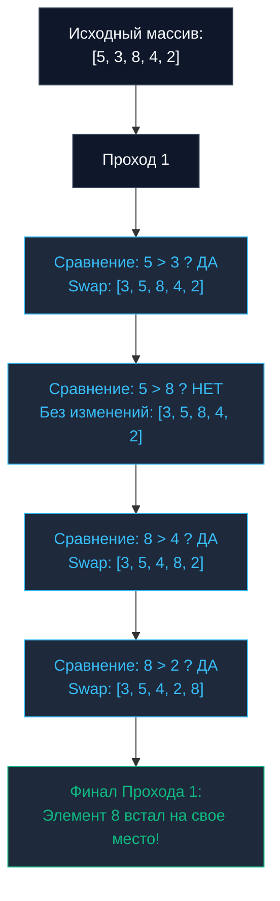

## Введение: Зачем изучать худший алгоритм?

Сортировки — это классическая фундаментальная тема Computer Science, с которой традиционно начинается изучение алгоритмов и структур данных. Для практикующего бэкенд-инженера понимание алгоритмов упорядочивания необходимо вовсе не для того, чтобы писать их с нуля вручную (в 99.9% реальных производственных сценариев вы просто вызовете стандартную функцию `slices.Sort()`). Подлинная цель — глубоко понимать механику доступа к памяти, предсказание ветвлений (Branch Prediction), влияние кэш-линий процессора и поведение алгоритмов на физическом кремнии.

Мы начнем этот путь с **Сортировки пузырьком (Bubble Sort)**. Это самый известный, элементарный в реализации и одновременно **самый неэффективный** алгоритм сортировки из всех когда-либо придуманных. Изучать его необходимо ради одной важнейшей инженерной цели: наглядно увидеть, как *не надо* проектировать код, и уметь аргументированно объяснить на системном интервью, почему современный суперскалярный CPU испытывает физические «мучения» при выполнении этого цикла.

---

## Концепция: Всплытие тяжелого

Идея алгоритма предельно проста: мы многократно проходим по массиву слева направо. На каждом элементарном шаге мы сравниваем два соседних элемента. Если левый элемент больше правого — мы меняем их местами (`Swap`). 

В результате каждого полного прохода наибольший элемент неотсортированной части словно пузырек воздуха в воде «всплывает» в самый конец массива, занимая свою окончательную позицию.

На следующем проходе нам уже нет необходимости трогать последний элемент (он гарантированно находится на своем законном месте), поэтому граница внутреннего цикла сдвигается до `N-2`, затем до `N-3` и так далее, пока весь массив не придет в упорядоченное состояние.



---

## Идиоматичная реализация на Go

Современный Go (начиная с версии 1.21+) предоставляет стандартный пакет `cmp` и поддержку обобщенных типов (Generics). Идиоматичная реализация сортировки больше не требует громоздкого написания интерфейсов `sort.Interface` с методами `Len`, `Less` и `Swap` для каждого пользовательского типа. Мы можем написать одну чистую, типобезопасную функцию.

> [!info] Под капотом
> В языке Go срезы (`slice`) передаются в функции по значению. Однако само значение заголовка среза (slice header) — это легковесная структура из трех 64-битных полей: указатель на базовый массив (`backing array`), текущая длина (`len`) и вместимость (`cap`). Передавая срез в функцию и мутируя его элементы по индексам, мы напрямую изменяем память оригинального базового массива без дополнительных аллокаций в куче. Это классическая сортировка «на месте» (`In-place`).

```go
package sort

import "cmp"

// BubbleSort выполняет сортировку среза любого типа, поддерживающего операторы сравнения.
func BubbleSort[T cmp.Ordered](arr []T) {
	n := len(arr)
	if n <= 1 {
		return
	}

	// Внешний цикл отсчитывает количество пройденных этапов
	for i := 0; i < n-1; i++ {
		// Оптимизация раннего выхода: отслеживаем факт перестановок
		swapped := false

		// Внутренний цикл сравнивает пары до границы уже отсортированного суффикса
		for j := 0; j < n-i-1; j++ {
			if arr[j] > arr[j+1] {
				// В Go swap выполняется элегантно в одну строку без временной переменной
				arr[j], arr[j+1] = arr[j+1], arr[j]
				swapped = true
			}
		}

		// Если за полный проход не произошло ни одной перестановки,
		// массив уже полностью упорядочен — досрочно прерываем работу.
		if !swapped {
			break
		}
	}
}
```

---

## Асимптотическая сложность

* **Время в худшем и среднем случае:** $O(N^2)$ (или `O(N^2)`). Для массива размером всего в $100\,000$ элементов алгоритму потребуется выполнить около 10 миллиардов сравнений и перестановок.
* **Время в лучшем случае:** $O(N)$ (или `O(N)`). Благодаря оптимизации с булевым флагом `swapped`, если входной срез уже отсортирован, алгоритм сделает ровно один линейный проход, не обнаружит перестановок и моментально завершит работу.
* **Пространственная сложность (Память):** $O(1)$ (или `O(1)`). Дополнительная память под вспомогательные буферы не выделяется, вся сортировка происходит strictly `In-place`.

> [!tip] Собеседование
> **Вопрос:** Является ли алгоритм Bubble Sort стабильным (`Stable`)?
> **Ответ:** Да. **Стабильная сортировка** гарантирует сохранение относительного порядка следования эквивалентных элементов. Поскольку условие перестановки строгое (`arr[j] > arr[j+1]`), два равных по значению элемента никогда не поменяются местами в процессе проходов. Это свойство критически важно в бэкенде: например, если мы сортируем записи логов сначала по времени возникновения, а затем вторично по уровню важности (severity) — стабильный алгоритм безупречно сохранит хронологический порядок внутри каждой категории severity.

---

## Mechanical Sympathy: Почему CPU ненавидит Bubble Sort?

Алгоритмическая сложность $O(N^2)$ — это лишь верхушка айсберга. Если проанализировать поведение Bubble Sort на микроархитектурном уровне кремниевого процессора, открывается полная инженерная катастрофа.

### 1. Катастрофа предсказания ветвлений (Branch Misprediction)

Современные процессоры достигают гигагерцовых частот благодаря глубокой конвейеризации инструкций (`Pipelining`). Конвейер современного x86/ARM чипа содержит от 14 до 20+ стадий. Чтобы конвейер не простаивал в ожидании результатов выполнения предыдущих инструкций, процессор использует аппаратный модуль предсказания ветвлений (`Branch Prediction` / `Branch Predictor`), пытаясь заранее угадать, выполнится ли условие условного перехода.

В строке `if arr[j] > arr[j+1]` для неупорядоченного массива со случайным распределением данных вероятность истинности составляет ровно 50%. Для механизма `Branch Predictor` это худший из возможных сценариев — аналог постоянного подбрасывания монетки. Процессор будет регулярно ошибаться в своих прогнозах. При каждой такой ошибке (`Branch Misprediction`) процессор вынужден аварийно сбросить конвейер (`Pipeline Flush`), отменить результаты спекулятивных инструкций и начать загрузку правильной ветки с нуля, безвозвратно теряя 15–20 тактов тактового генератора на каждую ошибку.

### 2. Мусорный трафик памяти (Memory Bandwidth)

Хотя элементы массива считываются строго последовательно (что благоприятно для `L1-кэш` и работы аппаратного префетчера), Bubble Sort генерирует колоссальный избыточный трафик на запись.

Операция перестановки `arr[j], arr[j+1] = arr[j+1], arr[j]` — это не просто регистровые манипуляции, а физическая перезапись ячеек памяти. В худшем сценарии (когда исходный массив отсортирован в строго обратном порядке) алгоритм выполнит порядка $\frac{N^2}{2}$ операций записи. В архитектуре процессорного кэша запись обходится на порядок дороже чтения: она требует перевода кэш-линий в состояние `Modified` по протоколу MESI, инвалидации кэшей других процессорных ядер, исчерпания пропускной способности шины (`Memory Bandwidth`) и последующего вытеснения (`eviction`) «грязных» строк в оперативную память.

> [!warning] Ловушка / Gotcha
> Из-за непрерывных сбросов конвейера CPU (`Pipeline Flush`) и колоссального количества паразитных записей в память Bubble Sort работает кратно медленнее других алгоритмов класса $O(N^2)$, таких как Сортировка выбором (`Selection Sort`) или Сортировка вставками (`Insertion Sort`). На практике Bubble Sort не применяется в реальных системах **вообще никогда**, даже на массивах из нескольких десятков элементов.

---

## Резюме

* **Область практического применения:** Строго 0% в реальном production-коде. Используется исключительно в дидактических целях как учебный антипаттерн.
* **Главный инженерный урок:** Bubble Sort ярко демонстрирует, как безудержные мутации памяти и непредсказуемые ветвления `if` способны разрушить производительность даже при идеальном последовательном паттерне обхода массива.

Осознав, почему Bubble Sort не место в надежных системах, мы готовы перейти к алгоритму, который формально обладает той же квадратичной сложностью $O(N^2)$, но благодаря выдающейся кэш-локальности и минимуму записей настолько эффективен на малых объемах данных, что входит в состав гибридных промышленных сортировок стандартных библиотек многих языков, включая Go.

В следующей статье: [[2. Insertion sort]].