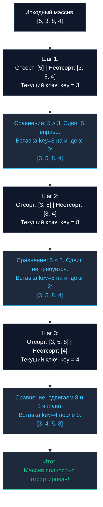

## Введение: Парадокс квадратичной сложности

В предыдущей главе [[1. Bubble sort и его недостатки]] мы детально исследовали алгоритм, который из-за непредсказуемых ветвлений и постоянных перестановок элементов буквально изнуряет микроархитектуру современного процессора. 

Означает ли это, что абсолютно все алгоритмы квадратичной сложности $O(N^2)$ непригодны для реального бэкенда? Вовсе нет. **Сортировка вставками (Insertion Sort)** — великолепный пример того, как алгоритм со скромной школьной асимптотикой благодаря поразительной механической гармонии с кремнием (Mechanical Sympathy) с легкостью превосходит сложные алгоритмы класса $O(N \log N)$ на массивах малого размера.

---

## Концепция: Сортировка игральных карт

Интуитивно понятная аналогия из повседневной жизни — раскладывание игральных карт в руке:

Вы держите карты раскрытым веером. Вы берете очередную неотсортированную карту, находите для нее подходящее место среди уже упорядоченной левой стопки карт, сдвигаете мешающие карты вправо и аккуратно опускаете новичка в образовавшийся зазор.

Алгоритмически процедура разбивается на следующие шаги:
1. Массив мысленно делится на две зоны: левую (уже отсортированную) и правую (еще ожидающую обработки).
2. Одиночный элемент под индексом `0` тривиально считается отсортированным базовым массивом.
3. Мы берем первый элемент из неотсортированной правой части — назовем его текущим ключом (`key`).
4. Двигаемся по отсортированной левой части справа налево, сравнивая ее элементы с `key`.
5. Если текущий элемент превосходит `key`, мы **сдвигаем** его на одну ячейку вправо.
6. Как только мы встречаем элемент, не превышающий `key` (или достигаем начала среза), мы **вставляем** `key` в освободившуюся позицию.



---

## Идиоматичная реализация на Go

В отличие от Bubble Sort, непрерывно выполняющего тяжелые **перестановки (`swap`)** на каждом шаге (требующие трех присваиваний: `tmp = a; a = b; b = tmp`), Insertion Sort опирается на элегантный **сдвиг (`shift`)**. Мы единожды сохраняем значение ключа в регистр процессора, сдвигаем данные ячейка за ячейкой вправо и завершаем проход ровно одной операцией финальной записи ключа.

```go
package sort

import "cmp"

// InsertionSort сортирует срез на месте (in-place) без дополнительных аллокаций.
func InsertionSort[T cmp.Ordered](arr []T) {
	n := len(arr)
	// Начинаем с 1, так как элемент под индексом 0 уже образует отсортированную часть
	for i := 1; i < n; i++ {
		key := arr[i]
		j := i - 1

		// Сдвигаем элементы отсортированной части вправо,
		// освобождая позицию для размещения key
		for j >= 0 && arr[j] > key {
			arr[j+1] = arr[j] // Это сдвиг (shift), а не перестановка (swap)!
			j--
		}

		// Вставляем ключ на найденное место
		arr[j+1] = key
	}
}
```

---

## Mechanical Sympathy: Почему Insertion Sort крут?

Взглянем на поведение этого лаконичного кода с точки зрения микроархитектуры центрального процессора и иерархии кэш-памяти.

### 1. Последовательный доступ к памяти (Cache Locality)

Внутренний цикл выполняет присваивание `arr[j+1] = arr[j]`. Это последовательное чтение и запись смежных ячеек оперативной памяти с детерминированным отрицательным шагом смещения `-1`.

Аппаратный предсказатель адресов (`Hardware Prefetcher`) современного микропроцессора мгновенно фиксирует такой паттерн обратного последовательного доступа (`Backward Sequential Access`) и агрессивно предварительно подгружает строки из системной RAM в кэши первого и второго уровней (`L1/L2 кэша`). Процессор практически ни одного такта не простаивает в ожидании шины памяти, достигая состояния околонулевых промахов (`Zero Cache Misses`).

### 2. Цена операции: Shift vs Swap

Классическая перестановка двух элементов `swap` на уровне ассемблера требует либо нескольких регистровых манипуляций с промежуточной переменной, либо пары инструкций `MOV`. 

В алгоритме Insertion Sort внутренний цикл выполняет строго одиночный сдвиг `arr[j+1] = arr[j]`. На современных процессорах архитектур `x86-64/ARM64` компилятор Go генерирует плотный ассемблерный цикл из высокооптимизированных инструкций передачи данных без паразитных чтений. Чем меньше инструкций исполняется в цикле, тем выше пропускная способность конвейера CPU.

### 3. Предсказание ветвлений на почти отсортированных данных

Временная сложность Insertion Sort фундаментально адаптируется под качество входного набора:
* **Худший случай (обратно упорядоченный массив):** $O(N^2)$ (или `O(N^2)`).
* **Лучший случай (массив изначально упорядочен или почти отсортирован):** $O(N)$ (или `O(N)`).

В реальных распределенных бэкенд-системах потоки событий поступают **частично упорядоченными** (например, логи телеметрии, где сетевые задержки вызывают редкие out-of-order пакеты). В подобных условиях условие внутреннего цикла `arr[j] > key` почти при каждом входе немедленно вычисляется как `false`. Модуль `Branch Predictor` мгновенно обучается этому стабильному паттерну, в результате чего алгоритм пролетает срез с головокружительной скоростью линейного чтения $O(N)$.

---

## Практическое применение: Секретное оружие Go

> [!tip] Собеседование
> **Вопрос:** Если алгоритмы быстрой сортировки Quick Sort гарантируют асимптотику $O(N \log N)$, почему ни в одной промышленной стандартной библиотеке (Go, C++, Java) они не применяются в чистом виде?
> **Ответ:** Потому что абстрактная асимптотическая оценка игнорирует физические накладные расходы времени выполнения (`Overhead`).

Алгоритмы парадигмы «Разделяй и властвуй» (`Quick Sort`, `Merge Sort`) несут ощутимую фиксированную цену: ветвления рекурсивных вызовов, манипуляции со стековыми кадрами, вычисление опорных элементов (пивотов).

Когда размер сортируемого подмассива становится достаточно маленьким (в пределах 10–30 элементов), этот инфраструктурный оверхед начинает доминировать над полезными сравнениями. Именно здесь Insertion Sort раскрывает свой потенциал: у него нулевой `Overhead`, нет рекурсии, а все рабочие переменные целиком размещаются в быстрых регистрах CPU. На малых диапазонах $N$ скрытая константа квадратичного алгоритма Insertion Sort оказывается физически меньше константы логарифмических гигантов $O(N \log N)$.

> [!info] Под капотом
> Стандартная функция `slices.Sort()` в Go 1.21+ построена на базе передового алгоритма **pdqsort (Pattern-Defeating Quicksort)**.
> В исходном коде рантайма Go (в файле `zsortanyfunc.go` или пакете `sort`) определена специальная константа порога — `insertionSortThreshold`. Как правило, она установлена равной **12** или **24** элементам.
> Когда быстрая сортировка рекурсивно делит массив на фрагменты и достигает подмассива размером менее 12–24 элементов, она **прекращает дальнейшее рекурсивное деление** и передает этот компактный участок на вход оптимизированному алгоритму `InsertionSort`.
> Этот гибридный симбиоз позволяет выжать максимум из вычислительного железа: глобальное масштабирование $O(N \log N)$ и молниеносный кремниевый финиш через Hardware-оптимизированный $O(N^2)$. Подробное устройство этого механизма мы разберем в главе [[9. Внутренности пакета sort в Go]].

---

## Итог

* **Асимптотическая сложность:** $O(N^2)$ в худшем сценарии, строго линейное $O(N)$ на уже отсортированных данных.
* **Пространственная сложность:** Строгое $O(1)$ на месте (`in-place`).
* **Стабильность:** Да, это образцовая стабильная сортировка (`Stable Sort`), сохраняющая исходный порядок следования эквивалентных записей.
* **Сфера промышленного применения:** В качестве базового случая (`Base Case`) для тяжелых рекурсивных сортировок (`Quick Sort`, `Merge Sort`) на коротких сегментах (длиной до ~12–24 элементов) во всех современных стандартных библиотеках.

Insertion Sort преподает важнейший инженерный урок: механическое взаимодействие с кэш-линиями и конвейером процессора на практике нередко важнее идеальной теоретической асимптотики. Однако для миллионных наборов данных квадратичный алгоритм непригоден. Чтобы укротить большие объемы данных, нам потребуется алгоритмическая мощь декомпозиции.

В следующей статье мы переходим к тяжелой артиллерии $O(N \log N)$ и фундаментальному принципу «Разделяй и властвуй»: [[3. Merge sort]].