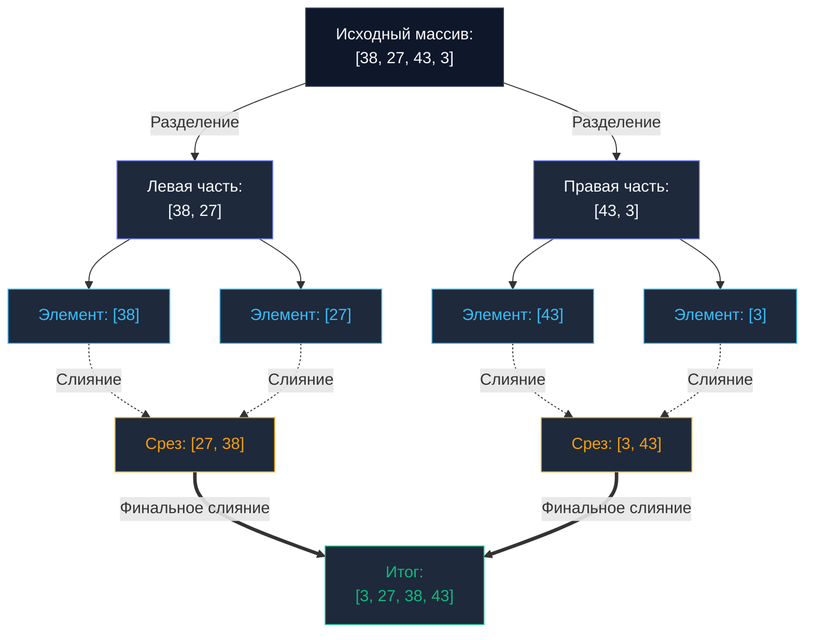

## Введение: Разрушение квадратичного барьера

В предыдущих главах ([[1. Bubble sort и его недостатки]] и [[2. Insertion sort]]) мы находились в границах квадратичной сложности $O(N^2)$. Подобные алгоритмы эффективны для крошечных срезов, но если перед бэкенд-сервисом встает задача отсортировать хотя бы миллион записей, процессор потратит астрономическое количество времени, прежде чем завершит вычисления.

Чтобы пробить квадратичный потолок производительности, компьютерные науки обратились к парадигме **Разделяй и властвуй (Divide and Conquer)**. Первым и наиболее фундаментальным алгоритмом в этом классе является **Сортировка слиянием (Merge Sort)**, сформулированная Джоном фон Нейманом еще в 1945 году. 

Для современного инженера высоконагруженных систем Merge Sort — это не просто учебный алгоритм. Это основополагающий архитектурный паттерн, лежащий в основе распределенных вычислительных платформ (MapReduce) и механизмов фонового слияния файлов на диске (`Compaction`) в современных базах данных уровня LSM.

---

## Концепция: Разделяй и властвуй

Алгоритм состоит из двух циклически сменяющих друг друга фаз:

1. **Разделение (Divide):** Берем исходный массив и делим его ровно пополам. Полученные половины снова делим пополам. Продолжаем рекурсивное деление до тех пор, пока длина сегмента не станет равной 1. (Одиночный элемент тривиально считается уже отсортированным).
2. **Слияние (Conquer / Merge):** Берем два смежных отсортированных массива и «сливаем» их в единый упорядоченный срез. Для этого размещаем два указателя на начала обоих списков, на каждом шаге выбираем наименьший элемент, переносим его в результирующий буфер и сдвигаем соответствующий указатель вперед.



---

## Асимптотическая сложность

* **Время выполнения (Худший, Средний и Лучший случаи):** $O(N \log N)$ (или `O(N \log N)`).
  Глубина рекурсивного дерева деления всегда строго равна $\log_2 N$. На каждом из уровней рекурсии суммарно выполняется линейный проход $O(N)$ для слияния элементов. Произведение высоты дерева на стоимость уровня дает непоколебимые $O(N \log N)$. В отличие от Quick Sort, у Merge Sort **отсутствует худший случай деградации** — алгоритм одинаково быстр на любых данных.
* **Пространственная сложность (Память):** $O(N)$ (или `O(N)`). Необходимость выделения дополнительной памяти — главная ахиллесова пята классического Merge Sort.
* **Стабильность:** Да, это образцовая стабильная сортировка (`Stable Sort`), сохраняющая исходный порядок следования одинаковых ключей.

---

## Mechanical Sympathy: Битва за память

С точки зрения кремниевой архитектуры процессора и подсистемы памяти у Merge Sort есть две диаметрально противоположные стороны.

**Светлая сторона: Идеальный паттерн доступа.**
Операция слияния (`merge`) — абсолютный триумф для аппаратного префетчера процессора (`Hardware Prefetcher`). Мы считываем элементы из двух подмассивов строго последовательно слева направо и записываем их в результирующий буфер также строго последовательно. Никаких хаотичных прыжков по указателям (`Pointer Chasing`). Кэши первого и второго уровней (`L1/L2`) функционируют со стопроцентной аппаратной отдачей.

**Темная сторона: Аллокации и Garbage Collector.**
Чтобы объединить два подмассива, алгоритму физически требуется **вспомогательный буфер** в оперативной памяти, суммарно эквивалентный объему исходного массива.

> [!warning] Ловушка / Gotcha (Наивная реализация)
> В студенческих и непродуманных реализациях на Go разработчики нередко пишут конструкцию вида `make([]T, len(left) + len(right))` непосредственно внутри вызываемой миллионы раз функции `merge`.
> Для высоконагруженного сервиса это катастрофа! При сортировке массива всего на 1 миллион записей такая программа совершит сотни тысяч мелких аллокаций в куче (`Heap`).
> Во-первых, вызовы аллокатора рантайма (`malloc`) заблокируют системные потоки горутин. Во-вторых, сборщик мусора (`GC`, `Garbage Collector`) растратит гигабайты пропускной способности памяти на очистку временных буферов, вызвав тяжелые паузы остановки мира (`STW`).

**Промышленный паттерн в Go:** Выделить вспомогательный буфер `O(N)` **ровно один раз** в точке входа и передавать его как черновую рабочую область (`scratch space`) во все дочерние рекурсивные ветви.

---

## Идиоматичная реализация на Go

Ниже представлена чистая, типобезопасная и свободная от аллокаций в рекурсии реализация Merge Sort на современном Go (1.21+):

```go
package sort

import "cmp"

// MergeSort сортирует срез, используя O-N- дополнительной памяти
func MergeSort[T cmp.Ordered](arr []T) {
	if len(arr) <= 1 {
		return
	}

	// Выделяем буфер ОДИН РАЗ на всю операцию сортировки!
	// Это избавляет GC от работы и бережет такты CPU (scratch space).
	buffer := make([]T, len(arr))

	mergeSortRec(arr, buffer, 0, len(arr)-1)
}

// mergeSortRec - внутренняя рекурсивная функция разделения
func mergeSortRec[T cmp.Ordered](arr, buffer []T, left, right int) {
	if left >= right {
		return
	}

	// Вычисляем середину с защитой от целочисленного переполнения
	mid := left + (right-left)/2

	// Разделяем
	mergeSortRec(arr, buffer, left, mid)
	mergeSortRec(arr, buffer, mid+1, right)

	// Властвуем (сливаем)
	merge(arr, buffer, left, mid, right)
}

func merge[T cmp.Ordered](arr, buffer []T, left, mid, right int) {
	i := left    // Указатель на левую половину
	j := mid + 1 // Указатель на правую половину
	k := left    // Указатель на буфер

	// 1. Сравниваем и копируем меньший элемент в буфер
	for i <= mid && j <= right {
		if arr[i] <= arr[j] { // Оператор "<=" гарантирует стабильность сортировки
			buffer[k] = arr[i]
			i++
		} else {
			buffer[k] = arr[j]
			j++
		}
		k++
	}

	// 2. Дописываем хвост левой половины (если остался)
	for i <= mid {
		buffer[k] = arr[i]
		i++
		k++
	}

	// 3. Дописываем хвост правой половины (если остался)
	for j <= right {
		buffer[k] = arr[j]
		j++
		k++
	}

	// 4. Копируем отсортированные данные из буфера обратно в оригинальный срез
	// Копируем только тот участок, который сливали: arr-left:right+1-
	copy(arr[left:right+1], buffer[left:right+1])
}
```

---

## Где Merge Sort абсолютно незаменим?

Если Quick Sort работает быстрее в оперативной памяти благодаря отсутствию тяжелого копирования во вспомогательный срез, зачем инженеру вообще нужен Merge Sort?

Ответ кроется в архитектуре дисковых подсистем, баз данных и обработке сверхбольших потоков данных.

> [!tip] Собеседование
> **Вопрос:** У вас есть файл с логами размером 100 ГБ. Ваш сервер располагает лишь 4 ГБ оперативной памяти. Как отсортировать данный файл? Алгоритмы быстрой сортировки здесь бессильны, поскольку весь массив физически невозможно загрузить в RAM.
> **Ответ:** Задача решается с помощью **Внешней сортировки слиянием (External Merge Sort)**.

Фаза слияния (`merge`) обладает фундаментальным свойством: ей **не требуется видеть весь массив целиком**. Чтобы производить упорядоченное слияние нескольких отсортированных потоков, достаточно считывать только головные элементы (первые порции) каждого потока.

**Архитектура внешней сортировки (`External Sorting`):**
1. Файл считывается блоками по 1 ГБ, комфортно помещающимися в RAM.
2. Каждый блок сортируется в оперативной памяти быстрым алгоритмом (например, `pdqsort`) и сбрасывается на диск в виде временных фрагментов (получаем 100 упорядоченных файлов по 1 ГБ).
3. Затем открываются дескрипторы всех 100 файлов на последовательное потоковое чтение, и из каждого считывается по одному первому элементу.
4. С помощью очереди с приоритетами (`Min-Heap`, см. [[1. Куча как структура данных]]) или линейного селектора находится минимальный ключ среди 100 доступных голов.
5. Найденный минимум записывается в результирующий поток на диске, а из соответствующего файла-источника подтягивается следующий элемент.

По точно такому же принципу реализовано объединение неизменяемых файлов `SSTables` в дисковом дереве [[4. LSM дерево]] (`LSM-дереве`), когда аналитические СУБД вроде `ClickHouse` или распределенные хранилища вроде `Cassandra` выполняют фоновое слияние (`Compaction`). Именно поэтому алгоритм Merge Sort лежит в фундаменте современной индустрии Big Data.

---

## Резюме

* **Merge Sort** — фундаментальный алгоритм с гарантированной стабильной сложностью $O(N \log N)$ без риска худшего случая деградации.
* **Главный компромисс:** Требование $O(N)$ дополнительной памяти нагружает шину и процессорный кэш непрерывными операциями `copy`.
* **Ключевое преимущество:** Строго последовательный доступ к памяти и способность производить внешнюю сортировку терабайтных наборов данных (`External Sorting`), многократно превышающих объем оперативной памяти.

Несмотря на стабильность и безупречную предсказуемость Merge Sort, для данных, которые целиком помещаются в оперативную память, инженеры отдают предпочтение сортировке «на месте» (`In-place`), даже ценой потери стабильности. Об этом алгоритме пойдет речь в следующей главе: [[4. Quick sort]].