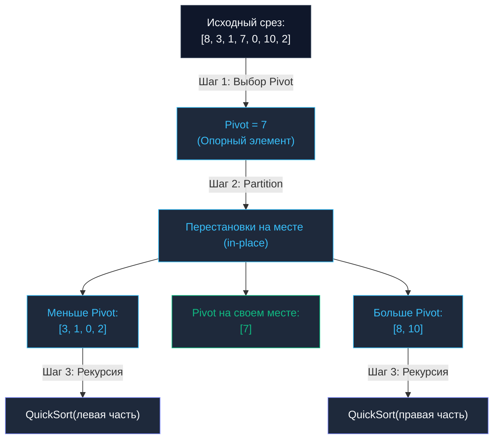

## Введение: В погоне за скоростью на месте

В предыдущей главе [[3. Merge sort]] мы познакомились с мощной парадигмой «Разделяй и властвуй». Сортировка слиянием математически безупречна и гарантирует непоколебимые $O(N \log N)$ в любых условиях. Однако для вычислений в оперативной памяти (in-memory) у нее есть существенный архитектурный изъян: требование выделения дополнительного буфера памяти размером $O(N)$. Если сервис сортирует срез на 10 ГБ данных, ему потребуется выделить еще 10 ГБ оперативной памяти просто для того, чтобы перекладывать байты из одного буфера в другой.

Индустрии требовался алгоритм, работающий столь же быстро, но производящий все манипуляции **строго на месте (in-place)**, без обращения к аллокатору кучи. В 1959 году выдающийся британский ученый Тони Хоар изобрел **Быструю сортировку (Quick Sort)**. Сегодня ее модификации служат надежным мотором стандартных библиотек практически всех промышленных языков программирования, включая Go.

---

## Концепция: Разделение вокруг опоры

В то время как Merge Sort сначала механически делит срез пополам, а всю интеллектуальную работу откладывает на фазу слияния, Quick Sort действует с точностью до наоборот. Вся содержательная работа выполняется на этапе разбиения (**Partition**), после чего фаза «слияния» вообще не требуется.

Алгоритм строится на трех шагах:
1. **Выбор опорного элемента (Pivot):** Из подмассива выбирается один элемент, относительно которого будет оцениваться весь набор.
2. **Разделение (Partition):** Элементы среза переставляются на месте таким образом, чтобы все значения, меньшие `pivot`, оказались слева от него, а все значения, большие или равные — справа. В результате этой процедуры сам `pivot` оказывается на своей **окончательной, идеально отсортированной позиции**.
3. **Рекурсия:** Алгоритм рекурсивно вызывается для независимой обработки левого и правого сегментов.



---

## Mechanical Sympathy: Почему Quick Sort действительно "Quick"?

Теоретическая сложность Quick Sort в среднем составляет $O(N \log N)$ — ровно столько же, сколько у Merge Sort. Однако на реальном кремниевом процессоре Quick Sort обгоняет соперника в 2–3 раза. В чем секрет этого феномена?

1. **Идеальная пространственная локальность (Cache Locality):** Алгоритм выполняется strictly `in-place`. Встречные указатели движутся навстречу друг другу, последовательно считывая смежные элементы. Аппаратный предсказатель адресов (`Hardware Prefetcher`) заполняет кэш-линии (`Cache Lines`) первого уровня `L1-кэша` с предельной эффективностью. Никаких блужданий по памяти.
2. **Нулевые аллокации в куче:** Алгоритм обходится без вызовов `make()`. Нет нагрузки на Garbage Collector, нет задержек на выделение страниц памяти.
3. **Минимальный объем перемещения данных:** В Merge Sort каждый байт неизбежно копируется из исходного среза во временный буфер и обратно. Quick Sort выполняет лишь точечные парные перестановки (`swaps`), не покидая границ одного непрерывного блока памяти.

---

## Трагедия худшего случая: $O(N^2)$

Однако у чистой схемы Quick Sort есть драматическая уязвимость. Ее производительность критически зависит от качества выбора опорного элемента (`Pivot`).

> [!warning] Ловушка / Gotcha
> Представьте наивную реализацию, в которой в качестве `pivot` всегда выбирается последний элемент подмассива, а на вход подается **уже отсортированный массив** (или массив, отсортированный в обратном порядке).
> Что произойдет во время процедуры Partition? Левая часть заберет ровно $N-1$ элементов, а правая останется пустой ($0$ элементов).
> Сбалансированное дерево рекурсии глубиной $\log_2 N$ моментально вырождается в линейную цепь глубиной $N$.
> Сложность катастрофически деградирует до $O(N^2)$, а колоссальная глубина рекурсии способна спровоцировать переполнение стека (`Stack Overflow`, хотя в Go стек горутин динамически расширяется, постоянные аллокации стековых сегментов обрушат пропускную способность сервиса).

### Как индустрия решает проблему Pivot?

В промышленном коде никто не выбирает тривиальный крайний элемент. На практике применяются надежные эвристики:

1. **Случайный Pivot (Randomized Pivot):** Выбор псевдослучайного индекса математически гарантирует среднее $O(N \log N)$, однако обращение к генератору случайных чисел в узком цикле создает избыточный оверхед.
2. **Медиана трех (Median of Three):** Алгоритм исследует первый, центральный и последний элементы подмассива и выбирает в качестве опоры средний по величине. Эта операция занимает буквально пару инструкций CPU и идеально защищает от деградации на частично упорядоченных массивах.

---

## Идиоматичная реализация на Go

Существует две классические схемы разделения: схема Ломуто (наиболее проста и наглядна) и схема Хоара (выполняет в среднем втрое меньше перестановок). Ниже представлена надежная реализация со схемой Ломуто и оптимизацией «Медиана трех», написанная на современном обобщенном Go (1.21+):

```go
package sort

import "cmp"

// QuickSort сортирует срез in-place без выделения дополнительной динамической памяти.
func QuickSort[T cmp.Ordered](arr []T) {
	if len(arr) < 2 {
		return
	}
	quickSortRec(arr, 0, len(arr)-1)
}

func quickSortRec[T cmp.Ordered](arr []T, low, high int) {
	if low < high {
		// Оптимизация: Выбор Pivot с помощью "Медианы трех" 
		// надежно защищает от деградации в O-N^2- на упорядоченных срезах.
		pivotIdx := medianOfThree(arr, low, high)

		// Прячем pivot в конец, чтобы алгоритм Ломуто сработал стандартно
		arr[pivotIdx], arr[high] = arr[high], arr[pivotIdx]

		// Выполняем разделение
		p := partition(arr, low, high)

		// Рекурсивно сортируем левую и правую части.
		// Элемент под индексом 'p' уже находится на своем финальном месте!
		quickSortRec(arr, low, p-1)
		quickSortRec(arr, p+1, high)
	}
}

// partition переставляет элементы и возвращает финальный индекс pivot
func partition[T cmp.Ordered](arr []T, low, high int) int {
	pivot := arr[high]
	i := low // i указывает на границу элементов, которые строго меньше pivot

	for j := low; j < high; j++ {
		if arr[j] < pivot {
			arr[i], arr[j] = arr[j], arr[i]
			i++
		}
	}
	// Ставим pivot на его законное место
	arr[i], arr[high] = arr[high], arr[i]
	return i
}

// medianOfThree находит индекс среднего по значению элемента
// среди первого, центрального и замыкающего.
func medianOfThree[T cmp.Ordered](arr []T, low, high int) int {
	mid := low + (high-low)/2

	// Сортируем три элемента между собой прямо в массиве
	if arr[low] > arr[mid] {
		arr[low], arr[mid] = arr[mid], arr[low]
	}
	if arr[low] > arr[high] {
		arr[low], arr[high] = arr[high], arr[low]
	}
	if arr[mid] > arr[high] {
		arr[mid], arr[high] = arr[high], arr[mid]
	}

	// Теперь arr-mid- содержит медиану
	return mid
}
```

> [!info] Под капотом
> Стандартный пакет `sort` и современный пакет `slices` в Go не используют Quick Sort в изолированном виде. Они опираются на передовой гибридный алгоритм **pdqsort (Pattern-Defeating Quicksort)**:
> 1. Если длина сегмента мала (< 12–24 элементов), вызывается [[2. Insertion sort]], устраняя оверхед рекурсии.
> 2. Основным движком выступает модифицированный Quick Sort со схемой Хоара и вычислением псевдомедианы девяти (Tukey's ninther) на больших объемах.
> 3. Если алгоритм детектирует серию неудачных разбиений, грозящих падением в $O(N^2)$, он динамически переключается на **Heap Sort** (пирамидальную сортировку), гарантирующую строго $O(N \log N)$ в любых граничных условиях.
> Данная триада формирует алгоритмический класс `IntroSort / pdqsort`, внутреннее устройство которого мы детально исследуем в главе [[9. Внутренности пакета sort в Go]].

---

## Собеседование: Главные вопросы

> [!tip] Собеседование
> **Вопрос 1: Является ли Quick Sort стабильной сортировкой (`Stable`)?**  
> **Ответ:** Нет. Из-за далеких прыжков элементов при перестановках (`swaps`) в фазе Partition одинаковые по значению элементы могут легко поменяться относительным порядком. Если в архитектуре критически необходима стабильность (например, сохранение хронологии событий внутри одинаковых категорий), инженеры применяют [[3. Merge sort]] либо стандартный метод `slices.SortStableFunc`.
>
> **Вопрос 2: Сколько дополнительной памяти потребляет Quick Sort?**  
> **Ответ:** Хотя массив модифицируется строго на месте (`in-place`), алгоритм **не работает за строгое $O(1)$ по памяти**.  
> Каждый рекурсивный шаг откладывает стековый кадр в стеке вызовов (`Call Stack`). В среднем и лучшем случаях глубина рекурсии составляет $\log_2 N$, то есть алгоритм требует **$O(\log N)$ стековой памяти**. В худшем сценарии (без эвристик ограничения глубины) потребление стека способно деградировать до линейного $O(N)$.

---

## Итог

* **Quick Sort** — общепризнанный лидер среди алгоритмов сортировки в оперативной памяти благодаря исключительной кэш-локальности и отсутствию аллокаций.
* **Слабость:** Теоретический риск деградации в $O(N^2)$ при неудачном выборе опорного элемента. В продакшене проблема нивелируется эвристиками вроде «Медианы трех» и гибридизацией в `pdqsort`.
* **Память:** Работает `in-place`, но расходует $O(\log N)$ памяти стека вызовов (`Call Stack`).
* **Стабильность:** Нестабилен (`Unstable`).

Если вашей системе требуется абсолютная, математически нерушимая гарантия $O(N \log N)$ без малейшего риска деградации и с нулевыми требованиями к дополнительной динамической памяти, на помощь приходит алгоритм, основанный на двоичной куче. 

В следующей статье мы разберем пирамидальную сортировку: [[5. Heap sort]].