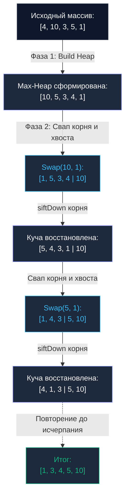

## Введение: Железная гарантия без аллокаций

В предыдущей главе [[4. Quick sort]] мы восхищались головокружительной скоростью быстрой сортировки и ее бережным отношением к кэш-линиям центрального процессора. Однако мы также обнаружили ее критическую ахиллесову пяту — катастрофическую деградацию до $O(N^2)$ при неудачном выборе опорного элемента (`Pivot`) и риск глубоких рекурсивных вызовов. С другой стороны, алгоритм [[3. Merge sort]] дает строгие $O(N \log N)$, но требует $O(N)$ дополнительной оперативной памяти, что становится непреодолимым препятствием при обработке массивов данных размером в десятки гигабайт.

Инженерной практике требовался алгоритм, гармонично объединяющий сильные стороны обоих подходов: **нерушимую математическую гарантию $O(N \log N)$ в худшем случае и строгое $O(1)$ по памяти (`In-Place`)**.

Таким решением стала **Пирамидальная сортировка (Heap Sort)**, представленная Джоном Уильямсом в 1964 году одновременно с открытием самой структуры данных — Двоичной кучи.

---

## Концепция: Сортировка через структуру данных

Алгоритм Heap Sort напрямую опирается на инвариант невозрастающего дерева (`Max-Heap`), которое мы детально исследовали в контексте приоритетных очередей (см. [[1. Куча как структура данных]]).

Фундаментальное преимущество двоичной кучи заключается в том, что она не требует динамического выделения узлов, указателей и аллокаций в куче Go. Дерево виртуально проецируется на непрерывный срез оперативной памяти с помощью простой арифметики индексов:
* Левый потомок элемента с индексом `i`: `2*i + 1`
* Правый потомок элемента с индексом `i`: `2*i + 2`
* Родительский элемент для узла `i`: `(i - 1) / 2`

Процесс сортировки Heap Sort элегантно делится на две последовательные фазы:

### Фаза 1: Build Max-Heap (Построение кучи)

Исходный неупорядоченный срез преобразуется в валидную кучу `Max-Heap` за линейное время $O(N)$. Для этого алгоритм выполняет обратный проход от середины среза к его началу, последовательно вызывая процедуру просеивания вниз (`siftDown`). В результате этой фазы **абсолютный максимум всего массива гарантированно оказывается в корне** (на индексе `0`).

### Фаза 2: Extract Max (Сортировка)

1. Берем текущий максимум из корня (индекс `0`) и меняем его местами с замыкающим элементом неотсортированной части (индекс `N-1`). Теперь наибольший элемент встал на свою финальную позицию в суффиксе.
2. Виртуальный размер рабочей кучи уменьшается на 1, изолируя зафиксированный элемент.
3. Новый корень на индексе `0`, вероятнее всего, нарушает порядок кучи. Для него вызывается процедура `siftDown`, узел проваливается на соответствующий уровень дерева, а на вершину выталкивается следующий по величине максимум.
4. Шаги циклически повторяются, пока размер кучи не сократится до одного элемента.



---

## Идиоматичная реализация на Go

Ниже представлена строгая и эффективная реализация Heap Sort на современном Go (1.21+) с использованием обобщений (`Generics`) без привлечения сторонних зависимостей:

```go
package sort

import "cmp"

// HeapSort сортирует срез на месте (in-place) со строгой гарантией O-N log N-
func HeapSort[T cmp.Ordered](arr []T) {
	n := len(arr)
	if n <= 1 {
		return
	}

	// Фаза 1: Построение Max-Heap за O(N)
	// Начинаем с n/2 - 1, так как вторая половина массива - это листовые узлы,
	// а листья по определению уже являются корректными кучами из 1 элемента.
	for i := n/2 - 1; i >= 0; i-- {
		siftDown(arr, i, n)
	}

	// Фаза 2: Последовательное извлечение максимума
	for i := n - 1; i > 0; i-- {
		// Перемещаем текущий корень (максимум) в конец неотсортированной области
		arr[0], arr[i] = arr[i], arr[0]

		// Вызываем siftDown для уменьшенной кучи
		// Индекс i теперь выступает в роли текущего размера кучи
		siftDown(arr, 0, i)
	}
}

// siftDown просеивает элемент вниз, восстанавливая инвариант Max-Heap
func siftDown[T cmp.Ordered](arr []T, root, length int) {
	for {
		largest := root
		left := 2*root + 1
		right := 2*root + 2

		// Проверяем левого потомка
		if left < length && arr[left] > arr[largest] {
			largest = left
		}

		// Проверяем правого потомка
		if right < length && arr[right] > arr[largest] {
			largest = right
		}

		// Если родитель больше обоих потомков - инвариант кучи соблюден
		if largest == root {
			break
		}

		// Иначе меняем родителя с наибольшим потомком
		arr[root], arr[largest] = arr[largest], arr[root]

		// Продолжаем просеивание на следующем уровне
		root = largest
	}
}
```

---

## Mechanical Sympathy: Почему CPU ненавидит Heap Sort?

Если Heap Sort обладает безупречными теоретическими характеристиками (не требует вспомогательной памяти в отличие от Merge Sort и не вырождается в $O(N^2)$ в отличие от Quick Sort), почему разработчики рантаймов не используют его в качестве алгоритма сортировки по умолчанию?

Причина кроется в физическом поведении **Аппаратного кэша (`L1/L2 Cache`)**.

Обратите внимание на логику спуска в процедуре `siftDown`. Чтобы спуститься к потомкам, мы вычисляем индексы по формуле `2*i + 1`.
На крупном массиве данных элемент под индексом `1000` сравнивается с элементом под индексом `2001`. На следующей итерации проверка адресуется к ячейке `4003`, затем `8007`.

Это **геометрическая прогрессия скачков по физической памяти**. Аппаратный префетчер (`Hardware Prefetcher`) современного процессора, спроектированный под предсказание линейных или регулярных последовательностей, здесь оказывается абсолютно бесполезен. Каждый спуск в куче размером в десятки мегабайт гарантирует болезненный промах кэша (`Cache Miss`). Процессор простаивает сотни тактов, ожидая доставку данных по шине оперативной памяти.

Именно поэтому, несмотря на математически идентичную асимптотику $O(N \log N)$, в реальном физическом времени исполнения (`wall-clock time`) **Heap Sort уступает Quick Sort в 2–3 раза**.

---

## Роль Heap Sort в реальном Production (IntroSort)

Означает ли это, что пирамидальная сортировка осталась лишь историческим курьезом? Ни в коем случае. Она выступает надежным щитом, защищающим инфраструктуру от деградации производительности и DoS-атак на алгоритмическую сложность.

> [!tip] Собеседование
> **Вопрос:** Если злоумышленник отправит на бэкенд специально сгенерированный массив данных (killer sequence), провоцирующий худший случай $O(N^2)$ в Quick Sort, как стандартная библиотека предотвратит зависание сервиса?
> **Ответ:** Задействуя архитектуру алгоритма **IntroSort** (Introspective Sort).

**IntroSort** (в современном рантайме Go интегрированный в состав `pdqsort`) — это гибридная система, стартующая как высокоскоростной Quick Sort. Однако алгоритм *интроспективно* непрерывно контролирует глубину дерева рекурсии. Если глубина деления превышает расчетный порог `2 * log2(N)` (что свидетельствует о неудачном подборе пивотов и риске квадратичного вырождения), алгоритм немедленно прерывает рекурсию быстрой сортировки и **вызывает `heapSort` для оставшегося сегмента**.

В этой схеме Heap Sort играет роль **идеального спасательного парашюта**: он менее благосклонен к кэшу процессора, но обеспечивает несокрушимую гарантию $O(N \log N)$, защищая систему от переполнения стека и зависания ядер CPU.

> [!info] Под капотом
> В исходных текстах стандартной библиотеки Go (в пакетах `slices` и `sort`) реализована функция `heapSort`. Она не вызывается при стандартном старте. Она активируется внутри контура `pdqsort`, как только счетчик неудачных разбиений (`limit`) падает до нуля:
> ```go
> if limit == 0 {
>     heapSort(data, a, b)
>     return
> }
> ```

---

## Итог

* **Временная сложность:** Строго $O(N \log N)$ во всех сценариях (худший, средний, лучший).
* **Пространственная сложность:** Строго $O(1)$ (`In-place`).
* **Стабильность:** Нестабилен (далекие перестановки через дерево нарушают порядок следования равных элементов).
* **Слабая сторона:** Низкая пространственная локальность (Cache Locality) из-за прыжков по индексам `2*i`.
* **Роль в бэкенд-инженерии:** Безотказный защитный механизм (Fallback) в современных гибридных алгоритмах сортировки.

Мы завершили детальный анализ алгоритмов, основанных на парном сравнении ключей (`Comparison-based sorts`). В теории алгоритмов математически доказано, что ни один компараторный алгоритм в принципе не способен работать быстрее $O(N \log N)$.

Но что, если перед нами стоит задача отсортировать срез за строго линейное время **$O(N)$**? Возможно ли преодолеть фундаментальный барьер сравнений? Да — если мы откажемся от операторов сравнения и научимся данные подсчитывать. В следующей статье мы переходим к линейным алгоритмам: [[6. Counting sort]].