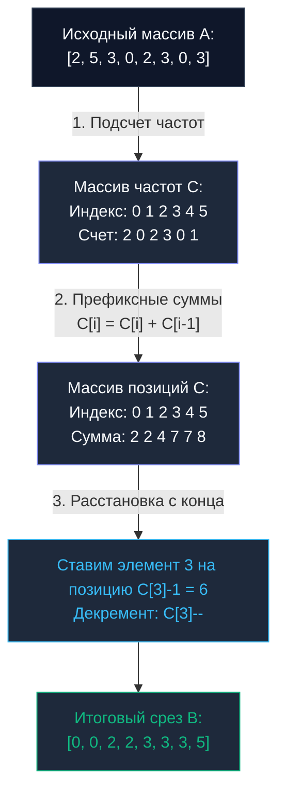

## Введение: Взлом барьера O(N log N)

В предшествующих главах (от [[1. Bubble sort и его недостатки]] до [[5. Heap sort]]) мы находились в строгих рамках алгоритмов, основанных на **парном сравнении** элементов (`Comparison-based sorts`). В классической теории сложности доказана фундаментальная теорема: никакой алгоритм, упорядочивающий данные через логические проверки вида «$A > B$?», математически не способен преодолеть нижнюю границу $O(N \log N)$ в худшем случае. Это нерушимый предел информатики для произвольных данных.

Но что произойдет, если мы принципиально откажемся от операций сравнения?
Если нам заранее известна физическая природа обрабатываемых сущностей (например, то, что это целочисленные идентификаторы, статусы HTTP-ответов или возрасты пользователей в фиксированном диапазоне), мы можем элегантно обойти теорему сравнений и отсортировать массив за строго линейное время — **$O(N)$**.

Первым и наиболее наглядным алгоритмом в этом семействе является **Сортировка подсчетом (Counting Sort)**.

---

## Концепция: Считать, а не сравнивать

Представьте практическую бэкенд-задачу: отсортировать массив из одного миллиона оценок студентов за экзамен. Значения оценок строго ограничены диапазоном от 1 до 5. Будет ли благоразумно запускать рекурсивный Quick Sort для этой задачи? Конечно нет. Инженер просто подсчитает количество единиц, двоек, троек, четверок и пятерок, а затем запишет их последовательно в исходный буфер: сначала все единицы, затем двойки и так далее.

В этой элегантной идее и заключается суть Counting Sort. Алгоритм структурирован в три последовательные фазы:
1. **Подсчет частот:** Создается вспомогательный массив счетчиков (`Count Array`), в котором фиксируется точное количество вхождений каждого ключа.
2. **Префиксные суммы:** Массив `Count Array` преобразуется путем кумулятивного суммирования так, чтобы каждая ячейка хранила сумму предшествующих частот. Это дает строгие абсолютные координаты (финишные индексы) для каждого значения. Данный паттерн мы подробно изучим в главе [[6. Prefix sums - префиксные суммы]].
3. **Расстановка:** Исходный срез сканируется с конца (справа налево для сохранения стабильности), и каждый элемент помещается на вычисленную для него позицию в результирующем буфере.



---

## Mechanical Sympathy: Время против Памяти

Асимптотическая сложность алгоритма Counting Sort составляет **$O(N + K)$**, где:
* $N$ — общее число сортируемых записей.
* $K$ — ширина диапазона значений ($\max - \min + 1$).

> [!warning] Ловушка / Gotcha (Ограничение $K$)
> Линейная скорость $O(N)$ — это привлекательное свойство, которое сохраняется строго при условии $K \le N$.
> Представьте наивную попытку отсортировать срез всего из трех элементов: `[1, 2, 1_000_000_000]`.
> Здесь $N = 3$, однако диапазон $K = 1\,000\,000\,000$.
> Алгоритм попытается выделить в оперативной памяти срез `Count Array` емкостью в 1 миллиард элементов. Для 64-битных целых чисел (`int64`) это потребует **8 Гигабайт RAM** исключительно ради сортировки трех чисел! Процессор растратит миллиарды тактов на зануление гигантского участка памяти.
> В этом сценарии сложность $O(N + K)$ катастрофически деградирует по памяти, разрушая `L1/L2 кэши` процессора и работая в тысячи раз медленнее, чем классический `Quick Sort`.

С точки зрения кремния при адекватном диапазоне $K$ алгоритм Counting Sort чрезвычайно эффективен. В его теле **полностью отсутствуют условные ветвления (`Branching`)**, зависящие от данных: нет сравнений `if arr[i] > arr[j]`. Модуль аппаратного предсказания ветвлений (`Branch Predictor`) не сталкивается со сбросами конвейера, и процессор выполняет инструкции с предельной плотностью.

---

## Идиоматичная реализация на Go

В учебных примерах алгоритм часто упрощают, предполагая неотрицательность чисел. В реальном бэкенде данные нередко содержат отрицательные значения.

Идиоматичный прием в Go — введение **смещения (`Offset`)**. Мы находим минимальное значение `minVal` и вычитаем его из всех элементов при индексации в массиве подсчета. Это позволяет прозрачно упорядочивать произвольные целочисленные диапазоны (например, `[-5, 2, -1]`).

Кроме того, мы реализуем каноническую **стабильную (`Stable`)** версию алгоритма:

```go
package sort

// CountingSort сортирует целые числа за O(N + K) времени и O(N + K) памяти.
func CountingSort(arr []int) {
	if len(arr) <= 1 {
		return
	}

	// 1. Находим минимальное и максимальное значения для определения диапазона K
	minVal, maxVal := arr[0], arr[0]
	for _, v := range arr {
		if v < minVal {
			minVal = v
		}
		if v > maxVal {
			maxVal = v
		}
	}

	// Диапазон значений K
	k := maxVal - minVal + 1

	// Защита памяти: если диапазон K несоразмерно велик по сравнению с N,
	// в промышленном коде здесь следует выполнить Fallback на QuickSort/pdqsort.
	// Для демонстрации алгоритма продолжаем выполнение.

	count := make([]int, k)         // O(K) памяти под частоты
	output := make([]int, len(arr)) // O(N) вспомогательной памяти под результат

	// 2. Подсчитываем частоты (используем minVal как смещение - Offset)
	for _, v := range arr {
		count[v-minVal]++
	}

	// 3. Вычисляем префиксные суммы
	// Теперь count[i] хранит позицию (индекс + 1) последнего элемента
	// со значением (i + minVal) в итоговом массиве.
	for i := 1; i < len(count); i++ {
		count[i] += count[i-1]
	}

	// 4. Расстановка элементов (идем С КОНЦА для стабильности сортировки!)
	for i := len(arr) - 1; i >= 0; i-- {
		val := arr[i]
		// Вычисляем финальный индекс с учетом смещения
		pos := count[val-minVal] - 1

		output[pos] = val

		// Декрементируем счетчик, чтобы следующий такой же элемент встал левее
		count[val-minVal]--
	}

	// 5. Копируем результат обратно в исходный массив
	copy(arr, output)
}
```

> [!tip] Собеседование
> **Вопрос:** Почему на шаге 4 мы обязательно обходим исходный срез **с конца (справа налево)**, а не слева направо?
> **Ответ:** Это необходимо для сохранения свойства **Стабильности (`Stable`)**.  
> Если во входном массиве присутствуют два эквивалентных по ключу элемента (например, `3_a` и `3_b`, где `3_a` стоял левее в оригинале), они оба претендуют на один диапазон ячеек. Префиксная сумма указывает на **крайнюю правую** свободную позицию для данного значения.
> Двигаясь с конца, алгоритм первым берет элемент `3_b` (который стоял правее) и размещает его на самую правую свободную ячейку. Затем обрабатывается `3_a` и смещается на одну позицию левее. В результате их относительный хронологический порядок гарантированно сохраняется.

---

## Зачем нам стабильность в Counting Sort?

Казалось бы, зачем заботиться о стабильности одинаковых скалярных чисел: ведь тройка неотличима от тройки?
Ответ очевиден: изолированный Counting Sort для голых чисел в продакшене применяется редко. В реальных бэкенд-системах мы сортируем **полноценные доменные структуры по целочисленному ключу**.

Например, у нас имеется срез из миллиона записей логов `struct { Level int; Message string }`. Нам необходимо сгруппировать их по полю `Level` (от 1 до 5). Если алгоритм нестабилен, хронологический порядок сообщений внутри каждого уровня разрушится. Стабильный Counting Sort гарантирует, что события уровня `ERROR` соберутся в единый блок, строго сохранив исходный порядок своего появления в системе.

---

## Итог

* **Временная сложность:** Строго $O(N + K)$.
* **Пространственная сложность:** $O(N + K)$ (требует выделения срезов под `Count Array` и буфер вывода).
* **Специфика:** Применим строго к дискретным ключам; не работает с вещественными числами (`float64`) и строками произвольной длины напрямую.
* **Главное ограничение:** Неприемлемая деградация по памяти и времени при большом разбросе данных ($K \gg N$).

Но что делать, если перед нами стоит задача отсортировать миллиарды 64-битных хешей или UUID за линейное время $O(N)$? Выделить массив счетчиков размером $2^{64}$ физически невозможно.
Для преодоления этого фундаментального барьера инженеры объединили Counting Sort с поразрядной обработкой: числа сортируются фрагмент за фрагментом (по байтам или разрядам). Эта концепция называется **Поразрядной сортировкой**, и мы разберем ее в следующей главе: [[7. Radix sort]].