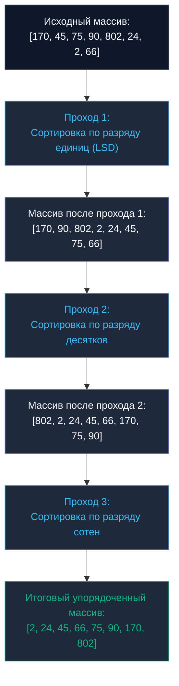

## Введение: Линейная сортировка без ограничений по диапазону

В предыдущей главе [[6. Counting sort]] мы детально исследовали, как отсортировать срез за строго линейное время $O(N)$, полностью исключив из алгоритма операции парного сравнения элементов. Однако там мы натолкнулись на жесткий физический барьер: Сортировка подсчетом требует выделения массива счетчиков размером $K$, где $K$ — размах между минимальным и максимальным значениями. Попытка отсортировать компактный срез `[1, 2, 1_000_000_000]` приведет к аллокации гигабайтного массива частот и полному коллапсу производительности.

Чтобы преодолеть этот тупик и сохранить преимущество линейной скорости $O(N)$ для произвольных 32- и 64-битных чисел без чудовищного перерасхода оперативной памяти, была разработана **Поразрядная сортировка (Radix Sort)**.

---

## Архитектура Radix Sort

Фундаментальная идея Radix Sort заключается в том, чтобы упорядочивать сущности не целиком за один тяжелый шаг, а последовательно по частям — **по разрядам (отдельным цифрам, битовым группам или байтам)**.

В качестве внутреннего рабочего механизма алгоритм задействует стабильную сортировку подсчетом (`Counting Sort`). В архитектуре поразрядной обработки выделяют два базовых направления:
1. **LSD (Least Significant Digit):** Обработка стартует с младшего разряда (единиц) и шаг за шагом продвигается к старшим разрядам. Это классический и наиболее востребованный подход для плоских числовых массивов.
2. **MSD (Most Significant Digit):** Обработка начинается со старших разрядов. Этот подход традиционно применяется для рекурсивной сортировки строк переменной длины в лексикографическом порядке.

### Как работает LSD Radix Sort

Рассмотрим входной числовой набор: `[170, 45, 75, 90, 802, 24, 2, 66]`.
Поскольку максимальное число содержит три десятичных разряда, алгоритм упорядочит данные ровно за 3 последовательных прохода:



> [!warning] Ловушка / Gotcha: Условие стабильности
> Для корректной работы алгоритма Radix Sort внутренняя подпрограмма сортировки разрядов (Counting Sort) **обязана быть строго стабильной (`Stable`)**. Если два элемента обладают одинаковой цифрой в текущем разряде (например, числа `45` и `75` при сортировке по разряду десятков), их относительное взаимное расположение обязано сохраниться неизменным. Малейшее нарушение стабильности приведет к мгновенному разрушению порядка, достигнутого на предыдущих проходах по младшим разрядам!

---

## Mechanical Sympathy: Битовая магия вместо математики

В классической академической литературе Radix Sort обычно иллюстрируют на десятичной системе счисления (`Base-10`). Для выделения очередного разряда при этом используют операции целочисленного деления и остатка: `(num / 10) % 10`.

Для системного разработчика высоконагруженного бэкенда такой подход неприемлем. В арифметико-логическом устройстве (`ALU`) современного процессора деление (`/`) и вычисление остатка (`%`) — крайне тяжелые скалярные инструкции, требующие от 15 до 40+ тактов CPU. Использование арифметического деления при сортировке десятков миллионов записей уничтожит всякое преимущество линейной асимптотики, сделав поразрядную сортировку кратно медленнее обычного `Quick Sort`.

### Переход к Base-256 (Байтовая сортировка)

Настоящий промышленный Radix Sort оперирует не десятичными цифрами, а байтами. Основание системы счисления выбирается равным $2^8 = 256$ (`Base-256`).

Почему это дает колоссальный выигрыш в производительности:
1. Выделение разряда превращается в быстрый битовый сдвиг вправо `>>` и маскирование `&`: `(num >> 8) & 0xFF`. Эти побитовые инструкции выполняются аппаратурой ровно за **один такт CPU**.
2. В языке Go тип `uint64` занимает ровно 8 байт. Это означает, что для сортировки абсолютно любого массива `uint64` произвольного диапазона нам потребуется строго фиксированное количество проходов: ровно **8 проходов** (по 8 бит каждый). Никакой неопределенности.
3. Размер вспомогательного массива корзин (`Buckets`) в Counting Sort фиксирован и равен ровно 256 ячейкам. Буфер частот `[256]int` занимает всего 2 КБ оперативной памяти и целиком, без малейшего остатка, помещается в быстрейший `L1 кэш` процессора, гарантируя полное отсутствие промахов (`Cache Misses`) на фазе подсчета.

---

## Реализация на Go (Highload Ready)

Ниже представлена высокопроизводительная реализация LSD Radix Sort для беззнаковых 64-битных целых чисел (`uint64`), выделяющая единственный вспомогательный буфер один раз на старте:

```go
package main

// RadixSortUint64 сортирует срез беззнаковых 64-битных целых чисел за строго линейное время.
func RadixSortUint64(arr []uint64) {
	n := len(arr)
	if n < 2 {
		return
	}

	// Аллоцируем вспомогательный буфер ровно один раз на всю процедуру (O(N) по памяти)
	buffer := make([]uint64, n)

	// uint64 занимает 8 байт. Выполняем ровно 8 проходов (по 8 бит).
	// Параметр shift увеличивается с шагом 8: 0, 8, 16, 24, 32, 40, 48, 56
	for shift := uint(0); shift < 64; shift += 8 {
		
		// Buckets для хранения частот значений байта (от 0 до 255)
		var counts [256]int

		// 1. Подсчет частот текущего байта (выделение за 1 такт CPU)
		for i := 0; i < n; i++ {
			digit := (arr[i] >> shift) & 0xFF
			counts[digit]++
		}

		// 2. Префиксные суммы для детерминированного вычисления позиций
		// Это обеспечивает строгую стабильность (Stable)
		for i := 1; i < 256; i++ {
			counts[i] += counts[i-1]
		}

		// 3. Распределение элементов во вспомогательный буфер (обход с конца)
		for i := n - 1; i >= 0; i-- {
			digit := (arr[i] >> shift) & 0xFF
			counts[digit]--
			pos := counts[digit]
			buffer[pos] = arr[i]
		}

		// 4. Синхронизируем состояние: копируем данные обратно в оригинальный срез.
		// Стандартный copy() на уровне ассемблера оптимизирован через memmove
		copy(arr, buffer)
	}
}
```

> [!info] Под капотом: Оптимизация указателей
> Вместо вызова `copy(arr, buffer)` на каждой итерации циклического прохода низкоуровневые оптимизации часто меняют местами сами заголовки срезов: `arr, buffer = buffer, arr`. Однако, поскольку срезы передаются в функции Go как структуры `SliceHeader` по значению, инженеру требуется строго контролировать четность проходов. Поскольку 8 проходов по байтам — число четное, после завершения серии перестановок (`swap`) оригинальный срез гарантированно останется актуальным держателем упорядоченных данных.

---

## Временная и пространственная сложность

* **Временная сложность:** $O(W \cdot N)$, где $W$ — фиксированное количество байт в машинном слове (для 64-битных целых чисел $W = 8$), а $N$ — число элементов в массиве. Поскольку $W$ константно, перед нами чистое линейное время $O(N)$.
* **Пространственная сложность:** $O(N + 2^b)$, где $N$ — размер вспомогательного буфера, а $2^b$ — емкость массива `counts` ($2^8 = 256$ ячеек). Итоговые затраты памяти составляют строго $O(N)$ (`Out-of-place`).

---

## Типичные ловушки и вопросы с собеседований

> [!tip] Собеседование
> **Вопрос:** Если Radix Sort обладает линейной сложностью $O(N)$, почему стандартная библиотека Go (`slices.Sort` или `sort.Slice`) построена на алгоритмах быстрой сортировки со сложностью $O(N \log N)$?
> **Ответ:** 
> 1. **Универсальность:** Radix Sort требует побайтового доступа к представлению данных и применим только для дискретных чисел либо строк фиксированной длины. Он не способен напрямую упорядочивать сложные структуры предметной области по произвольному компаратору `less(i, j)`.
> 2. **Расход памяти:** Radix Sort требует обязательного вспомогательного буфера размером $O(N)$ (`Out-of-place`). Быстрая сортировка оперирует strictly `In-place`, обходясь лишь $O(\log N)$ стековой памяти.
> 3. **Скрытая константа:** Формула $O(W \cdot N)$ означает, что при сортировке 64-битных чисел массив целиком перекачивается через процессор 8 раз. На наборах данных умеренного объема (сотни и тысячи элементов) алгоритм `Quick Sort` за счет меньшего объема перемещений и предельной кэш-локальности физически выигрывает в реальных наносекундах.

### Как сортировать отрицательные числа?

Приведенный выше алгоритм даст сбой на знаковых типах (`int64`), если в массиве встретятся отрицательные значения. В архитектуре процессора отрицательные числа кодируются в формате **дополнительного кода (`Two's Complement (Дополнительный код)`)**: старший знаковый бит у них равен `1`, из-за чего побитовые операции ошибочно сочтут их большими, чем положительные числа.

**Инженерное решение:**
Перед запуском сортировки необходимо инвертировать знаковый бит у всех элементов: `val := val ^ (1 << 63)`. Эта операция смещает диапазон, переводя минимальное отрицательное число в математический ноль, а положительные числа — в верхнюю половину диапазона `uint64`. Массив сортируется стандартным алгоритмом `RadixSortUint64`, после чего знаковый бит повторно инвертируется обратным XOR-преобразованием.

### Как сортировать строки?

Для строк переменной длины применяется алгоритм MSD Radix Sort. Строки сначала распределяются по корзинам в соответствии с их первым байтом, после чего каждая непустая корзина независимо и рекурсивно упорядочивается по второму байту. На этой архитектуре базируются эффективные алгоритмы построения суффиксных массивов ([[6. Suffix array]]).

---

## Итог

1. **Radix Sort** — классический высокоскоростной алгоритм линейной сложности $O(N)$, предназначенный для целочисленных и байтовых последовательностей.
2. Алгоритм опирается на многократное последовательное применение стабильного Counting Sort к отдельным разрядам числа.
3. В современных высоконагруженных сервисах вместо десятичных делений используют побайтовую группировку (`Base-256`) и побитовые сдвиги, выполняемые процессором за 1 такт.
4. Radix Sort не является универсальной заменой обычным сортировкам из-за потребности в $O(N)$ дополнительной памяти и узкой специализации типов данных.

На этом мы завершаем исследование специализированных поразрядных алгоритмов. В следующей главе мы возвращаемся к универсальным сортировкам на основе сравнений, чтобы изучить подлинный шедевр практической инженерии, объединивший лучшие качества Insertion Sort и Merge Sort и ставший мировым стандартом в платформах Python, Java и Rust: [[8. Tim sort концепция]].