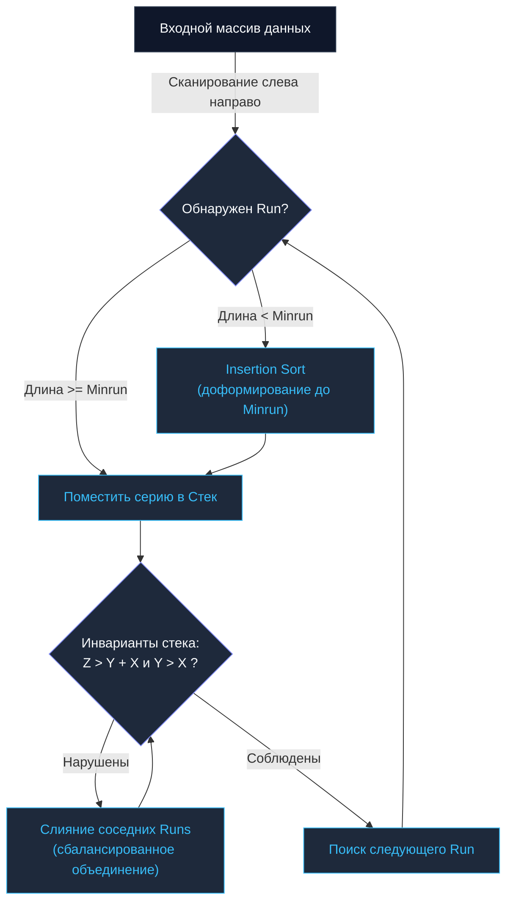

## Введение: Реальный мир против абстрактных моделей

В предыдущих главах мы последовательно исследовали классические алгоритмические конструкции: от аппаратной грации [[2. Insertion sort]] на сверхмалых срезах до мощных представителей школы «Разделяй и властвуй» ([[3. Merge sort]], [[4. Quick sort]]). 

Каждый из этих академических алгоритмов традиционно исследовался на идеально случайных (randomized) синтетических наборах данных. Однако в 2002 году выдающийся инженер Тим Петерс (Tim Peters), проектируя алгоритм сортировки для стандартной библиотеки языка Python, задал фундаментальный практический вопрос: **А как в действительности выглядят потоки данных в реальных производственных системах?**

Анализ продакшен-трафика показал: в практическом бэкенде данные практически никогда не бывают абсолютно хаотичными. В системных логах, выборках из реляционных баз данных и лентах пользовательских событий практически всегда присутствуют длинные **частично упорядоченные фрагменты** (например, когда временные ряды поступают монотонно, но сетевые задержки или фоновые апдейты добавляют свежие порции в хвост).

Так на свет появился **Timsort** — адаптивный гибридный стабильный алгоритм сортировки, объединивший лучшие черты Сортировки слиянием и Сортировки вставками. Алгоритм продемонстрировал столь выдающуюся производительность на реальном трафике, что стал стандартной сортировкой по умолчанию в средах Python, Java, Android и движке V8 (Node.js/Chromium).

---

## Концепция 1: Охота на Серии (Runs)

Вместо того чтобы механически разрезать срез пополам (как поступает прямолинейный Merge Sort), Timsort начинает со сканирования массива слева направо в поисках **Серий (`Runs`)** — непрерывных сегментов памяти, которые *уже находятся в упорядоченном состоянии*.

Естественная серия может быть двух видов:
1. **Строго возрастающей:** `a[0] <= a[1] <= a[2] ...`
2. **Строго убывающей:** `a[0] > a[1] > a[2] ...`

Если алгоритм обнаруживает строго убывающую серию, он за один линейный проход $O(N)$ разворачивает ее в обратную сторону (`Reverse`), превращая в монотонно возрастающую. Это поразительно выгодная оптимизация: мы получаем уже отсортированные крупные блоки совершенно бесплатно, просто в процессе первичного чтения данных.

### Minrun и спасительный Insertion Sort

Если встретившаяся естественная серия оказывается слишком короткой, Timsort искусственно «доращивает» ее до минимального расчетного размера — величины **`Minrun`** (в промышленной практике она выбирается в диапазоне от 32 до 64 элементов).

Чтобы расширить серию до границы `Minrun`, алгоритм захватывает следующие неупорядоченные элементы входного среза и упорядочивает их с помощью **Сортировки вставками**.

> [!info] Под капотом
> Почему размер `Minrun` выбирается равным 32–64 элементам? И почему для его заполнения применяется именно Insertion Sort?
> Во-первых, блок из 32–64 элементов идеально укладывается в быстрый `L1-кэш` центрального процессора.
> Во-вторых, как мы убедились в главе [[2. Insertion sort]], на коротких диапазонах сортировка вставками не знает равных благодаря образцовой пространственной локальности (`Cache Locality`) и полному отсутствию накладных расходов на рекурсию и стековые кадры.

---

## Концепция 2: Слияние и Инварианты Стека

После того как срез разбит на серии (`Runs`), их необходимо упорядоченно объединить, опираясь на логику сортировки слиянием. Однако выполнять слияния вслепую недопустимо: длины соседних серий могут драматически различаться. Попытка слить микроскопическую серию с огромным сегментом памяти приведет к сильному дисбалансу дерева слияний и падению скорости.

Timsort решает задачу через **Стек серий**. Каждая выделенная серия помещается в специальный стек. Алгоритм непрерывно контролирует верхние три серии в стеке `[X, Y, Z]` (где `X` — вершина стека), требуя строгого соблюдения двух балансировочных инвариантов:
1. $Z > Y + X$
2. $Y > X$

Если хотя бы один инвариант оказывается нарушен, Timsort выполняет слияние серии `Y` с меньшей из смежных серий (`X` или `Z`). Это детерминированно поддерживает баланс глубин, гарантируя, что объединяются сегменты сопоставимой длины, а общая временная сложность строго сохраняется на уровне $O(N \log N)$.

---

## Концепция 3: Режим Галопа (Galloping Mode)

Это ключевая инженерная оптимизация Timsort, проявляющаяся на фазе слияния двух подмассивов.

В классическом Merge Sort при объединении двух списков $A$ и $B$ алгоритм монотонно сравнивает их головные элементы по одному. Но представьте практическую ситуацию, когда все элементы фрагмента $A$ оказываются меньше первых 100 элементов фрагмента $B$. Обычный цикл совершит 100 избыточных холостых сравнений подряд.

Кроме того, для модуля предсказания ветвлений (`Branch Predictor`) это создает скрытую ловушку: пока один массив непрерывно «побеждает», предсказатель ветвлений адаптируется к этой ветке, но в момент смены лидера неизбежно случается сброс конвейера (`Branch Misprediction`).

**Timsort вводит механизм галопирования (`Galloping Mode`):**
1. Если в процессе слияния элементы одного массива выигрывают конкуренцию подряд $N$ раз (в стандартной реализации порог равен 7), Timsort мгновенно активирует **режим галопа**.
2. Вместо медленного поштучного сканирования алгоритм запускает экспоненциальный поиск с шагом степени двойки ($1, 2, 4, 8, 16, \dots$), быстро локализуя диапазон вставки опорного элемента проигрывающего массива в массив-победитель.
3. Внутри локализованного интервала выполняется высокоскоростной двоичный поиск (`Binary Search`).
4. Обнаружив точную границу, Timsort забирает весь выявленный крупный кластер массива-победителя и перемещает его **единым монолитным блоком** оперативной памяти в итоговый буфер.

---

## Mechanical Sympathy: Почему Timsort побеждает на практике?

1. **Эксплуатация естественной упорядоченности:** Если на вход Timsort подать уже отсортированный массив, алгоритм идентифицирует его как одну длинную серию и завершит работу за строго линейное время $O(N)$ без слияний. Простые алгоритмы вроде Bubble Sort или Insertion Sort также обладают линейным лучшим случаем, но вырождаются до $O(N^2)$ при случайных данных. Timsort же в худшем случае надежно гарантирует $O(N \log N)$.
2. **Аппаратное блочное копирование памяти:** Режим галопа позволяет заменять миллионы инструкций поштучного ветвления и сравнения на ассемблерные инструкции векторного блочного перемещения памяти (аналог системного вызова `memmove` в Си или ассемблерной оптимизации `copy()` в рантайме Go).
3. **Строгая стабильность:** Алгоритм является образцово стабильным (`Stable`), бережно сохраняя исходный относительный порядок следования эквивалентных записей.

> [!warning] Ловушка / Gotcha (Память)
> Как и любой потомок классического Merge Sort, Timsort требует выделения **дополнительной оперативной памяти**. Для выполнения слияния серий ему требуется буфер размером до $\frac{N}{2}$. По этой причине Timsort не относится к классу алгоритмов `In-place` (в отличие от Quick Sort или Heap Sort).

---

## Timsort в экосистеме Go

> [!tip] Собеседование
> **Вопрос:** Используется ли Timsort в качестве алгоритма по умолчанию в стандартной библиотеке Go (в пакетах `sort` или `slices`)?  
> **Ответ:** **Нет**.

Инженерная философия рантайма Go ориентирована на беспощадную минимизацию скрытых аллокаций динамической памяти и снижение давления на сборщик мусора. Timsort же требует обязательного выделения дополнительного буфера под слияние серий и динамического стека.

Вместо классического Timsort разработчики Go пошли по пути собственных оригинальных решений:
1. Для нестабильной сортировки общего назначения (`slices.Sort`) Go задействует передовой алгоритм **pdqsort (Pattern-Defeating Quicksort)**. Он работает строго `In-place` (без аллокаций в куче), но успешно заимствует ключевые идеи реального мира: детектирует уже упорядоченные паттерны и делегирует сортировку малых блоков алгоритму Insertion Sort.
2. Для стабильной сортировки (`slices.SortStableFunc`) стандартная библиотека Go использует алгоритм **SymMerge** (или его блочные адаптивные модификации). Это специализированная сортировка слиянием «на месте» с использованием циклических ротаций памяти. Она также выполняет поиск естественных серий (`Runs`) и применяет Insertion Sort для отрезков длиной до 20 элементов.

Концептуально стабильная сортировка в рантайме Go разделяет ключевые принципы Timsort (выявление серий + Сортировка вставками + Слияние), однако реализована с бескомпромиссным требованием нулевых аллокаций (`Zero Allocation`) везде, где это физически достижимо.

---

## Итог

* **Timsort** — величайший триумф практической алгоритмики, созданный для реальных частично упорядоченных данных.
* **Архитектурный фундамент:** Разбиение массива на серии (`Runs`), адаптивное выравнивание до `Minrun` через Insertion Sort и сбалансированное слияние через стек с инвариантами.
* **Режим галопа (`Galloping Mode`)** переводит поштучные сравнения в экспоненциальный поиск и аппаратное блочное копирование памяти.
* **Стандарт индустрии:** Де-факто принят как основной алгоритм в Python, Java, Rust и платформе Android. В Go вдохновил создание алгоритмов `pdqsort` и `SymMerge`.

Мы проследили эволюцию алгоритмов сортировки от элементарного пузырька до сложнейших адаптивных гибридов. Теперь настал момент заглянуть в самое сердце самого языка Go: как именно команда инженеров Google спроектировала современную реализацию `slices.Sort`? Какие низкоуровневые трюки скрыты в недрах рантайма?

Мы исследуем этот механизм до последнего бита в финальной главе раздела: [[9. Внутренности пакета sort в Go]].