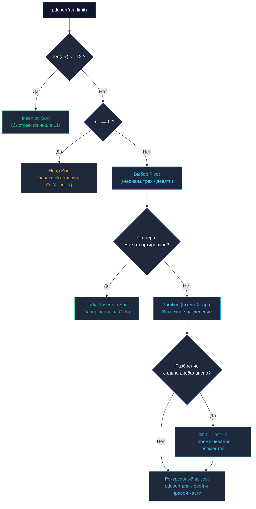

## Введение: От теории к индустриальному совершенству

В предшествующих главах мы исследовали алгоритмы сортировки в изолированной теоретической среде: изучали их асимптотические границы, паттерны взаимодействия с процессорными кэшами и потенциальные ловушки. Однако когда в реальном производственном коде на Go вы вызываете `slices.Sort(arr)`, под капотом запускается отнюдь не наивный Quick Sort или прямолинейный Merge Sort. Вы активируете сложнейший инженерный гибрид, вобравший в себя десятилетия практических исследований в области алгоритмики и низкоуровневой оптимизации железа.

Стандартный инструментарий сортировки в Go — классический пакет `sort` и современный обобщенный модуль `slices` — пережил две фундаментальные технические революции:
1. **Алгоритмическую революцию (Go 1.19):** Полный отказ от устаревшего IntroSort и переход на адаптивный алгоритм **pdqsort (Pattern-Defeating Quicksort)**.
2. **Архитектурную революцию (Go 1.21):** Переход на обобщенные типы (`Generics`) и мономорфизацию машинного кода, устранившую паразитные накладные расходы динамической диспетчеризации.

Для Senior-инженера глубокое понимание этих внутренних механизмов — это ключ к проектированию Zero-Allocation сервисов и полному контролю над поведением компилятора.

---

## Архитектурная революция: Интерфейсы vs Дженерики

До релиза Go 1.21 для сортировки любого пользовательского среза требовалось явно реализовать классический интерфейс `sort.Interface`:

```go
// Паттерн до появления Go 1.21 (Пакет sort)
type Users []User

func (a Users) Len() int           { return len(a) }
func (a Users) Swap(i, j int)      { a[i], a[j] = a[j], a[i] }
func (a Users) Less(i, j int) bool { return a[i].Age < a[j].Age }

// Вызов:
sort.Sort(Users(myUsers))
```

### Mechanical Sympathy: Налог на интерфейсы

С точки зрения математической теории асимптотика алгоритма выглядела безупречно — $O(N \log N)$. Однако на физическом кремнии микропроцессора этот код страдал от колоссального инфраструктурного налога.

Внутренний механизм пакета `sort` не имел представления о структуре лежащих в памяти данных: он взаимодействовал с массивом исключительно через интерфейсный контракт `sort.Interface`.

В результате каждая операция сравнения (`Less`) и каждая перестановка (`Swap`) требовали **динамической диспетчеризации (Dynamic Dispatch)**. Процессор не мог просто выполнить базовую машинную инструкцию сравнения двух регистров. Вместо этого он был вынужден:
* Обратиться к таблице виртуальных методов (`itab`).
* Разыменовать указатель на тело функции `Less`.
* Совершить косвенный переход (`Jump`), сбросив конвейер предсказания ветвлений (`Branch Prediction`).
* Сформировать стек-фрейм, выполнить операцию, вернуть значение и восстановить регистры.

При сортировке массива на 1 миллион записей совершаются десятки миллионов подобных интерфейсных вызовов! Косвенные вызовы полностью блокировали фундаментальную оптимизацию компилятора — инлайнинг функций (**Inlining**), превращая высокоскоростной алгоритм в череду холостых обращений к памяти.

### Эра Generics и Мономорфизация (`slices.Sort`)

С появлением пакета `slices` в Go 1.21 архитектура изменилась кардинально:

```go
// Современный идиоматичный подход (Go 1.21+)
slices.SortFunc(myUsers, func(a, b User) int {
	return cmp.Compare(a.Age, b.Age)
})
```

Вместо упаковки в интерфейсы компилятор Go осуществляет **мономорфизацию (Monomorphization)**. В процессе компиляции рантайм компилирует специализированную версию алгоритма сортировки, жестко привязанную к конкретному типу `[]User`.

Исчезли таблицы `itab` и косвенные переходы. Функция `cmp.Compare` прозрачно встраивается (`Inlining`) непосредственно в тело цикла сортировки, а вся логика сравнения вырождается в одиночные процессорные инструкции `CMP`.

> [!info] Под капотом
> Миграция со старого пакета `sort` на современный `slices` ускорила сортировку примитивных типов (`int`, `string`) на **20–40%**, а сортировку срезов структур — более чем **в 2 раза** исключительно за счет устранения интерфейсного оверхеда. Во всех современных проектах следует использовать исключительно пакет `slices`.

---

## Алгоритмическая революция: Pattern-Defeating Quicksort (pdqsort)

Вплоть до версии Go 1.18 стандартная библиотека опиралась на алгоритм **IntroSort** (триаду Quick Sort, Heap Sort и Insertion Sort). Однако у IntroSort была принципиальная слабость: он оставался слеп к внутренней структуре реальных данных (например, к массивам с большим числом дубликатов или частично упорядоченным срезам).

В релизе Go 1.19 команда рантайма внедрила передовой алгоритм **pdqsort (Pattern-Defeating Quicksort)**, созданный исследователем Орсоном Петерсом (Orson Peters).

Название алгоритма буквально означает «быстрая сортировка, побеждающая паттерны». Он объединяет адаптивную мощь Timsort ([[8. Tim sort концепция]]), сохраняя при этом строгое требование нулевых аллокаций памяти — работа strictly `In-place` с константной памятью $O(1)$.

### Три столпа `pdqsort` в Go

1. **Фундамент: Quick Sort (Схема Хоара).** В отличие от схемы Ломуто ([[4. Quick sort]]), схема Хоара задействует два встречных указателя. Она производит в среднем втрое меньше операций физической записи (`swaps`), колоссально экономя пропускную способность шины памяти (`Memory Bandwidth`).
2. **Локальный финиш: Insertion Sort.** Как только размер подмассива сокращается до границы $\le 12$ элементов, `pdqsort` переключается на [[2. Insertion sort]]. На ультракоротких дистанциях сортировка вставками опережает любые рекурсивные алгоритмы благодаря идеальной кэш-локальности.
3. **Запасной парашют: Heap Sort.** Алгоритм интроспективно ведет счетчик допустимых неудачных разбиений (`limit = log2(N)`). Если `limit` обнуляется (сигнализируя о риске квадратичной деградации в $O(N^2)$), `pdqsort` немедленно прерывает рекурсию и передает сегмент в [[5. Heap sort]], жестко гарантируя верхнюю границу $O(N \log N)$.

### Как `pdqsort` побеждает паттерны?

На каждом шаге рекурсивного разделения алгоритм выполняет эвристический анализ сегмента:

* **Паттерн «Уже отсортировано»:** Выбирая опорный элемент (`Pivot`), алгоритм проверяет взаимное расположение соседних ключей. Если отрезок демонстрирует высокую степень упорядоченности, запускается оптимистичный локальный проход вставками (**Partial Insertion Sort**). Если срез действительно упорядочен, процедура триумфально завершается за строго линейное время $O(N)$!
* **Паттерн «Обратный порядок»:** Если эвристика фиксирует строгое монотонное убывание элементов, `pdqsort` выполняет мгновенный разворот среза на месте (**Reverse**) за линейное количество процессорных инструкций, полностью исключая бессмысленные рекурсивные шаги.
* **Паттерн «Множественные дубликаты»:** В классическом Quick Sort срез из миллиона одинаковых чисел способен спровоцировать худший случай $O(N^2)$. Алгоритм `pdqsort` после процедуры Partition проверяет равенство элементов опорному значению, изолирует весь блок дубликатов в центре и полностью исключает их из дальнейшей рекурсивной обработки.

---

## Анатомия рантайма: Дерево принятия решений

Логика работы функции сортировки внутри пакета `slices` для каждого независимого сегмента данных наглядно представлена на схеме:



> [!warning] Ловушка / Gotcha (Стабильность)
> Стандартные функции `slices.Sort` и `sort.Slice` опираются на `pdqsort`, который **НЕ ЯВЛЯЕТСЯ стабильной сортировкой**. Относительный порядок эквивалентных записей гарантированно не сохраняется.
> Если вашей архитектуре критически необходима стабильность, вы обязаны явно вызывать специализированную функцию `slices.SortStableFunc`.
> Внутри `SortStableFunc` рантайм Go задействует принципиально иной алгоритм — адаптивную модификацию **Сортировки слиянием (SymMerge)** с блочными ротациями памяти. Она работает несколько медленнее `pdqsort` и требует вспомогательной памяти, но обеспечивает стопроцентную стабильность.

---

## Вопросы с собеседований уровня Senior

> [!tip] Собеседование
> **Вопрос 1:** В пакете `sort` существует функция `sort.Search` (в современном `slices` замененная на `slices.BinarySearch` и `slices.BinarySearchFunc`). Как устроен `sort.Search` под капотом, если мы передаем в него предикат `func(i int) bool`, а не конкретное искомое значение?  
> **Ответ:** Это классический паттерн абстрактного бинарного поиска (Discrete Binary Search). Функция `sort.Search` не взаимодействует с физическим срезом: она генерирует индексы диапазона $[0, N)$ и передает их в пользовательскую функцию-предикат. Функция возвращает `true`, если условие соблюдено, после чего алгоритм сужает правую границу. Это позволяет применять двоичный поиск не только к массивам данных, но и к непрерывным математическим функциям (например, для нахождения минимальной пропускной способности канала или оптимального тайм-аута).
>
> **Вопрос 2:** Если алгоритм `pdqsort` настолько быстр, адаптивен и работает strictly In-Place, почему языки Python и Java сохраняют верность Timsort?  
> **Ответ:** Timsort изначально проектировался со строгой гарантией **стабильности**. В экосистемах Python и Java стабильность сортировки объектов заложена непосредственно в языковую спецификацию. Разработчики Go приняли более прагматичное инженерное решение: предоставить пользователю по умолчанию максимально быстродействующую нестабильную сортировку `In-place`, а стабильный вариант вынести в отдельный метод `slices.SortStableFunc`, не заставляя миллионы сервисов безусловно платить налог на дополнительную память Timsort.

---

## Итог раздела Сортировок

Мы завершили масштабное погружение в фундаментальный мир алгоритмов упорядочивания данных:
1. Мы убедились, что простые квадратичные алгоритмы $O(N^2)$ (Insertion Sort) — это не музейные экспонаты, а незаменимый инструмент низкоуровневой оптимизации микропроцессорного L1-кэша.
2. Мы исследовали баланс между скоростными сортировками «на месте» (`Quick Sort`) и стабильными, но требовательными к оперативной памяти алгоритмами слияния (`Merge Sort`).
3. Мы преодолели фундаментальный предел сравнений $O(N \log N)$ с помощью поразрядных целочисленных преобразований (`Counting Sort`, `Radix Sort`).
4. Мы изучили устройство современного промышленного движка `pdqsort` в Go, объединившего аппаратную кэш-локальность, защиту от вырождения через `Heap Sort` и адаптивную победу над паттернами.

Однако в распределенных системах данные сортируются не ради самого процесса: упорядочивание служит фундаментом для **мгновенного поиска информации**.

Мы переходим к следующему фундаментальному разделу бэкенд-инженерии — алгоритмам поиска. И начнем мы с базового, но чрезвычайно поучительного с точки зрения механического сочувствия алгоритма.

В следующей статье: [[1. Линейный поиск]].