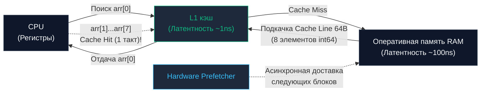

## Введение: Простота против аппаратной скорости

Линейный поиск (Linear Search) — это самый элементарный, интуитивно понятный и, на первый взгляд, алгоритмически тривиальный метод отыскания данных. Мы берем массив и последовательно проверяем каждый элемент с начала до конца, пока не встретим целевое значение.

Однако для Senior-разработчика бэкенда линейный поиск скрывает в себе глубокие инженерные парадоксы. В реальных высоконагруженных микросервисах линейное сканирование нередко сокрушает алгоритмически более изощренные структуры данных (сбалансированные деревья поиска или даже двоичный поиск) на малых и средних диапазонах элементов.

---

## Mechanical Sympathy: Почему O(N) может быть быстрее O(log N)?

С точки зрения строгой теории алгоритмической сложности Big-O, линейный поиск требует времени $O(N)$, тогда как бинарный поиск или сбалансированное дерево гарантируют $O(\log N)$. Казалось бы, логарифм математически всегда предпочтительнее линейной зависимости. Но кремниевый процессор выполняет не математические абстракции — он подчиняется законам физики полупроводников и иерархии памяти.

Как мы подробно выяснили в главе [[4. Пространственная сложность и cache locality]], узкое горлышко современной вычислительной архитектуры — это задержка обращения к физической оперативной памяти (`RAM`). Латентность чтения из RAM составляет порядка 50–100 наносекунд, в то время как чтение из быстрейшего `L1-кэшу` процессора занимает около 1 наносекунды (разница в сотню раз!).

Когда вы запускаете линейный поиск по непрерывному срезу в Go, в игру вступает комплексное аппаратное ускорение:
1. **Кэш-линии (Cache Lines):** Процессор никогда не считывает память отдельными байтами. Он загружает данные монолитными блоками по 64 байта (`Cache Lines`). Если мы ищем число `int64` (8 байт), одиночное обращение к RAM автоматически подтягивает в L1-кэш сразу 8 последовательных элементов. Следующие 7 проверок в цикле `for` выполнятся со скоростью регистровых операций процессора — за 1 такт каждая.
2. **Аппаратный предсказатель адресов (Hardware Prefetcher):** Контроллер CPU мгновенно детектирует строго линейный шаг обращения к адресам ($0, 1, 2, 3, \dots$). Модуль `Hardware Prefetcher` начинает асинхронно, в упреждающем режиме накачивать следующие кэш-линии из RAM в промежуточный `L2` и `L1` кэши еще **до того**, как текущая итерация цикла запросит эти данные.



**Практическое следствие:** На компактных объемах данных (на современных CPU это срезы размером до 100–200 элементов) прямолинейный линейный скан выполняется **ощутимо быстрее**, чем навигация по узлам бинарного дерева поиска (где каждый шаг вглубь — это прыжок по указателям `Pointer Chasing`, гарантированный промах кэша и паралич работы префетчера) или даже бинарный поиск по массиву (страдающий от постоянных сбросов конвейера из-за непредсказуемых ветвлений `branch misprediction`).

> [!tip] Собеседование
> **Вопрос:** Дан срез из 50 элементов. Какую стратегию поиска целесообразно выбрать: хеш-таблицу (`map`), бинарный поиск или обычный линейный поиск?
> **Ответ:** Линейный поиск. На столь компактном размере оверхед вычисления хеш-суммы и поиска по бакетам в `map` либо ветвления (Branching) в бинарном поиске обойдутся процессору заметно дороже, чем прямолинейное чтение 50 смежных элементов. Вся эта последовательность умещается всего в 6–7 кэш-линий и моментально прогревает L1-кэш без единого промаха.

---

## Реализация на Go (Idiomatic & Generic)

Благодаря поддержке Generics в современном Go мы можем выразить линейный поиск в виде лаконичной, типобезопасной функции с интерфейсным ограничением `comparable` (типы, поддерживающие проверку на равенство `==`):

```go
package main

// LinearSearch возвращает индекс первого совпадения или -1, если элемент отсутствует.
// Ограничение T comparable разрешает использовать любые типы: int, string, указатели и структуры без срезов.
func LinearSearch[T comparable](arr []T, target T) int {
	for i, val := range arr {
		if val == target {
			return i
		}
	}
	return -1
}
```

### Стандартная библиотека (Go 1.21+)

Начиная с версии Go 1.21, стандартный пакет `slices` берет на себя рутинные операции поиска:

```go
import "slices"

func main() {
    data := []string{"apple", "banana", "cherry"}

    // Линейный поиск первого совпадения, возвращает индекс (-1 если не найден)
    idx := slices.Index(data, "banana") // Вернет 1

    // Линейная проверка присутствия, возвращает булево значение
    found := slices.Contains(data, "cherry") // Вернет true
}
```

> [!info] Под капотом: Bounds Check Elimination (BCE)
> Go — язык со строгой гарантией безопасности памяти. При каждом обращении по индексу `arr[i]` рантайм обязан убедиться, что индекс строго меньше фактической длины среза `len(arr)`. Если индекс выходит за границу, программа аварийно завершается с `panic`.
> Подобные постоянные проверки границ добавляют лишние инструкции условных переходов в машинный код.
> Однако компилятор Go оснащен оптимизатором **Bounds Check Elimination (BCE)**. Когда разработчик использует канонический цикл `for i, val := range arr`, компилятор *математически доказывает*, что переменная `i` гарантированно не способна выйти за пределы среза. В результате он **полностью вырезает проверки границ** из ассемблерного тела цикла, обеспечивая линейному поиску скорость на уровне ассемблерного кода языка C.
> Убедиться в работе механизма можно при сборке с флагом: `go build -gcflags="-d=ssa/check_bce"`.

---

## Временная и пространственная сложность

* **Временная сложность:**
  * Лучший случай: $O(1)$ (целевой элемент расположен в нулевой ячейке).
  * Худший случай: $O(N)$ (элемент расположен в самом конце либо отсутствует в массиве).
  * Средний случай: $O(N/2)$, что в асимптотическом анализе эквивалентно $O(N)$.
* **Пространственная сложность (Память):** $O(1)$ — алгоритм не выделяет динамической памяти в куче, работая строго *in-place*.

---

## Итог

1. **Линейный поиск** — фундамент алгоритмики со сложностью $O(N)$, последовательно опрашивающий элементы массива.
2. Симбиоз аппаратного предсказателя адресов (**Hardware Prefetcher**) и пространственной локальности данных (**Spatial Locality**) превращает линейный поиск в безоговорочного лидера по скорости на небольших срезах (до 100–200 элементов).
3. В идиоматичном коде на Go всегда следует использовать цикл `for ... range` (для активации механизма BCE) либо стандартные библиотечные функции `slices.Index` и `slices.Contains`.
4. Главное ограничение линейного сканирования: слабая масштабируемость при росте объема. На массивах в сотни миллионов записей $O(N)$ парализует производительность сервиса.

Когда данные отсортированы, а их объем исчисляется миллионами элементов, линейный скан уступает место стратегии деления пополам, отбрасывающей 50% пространства поиска на каждом шаге.

В следующей главе мы переходим к золотому стандарту поиска: [[2. Бинарный поиск]].