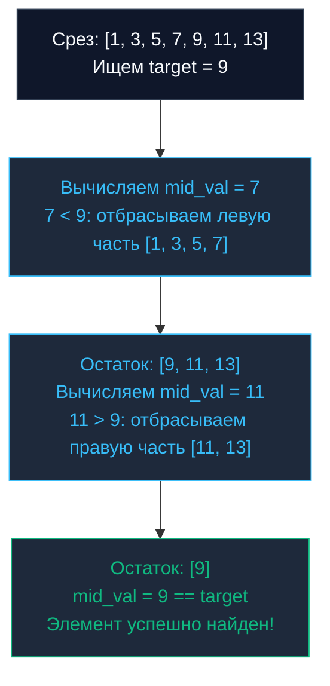

## Введение: Логарифмическое сжатие пространства поиска

В предыдущей главе [[1. Линейный поиск]] мы убедились, что на малых наборах данных физические особенности кремния — непрерывные кэш-линии процессора и упреждающий `Hardware Prefetcher` — способны вдохнуть феноменальную скорость в прямолинейный алгоритм $O(N)$, превосходя теоретически более сложные структуры.

Однако когда размер среза возрастает от сотен элементов до миллионов и миллиардов записей, физика кэшей исчерпывает свои возможности. Линейный скан миллиарда 64-битных чисел займет секунды, парализуя работу бэкенда. Нам требуется радикальное сокращение вычислительной сложности. И если входной срез **заранее отсортирован**, мы можем задействовать абсолютную классику компьютерных наук — **Двоичный поиск (Binary Search)**, сокращающий время отыскания до логарифмического предела $O(\log N)$.

---

## Механика алгоритма

Бинарный поиск всецело базируется на парадигме «Разделяй и властвуй» (`Divide and Conquer`). 

Вместо монотонного поштучного перебора мы на каждом шаге обращаемся строго в геометрический центр текущего диапазона поиска (`mid`):
1. Если элемент в середине точно совпадает с искомым значением (`arr[mid] == target`) — поиск триумфально завершен.
2. Если искомое значение *меньше* центрального элемента, это математически гарантирует, что целевое значение (если оно вообще присутствует в коллекции) лежит строго слева от середины. Вся правая половина отбрасывается за одну операцию.
3. Если целевое значение *больше* центрального, отбрасывается левая половина, и поиск продолжается в правом интервале.

На каждом элементарном шаге пространство неопределенности сжимается ровно вдвое. Для гигантского среза емкостью в 1 миллиард элементов двоичный поиск совершит не более 30 операций сравнения ($\log_2 10^9 \approx 29.89$).



---

## Mechanical Sympathy: Проблемы бинарного поиска на уровне CPU

Для инженера высоконагруженных систем принципиально важно осознавать: бинарный поиск на аппаратном уровне — это **крайне неудобный паттерн для кремниевого процессора**. Несмотря на безупречную математику $O(\log N)$, при исполнении инструкций микроархитектура ядра наталкивается на два тяжелых физических барьера:

### 1. Branch Misprediction (Ошибка предсказания ветвлений)

Современные процессоры используют сверхглубокие конвейеры инструкций (`Pipelines`). Чтобы конвейер не простаивал в ожидании результата условия `if arr[mid] < target`, аппаратный блок **Branch Predictor** пытается предугадать траекторию исполнения и спекулятивно загружает инструкции целевой ветки.

В линейном поиске условие проверки `if arr[i] == target` почти всегда ложно (пока мы не доберемся до целевой ячейки), поэтому блок предсказания обучается безошибочно («False, False, False...»). В бинарном же поиске вероятность перехода влево или вправо на каждом шаге составляет **ровно 50/50**. Предсказатель ветвлений ошибается в половине случаев. Каждая подобная ошибка приводит к аварийному сбросу конвейера (`Pipeline Flush`), напрасно сжигая от 15 до 20 машинных тактов CPU.

### 2. Cache Misses (Промахи кэша)

На начальных итерациях алгоритм совершает гигантские прыжки по адресному пространству: сначала прыжок на $N/2$, затем на $N/4$. Аппаратный префетчер адресов не способен обнаружить в этих скачках последовательную структуру: он бессилен заранее подгрузить строки памяти.

В результате первые 10–15 шагов бинарного поиска по массиву в миллионы элементов гарантированно вызывают тяжелый промах кэша (`Cache Miss`) и обращение к медленной системной оперативной памяти (`DRAM`), внося задержку порядка 50–100 наносекунд на каждое сравнение.

> [!info] Под капотом: Гибридные подходы
> Именно поэтому в экстремально высокопроизводительных движках СУБД и колоночных базах данных применяют гибридную схему: двоичный поиск сужает диапазон до размера одной-двух кэш-линий (64–128 байт, что эквивалентно 8–16 числам `int64`), после чего управление передается **линейному сканированию** или векторным микроинструкциям `SIMD`, обрабатывающим финальный отрезок без ветвлений и кэш-промахов.

---

## Реализация на Go (Idiomatic)

Ниже представлена каноническая реализация двоичного поиска на современном Go (1.21+) с использованием пакета `cmp` и обобщенного интерфейса `cmp.Ordered`:

```go
package main

import "cmp"

// BinarySearch возвращает индекс элемента или -1, если он не найден.
func BinarySearch[T cmp.Ordered](arr []T, target T) int {
	left := 0
	right := len(arr) - 1

	for left <= right {
		// Безопасное вычисление середины с защитой от целочисленного переполнения
		mid := left + (right - left) / 2
		
		if arr[mid] == target {
			return mid // Элемент найден
		} else if arr[mid] < target {
			left = mid + 1 // Смещаем левую границу вправо
		} else {
			right = mid - 1 // Смещаем правую границу влево
		}
	}

	return -1 // Искомый элемент отсутствует
}
```

> [!warning] Ловушка / Gotcha: Переполнение при вычислении mid
> Исторически (в ранних библиотеках языков Си и Java) середину интервала вычисляли формулой `mid := (left + right) / 2`. Если переменные `left` и `right` приближаются к верхнему лимиту `math.MaxInt`, их арифметическая сумма вызовет целочисленное переполнение (Integer Overflow). Значение `mid` станет отрицательным числом, и обращение `arr[mid]` немедленно завершится аварийной остановкой `panic: index out of range`.
> 
> Канонический метод защиты: `mid := left + (right - left) / 2`.
> 
> **Специфика Go:** В 64-битной среде тип `int` вмещает числа до $9 \times 10^{18}$. Создать слайс такой физической длины невозможно из-за ограничений оперативной памяти. Однако в исходных текстах пакета `sort` разработчики рантайма Go используют еще более изящную низкоуровневую конструкцию:
> `mid := int(uint(left+right) >> 1)`
> Преобразование к беззнаковому `uint` исключает переполнение знакового бита, а побитовый сдвиг вправо `>> 1` заменяет деление на молниеносную инструкцию процессора за 1 такт.

---

## Стандартная библиотека Go (Эволюция)

До появления Go 1.21 классическим способом выполнения двоичного поиска служила функция `sort.Search`:

```go
// Устаревший паттерн (Go < 1.21)
arr := []int{1, 3, 5, 7, 9}
target := 5

// sort.Search принимает общее количество элементов и замыкание (Closure)
idx := sort.Search(len(arr), func(i int) bool {
    return arr[i] >= target
})

if idx < len(arr) && arr[idx] == target {
    // Элемент найден
}
```

**Архитектурный недостаток `sort.Search`:** Передача функционального замыкания (`Closure`) `func(i int) bool` на каждом шаге цикла вносит накладные расходы на косвенный вызов функций (`Function Call Overhead`) и препятствует агрессивному инлайнингу кода (`Inlining`) оптимизатором компилятора.

### Новый подход: slices.BinarySearch (Go 1.21+)

Начиная с версии Go 1.21, стандартная библиотека предоставляет универсальный пакет `slices`. Функция `slices.BinarySearch` работает напрямую со срезами через Generics без создания замыканий, обеспечивая максимальную скорость выполнения:

```go
// Современный промышленный стандарт (Go 1.21+)
import "slices"

arr := []int{1, 3, 5, 7, 9}
target := 5

// Возвращает индекс и точный булев флаг совпадения
idx, found := slices.BinarySearch(arr, target)
if found {
    fmt.Printf("Элемент обнаружен на индексе: %d\n", idx)
}
```

> [!tip] Собеседование
> **Вопрос:** Что возвратит вызов `slices.BinarySearch(arr, 4)` для упорядоченного среза `[1, 3, 5, 7]`, если искомое число `4` отсутствует?  
> **Ответ:** Функция вернет пару `idx = 2, found = false`.  
> Индекс `2` указывает на позицию, которую в текущий момент занимает число `5`. Это так называемая **точка вставки (`Insertion Point`)** — строго то место, куда необходимо поместить число `4`, чтобы массив сохранил упорядоченность без необходимости запускать полную пересортировку. Данное свойство лежит в основе эффективного поддержания динамических индексов.

---

## Итог

1. **Бинарный поиск** — фундаментальный логарифмический алгоритм со сложностью $O(\log N)$, применимый строго к предварительно упорядоченным наборам данных.
2. Алгоритм предъявляет жесткие требования к пониманию физики микропроцессоров: он генерирует каскады промахов кэша (`Cache Misses`) на старте и провоцирует ошибки предсказания ветвлений (`Branch Misprediction`).
3. Для защиты от переполнения середины используйте идиоматичную формулу `left + (right - left) / 2` либо беззнаковый сдвиг `int(uint(left+right) >> 1)`.
4. В современном Go всегда отдавайте предпочтение функции `slices.BinarySearch`, избегая устаревшего метода `sort.Search` с функциональными замыканиями.

Возврат точной точки вставки открывает дорогу к решению фундаментального класса диапазонных задач: как эффективно найти первый и последний элементы в последовательности дубликатов? Как за логарифмическое время подсчитать число ключей в заданном интервале?

Для ответа на эти вопросы классический двоичный поиск адаптируют в специализированные граничные формы, которые мы разберем в следующей главе: [[3. Lower bound, upper bound]].