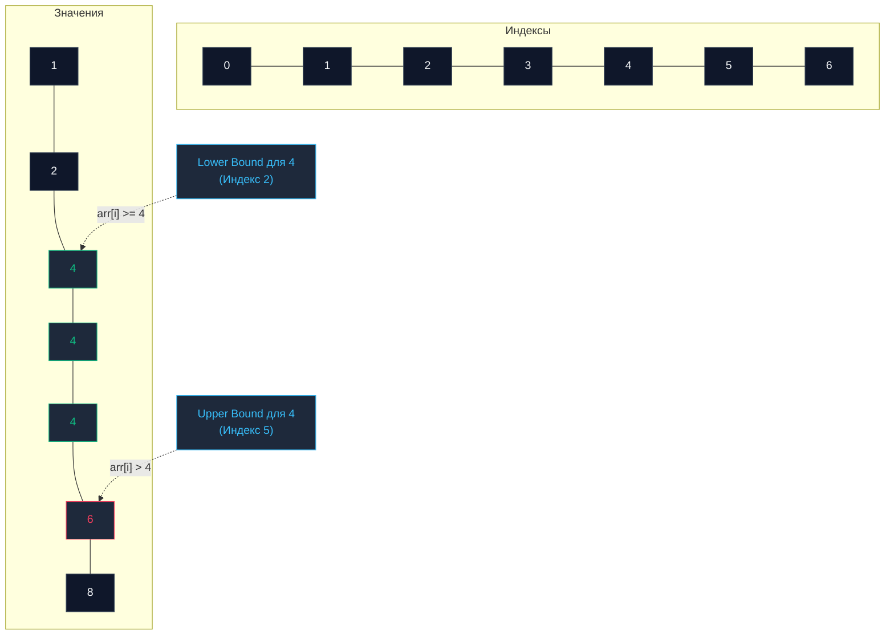

## Введение: За пределами точечного поиска

В предыдущей главе [[2. Бинарный поиск]] мы подробно рассмотрели классический алгоритм логарифмического поиска со сложностью $O(\log N)$. У классической реализации есть принципиальная особенность: если в массиве присутствует серия одинаковых дубликатов, проверка условия `arr[mid] == target` вернет индекс *случайного* из них — того элемента, на который алгоритм наткнулся в процессе последовательного деления отрезка пополам.

Для реальных бизнес-требований и системных движков этого категорически недостаточно. Что если бэкенду необходимо обнаружить строго **первое** вхождение записи? Или мгновенно вычислить суммарное **количество** дубликатов в срезе? А если целевой ключ отсутствует — определить его точную, законную позицию в массиве?

В системном программировании (и особенно при проектировании движков баз данных и поисковых индексов) эти задачи решаются элегантными модификациями бинарного поиска: алгоритмами **Lower Bound** и **Upper Bound** (Нижняя и Верхняя границы).

---

## Анатомия границ

Представим упорядоченный срез данных с повторяющимися ключами: `[1, 2, 4, 4, 4, 6, 8]`.  
Пусть целевым значением выступает число `4`.

1. **Lower Bound (Нижняя граница):** Отыскивает индекс **первого элемента, значение которого больше либо равно** ($\ge$) искомому.
   * Для ключа `4` результатом станет индекс `2` (позиция самой первой четверки).
   * Если запросить число `5` (отсутствующее в наборе), Lower Bound вернет индекс `5` (ячейку числа `6`). Это так называемая **точка вставки (Insertion Point)**.
2. **Upper Bound (Верхняя граница):** Отыскивает индекс **первого элемента, значение которого строго больше** ($>$) искомого.
   * Для ключа `4` результатом станет индекс `5` (позиция первого элемента, превосходящего четверку, — числа `6`).



> [!info] Под капотом: Базы данных и B+ деревья
> Почему эта концепция фундаментальна для бэкенд-инженера? Вспомним стандартный SQL-запрос выборки по диапазону: `SELECT * FROM users WHERE age >= 18 AND age <= 30`.  
> Индекс реляционной базы данных (как правило, представляющий собой B+ дерево, см. [[3. B дерево и B+ дерево]]) запускает алгоритм **Lower Bound**, чтобы за время $O(\log N)$ найти листовой узел, где `age == 18`. Затем сканер последовательно вычитывает данные по связному списку листьев, пока не натолкнется на позицию **Upper Bound** для значения `30`. Алгоритмы границ — несущая конструкция любых Range-запросов.

---

## Mechanical Sympathy: Безветвистая магия

Вспомним структуру классического двоичного поиска:
```go
if arr[mid] == target { 
    return mid 
} else if arr[mid] < target { 
    left = mid + 1 
} else { 
    right = mid - 1 
}
```
Здесь присутствуют три независимые ветви логики. Как мы выяснили ранее, модуль `Branch Predictor` процессора регулярно ошибается на таких проверках из-за высокой энтропии ветвлений.

Алгоритмы Lower Bound и Upper Bound спроектированы более гармонично. Они полностью избавлены от проверки на равенство (`==`). Алгоритм **никогда не останавливается досрочно**. Границы `left` и `right` непрерывно сжимаются, пока строго не сойдутся в одной точке. В теле цикла остается ровно одно бинарное условие `if`. Процессор исполняет такой цикл с гораздо большей предсказуемостью (меньше сбросов конвейера), даже с учетом того, что поиск всегда выполняет ровно $\log_2 N$ шагов без случайных досрочных выходов.

---

## Реализация на Go (Idiomatic)

### 1. Lower Bound

```go
package main

import "cmp"

// LowerBound возвращает индекс первого элемента >= target.
// Если все элементы меньше target, возвращает len(arr).
func LowerBound[T cmp.Ordered](arr []T, target T) int {
	left := 0
	right := len(arr) // Внимание: right изначально указывает ЗА пределы массива

	for left < right {
		mid := left + (right - left) / 2
		
		if arr[mid] >= target {
			// Если элемент больше или равен, он МОЖЕТ быть искомой нижней границей.
			// Смещаем правую границу, включая текущий mid.
			right = mid
		} else {
			// Элемент строго меньше target, он гарантированно не подходит.
			// Смещаем левую границу на следующий индекс.
			left = mid + 1
		}
	}

	return left // В момент выхода из цикла строго выполняется left == right
}
```

### 2. Upper Bound

```go
// UpperBound возвращает индекс первого элемента строго > target.
// Если таких элементов нет, возвращает len(arr).
func UpperBound[T cmp.Ordered](arr []T, target T) int {
	left := 0
	right := len(arr)

	for left < right {
		mid := left + (right - left) / 2
		
		if arr[mid] > target { // Единственное концептуальное отличие: строго больше (>)
			right = mid
		} else {
			left = mid + 1
		}
	}

	return left
}
```

> [!warning] Ловушка / Gotcha: Бесконечный цикл
> Обратите особое внимание на инициализацию `right := len(arr)` и строгий полуоткрытый интервал в условии: `left < right` (без знака равенства!). В классическом бинарном поиске мы использовали закрытый интервал: `right := len(arr) - 1` и `left <= right`.  
> Если смешать эти две парадигмы (например, написать `right = mid` внутри цикла с `left <= right`), программа попадет в **бесконечный цикл (infinite loop)**, когда при разнице индексов в единицу переменные замрут на месте.

---

## Стандартная библиотека Go (slices.BinarySearch)

В современном Go (версии 1.21+) стандартная функция `slices.BinarySearch` под капотом построена строго на логике **Lower Bound**.

В исходных кодах рантайма (файл `src/slices/sort.go`) реализован именно этот элегантный алгоритм:

```go
import (
	"fmt"
	"slices"
)

func main() {
	arr := []int{1, 2, 4, 4, 4, 6, 8}
	
	// Возвращает (индекс, bool)
	idx, found := slices.BinarySearch(arr, 4)
	fmt.Printf("Index: %d, Found: %v\n", idx, found) // Index: 2, Found: true
	
	// Ищем отсутствующее значение
	idx, found = slices.BinarySearch(arr, 5)
	fmt.Printf("Index: %d, Found: %v\n", idx, found) // Index: 5, Found: false
}
```

**Инженерный вывод:** Возвращаемый индекс `idx` в стандартной библиотеке — это всегда точный Lower Bound. Если флаг `found == false`, возвращенный индекс указывает точную позицию, куда можно произвести операцию `insert`, сохранив упорядоченность массива без повторной пересортировки.

---

## Паттерны задач (Собеседования)

Если в формулировке алгоритмической задачи присутствует фраза «дан отсортированный массив», это практически стопроцентный маркер применимости двоичного поиска и его граничных модификаций.

### Паттерн 1: Подсчет дубликатов (Count Occurrences)

**Задача:** Дан отсортированный срез `arr` и искомое значение `X`. Требуется подсчитать количество вхождений числа `X` с асимптотикой строго $O(\log N)$.  
**Решение:** Линейное сканирование (см. [[1. Линейный поиск]]) после первого попадания потребует в худшем случае $O(N)$ времени, что вызовет таймаут на срезах с миллионами дубликатов.  
Решение через границы:
```go
count := UpperBound(arr, X) - LowerBound(arr, X)
```
Разность двух индексов дает точное число дубликатов ровно за $2 \cdot \log_2 N$ операций!

### Паттерн 2: Поиск последнего вхождения

**Задача:** Найти индекс *последнего* вхождения числа `X` в отсортированном массиве.  
**Решение:** Вычисляем `idx := UpperBound(arr, X) - 1`. Если условие `idx >= 0 && arr[idx] == X` истинно, найденный индекс указывает строго на последний дубликат.

> [!tip] Собеседование: Историческая справка `sort.Search`
> На системных интервью кандидатов нередко спрашивают о механике классической функции `sort.Search(n int, f func(int) bool)`.  
> Функция принимала размер диапазона `n` и предикат `f`. Она находила **наименьший индекс**, на котором предикат возвращал `true`. Иными словами, `sort.Search` представлял собой универсальную реализацию Lower Bound через замыкание. Чтобы найти нижнюю границу для `target = 4`, разработчики передавали функцию `f := func(i int) bool { return arr[i] >= 4 }`.

---

## Итог

1. **Lower Bound** и **Upper Bound** — фундаментальные модификации двоичного поиска, которые не совершают случайных досрочных остановок, а детерминированно сужают интервал до границы перехода.
2. Алгоритмы оптимизируют конвейер микропроцессора, избавляясь от многоветвистых условий и работая с минимальным числом инструкций условного перехода.
3. Разность индексов `UpperBound(arr, X) - LowerBound(arr, X)` дает количество одинаковых элементов за $O(\log N)$.
4. Стандартная функция `slices.BinarySearch` в Go 1.21+ реализует именно семантику **Lower Bound**, возвращая точку вставки (`Insertion Point`) при промахе.

Граничный бинарный поиск идеален, когда цель поиска статична, а массив неизменен. Но что делать, если перед нами стоит задача отыскать пару элементов с заданной суммой или исследовать подмассивы переменной длины? Для этого применяется принципиально иная алгоритмическая техника.

В следующей главе мы исследуем: [[4. Два указателя - техника two pointers]].