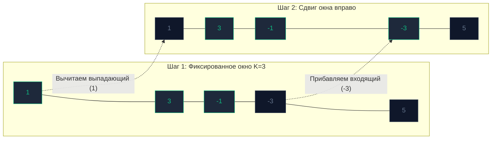

## Введение: Анализ непрерывных последовательностей

В предыдущей главе [[4. Два указателя - техника two pointers]] мы освоили технику эффективного обхода коллекций с помощью скоординированных индексов без выделения динамической памяти в куче. Но что делать, если специфика бизнес-логики требует от нас исследовать не точечные пары элементов, а **непрерывные интервалы** (подмассивы, срезы данных, подстроки)?

С такими вызовами бэкенд-разработчик сталкивается ежедневно:
* Расчет максимального оборота платежей за любые 3 подряд идущих дня в аналитической витрине.
* Реализация алгоритма ограничения частоты входящих сетевых запросов (`Rate Limiter`) для защиты внешнего HTTP API.
* Отыскание самой длинной подстроки, не содержащей повторяющихся символов.

Для решения подобных задач применяется специализированная форма двух указателей — алгоритмический паттерн **Скользящее окно (Sliding Window)**.

---

## Анатомия скользящего окна

Представьте обрабатываемый срез как протяженную ленту конвейера, на которую мы смотрим через компактную прямоугольную рамку («окно»). Эта рамка способна перемещаться по массиву строго слева направо.

Границы окна задаются парой указателей: левым (`left`) и правым (`right`). Все элементы, заключенные между этими индексами включительно, формируют текущее рабочее состояние окна.

В системном программировании выделяют два фундаментальных типа скользящего окна:
1. **Окно фиксированного размера (Fixed Window):** Ширина окна жестко зафиксирована константой $K$. Алгоритм единожды инициализирует окно шириной $K$, после чего указатели `left` и `right` синхронно сдвигаются вправо на 1 шаг.
2. **Окно динамического размера (Dynamic Window):** Правый указатель `right` последовательно поглощает новые элементы, расширяя окно до тех пор, пока соблюдается заданное ограничение. Как только инвариант нарушается, левый указатель `left` начинает подтягиваться вправо, сжимая окно, пока система не вернется в валидное состояние.



---

## Mechanical Sympathy: Оптимизация на уровне ALU

Взглянем на наивную реализацию поиска максимальной суммы подмассива фиксированной длины $K$ через вложенные циклы: для каждого индекса `i` запускается внутренний цикл `for j := 0; j < K`, суммирующий $K$ чисел с нуля.  
Временная сложность такого подхода составляет чудовищные $O(N \cdot K)$.

С точки зрения кремниевого процессора это бессмысленная трата ресурсов: арифметико-логическое устройство (`ALU`) миллионы раз заново складывает одни и те же числа. Процессор впустую сотни раз перечитывает одни и те же кэш-линии `L1/L2` кэшей.

**Магия скользящего окна:** При смещении рамки на один шаг вправо подавляющее большинство (99%) данных внутри окна остается неизменным!  
Вместо полного пересчета суммы алгоритм совершает дифференциальный шаг: **вычитает** элемент, покинувший окно слева (`arr[i-k]`), и **прибавляет** элемент, вошедший в окно справа (`arr[i]`).

Сложность вычислений падает до идеального линейного времени $O(N)$. На каждом шаге конвейер ALU выполняет всего 2 элементарные инструкции сложения/вычитания вместо $K$ циклов.

---

## Паттерн 1: Окно фиксированного размера

Классическая задача алгоритмических секций: нахождение максимальной суммы подмассива фиксированной ширины $K$ (`LeetCode 643`).

```go
package main

// MaxSumSubarrayK возвращает максимальную сумму подмассива длины K за время O(N) и память O(1).
func MaxSumSubarrayK(arr []int, k int) int {
	if len(arr) < k || k <= 0 {
		return 0
	}

	// 1. Инициализируем стартовое окно: аккумулируем сумму первых K элементов
	windowSum := 0
	for i := 0; i < k; i++ {
		windowSum += arr[i]
	}

	maxSum := windowSum

	// 2. Скользим окном вправо по всей длине среза
	// Индекс i представляет правый край окна, а (i - k) - левый выпадающий элемент
	for i := k; i < len(arr); i++ {
		// Дифференциальное обновление состояния за строгое O(1):
		windowSum += arr[i] - arr[i-k]
		
		if windowSum > maxSum {
			maxSum = windowSum
		}
	}

	return maxSum
}
```

---

## Паттерн 2: Окно динамического размера (Гусеница)

Динамическое окно функционирует по принципу движения гусеницы: сначала голова (`right`) вытягивается вперед, накапливая данные до предела условий задачи, после чего хвост (`left`) подтягивается следом, сбрасывая невалидные элементы.

Канонический пример системного интервью — задача `LeetCode 3`: **Longest Substring Without Repeating Characters** (Поиск наибольшей подстроки без повторяющихся символов).

> [!info] Под капотом: Карта частот против Плоского массива
> Во многих типичных решениях на Python или Java разработчики инстинктивно используют хеш-таблицу (в Go это `map[byte]int`) для сохранения индексов последних встреченных символов.  
> **Для высоконагруженного бэкенда это грубейшая ошибка.** Вычисление хеша, аллокации связанных бакетов в куче и последующая работа Garbage Collector порождают колоссальный инфраструктурный overhead.  
> Поскольку набор расширенной таблицы ASCII строго ограничен 256 значениями, промышленный Go-код использует плоский статический массив `[256]int`. Он мгновенно ложится в быстрый `L1-кэш` ядра процессора, доступ по индексу `arr[char]` выполняется ровно за 1 такт, а компилятор Go аллоцирует его прямо на стеке горутины с нулевой нагрузкой на GC.

```go
func LengthOfLongestSubstring(s string) int {
	// Статический массив для фиксации последней позиции каждого символа ASCII.
	// Храним индексы со смещением +1 (чтобы 0 означал отсутствие символа в истории).
	var lastSeen [256]int 
	
	maxLength := 0
	left := 0

	for right := 0; right < len(s); right++ {
		char := s[right] // Извлекаем текущий байт

		// Если данный символ уже встречался И его предыдущая позиция лежит ВНУТРИ текущего окна
		if prevIdxPlusOne := lastSeen[char]; prevIdxPlusOne > left {
			// Мгновенно смещаем левую границу, изолируя дубликат за пределами окна
			left = prevIdxPlusOne 
		}

		// Фиксируем новую позицию символа (сохраняем индекс + 1)
		lastSeen[char] = right + 1

		// Обновляем глобальный рекорд длины
		currentLength := right - left + 1
		if currentLength > maxLength {
			maxLength = currentLength
		}
	}

	return maxLength
}
```

> [!warning] Ловушка / Gotcha: Строки, Руны и UTF-8
> В языке Go тип `string` представляет собой неизменяемый срез байт, а не абстрактных символов. Обращение по индексу `s[right]` возвращает ровно один байт (`uint8`).  
> Если на вход функции поступит многобайтовая строка в кодировке UTF-8 (например, `"привет"`, где каждая кириллическая буква кодируется двумя байтами), наивная логика с массивом на 256 ячеек даст сбой или спровоцирует аварийную остановку `panic`.  
> На технических интервью всегда задавайте уточняющий вопрос: *«Гарантируется ли, что входные данные представлены только символами ASCII?»* Если строка содержит Unicode, ее необходимо либо преобразовать в срез рун `[]rune` (что требует $O(N)$ памяти и времени на аллокацию), либо использовать хеш-таблицу `map[rune]int`, осознанно пожертвовав процессорным кэшем ради корректности стандарта `Unicode`.

---

## Типичные задачи и признаки

Как на техническом интервью безошибочно определить, что задача решается через Sliding Window?

Ищите характерные маркеры в постановке задачи:
1. **Ключевые сущности:** В условии явно упоминается **«непрерывный подмассив» (`contiguous subarray`)** или **«подстрока» (`substring`)**. *(Обратите внимание: если требуется найти произвольную подпоследовательность (`subsequence`), задача почти всегда относится к сфере динамического программирования!)*
2. **Экстремальные требования:** Требуется определить **максимальную сумму**, **минимальную длину интервала** или **самую длинную последовательность**.
3. **Ограничения по времени:** Размер входного среза составляет $N \ge 10^5$, что делает любое решение медленнее строгого $O(N)$ нежизнеспособным.

---

## Итог

1. **Скользящее окно (`Sliding Window`)** — классический алгоритмический паттерн для непрерывного анализа подмассивов и подстрок без избыточного пересчета общих данных на каждом шаге.
2. Паттерн сокращает сложность обработки интервалов с квадратичных $O(N^2)$ или $O(N \cdot K)$ до безупречного линейного времени $O(N)$, кардинально оптимизируя использование вычислительных блоков `ALU`.
3. Окно бывает **фиксированным** (размер $K$ постоянен, указатели синхронны) либо **динамическим** (окно расширяется скаутом и сжимается при нарушении граничных инвариантов).
4. При анализе символьных окон всегда отдавайте предпочтение компактным статическим массивам `[256]int` вместо тяжелых хеш-таблиц `map[byte]int`, сохраняя данные в `L1-кэше` без аллокаций.

Скользящее окно позволяет непрерывно агрегировать показатели на лету в одном линейном потоке. Но что делать, если архитектуре сервиса требуется моментально отвечать на тысячи произвольных аналитических запросов вида: *«Какова точная сумма транзакций в диапазоне с 14-го по 89-й день?»*, гарантируя ответ за строгое время $O(1)$ на каждый запрос?

Здесь ни окно, ни два указателя помочь не смогут. На помощь приходит техника предвычисления префиксных агрегатов, которую мы разберем в следующей статье: [[6. Prefix sums - префиксные суммы]].